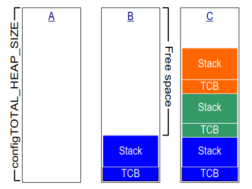
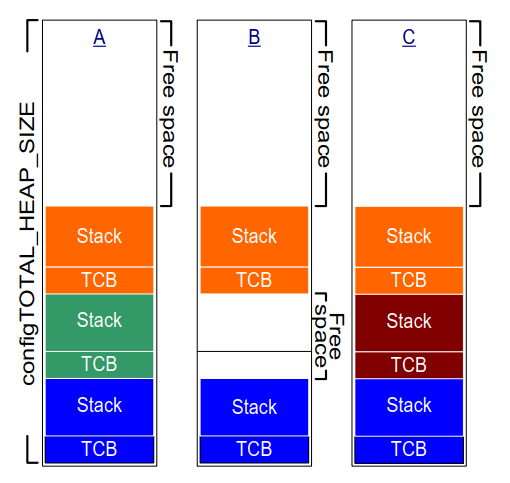
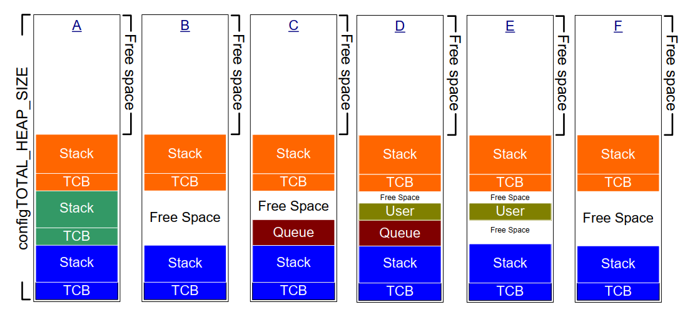
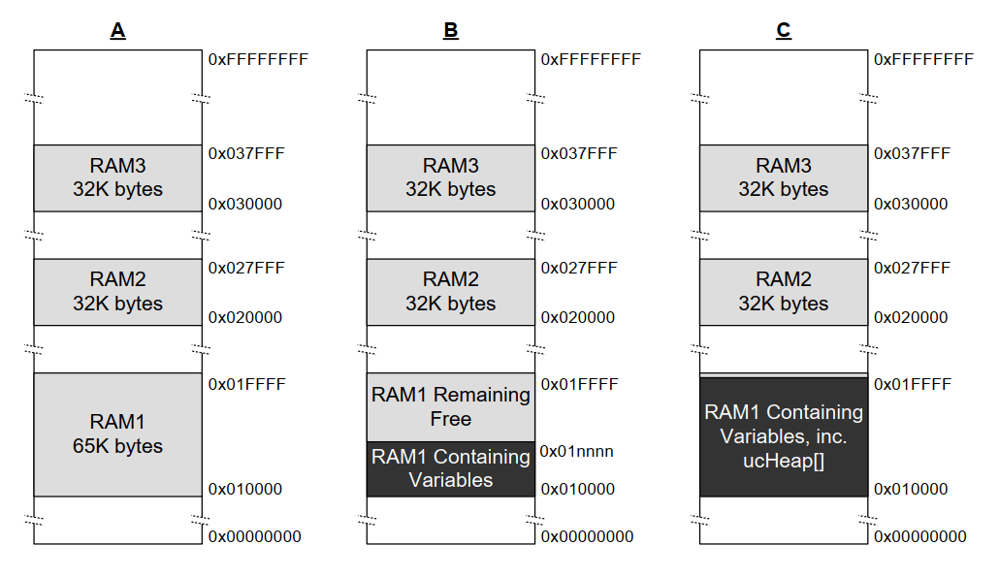

# 3 堆内存管理

## 3.1 简介

### 3.1.1 先决条件

要使用 FreeRTOS，前提是具备合格的 C 编程能力，因此本章假定读者
熟悉如下概念：

- 构建 C 项目时各个编译与链接阶段的区别。
- 什么是栈和堆。
- 标准 C 库中的 `malloc()` 与 `free()` 函数。

### 3.1.2 范围

本章涵盖：

- FreeRTOS 在何时分配 RAM。
- FreeRTOS 提供的五种示例内存分配方案。
- 如何选择合适的内存分配方案。

### 3.1.3 在静态与动态内存分配之间切换

后续章节会介绍任务、队列、信号量、事件组等内核对象。保存这些对象
所需的 RAM 可以在编译期静态分配，也可以在运行时动态分配。
动态分配可减少设计和规划工作量、简化 API，并最小化 RAM 占用。
静态分配则更具确定性，无需处理内存分配失败，并消除了堆碎片风险
（即堆中总空闲内存足够，但没有一块可用的连续内存）。

仅当在 FreeRTOSConfig.h 中将 `configSUPPORT_STATIC_ALLOCATION`
设置为 1 时，才会提供使用静态分配内存创建内核对象的 FreeRTOS API。
仅当在 FreeRTOSConfig.h 中将 `configSUPPORT_DYNAMIC_ALLOCATION`
设置为 1 或保持未定义时，才会提供使用动态分配内存创建内核对象的
FreeRTOS API。两个常量同时设为 1 是合法的。

关于 `configSUPPORT_STATIC_ALLOCATION` 的更多信息见
3.4 节使用静态内存分配。

### 3.1.4 使用动态内存分配

动态内存分配是 C 编程中的概念，并非 FreeRTOS 或多任务特有概念。
之所以与 FreeRTOS 相关，是因为内核对象可选择通过动态内存来创建，
而通用的 C 库 `malloc()` 与 `free()` 可能因以下一个或多个原因并不适用：

- 在小型嵌入式系统上并不总是可用。
- 实现体积可能较大，会占用宝贵的代码空间。
- 通常不是线程安全的。
- 不具确定性；每次调用执行所需时间可能不同。
- 可能发生碎片问题（堆中空闲内存足够，但没有可用连续块）。
- 可能使链接器配置更复杂。
- 若允许堆空间增长到与其他变量使用的内存重叠，可能导致难以调试的错误。

### 3.1.5 动态内存分配选项

FreeRTOS 早期版本使用内存池分配方案：在编译期预分配不同大小的内存块池，
然后由内存分配函数返回这些块。虽然块分配在实时系统中很常见，但它已从
FreeRTOS 中移除，因为在极小型嵌入式系统中其 RAM 利用率低，导致大量支持请求。

FreeRTOS 现在将内存分配视为可移植层的一部分（而非核心代码的一部分）。
原因是不同嵌入式系统对动态内存分配和时序的要求不同，单一算法只会适用于
一部分应用。此外，将动态内存分配从核心代码中分离后，应用开发者可在需要时
提供自己的特定实现。

当 FreeRTOS 需要 RAM 时，它调用 `pvPortMalloc()` 而不是 `malloc()`。
同样，当 FreeRTOS 释放先前分配的 RAM 时，它调用 `vPortFree()` 而不是 `free()`。
`pvPortMalloc()` 的原型与标准 C 库 `malloc()` 相同，`vPortFree()` 的原型与
标准 C 库 `free()` 相同。

`pvPortMalloc()` 与 `vPortFree()` 是公开函数，因此应用代码也可以直接调用。

FreeRTOS 提供了 `pvPortMalloc()` 与 `vPortFree()` 的五种示例实现，
本章都会说明。FreeRTOS 应用既可以使用其中一种示例实现，也可以提供自定义实现。

这五个示例分别定义在 heap\_1.c、heap\_2.c、heap\_3.c、
heap\_4.c 和 heap\_5.c 中，这些文件都位于
FreeRTOS/Source/portable/MemMang 目录下。


## 3.2 示例内存分配方案

### 3.2.1 Heap\_1

在小型、专用嵌入式系统中，常见做法是在启动 FreeRTOS 调度器之前就创建
任务和其他内核对象。此时，内核仅会在应用开始执行任何实时功能之前
（动态）分配内存，且这些内存会在应用整个生命周期内保持分配状态。
这意味着所选分配方案无需考虑确定性和碎片等复杂问题，而可优先考虑
代码体积与简洁性等属性。

Heap\_1.c 实现了一个非常基础的 `pvPortMalloc()` 版本，且未实现
`vPortFree()`。从不删除任务或其他内核对象的应用可以考虑使用 heap\_1。
某些商业关键和安全关键系统本来会禁止动态内存分配，但也可能采用 heap\_1。
关键系统通常禁止动态内存分配，是因为它可能带来非确定性、内存碎片和
分配失败等不确定性。而 heap\_1 始终是确定性的，且不会产生内存碎片。

heap\_1 对 `pvPortMalloc()` 的实现方式很简单：每次调用时，都从一个名为
FreeRTOS heap 的 `uint8_t` 数组中切出一个更小的块。
FreeRTOSConfig.h 中的 `configTOTAL_HEAP_SIZE` 常量用于设置该数组的字节大小。
将堆实现为静态分配数组会让 FreeRTOS 看起来占用了大量 RAM，
因为堆成为了 FreeRTOS 数据的一部分。

每个动态分配的任务都会触发两次 `pvPortMalloc()` 调用：
第一次分配任务控制块（TCB），第二次分配任务栈。
图 3.1 展示了随着任务创建，heap\_1 如何对该数组进行切分。

参见图 3.1：

- **A** 显示创建任何任务之前的数组状态整个数组都是空闲的。

- **B** 显示创建一个任务之后的数组状态。

- **C** 显示创建三个任务之后的数组状态。


<a name="fig3.1" title="Figure 3.1 RAM being allocated from the heap\_1 array each time a task is created"></a>

* * *

***图 3.1*** *每次创建任务时，从 heap\_1 数组中分配 RAM*
* * *


### 3.2.2 Heap\_2

heap\_2 已被 heap\_4 取代，后者功能更完善。
出于向后兼容，heap\_2 仍保留在 FreeRTOS 发行包中，
但不建议在新设计中使用。

heap\_2.c 同样通过切分由 `configTOTAL_HEAP_SIZE` 定义大小的数组来工作。
它使用最佳适配（best-fit）算法进行分配，并且与 heap\_1 不同，
它实现了 `vPortFree()`。同样地，将堆实现为静态分配数组会让 FreeRTOS
看起来占用了大量 RAM，因为堆成为了 FreeRTOS 数据的一部分。

最佳适配算法确保 `pvPortMalloc()` 使用与请求字节数最接近的空闲内存块。
例如，考虑如下场景：

- 堆中有三个空闲内存块，大小分别为 5 字节、25 字节和 100 字节。
- `pvPortMalloc()` 请求 20 字节 RAM。

能够容纳请求大小的最小空闲块是 25 字节块，因此 `pvPortMalloc()` 会先将
25 字节块切分为 20 字节和 5 字节两个块，然后返回指向 20 字节块的指针[^2]。
新的 5 字节块仍可供后续 `pvPortMalloc()` 调用使用。

[^2]: 这是简化描述，因为 heap\_2 会在堆区内保存块大小信息，
因此切分后两个块大小之和实际上会小于 25。

与 heap\_4 不同，heap\_2 不会把相邻空闲块合并成更大的单块，
因此比 heap\_4 更容易出现碎片。不过，如果分配并随后释放的块
始终大小相同，碎片就不是问题。

<a name="fig3.2" title="Figure 3.2 RAM being allocated and freed from the heap\_2 array as tasks are created and deleted"></a>

* * *

***图 3.2*** *随着任务的创建与删除，从 heap\_2 数组中分配并释放 RAM*
* * *

图 3.2 展示了在任务被创建、删除、再次创建时，最佳适配算法如何工作。
参见图 3.2：

- **A** 显示分配了三个任务后的数组状态。数组顶部仍有一大块空闲块。

- **B** 显示删除其中一个任务后的数组状态。数组顶部的大空闲块仍在。
  另外还新增了两个较小空闲块，它们此前保存被删除任务的 TCB 和栈。

- **C** 显示再次创建一个任务后的状态。创建该任务时，
  `xTaskCreate()` API 函数内部调用了两次 `pvPortMalloc()`：一次分配新 TCB，
  一次分配任务栈。本书 3.4 节会介绍 `xTaskCreate()`。

  每个 TCB 大小都相同，因此最佳适配算法会复用先前被删除任务 TCB
  所在的 RAM 块来存放新任务的 TCB。

  如果新任务分配的栈大小与先前删除任务的栈大小相同，
  则最佳适配算法也会复用先前栈所在 RAM 块来存放新任务栈。

  数组顶部那块更大的未分配内存保持不变。

heap\_2 不具确定性，但其速度仍快于大多数标准库 `malloc()`/`free()` 实现。


### 3.2.3 Heap\_3

heap\_3.c 使用标准库 `malloc()` 与 `free()`，
因此堆大小由链接器配置决定，而不使用 `configTOTAL_HEAP_SIZE` 常量。

heap\_3 通过在执行期间临时挂起 FreeRTOS 调度器，使 `malloc()` 和 `free()`
变为线程安全。第 8 章资源管理会介绍线程安全和调度器挂起。


### 3.2.4 Heap\_4

与 heap\_1 和 heap\_2 一样，heap\_4 通过把一个数组切分成小块来工作。
同前，数组为静态分配，并由 `configTOTAL_HEAP_SIZE` 确定大小，
因此堆作为 FreeRTOS 数据的一部分会让 FreeRTOS 看起来占用较多 RAM。

heap\_4 使用首次适配（first-fit）算法分配内存。与 heap\_2 不同，
heap\_4 会将相邻的空闲内存块合并（coalesce）为一个更大的块，
从而降低内存碎片风险。

首次适配算法确保 `pvPortMalloc()` 使用第一个足够容纳请求字节数的空闲块。
例如，考虑如下场景：

- 堆中有三个空闲内存块，按它们在数组中的出现顺序，
  分别是 5 字节、200 字节和 100 字节。
- `pvPortMalloc()` 请求 20 字节 RAM。

第一个能容纳请求大小的空闲块是 200 字节块，所以 `pvPortMalloc()` 会先把
200 字节块切分为 20 字节和 180 字节两个块[^3]，然后返回指向 20 字节块的指针。
新的 180 字节块仍可供后续 `pvPortMalloc()` 调用使用。

[^3]: 这是简化描述，因为 heap\_4 会在堆区内保存块大小信息，
因此切分后两个块大小之和实际上会小于 200 字节。

heap\_4 会将相邻空闲块合并为更大的单块，从而降低碎片风险，
这使它适合反复分配和释放不同大小 RAM 块的应用。


<a name="fig3.3" title="Figure 3.3 RAM being allocated and freed from the heap\_4 array"></a>

* * *

***图 3.3*** *从 heap\_4 数组中分配与释放 RAM*
* * *

图 3.3 展示了带内存合并的 heap\_4 首次适配算法如何工作。
参见图 3.3：

- **A** 显示创建三个任务后的数组状态。数组顶部仍有一大块空闲块。

- **B** 显示删除其中一个任务后的数组状态。数组顶部的大空闲块仍在。
  在被删除任务原先 TCB 和栈所在位置，又出现了一个空闲块。
  与 heap\_2 示例不同，heap\_4 会把此前分别存放被删除任务 TCB 和栈的
  两个内存块合并成更大的单个空闲块。

- **C** 显示创建一个 FreeRTOS 队列后的状态。
  本书 5.3 节介绍用于动态分配队列的 `xQueueCreate()` API。
  `xQueueCreate()` 会调用 `pvPortMalloc()` 分配队列所需 RAM。
  由于 heap\_4 使用首次适配算法，`pvPortMalloc()` 会从第一个足够大的
  空闲 RAM 块中分配队列所需内存；在图 3.3 中，该块就是删除任务后释放的 RAM。
  队列并未耗尽该空闲块，因此该块会被一分为二，未使用部分仍可供后续
  `pvPortMalloc()` 调用使用。

- **D** 显示应用代码直接调用 `pvPortMalloc()`（而非间接调用 FreeRTOS API）
  之后的状态。用户分配块足够小，可放入第一个空闲块，
  即位于队列所分配内存与其后 TCB 所分配内存之间的那一块。

  由删除任务释放出的内存此时被分成三个独立块：第一块存放队列，
  第二块存放用户分配内存，第三块仍为空闲。

- **E** 显示删除队列后的状态；删除队列会自动释放其占用内存。
  这时用户分配块两侧都出现了空闲内存。

- **F** 显示释放用户分配内存后的状态。用户分配块先前占用的内存
  已与其两侧空闲内存合并，形成一个更大的单一空闲块。

heap\_4 不具确定性，但速度快于大多数标准库 `malloc()`/`free()` 实现。


### 3.2.5 Heap\_5

heap\_5 使用与 heap\_4 相同的分配算法。与只能从单个数组分配内存的
heap\_4 不同，heap\_5 可以把多个相互分离的内存空间合并为一个堆。
当 FreeRTOS 所运行系统提供的 RAM 在内存映射中不是单个连续块时，
heap\_5 会非常有用。


### 3.2.6 初始化 heap\_5：vPortDefineHeapRegions() API 函数

`vPortDefineHeapRegions()` 通过指定每个独立内存区的起始地址与大小，
来初始化由 heap\_5 管理的堆。heap\_5 是唯一一个需要显式初始化的
内置堆分配方案，且在调用 `vPortDefineHeapRegions()` 之前不能使用。
这意味着任务、队列、信号量等内核对象在此调用之前都不能动态创建。


<a name="list3.1" title="Listing 3.1 The vPortDefineHeapRegions() API function prototype"></a>


```c
void vPortDefineHeapRegions( const HeapRegion_t * const pxHeapRegions );
```
***清单 3.1*** *vPortDefineHeapRegions() API 函数原型*


`vPortDefineHeapRegions()` 仅接收一个参数：`HeapRegion_t` 结构体数组。
每个结构体定义一个将成为堆组成部分的内存块起始地址与大小
整个结构体数组共同定义完整堆空间。


<a name="list3.2" title="Listing 3.2 The HeapRegion\_t structure"></a>


```c
typedef struct HeapRegion
{
    /* The start address of a block of memory that will be part of the heap.*/
    uint8_t *pucStartAddress;

    /* The size of the block of memory in bytes. */
    size_t xSizeInBytes;

} HeapRegion_t;
```
***清单 3.2*** *HeapRegion\_t 结构体*


**参数：**

- `pxHeapRegions`

  指向 `HeapRegion_t` 结构体数组起始位置的指针。
  每个结构体定义一个将成为堆组成部分的内存块起始地址和大小。

  数组中的 `HeapRegion_t` 结构体必须按起始地址升序排列；
  描述最低起始地址内存区的 `HeapRegion_t` 必须位于数组首位，
  描述最高起始地址内存区的 `HeapRegion_t` 必须位于数组末位。

  用一个 `HeapRegion_t` 结构体标记数组结束，该结构体的
  `pucStartAddress` 成员应设置为 `NULL`。

举例来说，考虑图 3.4 **A** 所示的假想内存映射，其中包含三个
彼此分离的 RAM 块：RAM1、RAM2 和 RAM3。假定可执行代码放在只读存储器中，
图中未画出该部分。


<a name="fig3.4" title="Figure 3.4 Memory Map"></a>

* * *

***图 3.4*** *内存映射*
* * *

清单 3.3 给出了一个 `HeapRegion_t` 结构体数组，该数组整体描述了这三个
RAM 块的全部范围。


<a name="list3.3" title="Listing 3.3 An array of HeapRegion\_t structures that together describe the 3 regions of RAM in their entirety"></a>


```c
/* Define the start address and size of the three RAM regions. */
#define RAM1_START_ADDRESS ( ( uint8_t * ) 0x00010000 )
#define RAM1_SIZE ( 64 * 1024 )

#define RAM2_START_ADDRESS ( ( uint8_t * ) 0x00020000 )
#define RAM2_SIZE ( 32 * 1024 )

#define RAM3_START_ADDRESS ( ( uint8_t * ) 0x00030000 )
#define RAM3_SIZE ( 32 * 1024 )

/* Create an array of HeapRegion_t definitions, with an index for each
   of the three RAM regions, and terminate the array with a HeapRegion_t
   structure containing a NULL address. The HeapRegion_t structures must
   appear in start address order, with the structure that contains the
   lowest start address appearing first. */
const HeapRegion_t xHeapRegions[] =
{
    { RAM1_START_ADDRESS, RAM1_SIZE },
    { RAM2_START_ADDRESS, RAM2_SIZE },
    { RAM3_START_ADDRESS, RAM3_SIZE },
    { NULL,               0         } /* Marks the end of the array. */
};

int main( void )
{
    /* Initialize heap_5. */
    vPortDefineHeapRegions( xHeapRegions );

    /* Add application code here. */
}
```
***清单 3.3*** *共同完整描述 3 个 RAM 区域的 HeapRegion\_t 结构体数组*


尽管清单 3.3 对 RAM 的描述是正确的，但它并非可用示例，
因为它把所有 RAM 都分配给了堆，导致没有 RAM 留给其他变量使用。

在构建流程的链接阶段，链接器会为每个变量分配 RAM 地址。
可供链接器使用的 RAM 通常由链接器配置文件（如 linker script）描述。
在图 3.4 **B** 中，假设链接脚本包含了 RAM1 的信息，
但未包含 RAM2 与 RAM3 的信息。结果，链接器把变量放入 RAM1，
使 RAM1 中只有地址 0x0001nnnn 以上部分可供 heap\_5 使用。
0x0001nnnn 的具体值取决于应用中所有变量大小之和。
链接器使 RAM2 和 RAM3 完全未被使用，因此 RAM2 与 RAM3 的全部空间
都可供 heap\_5 使用。

若直接使用清单 3.3 的代码，会导致 heap\_5 在 0x0001nnnn 以下分配的 RAM
与变量占用 RAM 重叠。
如果把 `xHeapRegions[]` 数组中第一个 `HeapRegion_t` 的起始地址
从 0x00010000 改为 0x0001nnnn，则堆不会与链接器使用 RAM 重叠。
但这并不是推荐方案，因为：

- 起始地址可能不易确定。
- 链接器使用的 RAM 数量在未来构建中可能变化，
  这会导致必须更新 `HeapRegion_t` 结构体中使用的起始地址。
- 构建工具无法知道、也就无法告警链接器使用 RAM 与 heap\_5 使用 RAM
  是否发生重叠。

清单 3.4 展示了一个更方便、可维护性更高的示例。
它声明了一个名为 `ucHeap` 的数组。`ucHeap` 是普通变量，
因此会成为链接器分配到 RAM1 的数据的一部分。
`xHeapRegions` 数组中的第一个 `HeapRegion_t` 结构体描述了 `ucHeap` 的
起始地址与大小，因此 `ucHeap` 也成为 heap\_5 管理内存的一部分。
可以逐步增大 `ucHeap`，直到链接器使用的 RAM 占满 RAM1，
如图 3.4 **C** 所示。


<a name="list3.4" title="Listing 3.4 An array of HeapRegion\_t structures that describe all of RAM2, all of RAM3, but only part of RAM1"></a>

```c
/* Define the start address and size of the two RAM regions not used by
   the linker. */
#define RAM2_START_ADDRESS ( ( uint8_t * ) 0x00020000 )
#define RAM2_SIZE ( 32 * 1024 )

#define RAM3_START_ADDRESS ( ( uint8_t * ) 0x00030000 )
#define RAM3_SIZE ( 32 * 1024 )

/* Declare an array that will be part of the heap used by heap_5. The
   array will be placed in RAM1 by the linker. */
#define RAM1_HEAP_SIZE ( 30 * 1024 )
static uint8_t ucHeap[ RAM1_HEAP_SIZE ];

/* Create an array of HeapRegion_t definitions. Whereas in Listing 3.3 the
   first entry described all of RAM1, so heap_5 will have used all of
   RAM1, this time the first entry only describes the ucHeap array, so
   heap_5 will only use the part of RAM1 that contains the ucHeap array.
   The HeapRegion_t structures must still appear in start address order,
   with the structure that contains the lowest start address appearing first. */

const HeapRegion_t xHeapRegions[] =
{
    { ucHeap,             RAM1_HEAP_SIZE },
    { RAM2_START_ADDRESS, RAM2_SIZE },
    { RAM3_START_ADDRESS, RAM3_SIZE },
    { NULL,               0 }           /* Marks the end of the array. */
};
```
***清单 3.4*** *描述 RAM2 全部、RAM3 全部和 RAM1 部分区域的 HeapRegion\_t 结构体数组*


清单 3.4 所示技术的优点包括：

- 无需使用硬编码起始地址。
- `HeapRegion_t` 结构体中使用的地址将由链接器自动设置，
  因此即使链接器在后续构建中使用的 RAM 发生变化，地址也始终正确。
- 分配给 heap\_5 的 RAM 不可能与链接器放入 RAM1 的数据重叠。
- 若 `ucHeap` 过大，应用将无法通过链接。


## 3.3 与堆相关的实用函数和宏

### 3.3.1 定义堆起始地址

heap\_1、heap\_2 和 heap\_4 都从一个由 `configTOTAL_HEAP_SIZE`
确定大小的静态分配数组中分配内存。本节将这些分配方案统称为 heap\_n。

有时需要把堆放在特定内存地址。例如，动态创建任务时分配的任务栈来自堆，
因此可能需要把堆放在高速内部存储器中，而不是低速外部存储器中。
（另一个将任务栈放入高速存储器的方法见下文小节：将任务栈放入高速内存。）
编译期配置常量 `configAPPLICATION_ALLOCATED_HEAP` 允许应用自行声明数组，
以替代原本在 heap\_n.c 源文件中的声明。
在应用代码中声明该数组后，开发者就可以指定其起始地址。

如果在 FreeRTOSConfig.h 中将 `configAPPLICATION_ALLOCATED_HEAP` 设为 1，
则使用 FreeRTOS 的应用必须分配一个名为 `ucHeap` 的 `uint8_t` 数组，
其大小由 `configTOTAL_HEAP_SIZE` 常量确定。

将变量放置到特定内存地址所需语法取决于所用编译器，
请参考编译器文档。下面给出两个编译器示例：

- 清单 3.5 展示 GCC 语法：声明该数组并将其放入名为 `.my_heap` 的内存段。
- 清单 3.6 展示 IAR 语法：声明该数组并将其放在绝对地址 0x20000000。


<a name="list3.5" title="Listing 3.5 Using GCC syntax to declare the array that will be used by heap\_4, and place the array in a memory section named .my\_heap"></a>


```c
uint8_t ucHeap[ configTOTAL_HEAP_SIZE ] __attribute__ ( ( section( ".my_heap" ) ) );
```
***清单 3.5*** *使用 GCC 语法声明将被 heap\_4 使用的数组，并将其放入名为 .my\_heap 的内存段*


<a name="list3.6" title="Listing 3.6 Using IAR syntax to declare the array that will be used by heap\_4, and place the array at the absolute address 0x20000000"></a>


```c
uint8_t ucHeap[ configTOTAL_HEAP_SIZE ] @ 0x20000000;
```
***清单 3.6*** *使用 IAR 语法声明将被 heap\_4 使用的数组，并将其放在绝对地址 0x20000000*


### 3.3.2 xPortGetFreeHeapSize() API 函数

`xPortGetFreeHeapSize()` API 函数返回调用时堆中空闲字节数。
它不提供堆碎片信息。

heap\_3 未实现 `xPortGetFreeHeapSize()`。


<a name="list3.7" title="Listing 3.7 The xPortGetFreeHeapSize() API function prototype"></a>


```c
size_t xPortGetFreeHeapSize( void );
```
***清单 3.7*** *xPortGetFreeHeapSize() API 函数原型*


**返回值：**

- `xPortGetFreeHeapSize()` 返回调用时堆中尚未分配的字节数。


### 3.3.3 xPortGetMinimumEverFreeHeapSize() API 函数

`xPortGetMinimumEverFreeHeapSize()` API 函数返回自 FreeRTOS 应用开始执行以来，
堆中曾出现过的最小未分配字节数。

`xPortGetMinimumEverFreeHeapSize()` 返回值可指示应用距离耗尽堆空间
最近到什么程度。例如，若该函数返回 200，表示应用启动后某个时刻
曾距离堆耗尽仅剩 200 字节。

`xPortGetMinimumEverFreeHeapSize()` 还可用于优化堆大小。
例如，在执行完你已知堆占用最高的代码后，如果该函数返回 2000，
则 `configTOTAL_HEAP_SIZE` 最多可减少 2000 字节。

`xPortGetMinimumEverFreeHeapSize()` 仅在 heap\_4 和 heap\_5 中实现。


<a name="list3.8" title="Listing 3.8 The xPortGetMinimumEverFreeHeapSize() API function prototype"></a>


```c
size_t xPortGetMinimumEverFreeHeapSize( void );
```
***清单 3.8*** *xPortGetMinimumEverFreeHeapSize() API 函数原型*


**返回值：**

- `xPortGetMinimumEverFreeHeapSize()` 返回自 FreeRTOS 应用开始执行以来，
  堆中曾出现过的最小未分配字节数。


### 3.3.4 vPortGetHeapStats() API 函数

heap\_4 和 heap\_5 实现了 `vPortGetHeapStats()`，该函数通过引用传参方式
填充 `HeapStats_t` 结构体，且这是它唯一的参数。

清单 3.9 展示了 `vPortGetHeapStats()` 函数原型。
清单 3.10 展示了 `HeapStats_t` 结构体成员。


<a name="list3.9" title="Listing 3.9 The vPortGetHeapStatus() API function prototype"></a>


```c
void vPortGetHeapStats( HeapStats_t *xHeapStats );
```
***清单 3.9*** *vPortGetHeapStatus() API 函数原型*


<a name="list3.10" title="Listing 3.10 The HeapStatus\_t() structure"></a>


```c
/* Prototype of the vPortGetHeapStats() function. */
void vPortGetHeapStats( HeapStats_t *xHeapStats );

/* Definition of the HeapStats_t structure. All sizes specified in bytes. */
typedef struct xHeapStats
{
    /* The total heap size currently available - this is the sum of all the
       free blocks, not the largest available block. */
    size_t xAvailableHeapSpaceInBytes;

    /* The size of the largest free block within the heap at the time
       vPortGetHeapStats() is called. */
    size_t xSizeOfLargestFreeBlockInBytes;

    /* The size of the smallest free block within the heap at the time
       vPortGetHeapStats() is called. */
    size_t xSizeOfSmallestFreeBlockInBytes;

    /* The number of free memory blocks within the heap at the time
       vPortGetHeapStats() is called. */
    size_t xNumberOfFreeBlocks;

    /* The minimum amount of total free memory (sum of all free blocks)
       there has been in the heap since the system booted. */
    size_t xMinimumEverFreeBytesRemaining;

    /* The number of calls to pvPortMalloc() that have returned a valid
       memory block. */
    size_t xNumberOfSuccessfulAllocations;

    /* The number of calls to vPortFree() that has successfully freed a
       block of memory. */
    size_t xNumberOfSuccessfulFrees;
} HeapStats_t;
```
***清单 3.10*** *HeapStatus\_t() 结构体*


### 3.3.5 收集按任务划分的堆使用统计

应用开发者可以使用如下跟踪宏来收集按任务划分的堆使用统计：
- `traceMALLOC`
- `traceFREE`

清单 3.11 展示了一个使用这些跟踪宏收集按任务堆使用统计的实现示例。

<a name="list3.11" title="Listing 3.11 Collecting Per-task Heap Usage Statistics"></a>


```c
#define mainNUM_ALLOCATION_ENTRIES          512
#define mainNUM_PER_TASK_ALLOCATION_ENTRIES 32

/*-----------------------------------------------------------*/

/*
 * +-----------------+--------------+----------------+-------------------+
 * | Allocating Task | Entry in use | Allocated Size | Allocated Pointer |
 * +-----------------+--------------+----------------+-------------------+
 * |                 |              |                |                   |
 * +-----------------+--------------+----------------+-------------------+
 * |                 |              |                |                   |
 * +-----------------+--------------+----------------+-------------------+
 */
typedef struct AllocationEntry
{
    BaseType_t xInUse;
    TaskHandle_t xAllocatingTaskHandle;
    size_t uxAllocatedSize;
    void * pvAllocatedPointer;
} AllocationEntry_t;

AllocationEntry_t xAllocationEntries[ mainNUM_ALLOCATION_ENTRIES ];

/*
 * +------+-----------------------+----------------------+
 * | Task | Memory Currently Held | Max Memory Ever Held |
 * +------+-----------------------+----------------------+
 * |      |                       |                      |
 * +------+-----------------------+----------------------+
 * |      |                       |                      |
 * +------+-----------------------+----------------------+
 */
typedef struct PerTaskAllocationEntry
{
    TaskHandle_t xTask;
    size_t uxMemoryCurrentlyHeld;
    size_t uxMaxMemoryEverHeld;
} PerTaskAllocationEntry_t;

PerTaskAllocationEntry_t xPerTaskAllocationEntries[ mainNUM_PER_TASK_ALLOCATION_ENTRIES ];

/*-----------------------------------------------------------*/

void TracepvPortMalloc( size_t uxAllocatedSize, void * pv )
{
    size_t i;
    TaskHandle_t xAllocatingTaskHandle;
    AllocationEntry_t * pxAllocationEntry = NULL;
    PerTaskAllocationEntry_t * pxPerTaskAllocationEntry = NULL;

    if( xTaskGetSchedulerState() != taskSCHEDULER_NOT_STARTED )
    {
        xAllocatingTaskHandle = xTaskGetCurrentTaskHandle();

        for( i = 0; i < mainNUM_ALLOCATION_ENTRIES; i++ )
        {
            if( xAllocationEntries[ i ].xInUse == pdFALSE )
            {
                pxAllocationEntry = &( xAllocationEntries[ i ] );
                break;
            }
        }

        /* Do we already have an entry in the per task table? */
        for( i = 0; i < mainNUM_PER_TASK_ALLOCATION_ENTRIES; i++ )
        {
            if( xPerTaskAllocationEntries[ i ].xTask == xAllocatingTaskHandle )
            {
                pxPerTaskAllocationEntry = &( xPerTaskAllocationEntries[ i ] );
                break;
            }
        }

        /* We do not have an entry in the per task table. Find an empty slot. */
        if( pxPerTaskAllocationEntry == NULL )
        {
            for( i = 0; i < mainNUM_PER_TASK_ALLOCATION_ENTRIES; i++ )
            {
                if( xPerTaskAllocationEntries[ i ].xTask == NULL )
                {
                    pxPerTaskAllocationEntry = &( xPerTaskAllocationEntries[ i ] );
                    break;
                }
            }
        }

        /* Ensure that we have space in both the tables. */
        configASSERT( pxAllocationEntry != NULL );
        configASSERT( pxPerTaskAllocationEntry != NULL );

        pxAllocationEntry->xAllocatingTaskHandle = xAllocatingTaskHandle;
        pxAllocationEntry->xInUse = pdTRUE;
        pxAllocationEntry->uxAllocatedSize = uxAllocatedSize;
        pxAllocationEntry->pvAllocatedPointer = pv;

        pxPerTaskAllocationEntry->xTask = xAllocatingTaskHandle;
        pxPerTaskAllocationEntry->uxMemoryCurrentlyHeld += uxAllocatedSize;
        if( pxPerTaskAllocationEntry->uxMaxMemoryEverHeld < pxPerTaskAllocationEntry->uxMemoryCurrentlyHeld )
        {
            pxPerTaskAllocationEntry->uxMaxMemoryEverHeld = pxPerTaskAllocationEntry->uxMemoryCurrentlyHeld;
        }
    }
}
/*-----------------------------------------------------------*/

void TracevPortFree( void * pv )
{
    size_t i;
    AllocationEntry_t * pxAllocationEntry = NULL;
    PerTaskAllocationEntry_t * pxPerTaskAllocationEntry = NULL;

    for( i = 0; i < mainNUM_ALLOCATION_ENTRIES; i++ )
    {
        if( ( xAllocationEntries[ i ].xInUse == pdTRUE ) &&
            ( xAllocationEntries[ i ].pvAllocatedPointer == pv ) )
        {
            pxAllocationEntry = &( xAllocationEntries [ i ] );
            break;
        }
    }

    /* Attempt to free a block that was never allocated. */
    configASSERT( pxAllocationEntry != NULL );

    for( i = 0; i < mainNUM_PER_TASK_ALLOCATION_ENTRIES; i++ )
    {
        if( xPerTaskAllocationEntries[ i ].xTask == pxAllocationEntry->xAllocatingTaskHandle )
        {
            pxPerTaskAllocationEntry = &( xPerTaskAllocationEntries[ i ] );
            break;
        }
    }

    /* An entry must exist in the per task table. */
    configASSERT( pxPerTaskAllocationEntry != NULL );

    pxPerTaskAllocationEntry->uxMemoryCurrentlyHeld -= pxAllocationEntry->uxAllocatedSize;

    pxAllocationEntry->xInUse = pdFALSE;
    pxAllocationEntry->xAllocatingTaskHandle = NULL;
    pxAllocationEntry->uxAllocatedSize = 0;
    pxAllocationEntry->pvAllocatedPointer = NULL;
}
/*-----------------------------------------------------------*/

/* The following goes in FreeRTOSConfig.h: */
extern void TracepvPortMalloc( size_t uxAllocatedSize, void * pv );
extern void TracevPortFree( void * pv );

#define traceMALLOC( pvReturn, xAllocatedBlockSize ) \
TracepvPortMalloc( xAllocatedBlockSize, pvReturn )

#define traceFREE( pv, xAllocatedBlockSize ) \
TracevPortFree( pv )
```
***清单 3.11*** *收集按任务划分的堆使用统计*

### 3.3.6 Malloc 失败钩子函数

与标准库 `malloc()` 函数类似，当 `pvPortMalloc()` 无法分配所请求的 RAM 时，
会返回 NULL。malloc 失败钩子函数（或回调）是由应用提供的函数，
当 `pvPortMalloc()` 返回 NULL 时会被调用。
要触发该回调，必须在 FreeRTOSConfig.h 中将 `configUSE_MALLOC_FAILED_HOOK`
设置为 1。如果在某个使用动态内存分配来创建内核对象的 FreeRTOS API 内部
触发了 malloc 失败钩子，则该对象不会被创建。

若在 FreeRTOSConfig.h 中将 `configUSE_MALLOC_FAILED_HOOK` 设为 1，
则应用必须提供一个名称与原型如清单 3.12 所示的 malloc 失败钩子函数。
应用可按自身需要实现该函数。许多 FreeRTOS 示例应用将分配失败视为致命错误，
但这并非生产系统最佳实践；生产系统应当能够优雅地从分配失败中恢复。


<a name="list3.12" title="Listing 3.12 The malloc failed hook function name and prototype"></a>


```c
void vApplicationMallocFailedHook( void );
```
***清单 3.12*** *malloc 失败钩子函数名称与原型*


### 3.3.7 将任务栈放入高速内存

由于栈会被高频读写，因此应放在高速内存中；但堆未必希望放在同一位置。
FreeRTOS 通过 `pvPortMallocStack()` 和 `vPortFreeStack()` 宏，
可选地使在 FreeRTOS API 代码中分配的栈使用独立内存分配器。
如果希望栈来自 `pvPortMalloc()` 管理的堆，则保持 `pvPortMallocStack()` 与
`vPortFreeStack()` 未定义即可它们默认分别调用 `pvPortMalloc()` 与
`vPortFree()`。否则，可如清单 3.13 所示，把这些宏定义为调用应用提供函数。


<a name="list3.13" title="Listing 3.13 Mapping the pvPortMallocStack() and vPortFreeStack() macros to an application defined memory allocator"></a>


```c
/* Functions provided by the application writer than allocate and free
   memory from a fast area of RAM. */

void *pvMallocFastMemory( size_t xWantedSize );

void vPortFreeFastMemory( void *pvBlockToFree );

/* Add the following to FreeRTOSConfig.h to map the pvPortMallocStack()
   and vPortFreeStack() macros to the functions that use fast memory. */

#define pvPortMallocStack( x ) pvMallocFastMemory( x )

#define vPortFreeStack( x ) vPortFreeFastMemory( x )
```
***清单 3.13*** *将 pvPortMallocStack() 与 vPortFreeStack() 宏映射到应用定义的内存分配器*


## 3.4 使用静态内存分配

3.1.4 节列出了动态内存分配的一些缺点。为了避免这些问题，
静态内存分配允许开发者显式创建应用所需的每个内存块。
这有如下优点：

- 所有必需内存在编译期即可确定。
- 所有内存行为都具有确定性。

除此之外还有其他优点，但这些优点也带来一些复杂性。
主要复杂性在于：需要增加少量用户函数来管理部分内核内存；
其次，需要确保所有静态内存在合适作用域中声明。


### 3.4.1 启用静态内存分配

在 FreeRTOSConfig.h 中将 `configSUPPORT_STATIC_ALLOCATION` 设为 1
即可启用静态内存分配。启用后，内核会启用所有内核函数的 `static` 版本：

- `xTaskCreateStatic`
- `xEventGroupCreateStatic`
- `xEventGroupGetStaticBuffer`
- `xQueueGenericCreateStatic`
- `xQueueGenericGetStaticBuffers`
- `xQueueCreateMutexStatic`
  - *当 `configUSE_MUTEXES` 为 1 时*
- `xQueueCreateCountingSemaphoreStatic`
  - *当 `configUSE_COUNTING_SEMAPHORES` 为 1 时*
- `xStreamBufferGenericCreateStatic`
- `xStreamBufferGetStaticBuffers`
- `xTimerCreateStatic`
  - *当 `configUSE_TIMERS` 为 1 时*
- `xTimerGetStaticBuffer`
  - *当 `configUSE_TIMERS` 为 1 时*

这些函数会在本书对应章节中进行说明。

### 3.4.2 静态的内核内部内存

启用静态内存分配器后，空闲任务和定时器任务（若启用）将使用
由用户函数提供的静态内存。这些用户函数为：

- `vApplicationGetTimerTaskMemory`
  - *当 `configUSE_TIMERS` 为 1 时*
- `vApplicationGetIdleTaskMemory`


#### 3.4.2.1 vApplicationGetTimerTaskMemory

如果 `configSUPPORT_STATIC_ALLOCATION` 与 `configUSE_TIMERS` 均启用，
内核会调用 `vApplicationGetTimerTaskMemory()`，让应用创建并返回用于
定时器任务 TCB 和定时器任务栈的内存缓冲区。函数还会返回定时器任务栈大小。
清单 3.14 给出了该函数的推荐实现。


<a name="list3.14" title="Listing 3.14 Typical implementation of vApplicationGetTimerTaskMemory"></a>


```c
void vApplicationGetTimerTaskMemory( StaticTask_t **ppxTimerTaskTCBBuffer,
                                     StackType_t **ppxTimerTaskStackBuffer,
                                     uint32_t *pulTimerTaskStackSize )
{
  /* If the buffers to be provided to the Timer task are declared inside this
  function then they must be declared static - otherwise they will be allocated on
  the stack and hence would not exists after this function exits. */
  static StaticTask_t xTimerTaskTCB;
  static StackType_t uxTimerTaskStack[ configMINIMAL_STACK_SIZE ];

  /* Pass out a pointer to the StaticTask_t structure in which the Timer task's
  state will be stored. */
  *ppxTimerTaskTCBBuffer = &xTimerTaskTCB;

  /* Pass out the array that will be used as the Timer task's stack. */
  *ppxTimerTaskStackBuffer = uxTimerTaskStack;

  /* Pass out the stack size of the array pointed to by *ppxTimerTaskStackBuffer.
  Note the stack size is a count of StackType_t */
  *pulTimerTaskStackSize = sizeof(uxTimerTaskStack) / sizeof(*uxTimerTaskStack);
}
```
***清单 3.14*** *vApplicationGetTimerTaskMemory 的典型实现*


由于任何系统（包括 SMP）都只有一个定时器任务，
因此该问题的一个有效解法是在 `vApplicationGetTimeTaskMemory()` 函数中
分配静态缓冲区，并把缓冲区指针返回给内核。


#### 3.4.2.2 vApplicationGetIdleTaskMemory

当某个核心没有可调度工作时，会运行空闲任务。空闲任务执行一些后台维护操作，
若启用，还可触发用户的 `vTaskIdleHook()`。
在对称多处理系统（SMP）中，其余核心还存在非维护型空闲任务，
这些任务在内部以 `configMINIMAL_STACK_SIZE` 字节静态分配。

调用 `vApplicationGetIdleTaskMemory` 是为了让应用创建主空闲任务所需缓冲区。
清单 3.15 展示了 `vApplicationIdleTaskMemory()` 函数的典型实现：
使用静态局部变量创建所需缓冲区。


<a name="list3.15" title="Listing 3.15 Typical implementation of vApplicationGetIdleTaskMemory"></a>

```c
void vApplicationGetIdleTaskMemory( StaticTask_t **ppxIdleTaskTCBBuffer,
                                    StackType_t **ppxIdleTaskStackBuffer,
                                    uint32_t *pulIdleTaskStackSize )
{
  static StaticTask_t xIdleTaskTCB;
  static StackType_t uxIdleTaskStack[ configMINIMAL_STACK_SIZE ];

  *ppxIdleTaskTCBBuffer = &xIdleTaskTCB;
  *ppxIdleTaskStackBuffer = uxIdleTaskStack;
  *pulIdleTaskStackSize = configMINIMAL_STACK_SIZE;
}
```
***清单 3.15*** *vApplicationGetIdleTaskMemory 的典型实现*
