# 4 任务管理

## 4.1 引言

### 4.1.1 范围

本章涵盖：

- FreeRTOS 如何为应用中的每个任务分配处理器时间。
- FreeRTOS 如何在任意时刻选择应该执行哪个任务。
- 每个任务的相对优先级如何影响系统行为。
- 任务可能处于的状态。

本章还讨论：

- 如何实现任务。
- 如何创建一个或多个任务实例。
- 如何使用任务参数。
- 如何修改已经创建的任务优先级。
- 如何删除任务。
- 如何使用任务实现周期性处理。（后续章节还会说明如何使用软件定时器实现同样功能。）
- 空闲任务何时执行以及如何利用它。

本章中的概念是理解 FreeRTOS 使用方式及 FreeRTOS 应用行为的基础。
因此，这是本书中最详细的一章。

## 4.2 任务函数

任务通过 C 函数实现。任务必须实现如清单 4.1 所示的函数原型：
该原型接收一个 `void` 指针参数并返回 `void`。

<a name="list4.1" title="清单 4.1 任务函数原型"></a>

```c
void vATaskFunction( void * pvParameters );
```

***清单 4.1*** *任务函数原型*


每个任务本身就是一个小程序。它有入口点，通常会在无限循环中一直运行，且不会退出。
清单 4.2 展示了典型任务的结构。

FreeRTOS 任务绝不能以任何方式从其实现函数返回。
任务函数中不能包含 `return` 语句，也不能运行到函数末尾之后。
如果某任务不再需要，应按清单 4.2 所示显式删除。

一个任务函数定义可以用于创建任意数量的任务，且每个被创建任务都是独立执行实例。
每个实例都有自己的栈，因此也拥有该任务内部自动（栈）变量的独立副本。


<a name="list4.2" title="清单 4.2 典型任务函数结构"></a>


```c
void vATaskFunction( void * pvParameters )
{
    /*
     * 在函数内部可以像平常一样声明栈上变量。
     * 用此示例函数创建的每个任务实例都会在各自任务栈上
     * 拥有独立的 lStackVariable 实例。
     */
    long lStackVariable = 0;

    /*
     * 与栈变量不同，带有 static 关键字声明的变量由链接器
     * 分配到固定内存位置。
     * 这意味着所有调用 vATaskFunction 的任务会共享同一个
     * lStaticVariable 实例。
     */
    static long lStaticVariable = 0;

    for( ;; )
    {
        /* 此处编写任务功能代码。 */
    }

    /*
     * 如果任务实现有可能跳出上述循环，那么在到达函数末尾前
     * 必须删除该任务。
     * 当向 vTaskDelete() 传入 NULL 时，表示要删除的是调用者
     * （即当前）任务本身。
     */
    vTaskDelete( NULL );
}
```

***清单 4.2*** *典型任务函数结构*

## 4.3 任务顶层状态

一个应用可能包含很多任务。如果运行该应用的处理器是单核，
那么任意时刻只能有一个任务在执行。
这意味着任务可处于两种顶层状态之一：*运行（Running）* 与 *未运行（Not Running）*。
我们先考虑这一简化模型。本章后续将介绍 *未运行* 状态的多个子状态。

当处理器正在执行某任务代码时，该任务处于 *运行* 状态。
当任务处于 *未运行* 状态时，该任务被暂停，其上下文会被保存，
以便调度器下次决定其进入 *运行* 状态时恢复执行。
任务恢复执行时，会从离开 *运行* 状态前即将执行的那条指令继续。


<a name="fig4.1" title="图 4.1 任务顶层状态与转换"></a>

***
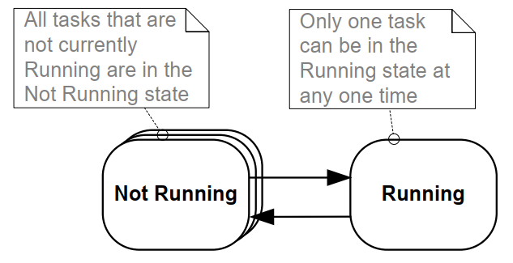
***图 4.1*** *任务顶层状态与转换*
***

任务从 *未运行* 状态切换到 *运行* 状态，称为“切入（switched in）”或“换入（swapped in）”。
反之，从 *运行* 状态切换到 *未运行* 状态，称为“切出（switched out）”或“换出（swapped out）”。
只有 FreeRTOS 调度器可以将任务切入或切出 *运行* 状态。

## 4.4 任务创建

可使用以下六个 API 函数创建任务：
`xTaskCreate()`、
`xTaskCreateStatic()`、
`xTaskCreateRestricted()`、
`xTaskCreateRestrictedStatic()`、
`xTaskCreateAffinitySet()` 和
`xTaskCreateStaticAffinitySet()`。

每个任务需要两块 RAM：一块用于任务控制块（TCB），一块用于任务栈。
名称中包含 `Static` 的 FreeRTOS API 使用调用参数传入的预分配内存。
名称中不包含 `Static` 的 API 则在运行时从系统堆动态分配所需 RAM。

某些 FreeRTOS 移植层支持“受限（restricted）/非特权（unprivileged）”模式任务。
名称中包含 `Restricted` 的 API 会创建对系统内存访问受限的任务。
不包含 `Restricted` 的 API 会创建在“特权模式（privileged mode）”执行、
可访问系统完整内存映射的任务。

支持对称多处理（SMP）的 FreeRTOS 移植允许不同任务在同一 CPU 的多个核心上并行运行。
对于这些移植，可通过名称中包含 `Affinity` 的函数指定任务运行核心。

FreeRTOS 的任务创建 API 相对复杂。本文大多数示例使用 `xTaskCreate()`，
因为它是这些函数中最简单的一个。

### 4.4.1 `xTaskCreate()` API 函数

清单 4.3 给出了 `xTaskCreate()` 的函数原型。
`xTaskCreateStatic()` 额外有两个参数，分别指向用于保存任务数据结构和栈的预分配内存。
[第 2.5 节：数据类型与编码风格指南](ch02.md#25-data-types-and-coding-style-guide)
描述了所使用的数据类型和命名约定。


<a name="list4.3" title="清单 4.3 xTaskCreate() API 函数原型"></a>


```c
BaseType_t xTaskCreate( TaskFunction_t pvTaskCode,
                        const char * const pcName,
                        configSTACK_DEPTH_TYPE usStackDepth,
                        void * pvParameters,
                        UBaseType_t uxPriority,
                        TaskHandle_t * pxCreatedTask );
```

***清单 4.3*** *`xTaskCreate()` API 函数原型*

**`xTaskCreate()` 参数与返回值：**

- `pvTaskCode`

  任务本质上是“永不退出”的 C 函数，因此通常实现为无限循环。
  `pvTaskCode` 参数就是实现该任务函数的指针（即函数名本身）。

- `pcName`

  任务的描述性名称。FreeRTOS 本身不会以任何方式使用它，
  其存在纯粹是为了调试辅助。
  使用人类可读名称标识任务，通常比用任务句柄更直观。

  应用定义常量 `configMAX_TASK_NAME_LEN` 指定任务名最大长度（包含 NULL 终止符）。
  若传入更长字符串，会被截断。

- `usStackDepth`

  指定为任务分配的栈大小。
  若希望使用预分配内存而非动态内存，请使用 `xTaskCreateStatic()`。

  注意：该值表示“栈可容纳的字（word）数”，而不是字节数。
  例如，若栈宽度为 32 位且 `usStackDepth` 为 128，
  则 `xTaskCreate()` 会分配 512 字节栈空间（128 * 4 字节）。

  `configSTACK_DEPTH_TYPE` 是一个宏，允许应用编写者指定用于保存栈大小的数据类型。
  若未定义，`configSTACK_DEPTH_TYPE` 默认是 `uint16_t`。
  因此当栈深度与栈宽度相乘后可能超过 65535（16 位最大值）时，
  应在 `FreeRTOSConfig.h` 中将 `configSTACK_DEPTH_TYPE` 定义为 `unsigned long` 或 `size_t`。

  [第 13.3 节 栈溢出](ch13.md#133-stack-overflow)
  给出了选择最优栈大小的实用方法。

- `pvParameters`

  任务实现函数接收单个 `void *` 参数。
  `pvParameters` 就是传给该参数的值。

- `uxPriority`

  定义任务优先级。0 为最低优先级，`(configMAX_PRIORITIES – 1)` 为最高优先级。
  [第 4.5 节](#45-task-priorities)描述了用户定义常量 `configMAX_PRIORITIES`。

  如果定义了大于 `(configMAX_PRIORITIES – 1)` 的 `uxPriority`，
  实际值会被钳制到 `(configMAX_PRIORITIES – 1)`。

- `pxCreatedTask`

  指向一个存储位置的指针，用于保存所创建任务的句柄。
  该句柄可在后续 API 调用中使用，例如修改任务优先级或删除任务。

  `pxCreatedTask` 是可选参数；若不需要任务句柄，可传入 `NULL`。

- 返回值

  可能有两个返回值：

  - `pdPASS`

    表示任务创建成功。

  - `pdFAIL`

    表示堆内存不足，无法创建任务。
    [第 3 章](ch03.md#3-heap-memory-management)提供了更多堆内存管理信息。


<a name="example4.1" title="示例 4.1 创建任务"></a>
---
***示例 4.1*** *创建任务*

---

下面示例演示了创建两个简单任务并启动它们所需的步骤。
这两个任务仅通过一个粗糙的忙等循环制造周期延时，然后周期性打印字符串。
两个任务优先级相同，除打印字符串不同外完全一致——
其实现分别见清单 4.4 和清单 4.5。
关于在任务中使用 `printf()` 的警告请参见第 8 章。

<a name="list4.4" title="清单 4.4 示例 4.1 中第一个任务的实现"></a>


```c
void vTask1( void * pvParameters )
{
    /* ulCount 声明为 volatile，以确保不会被优化掉。 */
    volatile unsigned long ulCount;

    for( ;; )
    {
        /* 打印当前任务名称。 */
        vPrintLine( "Task 1 is running" );

        /* 延时一段时间。 */
        for( ulCount = 0; ulCount < mainDELAY_LOOP_COUNT; ulCount++ )
        {
            /*
             * 这是非常粗糙的延时实现，循环体内无需任何操作。
             * 后续示例会用正规的 delay/sleep 函数替代该循环。
             */
        }
    }
}
```

***清单 4.4*** *示例 4.1 中第一个任务的实现*


<a name="list4.5" title="清单 4.5 示例 4.1 中第二个任务的实现"></a>


```c
void vTask2( void * pvParameters )
{
    /* ulCount 声明为 volatile，以确保不会被优化掉。 */
    volatile unsigned long ulCount;

    /* 与大多数任务一样，该任务由无限循环实现。 */
    for( ;; )
    {
        /* 打印该任务名称。 */
        vPrintLine( "Task 2 is running" );

        /* 延时一段时间。 */
        for( ulCount = 0; ulCount < mainDELAY_LOOP_COUNT; ulCount++ )
        {
            /*
             * 这是非常粗糙的延时实现，循环体内无需任何操作。
             * 后续示例会用正规的 delay/sleep 函数替代该循环。
             */
        }
    }
}
```

***清单 4.5*** *示例 4.1 中第二个任务的实现*

`main()` 函数会先创建任务，再启动调度器——其实现见清单 4.6。


<a name="list4.6" title="清单 4.6 启动示例 4.1 的任务"></a>


```c
int main( void )
{
    /*
     * 在启动 FreeRTOS 调度器后，此处声明的变量可能已不存在。
     * 不要在任务中访问 main() 使用的栈上变量。
     */

    /*
     * 创建两个任务中的一个。注意：实际应用应检查 xTaskCreate()
     * 的返回值，确保任务创建成功。
     */
    xTaskCreate( vTask1,  /* 指向实现任务的函数。 */
                 "Task 1",/* 任务文本名称。 */
                 1000,    /* 以 word 为单位的栈深。 */
                 NULL,    /* 本示例不使用任务参数。 */
                 1,       /* 该任务优先级为 1。 */
                 NULL );  /* 本示例不使用任务句柄。 */

    /* 以完全相同的方式、相同优先级创建另一个任务。 */
    xTaskCreate( vTask2, "Task 2", 1000, NULL, 1, NULL );

    /* 启动调度器，让任务开始执行。 */
    vTaskStartScheduler();

    /*
     * 若一切正常，main() 不会执行到这里，因为调度器此时已在运行创建的任务。
     * 如果执行到了这里，说明堆内存不足，无法创建空闲任务或定时器任务
     * （本书后文会介绍）。第 3 章提供更多堆内存管理信息。
     */
    for( ;; );
}
```

***清单 4.6*** *启动示例 4.1 的任务*

执行该示例会产生图 4.2 所示输出。


<a name="fig4.2" title="图 4.2 运行示例 4.1 时产生的输出"></a>

***

```console
C:\Temp>rtosdemo
Task 1 is running
Task 2 is running
Task 1 is running
Task 2 is running
Task 1 is running
Task 2 is running
Task 1 is running
Task 2 is running
Task 1 is running
Task 2 is running
Task 1 is running
Task 2 is running
Task 1 is running
Task 2 is running
```

***图 4.2*** *运行示例 4.1 时产生的输出[^4]*

***

[^4]: 截图中每个任务都恰好打印一次后再由另一个任务执行。
这是 FreeRTOS Windows 模拟器带来的“人为场景”。
Windows 模拟器并非真正实时；同时向 Windows 控制台写入耗时较长，
且会触发一连串系统调用。若在真实嵌入式目标上运行相同代码，
且使用快速、非阻塞打印函数，可能会看到每个任务在被切出前
连续打印多次。

图 4.2 看起来像两个任务在“同时”执行；
但两者都运行在同一个处理器核心上，因此不可能真正并行。
实际上，两任务都在快速地进出 *运行* 状态。
由于它们优先级相同，所以共享同一核心的执行时间。
图 4.3 展示了它们的真实执行模式。

图 4.3 底部箭头表示时间从 t1 开始向前推进。
不同颜色线段表示各时刻正在执行的任务——例如 t1 到 t2 期间执行的是任务 1。

任意时刻只能有一个任务处于 *运行* 状态。
因此，当一个任务进入 *运行* 状态（被切入）时，
另一个任务就进入 *未运行* 状态（被切出）。


<a name="fig4.3" title="图 4.3 示例 4.1 两个任务的真实执行模式"></a>

***
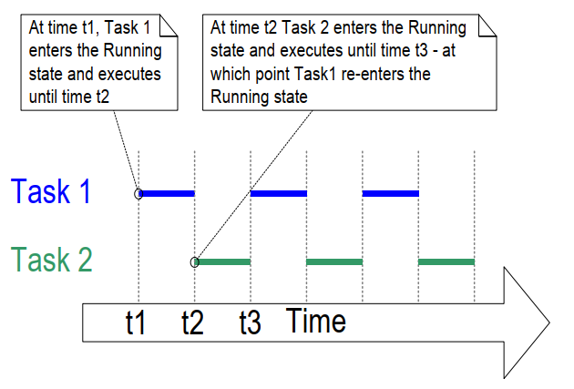
***图 4.3*** *示例 4.1 两个任务的真实执行模式*
***

示例 4.1 在 `main()` 中、调度器启动前创建了两个任务。
也可以在一个任务内部创建另一个任务。
例如，可以像清单 4.7 那样在任务 1 内部创建任务 2。


<a name="list4.7" title="清单 4.7 调度器启动后在一个任务内部创建另一个任务"></a>


```c
void vTask1( void * pvParameters )
{
    const char *pcTaskName = "Task 1 is running\r\n";
    volatile unsigned long ul; /* volatile，确保 ul 不被优化掉。 */

    /*
     * 如果执行到这里，说明调度器一定已经启动。
     * 在进入无限循环前先创建另一个任务。
     */
    xTaskCreate( vTask2, "Task 2", 1000, NULL, 1, NULL );

    for( ;; )
    {
        /* 打印该任务名称。 */
        vPrintLine( pcTaskName );

        /* 延时一段时间。 */
        for( ul = 0; ul < mainDELAY_LOOP_COUNT; ul++ )
        {
            /*
             * 这是非常粗糙的延时实现，循环体内无需操作。
             * 后续示例会用正规的 delay/sleep 函数替代。
             */
        }
    }
}
```

***清单 4.7*** *调度器启动后在一个任务内部创建另一个任务*

<a name="example4.2" title="示例 4.2 使用任务参数"></a>
---
***示例 4.2*** *使用任务参数*

---

示例 4.1 中创建的两个任务几乎完全相同，唯一区别是打印文本。
如果从同一个任务实现创建两个实例，并通过任务参数把字符串传入每个实例，
就可以消除这部分重复。

示例 4.2 将示例 4.1 的两个任务函数替换为单个任务函数 `vTaskFunction()`，
如清单 4.8 所示。注意其中将任务参数强制转换为 `char *`，
以获得任务应打印的字符串。


<a name="list4.8" title="清单 4.8 示例 4.2 中用于创建两个任务的单一任务函数"></a>

```c
void vTaskFunction( void * pvParameters )
{

    char *pcTaskName;
    volatile unsigned long ul; /* volatile，确保 ul 不被优化掉。 */

    /*
     * 要打印的字符串通过参数传入。将其转换为字符指针。
     */
    pcTaskName = ( char * ) pvParameters;

    /* 与大多数任务一样，该任务由无限循环实现。 */
    for( ;; )
    {
        /* 打印该任务名称。 */
        vPrintLine( pcTaskName );

        /* 延时一段时间。 */
        for( ul = 0; ul < mainDELAY_LOOP_COUNT; ul++ )
        {
            /*
             * 这是非常粗糙的延时实现，循环体内无需操作。
             * 后续练习会用正规的 delay/sleep 函数替代。
             */
        }
    }
}
```

***清单 4.8*** *示例 4.2 中用于创建两个任务的单一任务函数*

清单 4.9 从 `vTaskFunction()` 创建两个任务实例，
并通过任务参数向每个实例传入不同字符串。
两个任务在 FreeRTOS 调度器控制下独立执行，并各自拥有栈，
因此也各自拥有 `pcTaskName` 与 `ul` 变量的独立副本。


<a name="list4.9" title="清单 4.9 示例 2 的 main() 函数"></a>


```c
/*
 * 定义将作为任务参数传入的字符串。
 * 这些字符串定义为 const，且不放在 main() 的栈上，
 * 以保证任务执行期间其内容仍然有效。
 */
static const char * pcTextForTask1 = "Task 1 is running";
static const char * pcTextForTask2 = "Task 2 is running";

int main( void )
{
    /*
     * 在启动 FreeRTOS 调度器后，此处声明的变量可能已不存在。
     * 不要在任务中访问 main() 使用的栈上变量。
     */

    /* 创建两个任务中的一个。 */
    xTaskCreate( vTaskFunction,             /* 指向实现任务的函数。 */
                 "Task 1",                  /* 任务文本名称，仅用于
                                               便于调试。 */
                 1000,                      /* 栈深——在小型 MCU 上通常
                                               远小于该值。 */
                 ( void * ) pcTextForTask1, /* 通过任务参数将待打印文本
                                               传入任务。 */
                 1,                         /* 该任务优先级为 1。 */
                 NULL );                    /* 本示例不使用任务句柄。 */

    /*
     * 以完全相同方式创建另一个任务。注意这次是从同一个任务实现
     * （vTaskFunction）创建多个任务。只有参数值不同。
     * 这里创建了同一定义的两个实例。
     */
    xTaskCreate( vTaskFunction,
                 "Task 2",
                 1000,
                 ( void * ) pcTextForTask2,
                 1,
                 NULL );

    /* 启动调度器，让任务开始执行。 */
    vTaskStartScheduler();

    /*
     * 若一切正常，main() 不会执行到这里，因为调度器已在运行任务。
     * 若执行到这里，说明堆内存不足，无法创建空闲任务或定时器任务
     * （本书后文会介绍）。第 3 章提供更多堆内存管理信息。
     */
    for( ;; )
    {
    }
}
```

***清单 4.9*** *示例 2 的 `main()` 函数*


示例 4.2 的输出与图 4.2 中示例 1 的输出完全相同。

## 4.5 任务优先级

FreeRTOS 调度器始终确保“当前可运行的最高优先级任务”被选入 *运行* 状态。
同优先级任务会轮流进出 *运行* 状态。

任务创建 API 的 `uxPriority` 参数决定任务初始优先级。
`vTaskPrioritySet()` API 可在任务创建后修改其优先级。

应用定义的编译期配置常量 `configMAX_PRIORITIES`
设置可用优先级数量。
数字越小优先级越低，0 为最低优先级——
因此有效优先级范围为 0 到 `(configMAX_PRIORITIES – 1)`。
任意数量任务都可以共享同一优先级。

FreeRTOS 调度器用于选择 *运行* 任务的算法有两种实现，
`configMAX_PRIORITIES` 的最大允许值取决于所用实现：

### 4.5.1 通用调度器

通用调度器由 C 语言实现，可用于所有 FreeRTOS 架构移植。
它对 `configMAX_PRIORITEIS` 没有上限约束。
总体上建议尽量减小 `configMAX_PRIORITIES`，
因为优先级值越多需要的 RAM 越多，且会导致更长的最坏情况执行时间。

### 4.5.2 架构优化调度器

架构优化实现由特定架构汇编代码编写，
性能优于通用 C 实现，且不同 `configMAX_PRIORITIES` 取值下最坏执行时间一致。

架构优化实现在 32 位架构上将 `configMAX_PRIORITIES` 最大值限制为 32，
在 64 位架构上限制为 64。
与通用实现类似，仍建议将 `configMAX_PRIORITIES`
设置为满足需求的最小值，因为更高取值需要更多 RAM。

在 FreeRTOSConfig.h 中将 `configUSE_PORT_optimized_TASK_SELECTION` 设为 1
可启用架构优化实现；设为 0 则使用通用实现。
并非所有 FreeRTOS 移植都提供架构优化实现。
提供该实现的移植在未定义时默认 `configUSE_PORT_optimized_TASK_SELECTION` 为 1；
不提供者则默认其为 0。

## 4.6 时间测量与滴答中断

[第 4.12 节 调度算法](#412-scheduling-algorithms)介绍了一个可选特性“时间片（time slicing）”。
前面的示例都使用了时间片，这也是示例输出所表现出的行为。
在这些示例中，两个任务优先级相同，且始终可运行。
因此每个任务都在一个“时间片”内执行：
在时间片开始时进入 *运行* 状态，在时间片结束时离开 *运行* 状态。
图 4.3 中 t1 与 t2 之间的时间恰好就是一个时间片。

调度器会在每个时间片结束时运行以选择下一个任务[^5]。
这通过一个周期性中断来实现，称为“滴答中断（tick interrupt）”。
编译期配置常量 `configTICK_RATE_HZ` 设定滴答中断频率，
也就设定了每个时间片长度。
例如将 `configTICK_RATE_HZ` 设为 100（Hz），
则每个时间片为 10 毫秒。
两次滴答中断之间的时间称为“滴答周期（tick period）”——
因此一个时间片等于一个滴答周期。

[^5]: 需注意，调度器选择新任务并不只发生在时间片末尾。
本书将反复演示：当当前任务进入 *阻塞* 状态后，或中断将更高优先级任务
移入 *就绪* 状态后，调度器也会立即选择新任务运行。

图 4.4 在图 4.3 基础上进一步展示了调度器执行。
图 4.4 顶部线条表示调度器运行时段，细箭头表示执行顺序：
从任务到滴答中断，再由滴答中断返回到另一个任务。

`configTICK_RATE_HZ` 的最优值依应用而定，但 100 是常见取值。


<a name="fig4.4" title="图 4.4 扩展示意执行序列，显示滴答中断执行"></a>

***
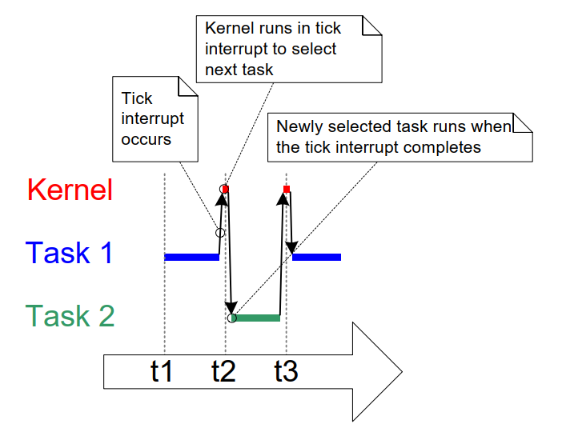
***图 4.4*** *扩展示意执行序列，显示滴答中断执行*
***

FreeRTOS API 中的时间通常以“滴答周期的倍数”表示，常简称为“ticks”。
`pdMS_TO_TICKS()` 宏可将毫秒时间转换为 tick 时间。
可用分辨率由滴答频率决定；若滴答频率超过 1KHz
（即 `configTICK_RATE_HZ` 大于 1000），则无法使用 `pdMS_TO_TICKS()`。
清单 4.10 演示如何用 `pdMS_TO_TICKS()`
将 200 毫秒转换为等效 tick 数。


<a name="list4.10" title="清单 4.10 使用 pdMS_TO_TICKS() 将 200 毫秒转换为 tick"></a>

```c
/*
 * pdMS_TO_TICKS() 仅接收一个毫秒参数，
 * 并计算等效的 tick 周期数。
 * 该示例把 xTimeInTicks 设为与 200ms 等效的 tick 数。
 */
TickType_t xTimeInTicks = pdMS_TO_TICKS( 200 );
```

***清单 4.10*** *使用 `pdMS_TO_TICKS()` 将 200 毫秒转换为等效 tick 周期数*

使用 `pdMS_TO_TICKS()` 以毫秒而非直接 tick 指定时间，
可确保当滴答频率改变时，应用中的时间语义不变。

“滴答计数（tick count）”是调度器启动后发生的滴答中断总数（假设计数尚未溢出）。
在指定延时时，用户应用无需关心溢出问题，
因为 FreeRTOS 会在内部保证时间一致性。

[第 4.12 节：调度算法](#412-scheduling-algorithms)
描述了会影响调度器何时选择新任务与滴答中断何时执行的配置常量。

<a name="example4.3" title="示例 4.3 试验优先级"></a>
---
***示例 4.3*** *试验优先级*

---

调度器总会确保“可运行的最高优先级任务”进入 *运行* 状态。
前面的示例中两个任务优先级相同，因此它们轮流进出 *运行* 状态。
本示例观察当两个任务优先级不同时会发生什么。
清单 4.11 展示了任务创建代码：
第一个任务优先级为 1，第二个为 2。
实现这两个任务的单一函数并未改变；
它仍会周期性打印字符串，并使用空循环制造延时。


<a name="list4.11" title="清单 4.11 创建两个不同优先级任务"></a>


```c
/*
 * 定义将作为任务参数传入的字符串。
 * 定义为 const，且不在栈上，以保证任务执行期间有效。
 */
static const char * pcTextForTask1 = "Task 1 is running";
static const char * pcTextForTask2 = "Task 2 is running";

int main( void )
{
    /* 创建第一个任务，优先级为 1。 */
    xTaskCreate( vTaskFunction,             /* 任务函数 */
                 "Task 1",                  /* 任务名 */
                 1000,                      /* 任务栈深 */
                 ( void * ) pcTextForTask1, /* 任务参数 */
                 1,                         /* 任务优先级 */
                 NULL );

    /* 创建第二个任务，优先级更高（2）。 */
    xTaskCreate( vTaskFunction,             /* 任务函数 */
                 "Task 2",                  /* 任务名 */
                 1000,                      /* 任务栈深 */
                 ( void * ) pcTextForTask2, /* 任务参数 */
                 2,                         /* 任务优先级 */
                 NULL );

    /* 启动调度器，使任务开始执行。 */
    vTaskStartScheduler();

    /* 不会执行到这里。 */
    return 0;
}
```

***清单 4.11*** *创建两个不同优先级任务*

图 4.5 展示了示例 4.3 的输出。

调度器总会选择可运行的最高优先级任务。
任务 2 优先级高于任务 1 且始终可运行；
因此调度器总是选择任务 2，任务 1 永远得不到执行。
这称为任务 1 被任务 2 “饿死（starved）”——
它无法打印字符串，因为它从未进入 *运行* 状态。


<a name="fig4.5" title="图 4.5 不同优先级运行两个任务"></a>

***
```console
C:\Temp>rtosdemo
Task 2 is running
Task 2 is running
Task 2 is running
Task 2 is running
Task 2 is running
Task 2 is running
Task 2 is running
Task 2 is running
Task 2 is running
Task 2 is running
Task 2 is running
Task 2 is running
Task 2 is running
Task 2 is running
Task 2 is running
```

***图 4.5*** *不同优先级运行两个任务*
***

任务 2 能一直运行，是因为它从不需要等待任何事件——
它不是在空循环中旋转，就是在向终端打印。


<a name="fig4.6" title="图 4.6 当一个任务优先级高于另一个任务时的执行模式"></a>

***
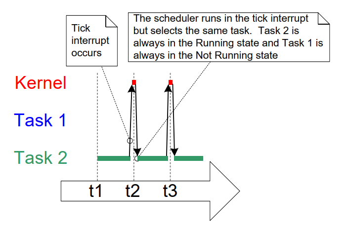
***图 4.6*** *示例 4.3 中一个任务优先级高于另一个任务时的执行模式*

## 4.7 展开 *未运行* 状态

到目前为止，创建的任务始终有处理工作可做，且从未等待任何事件——
既然它们从不等待，就始终可以进入 *运行* 状态。
这类“持续处理（continuous processing）”任务用途有限，
因为它们只能放在最低优先级。
如果放在更高优先级，将阻止低优先级任务运行。

要使这类任务真正有用，必须改写为事件驱动。
事件驱动任务只有在事件触发后才有工作可做，
在此之前不能进入 *运行* 状态。
调度器总会选择可运行的最高优先级任务。
如果高优先级任务因等待事件而不可选，
调度器就会改选可运行的低优先级任务。
因此采用事件驱动写法，就能在不同优先级下创建任务，
同时避免高优先级任务长期“饿死”低优先级任务。

### 4.7.1 *阻塞（Blocked）* 状态

等待事件的任务被称为处于 *阻塞* 状态，
它是 *未运行* 状态的一个子状态。

任务可因等待两类事件而进入 *阻塞* 状态：

1. 时间（temporal）事件——延时期满或到达绝对时刻时发生。
   例如，任务可进入 *阻塞* 状态等待 10 毫秒。

1. 同步（synchronization）事件——来自其他任务或中断。
   例如，任务可进入 *阻塞* 状态等待队列到达数据。
   同步事件覆盖范围很广。

FreeRTOS 队列、二值信号量、计数信号量、互斥量、递归互斥量、
事件组、流缓冲区、消息缓冲区以及直接任务通知，
都可用于创建同步事件。
后续章节将覆盖其中大部分机制。

任务在等待同步事件时可设置超时，
这等价于同时等待两类事件。
例如，任务可以最多等待 10 毫秒以接收队列数据。
若 10 毫秒内数据到达，任务离开 *阻塞* 状态；
若 10 毫秒过去仍无数据，也会离开 *阻塞* 状态。

### 4.7.2 *挂起（Suspended）* 状态

*挂起* 也是 *未运行* 的子状态。
处于挂起状态的任务对调度器不可见。
进入挂起状态的唯一方式是调用 `vTaskSuspend()`；
离开挂起状态只能通过 `vTaskResume()` 或 `xTaskResumeFromISR()`。
大多数应用不会使用挂起状态。

### 4.7.3 就绪（Ready）状态

处于 *未运行* 状态且不属于 *阻塞* 或 *挂起* 的任务，
称为处于 *就绪* 状态。
它们可以运行，因此“就绪”，
只是当前并未处于 *运行* 状态。

### 4.7.4 完整状态转换图

图 4.7 在简化状态图基础上补全了本节描述的所有 *未运行* 子状态。
到目前为止，示例中的任务尚未使用 *阻塞* 或 *挂起* 状态。
它们只在 *就绪* 与 *运行* 状态间切换，
如图 4.7 粗体线所示。


<a name="fig4.7" title="图 4.7 完整任务状态机"></a>

***
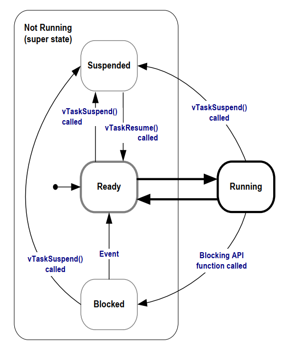
***图 4.7*** *完整任务状态机*
***

<a name="example4.4" title="示例 4.4 使用阻塞状态实现延时"></a>
---
***示例 4.4*** *使用 *Blocked* 状态创建延时*</i></h3>

---

到目前为止示例中创建的任务都是“周期性”任务——
它们先延时一段时间，再打印字符串，再次延时，如此循环。
延时是通过空循环非常粗糙地实现的——
任务不断轮询递增计数器，直到达到固定值。
示例 4.3 已清楚展示该方式的缺点：
高优先级任务执行空循环期间一直处于 *运行* 状态，
从而“饿死”低优先级任务。

各种轮询方式还有其他缺点，最明显的是低效。
轮询期间任务其实没有真正工作要做，
却仍占用最大处理时间，浪费处理器周期。
示例 4.4 通过调用 `vTaskDelay()` 取代空循环来修正该行为，
其原型见清单 4.12。
新的任务定义见清单 4.13。
注意：只有在 FreeRTOSConfig.h 中 `INCLUDE_vTaskDelay` 设为 1 时，
`vTaskDelay()` 才可用。

`vTaskDelay()` 会使调用任务在固定数量 tick 内进入 *阻塞* 状态。
任务在 *阻塞* 状态不占用处理时间，
因此仅在真正有工作时才消耗处理时间。


<a name="list4.12" title="清单 4.12 vTaskDelay() API 函数原型"></a>


```c
void vTaskDelay( TickType_t xTicksToDelay );
```

***清单 4.12*** *`vTaskDelay()` API 函数原型*

**`vTaskDelay` 参数：**

- `xTicksToDelay`

  调用任务将保持在 *阻塞* 状态的 tick 中断个数，
  到时后会被移回就绪状态。

  例如，若任务在 tick 计数为 10,000 时调用 `vTaskDelay( 100 )`，
  则它会立即进入 *阻塞* 状态，
  并在 tick 计数达到 10,100 前一直保持阻塞。

  可使用 `pdMS_TO_TICKS()` 将毫秒转换为 tick。
  例如调用 `vTaskDelay( pdMS_TO_TICKS( 100 ) )`，
  会使调用任务在 *阻塞* 状态维持 100 毫秒。


<a name="list4.13" title="清单 4.13 用 vTaskDelay() 替换空循环后的示例任务源码"></a>


```c
void vTaskFunction( void * pvParameters )
{
    char * pcTaskName;
    const TickType_t xDelay250ms = pdMS_TO_TICKS( 250 );

    /*
     * 要打印的字符串通过参数传入。将其转换为字符指针。
     */
    pcTaskName = ( char * ) pvParameters;

    /* 与大多数任务一样，该任务由无限循环实现。 */
    for( ;; )
    {
        /* 打印该任务名称。 */
        vPrintLine( pcTaskName );

        /*
         * 延时一段时间。这次使用 vTaskDelay()，
         * 使任务进入 Blocked 状态直至延时到期。
         * 参数以 tick 为单位，使用 pdMS_TO_TICKS() 宏
         *（见 xDelay250ms 声明）将 250 毫秒转换为等效 tick。
         */
        vTaskDelay( xDelay250ms );
    }
}
```

***清单 4.13*** *用 `vTaskDelay()` 替换空循环后的示例任务源码*

虽然两个任务依旧以不同优先级创建，
但现在两者都会运行。
图 4.8 给出了示例 4.4 的输出，验证了这一预期行为。


<a name="fig4.8" title="图 4.8 执行示例 4.4 时产生的输出"></a>

***

```console
C:\Temp>rtosdemo
Task 2 is running
Task 1 is running
Task 2 is running
Task 1 is running
Task 2 is running
Task 1 is running
Task 2 is running
Task 1 is running
Task 2 is running
Task 1 is running
Task 2 is running
Task 1 is running
Task 2 is running
Task 1 is running
Task 2 is running
Task 1 is running
```

***图 4.8*** *执行示例 4.4 时产生的输出*
***

图 4.9 的执行序列解释了为何两个不同优先级任务都能运行。
为简化说明，图中省略了调度器自身执行。

调度器启动时会自动创建空闲任务，
确保系统始终至少有一个可运行任务（至少一个任务处于 *就绪* 状态）。
[第 4.8 节：空闲任务与空闲任务钩子](#48-the-idle-task-and-the-idle-task-hook)
会更详细介绍空闲任务。


<a name="fig4.9" title="图 4.9 任务使用 vTaskDelay() 替代空循环时的执行序列"></a>

***
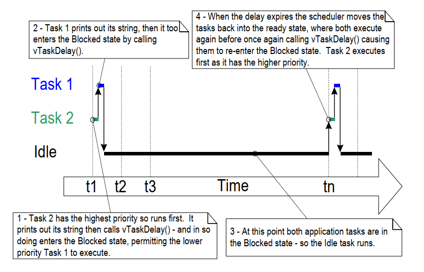
***图 4.9*** *任务使用 `vTaskDelay()` 替代空循环时的执行序列*
***

改变的只有两个任务的实现方式，功能并未改变。
将图 4.9 与图 4.4 对比可清楚看到：
相同功能以更高效方式实现。

图 4.4 展示了任务通过空循环实现延时、因此始终可运行时的执行模式。
结果是两者合计占用了全部可用处理时间。
图 4.9 展示了任务在整个延时期间处于 *阻塞* 状态时的执行模式。
它们只在确有工作要做时（本例中仅为打印消息）消耗处理时间，
因此只占用极少部分处理能力。

在图 4.9 场景中，每次任务离开 *阻塞* 状态后，
只执行不到一个 tick 周期就再次进入阻塞。
多数时间没有应用任务可运行（即无应用任务处于 *就绪* 状态），
因此也没有应用任务可被选入 *运行* 状态。
此时由空闲任务运行。
分配给空闲任务的处理时间可衡量系统剩余处理能力。
使用 RTOS 可显著提升系统剩余处理能力，
因为它允许应用变为完全事件驱动。

图 4.10 中粗体线表示示例 4.4 任务执行的状态转换：
每个任务现在都先进入 *阻塞* 状态，再返回 *就绪* 状态。


<a name="fig4.10" title="图 4.10 粗体线表示示例 4.4 任务执行的状态转换"></a>

***
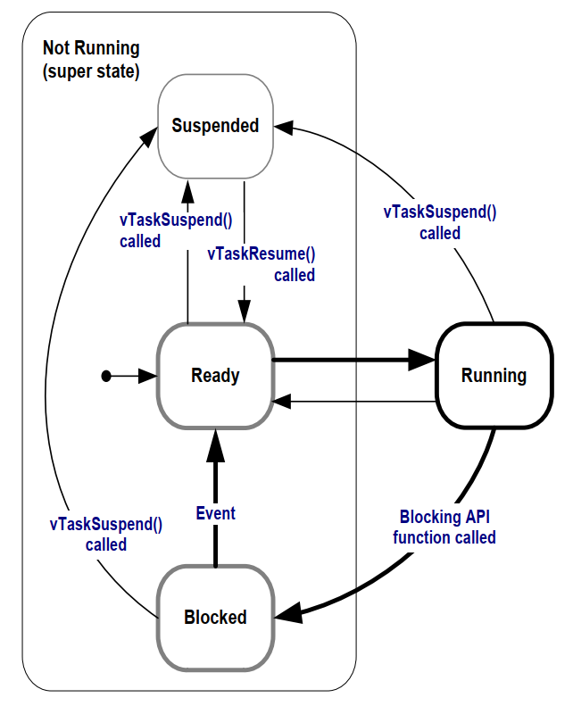
***图 4.10*** *粗体线表示示例 4.4 任务执行的状态转换*
***


### 4.7.5 `vTaskDelayUntil()` API 函数

`vTaskDelayUntil()` 与 `vTaskDelay()` 类似。
前文已示范：`vTaskDelay()` 参数指定的是
“任务调用 `vTaskDelay()` 到该任务再次离开 *阻塞* 状态之间
应发生多少次 tick 中断”。
任务在阻塞状态停留时长由 `vTaskDelay()` 参数指定，
但离开阻塞状态的时间点是相对调用 `vTaskDelay()` 的时刻而言。

`vTaskDelayUntil()` 参数则指定“绝对 tick 计数值”：
调用任务应在该 tick 值时从阻塞态移入 *就绪* 态。
当需要固定执行周期（即希望任务以固定频率周期执行）时，
应使用 `vTaskDelayUntil()`，因为解阻塞时刻是绝对的，
而非像 `vTaskDelay()` 那样相对函数调用时刻。


<a name="list4.14" title="清单 4.14 vTaskDelayUntil() API 函数原型"></a>

```c
void vTaskDelayUntil( TickType_t * pxPreviousWakeTime,
                      TickType_t xTimeIncrement );
```

***清单 4.14*** *`vTaskDelayUntil()` API 函数原型*

**`vTaskDelayUntil()` 参数**

- `pxPreviousWakeTime`

  该参数命名基于如下假设：`vTaskDelayUntil()`
  用于实现固定频率的周期任务。
  在这种情况下，`pxPreviousWakeTime` 保存任务上次离开 *阻塞*
  （被唤醒）时刻。
  该时刻作为参考点，用于计算任务下次应离开 *阻塞* 状态的时间。

  `pxPreviousWakeTime` 指向的变量会在 `vTaskDelayUntil()` 内自动更新；
  一般不应由应用代码修改，
  但首次使用前必须初始化为当前 tick 计数。
  清单 4.15 展示了初始化方法。

- `xTimeIncrement`

  该参数命名同样基于如下假设：
  `vTaskDelayUntil()` 用于实现固定频率周期任务，
  其频率由 `xTimeIncrement` 设定。

  `xTimeIncrement` 以 tick 为单位。
  可使用 `pdMS_TO_TICKS()` 将毫秒转换为 tick。

<a name="example4.5" title="示例 4.5 将示例任务改为使用 vTaskDelayUntil()"></a>
---
***示例 4.5*** *将示例任务改为使用 `vTaskDelayUntil()`*

---

示例 4.4 创建的两个任务是周期任务，
但使用 `vTaskDelay()` 并不能保证其运行频率严格固定，
因为它们离开 *阻塞* 状态的时刻是相对于调用 `vTaskDelay()` 的时刻。
将任务从 `vTaskDelay()` 改为 `vTaskDelayUntil()` 可解决这个潜在问题。


<a name="list4.15" title="清单 4.15 使用 vTaskDelayUntil() 的示例任务实现"></a>


```c
void vTaskFunction( void * pvParameters )
{
    char * pcTaskName;
    TickType_t xLastWakeTime;

    /*
     * 要打印的字符串通过参数传入。将其转换为字符指针。
     */
    pcTaskName = ( char * ) pvParameters;

    /*
     * xLastWakeTime 需要先初始化为当前 tick 计数。
     * 注意这是该变量唯一一次被显式写入。
     * 此后它会在 vTaskDelayUntil() 内自动更新。
     */
    xLastWakeTime = xTaskGetTickCount();

    /* 与大多数任务一样，该任务由无限循环实现。 */
    for( ;; )
    {
        /* 打印该任务名称。 */
        vPrintLine( pcTaskName );

        /*
         * 该任务应严格每 250 毫秒执行一次。
         * 与 vTaskDelay() 类似，时间以 tick 计量，
         * 通过 pdMS_TO_TICKS() 将毫秒转换为 tick。
         * xLastWakeTime 在 vTaskDelayUntil() 中自动更新，
         * 因此任务代码无需显式更新。
         */
        vTaskDelayUntil( &xLastWakeTime, pdMS_TO_TICKS( 250 ) );
    }
}
```

***清单 4.15*** *使用 `vTaskDelayUntil()` 的示例任务实现*

示例 4.5 的输出与图 4.8 中示例 4.4 的输出完全一致。

<a name="example4.6" title="示例 4.6 组合阻塞与非阻塞任务"></a>
---
***示例 4.6*** *组合阻塞与非阻塞任务*

---

前面的示例分别单独观察了轮询任务与阻塞任务行为。
本示例在此基础上进一步强化前述结论，
并展示当两种模式组合时的执行序列，具体如下：

1. 创建两个优先级为 1 的任务，它们仅持续打印字符串。

   这两个任务从不调用可能使其进入 *阻塞* 状态的 API，
   因此始终处于 *就绪* 或 *运行* 状态。
   这类任务称为“持续处理任务（continuous processing tasks）”，
   因为它们总是有工作要做（尽管本例工作较为简单）。
   清单 4.16 给出了持续处理任务源码。

1. 再创建第三个优先级为 2 的任务，高于前两个任务。
   第三个任务也只打印字符串，但它是周期执行，
   因此使用 `vTaskDelayUntil()` 在每次打印之间将自身置于 *阻塞* 状态。

清单 4.17 给出了周期任务源码。


<a name="list4.16" title="清单 4.16 示例 4.6 中的持续处理任务"></a>


```c
void vContinuousProcessingTask( void * pvParameters )
{
    char * pcTaskName;

    /*
     * 要打印的字符串通过参数传入。将其转换为字符指针。
     */
    pcTaskName = ( char * ) pvParameters;

    /* 与大多数任务一样，该任务由无限循环实现。 */
    for( ;; )
    {
        /*
         * 打印任务名称。
         * 该任务只重复执行此操作，不阻塞也不延时。
         */
        vPrintLine( pcTaskName );
    }
}
```

***清单 4.16*** *示例 4.6 中的持续处理任务*


<a name="list4.17" title="清单 4.17 示例 4.6 中的周期任务"></a>


```c
void vPeriodicTask( void * pvParameters )
{
    TickType_t xLastWakeTime;

    const TickType_t xDelay3ms = pdMS_TO_TICKS( 3 );

    /*
     * xLastWakeTime 需要初始化为当前 tick 计数。
     * 注意这是该变量唯一一次显式写入。
     * 此后由 vTaskDelayUntil() API 自动维护。
     */
    xLastWakeTime = xTaskGetTickCount();

    /* 与大多数任务一样，该任务由无限循环实现。 */
    for( ;; )
    {
        /* 打印该任务名称。 */
        vPrintLine( "Periodic task is running" );

        /*
         * 该任务应严格每 3 毫秒执行一次——见本函数中 xDelay3ms 声明。
         */
        vTaskDelayUntil( &xLastWakeTime, xDelay3ms );
    }
}
```

***清单 4.17*** *示例 4.6 中的周期任务*

图 4.11 给出了示例 4.6 的输出，
图 4.12 的执行序列解释了观察到的行为。

<a name="fig4.11" title="图 4.11 执行示例 4.6 时产生的输出"></a>

***

```console
Continuous task 2 running
Continuous task 2 running
Periodic task is running
Continuous task 1 running
Continuous task 1 running
Continuous task 1 running
Continuous task 1 running
Continuous task 1 running
Continuous task 2 running
Continuous task 2 running
Continuous task 2 running
Continuous task 2 running
Continuous task 2 running
Continuous task 1 running
Continuous task 1 running
Continuous task 1 running
Continuous task 1 running
Continuous task 1 running
Continuous task 1 running
Continuous task 1 running
Continuous task 1 running
Continuous task 1 running
Periodic task is running
Continuous task 2 running
Continuous task 2 running
```

***图 4.11*** *执行示例 4.6 时产生的输出*
***


<a name="fig4.12" title="图 4.12 示例 4.6 的执行模式"></a>

***
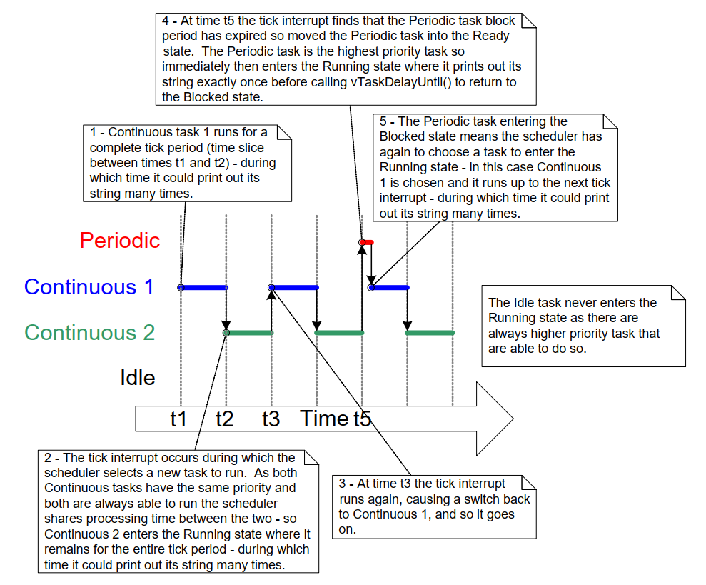
***图 4.12*** *示例 4.6 的执行模式*
***

## 4.8 空闲任务与空闲任务钩子

示例 4.4 创建的任务大部分时间处于 *阻塞* 状态。
在该状态下它们无法运行，因此不会被调度器选中。

系统中必须始终至少有一个任务可以进入 *运行* 状态[^6]。
为保证这一点，调度器在调用 `vTaskStartScheduler()` 时会自动创建空闲任务。
空闲任务几乎只是循环空转，
因此像前面示例中的任务一样，它始终可运行。

[^6]: 即便使用 FreeRTOS 的特殊低功耗特性，这一结论也成立。
在那种情况下，若应用创建的任务都无法执行，
运行 FreeRTOS 的微控制器会被置于低功耗模式。

空闲任务具有最低优先级（优先级 0），
以确保其不会阻止更高优先级应用任务进入 *运行* 状态。
不过，如果需要，应用设计者也可以创建与空闲任务同优先级（0）的任务。
`FreeRTOSConfig.h` 中的编译期配置常量 `configIDLE_SHOULD_YIELD`
可用于防止空闲任务占用那些更适合分配给同为优先级 0 的应用任务的处理时间。
第 4.12 节“调度算法”会介绍 `configIDLE_SHOULD_YIELD`。

由于空闲任务处于最低优先级，一旦有更高优先级任务进入就绪态，
它就会立即被切出 *运行* 状态。
图 4.9 的 **tn** 时刻可见此行为：
任务 2 离开 *阻塞* 状态瞬间，空闲任务立即被换出，任务 2 开始执行。
我们称任务 2 抢占了空闲任务。
抢占是自动发生的，被抢占任务本身并不“知情”。

> *注意：如果某任务调用 `vTaskDelete()` 删除自身，
> 则必须确保空闲任务不会被完全饿死。
> 因为空闲任务负责回收这些自删任务所使用的内核资源。*

### 4.8.1 空闲任务钩子函数

可通过空闲钩子（idle hook，或 idle callback）
把应用特定功能直接加入空闲任务。
空闲钩子函数会在空闲任务循环每次迭代时自动调用一次。

空闲任务钩子的常见用途包括：

- 执行低优先级、后台或持续处理功能，
  无需为此额外创建应用任务并消耗 RAM。

- 测量剩余处理能力。
  （仅当所有更高优先级应用任务都无事可做时，空闲任务才会运行；
  因此测量分配给空闲任务的处理时间，可清晰反映剩余处理时间。）

- 让处理器进入低功耗模式，
  在没有应用处理工作时自动省电
  （尽管节能效果不如无滴答空闲模式 tick-less idle）。

### 4.8.2 实现空闲任务钩子函数的限制

空闲任务钩子函数必须遵守以下规则：

- 空闲任务钩子函数绝不能尝试阻塞或挂起自己。

  *注意：以任何方式阻塞空闲任务，都可能导致系统中没有任务可进入 *运行* 状态。*

- 若某应用任务使用 `vTaskDelete()` 删除自身，
  则空闲任务钩子必须在合理时间内返回调用者。
  这是因为空闲任务负责回收自删任务分配的内核资源。
  若空闲任务长期停留在钩子函数内不返回，
  这些回收将无法进行。

空闲任务钩子函数必须使用清单 4.18 所示的名称与原型。


<a name="list4.18" title="清单 4.18 空闲任务钩子函数名称与原型"></a>

```c
void vApplicationIdleHook( void );
```

***清单 4.18*** *空闲任务钩子函数名称与原型*

<a name="example4.7" title="示例 4.7 定义空闲任务钩子函数"></a>
---
***示例 4.7*** *定义空闲任务钩子函数*</i></h3>

---

示例 4.4 中使用阻塞式 `vTaskDelay()` 调用，
产生了大量空闲时间，即应用任务都处于 *阻塞* 状态时
由空闲任务执行的时间。
示例 4.7 通过添加空闲钩子函数来利用这部分空闲时间，
其源码见清单 4.19。


<a name="list4.19" title="清单 4.19 一个非常简单的空闲钩子函数"></a>

```c
/* 声明一个将被钩子函数递增的变量。 */
volatile unsigned long ulIdleCycleCount = 0UL;

/*
 * 空闲钩子函数必须命名为 vApplicationIdleHook()，
 * 不带参数，返回 void。
 */
void vApplicationIdleHook( void )
{
    /* 此钩子函数仅做一件事：递增计数器。 */
    ulIdleCycleCount++;
}
```

***清单 4.19*** *一个非常简单的空闲钩子函数*


要让空闲钩子函数被调用，必须在 FreeRTOSConfig.h 中将
`configUSE_IDLE_HOOK` 设为 1。

创建任务的实现函数做了轻微修改：
如清单 4.20 所示，它会打印 `ulIdleCycleCount` 值。


<a name="list4.20" title="清单 4.20 示例任务源码现在会打印 ulIdleCycleCount 值"></a>


```c
void vTaskFunction( void * pvParameters )
{
    char * pcTaskName;
    const TickType_t xDelay250ms = pdMS_TO_TICKS( 250 );

    /*
     * 要打印的字符串通过参数传入。将其转换为字符指针。
     */
    pcTaskName = ( char * ) pvParameters;

    /* 与大多数任务一样，该任务由无限循环实现。 */
    for( ;; )
    {
        /*
         * 打印该任务名称，以及
         * ulIdleCycleCount 已递增的次数。
         */
        vPrintLineAndNumber( pcTaskName, ulIdleCycleCount );

        /* 延时 250 毫秒。 */
        vTaskDelay( xDelay250ms );
    }
}
```

***清单 4.20*** *示例任务源码现在会打印 `ulIdleCycleCount` 值*

图 4.13 展示了示例 4.7 输出。
可见应用任务每次迭代之间，空闲任务钩子函数大约执行 400 万次
（具体迭代次数依赖硬件速度）。


<a name="fig4.13" title="图 4.13 执行示例 4.7 时产生的输出"></a>

***

```console
C:\Temp>rtosdemo
Task 2 is running
ulIdleCycleCount = 0
Task 1 is running
ulIdleCycleCount = 0
Task 2 is running
ulIdleCycleCount = 3869504
Task 1 is running
ulIdleCycleCount = 3869504
Task 2 is running
ulIdleCycleCount = 8564623
Task 1 is running
ulIdleCycleCount = 8564623
Task 2 is running
ulIdleCycleCount = 13181489
Task 1 is running
ulIdleCycleCount = 13181489
Task 2 is running
ulIdleCycleCount = 17838406
Task 1 is running
ulIdleCycleCount = 17838406
Task 2 is running
```

***图 4.13*** *执行示例 4.7 时产生的输出*
***


## 4.9 修改任务优先级

### 4.9.1 `vTaskPrioritySet()` API 函数

`vTaskPrioritySet()` 可在调度器启动后修改任务优先级。
仅当 FreeRTOSConfig.h 中 `INCLUDE_vTaskPrioritySet` 设为 1 时可用。


<a name="list4.21" title="清单 4.21 vTaskPrioritySet() API 函数原型"></a>

```c
void vTaskPrioritySet( TaskHandle_t xTask,
                       UBaseType_t uxNewPriority );
```

***清单 4.21*** *`vTaskPrioritySet()` API 函数原型*

**`vTaskPrioritySet()` 参数**

- `pxTask`

  被修改优先级任务（目标任务）的句柄。
  如何获取任务句柄可参考 `xTaskCreate()` 的 `pxCreatedTask` 参数，
  或 `xTaskCreateStatic()` 的返回值。

  任务可通过传入 `NULL` 来修改自身优先级。

- `uxNewPriority`

  目标任务将设置到的优先级。
  该值会自动钳制到最大可用优先级 `(configMAX_PRIORITIES – 1)`，
  其中 `configMAX_PRIORITIES` 为 FreeRTOSConfig.h 中设置的编译期常量。


### 4.9.2 `uxTaskPriorityGet()` API 函数

`uxTaskPriorityGet()` 返回任务当前优先级。
仅当 FreeRTOSConfig.h 中 `INCLUDE_uxTaskPriorityGet` 设为 1 时可用。


<a name="list4.22" title="清单 4.22 uxTaskPriorityGet() API 函数原型"></a>

```c
UBaseType_t uxTaskPriorityGet( TaskHandle_t xTask );
```

***清单 4.22*** *`uxTaskPriorityGet()` API 函数原型*

**`uxTaskPriorityGet()` 参数与返回值**

- `pxTask`

  被查询优先级任务（目标任务）的句柄。
  如何获取任务句柄可参考 `xTaskCreate()` 的 `pxCreatedTask` 参数，
  或 `xTaskCreateStatic()` 的返回值。

  任务可通过传入 `NULL` 查询自身优先级。

- 返回值

  被查询任务当前优先级。


<a name="example4.8" title="示例 4.8 修改任务优先级"></a>
---
***示例 4.8*** *修改任务优先级*

---

调度器始终选择最高优先级 *就绪* 任务进入 *运行* 状态。
示例 4.8 通过 `vTaskPrioritySet()`
动态调整两个任务相对优先级来演示这一点。

示例 4.8 以两个不同优先级创建两个任务。
两者都不调用任何可能使其进入阻塞态的 API，
因此始终处于 *就绪* 或 *运行* 状态。
于是相对优先级更高的任务将始终被调度器选为 *运行* 任务。

示例 4.8 行为如下：

1. 任务 1（清单 4.23）以最高优先级创建，因此保证先运行。
   任务 1 先打印几条字符串，随后把任务 2（清单 4.24）优先级
   提升到高于自己。

1. 一旦任务 2 拥有最高相对优先级，就开始运行（进入 *运行* 状态）。
   任意时刻只能有一个任务处于 *运行* 状态，
   因此任务 2 运行时，任务 1 处于 *就绪* 状态。

1. 任务 2 打印消息后，再把自身优先级降低到低于任务 1。

1. 当任务 2 降低优先级后，任务 1 再次成为最高优先级任务，
   因而重新进入 *运行* 状态，并迫使任务 2 回到 *就绪* 状态。


<a name="list4.23" title="清单 4.23 示例 4.8 中任务 1 的实现"></a>

```c
void vTask1( void * pvParameters )
{
    UBaseType_t uxPriority;

    /*
     * 该任务总会先于任务 2 运行，因为创建时优先级更高。
     * 任务 1 与任务 2 都不会阻塞，因此两者始终处于
     * Running 或 Ready 状态。
     */

    /*
     * 查询本任务当前运行优先级——传入 NULL 表示
     * “返回调用任务的优先级”。
     */
    uxPriority = uxTaskPriorityGet( NULL );

    for( ;; )
    {
        /* 打印该任务名称。 */
        vPrintLine( "Task 1 is running" );

        /*
         * 将任务 2 的优先级提升到任务 1 之上后，
         * 任务 2 会立即开始运行（此时它成为两者中更高优先级）。
         * 注意在 vTaskPrioritySet() 调用中使用了任务 2 的句柄
         *（xTask2Handle）。清单 4.25 展示了句柄获取方式。
         */
        vPrintLine( "About to raise the Task 2 priority" );
        vTaskPrioritySet( xTask2Handle, ( uxPriority + 1 ) );

        /*
         * 任务 1 只有在优先级高于任务 2 时才会运行。
         * 因此执行到这里说明任务 2 已经执行过，
         * 并把自己的优先级降回低于本任务。
         */
    }
}
```

***清单 4.23*** *示例 4.8 中任务 1 的实现*


<a name="list4.24" title="清单 4.24 示例 4.8 中任务 2 的实现"></a>


```c
void vTask2( void * pvParameters )
{
    UBaseType_t uxPriority;

    /*
     * 任务 1 总会先于该任务运行，因为任务 1 创建时优先级更高。
     * 任务 1 与任务 2 都不会阻塞，因此始终处于
     * Running 或 Ready 状态。
     *
     * 查询本任务当前运行优先级——传入 NULL 表示
     * “返回调用任务的优先级”。
     */
    uxPriority = uxTaskPriorityGet( NULL );

    for( ;; )
    {
        /*
         * 执行到这里说明任务 1 已运行过，
         * 且已把该任务优先级提升到高于自身。
         */

         /* 打印该任务名称。 */
        vPrintLine( "Task 2 is running" );

        /*
         * 将本任务优先级降回初始值。
         * 句柄传 NULL 表示“修改调用任务本身优先级”。
         * 将优先级降到低于任务 1 会导致任务 1 立即开始运行，
         * 即抢占本任务。
         */
        vPrintLine( "About to lower the Task 2 priority" );
        vTaskPrioritySet( NULL, ( uxPriority - 2 ) );
    }
}
```

***清单 4.24*** *示例 4.8 中任务 2 的实现*

每个任务都可以用 `NULL` 代替有效句柄来查询或设置自身优先级。
只有当任务希望操作“其他任务”时才需要句柄，
例如任务 1 修改任务 2 优先级。
为了让任务 1 做到这一点，任务 2 句柄在创建任务 2 时获取并保存，
见清单 4.25 注释中的高亮说明。


<a name="list4.25" title="清单 4.25 示例 4.8 的 main() 实现"></a>

```c
/* 声明变量用于保存任务 2 句柄。 */
TaskHandle_t xTask2Handle = NULL;

int main( void )
{
    /*
     * 以优先级 2 创建第一个任务。
     * 任务参数未使用，设为 NULL。
     * 任务句柄也未使用，因此同样设为 NULL。
     */
    xTaskCreate( vTask1, "Task 1", 1000, NULL, 2, NULL );
    /* 该任务创建优先级为 2 ______^. */

    /*
     * 以优先级 1 创建第二个任务——低于任务 1。
     * 同样任务参数未使用，设为 NULL。
     * 但这次需要任务句柄，因此最后一个参数传入 xTask2Handle 地址。
     */
    xTaskCreate( vTask2, "Task 2", 1000, NULL, 1, &xTask2Handle );
    /* 任务句柄是最后一个参数 _____^^^^^^^^^^^^^ */

    /* 启动调度器，使任务开始执行。 */
    vTaskStartScheduler();

    /*
     * 若一切正常，main() 不会执行到这里，因为调度器已在运行任务。
     * 若执行到这里，说明堆内存不足，无法创建空闲任务或定时器任务
     * （本书后文会介绍）。第 3 章提供更多堆内存管理信息。
     */
    for( ;; )
    {
    }
}
```

***清单 4.25*** *示例 4.8 的 `main()` 实现*

图 4.14 展示了示例 4.8 任务执行顺序，
图 4.15 展示其输出结果。


<a name="fig4.14" title="图 4.14 运行示例 4.8 时的任务执行顺序"></a>

***
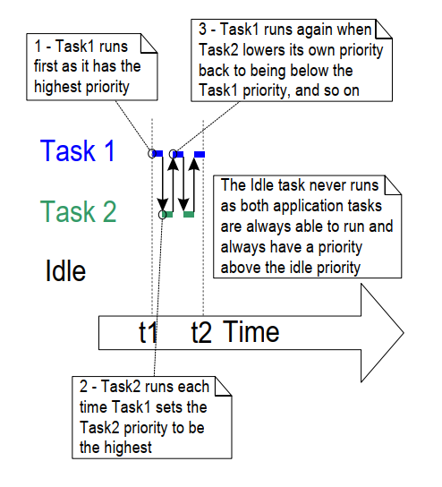
***图 4.14*** *运行示例 4.8 时的任务执行顺序*
***


<a name="fig4.15" title="图 4.15 执行示例 4.8 时产生的输出"></a>

***

```console
Task1 is running
About to raise the Task2 priority
Task2 is running
About to lower the Task2 priority
Task1 is running
About to raise the Task2 priority
Task2 is running
About to lower the Task2 priority
Task1 is running
About to raise the Task2 priority
Task2 is running
About to lower the Task2 priority
Task1 is running
```

***图 4.15*** *执行示例 4.8 时产生的输出*
***

## 4.10 删除任务

### 4.10.1 `vTaskDelete()` API 函数

`vTaskDelete()` API 用于删除任务。
仅当 FreeRTOSConfig.h 中 `INCLUDE_vTaskDelete` 设为 1 时可用。

通常不建议在运行时持续创建和删除任务；
如果发现需要这样做，应优先考虑其他设计方案（如复用任务）。

被删除任务不再存在，也不能再次进入 *运行* 状态。

若任务通过动态内存创建后再删除自身，
由空闲任务负责释放其占用内存，
例如被删任务的数据结构与栈。
因此在这种情况下，应用必须避免让空闲任务完全得不到处理时间。

> *注意：任务删除时，只有内核为该任务分配的内存会被自动释放。
> 在任务实现过程中由应用额外分配的内存或其他资源，
> 若不再需要，必须显式释放。*


<a name="list4.26" title="清单 4.26 vTaskDelete() API 函数原型"></a>


```c
void vTaskDelete( TaskHandle_t xTaskToDelete );
```

***清单 4.26*** *`vTaskDelete()` API 函数原型*

**`vTaskDelete()` 参数**

- `pxTaskToDelete`

  要删除任务（目标任务）的句柄。
  如何获取任务句柄可参考 `xTaskCreate()` 的 `pxCreatedTask` 参数，
  以及 `xTaskCreateStatic()` 的返回值。

  任务可通过传入 `NULL` 删除自身。


<a name="example4.9" title="示例 4.9 删除任务"></a>
---
***示例 4.9*** *删除任务*

---

这是一个非常简单的示例，行为如下：

1. `main()` 以优先级 1 创建任务 1。
   任务 1 运行后再创建优先级 2 的任务 2。
   此时任务 2 成为最高优先级任务，立即开始执行。
   清单 4.27 给出 `main()` 源码，清单 4.28 给出任务 1 源码。

1. 任务 2 除删除自身外不做其他事。
   它本可向 `vTaskDelete()` 传 `NULL` 自删，
   但为演示目的，这里使用了自己的任务句柄。
   清单 4.29 给出任务 2 源码。

1. 任务 2 删除后，任务 1 再次成为最高优先级任务并继续执行——
   然后调用 `vTaskDelay()` 阻塞短时间。

1. 任务 1 阻塞期间由空闲任务执行，
   并释放已删除任务 2 分配的内存。

1. 当任务 1 离开阻塞态后，再次成为最高优先级 *就绪* 任务，
   因而抢占空闲任务。
   它进入 *运行* 状态后又创建任务 2，如此循环。


<a name="list4.27" title="清单 4.27 示例 4.9 的 main() 实现"></a>

```c
int main( void )
{
    /* 以优先级 1 创建第一个任务。 */
    xTaskCreate( vTask1, "Task 1", 1000, NULL, 1, NULL );

    /* 启动调度器，使任务开始执行。 */
    vTaskStartScheduler();

    /* 调度器已启动，main() 不应运行到这里。 */
    for( ;; )
    {
    }
}
```

***清单 4.27*** *示例 4.9 的 `main()` 实现*
***


<a name="list4.28" title="清单 4.28 示例 4.9 中任务 1 的实现"></a>

```c
TaskHandle_t xTask2Handle = NULL;

void vTask1( void * pvParameters )
{
    const TickType_t xDelay100ms = pdMS_TO_TICKS( 100UL );

    for( ;; )
    {
        /* 打印该任务名称。 */
        vPrintLine( "Task 1 is running" );

        /*
         * 以更高优先级创建任务 2。
         * 将 xTask2Handle 地址作为 pxCreatedTask 参数传入，
         * 使 xTaskCreate 把生成的任务句柄写入该变量。
         */
        xTaskCreate( vTask2, "Task 2", 1000, NULL, 2, &xTask2Handle );

        /*
         * 任务 2 具有（或曾具有）更高优先级。
         * 任务 1 能执行到这里，说明任务 2 必然已经执行并删除自身。
         */
        vTaskDelay( xDelay100ms );
    }
}
```

***清单 4.28*** *示例 4.9 中任务 1 的实现*


<a name="list4.29" title="清单 4.29 示例 4.9 中任务 2 的实现"></a>


```c
void vTask2( void * pvParameters )
{
    /*
     * 任务 2 启动后立即删除自身。
     * 它可以向 vTaskDelete() 传入 NULL 来实现。
     * 但为演示目的，这里改为传入其自身任务句柄。
     */
    vPrintLine( "Task 2 is running and about to delete itself" );
    vTaskDelete( xTask2Handle );
}
```

***清单 4.29*** *示例 4.9 中任务 2 的实现*


<a name="fig4.16" title="图 4.16 执行示例 4.9 时产生的输出"></a>

***

```console
C:\Temp>rtosdemo
Task1 is running
Task2 is running and about to delete itself
Task1 is running
Task2 is running and about to delete itself
Task1 is running
Task2 is running and about to delete itself
Task1 is running
Task2 is running and about to delete itself
Task1 is running
Task2 is running and about to delete itself
Task1 is running
Task2 is running and about to delete itself
Task1 is running
Task2 is running and about to delete itself
Task1 is running
Task2 is running and about to delete itself
```

***图 4.16*** *执行示例 4.9 时产生的输出*
***


<a name="fig4.17" title="图 4.17 示例 4.9 的执行序列"></a>

***
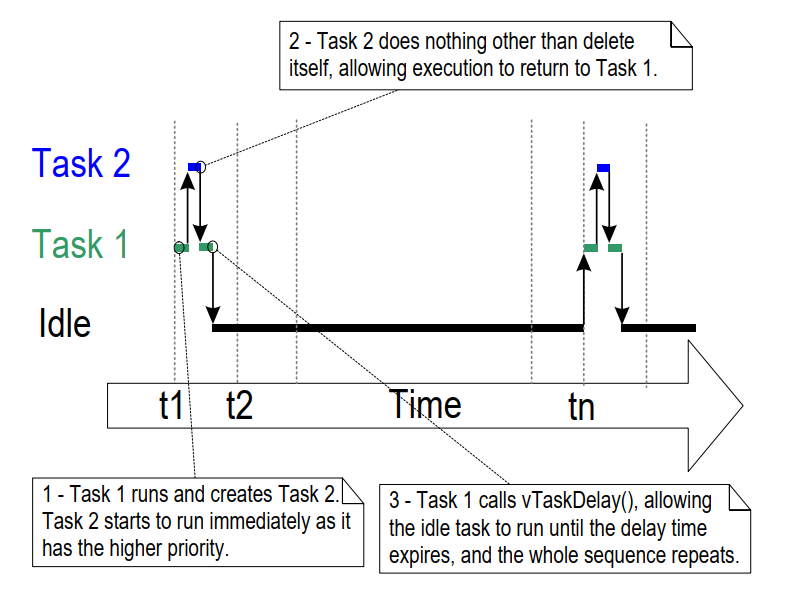
***图 4.17*** *示例 4.9 的执行序列*
***


## 4.11 线程本地存储与可重入

线程本地存储（Thread Local Storage，TLS）允许应用开发者
在每个任务的任务控制块中存储任意数据。
该特性最常见用途是保存原本会被不可重入函数放在全局变量中的数据。

可重入函数（reentrant function）是指可在多线程中安全运行且无副作用的函数。
在多线程环境中使用不可重入函数而又不使用线程本地存储时，
必须特别小心：通常需要在临界区内检查这些函数调用的带外结果。
大量使用临界区会降低 RTOS 性能，
因此通常更倾向使用线程本地存储而不是临界区。

线程本地存储最常见的用法是处理 ISO C 标准库与 POSIX 系统中的
`errno` 全局变量。
`errno` 用于为 `strtof`、`strtol` 等常见标准库函数
提供扩展结果或错误码。

### 4.11.1 C 运行时线程本地存储实现

大多数嵌入式 libc 实现都提供 API，
以确保不可重入函数在多线程环境中也能正确工作。
FreeRTOS 内置支持两个常用开源库的可重入 API：
[newlib](https://sourceware.org/newlib/) 与
[picolibc](https://github.com/picolibc/picolibc)。
可在项目的 FreeRTOSConfig.h 中定义下列宏，
启用对应的预构建 C 运行时线程本地存储实现：

- `configUSE_NEWLIB_REENTRANT`（用于 [newlib](https://sourceware.org/newlib/)）
- `configUSE_PICOLIBC_TLS`（用于 [picolibc](https://github.com/picolibc/picolibc)）

### 4.11.2 自定义 C 运行时线程本地存储

应用开发者也可以在 FreeRTOSConfig.h 中定义如下宏来自行实现 TLS：

- 将 `configUSE_C_RUNTIME_TLS_SUPPORT` 定义为 1，启用 C 运行时 TLS 支持。

- 将 `configTLS_BLOCK_TYPE` 定义为用于存储 C 运行时 TLS 数据的 C 类型。

- 将 `configINIT_TLS_BLOCK` 定义为初始化 C 运行时 TLS 块时执行的 C 代码。

- 将 `configSET_TLS_BLOCK` 定义为切入新任务时执行的 C 代码。

- 将 `configDEINIT_TLS_BLOCK` 定义为去初始化 C 运行时 TLS 块时执行的 C 代码。

### 4.11.3 应用级线程本地存储

除 C 运行时 TLS 外，应用开发者还可定义一组应用专用指针并放入任务控制块。
在项目 FreeRTOSConfig.h 中将 `configNUM_THREAD_LOCAL_STORAGE_POINTERS`
设为非零即可启用该特性。
清单 4.30 中定义的 `vTaskSetThreadLocalStoragePointer`
与 `pvTaskGetThreadLocalStoragePointer` 函数，
可分别在运行时设置与获取每个 TLS 指针的值。


<a name="list4.30" title="清单 4.30 线程本地存储指针 API 函数原型"></a>

```c
void * pvTaskGetThreadLocalStoragePointer( TaskHandle_t xTaskToQuery,
                                           BaseType_t xIndex )

void vTaskSetThreadLocalStoragePointer( TaskHandle_t xTaskToSet,
                                        BaseType_t xIndex,
                                        void * pvValue );
```

***清单 4.30*** *线程本地存储指针 API 函数原型*


## 4.12 调度算法

### 4.12.1 任务状态与事件回顾

实际正在运行（占用处理时间）的任务处于 *运行* 状态。
在单核处理器上，任意时刻只能有一个任务处于 *运行* 状态。
FreeRTOS 也可运行在多核（非对称多处理 AMP）或跨核调度（对称多处理 SMP）环境，
但本节不讨论这些场景。

那些未实际运行、又不处于阻塞态或挂起态的任务，
处于 *就绪* 状态。
就绪任务可被调度器选择进入 *运行* 状态。
调度器始终选择最高优先级就绪任务进入 *运行* 状态。

任务可在 *阻塞* 状态等待事件；当事件发生时会自动移回 *就绪* 状态。
时间事件在特定时刻发生，例如阻塞超时到期，
通常用于实现周期行为或超时行为。
同步事件则由任务或中断服务例程通过任务通知、队列、事件组、消息缓冲区、
流缓冲区或多种信号量发送信息触发。
它们一般用于指示异步活动，例如外设数据到达。


### 4.12.2 选择调度算法

调度算法是决定“哪个就绪任务转入运行态”的软件例程。

到目前为止所有示例都使用了同一种调度算法，
但可通过配置常量 `configUSE_PREEMPTION` 与 `configUSE_TIME_SLICING`
进行更改。
这两个常量都定义在 FreeRTOSConfig.h 中。

第三个配置常量 `configUSE_TICKLESS_IDLE` 也会影响调度算法，
因为启用后可能在较长时间内完全关闭滴答中断。
`configUSE_TICKLESS_IDLE` 是面向“必须最小化功耗”的应用提供的高级选项。
本节描述默认假设 `configUSE_TICKLESS_IDLE` 为 0（未定义时默认即为 0）。

在所有单核配置中，FreeRTOS 调度器都会让同优先级任务轮流被选中。
这种“轮流来”的策略通常称为“轮转调度（Round Robin Scheduling）”。
轮转并不保证同优先级任务获得完全相等的时间，
只保证同优先级且处于就绪态的任务会轮流进入运行态。

<a name="tbl5" title="表 5 FreeRTOSConfig.h 中配置内核调度算法的设置"></a>

***
| 调度算法 | 是否按优先级 | `configUSE_PREEMPTION` | `configUSE_TIME_SLICING` |
|---------------------------------|-------------|------------------------|--------------------------|
| 抢占式 + 时间片 | 是 | 1 | 1   |
| 抢占式 + 无时间片 | 是 | 1 | 0   |
| 协作式 | 否 | 0 | 任意 |

***表 5*** *FreeRTOSConfig.h 中配置内核调度算法的设置*
* * *

### 4.12.3 带时间片的按优先级抢占调度

表 5 所示配置会让 FreeRTOS 调度器使用
“固定优先级抢占 + 时间片（Fixed Priority Preemptive Scheduling with Time Slicing）”算法。
这也是大多数小型 RTOS 应用采用的算法，
亦是本书前述所有示例所使用的算法。
下表术语解释了该算法名称中的关键词。

**调度策略术语解释：**

- 固定优先级（Fixed Priority）

  所谓“固定优先级”是指调度算法本身不会修改被调度任务的优先级；
  但它并不阻止任务自己修改自身或其他任务优先级。

- 抢占（Preemptive）

  抢占式调度在“高于当前运行任务优先级”的任务进入就绪态时，
  会立即抢占当前运行任务。
  被抢占意味着在未显式让出或阻塞的情况下，
  任务被强制移出运行态并进入就绪态，
  以让另一个任务进入运行态。
  任务抢占可发生在任意时刻，不仅限于 RTOS 滴答中断。

- 时间片（Time Slicing）

  时间片用于在同优先级任务间共享处理时间，
  即使这些任务没有显式让出或进入阻塞态。
  使用时间片的调度算法会在每个时间片结束时，
  若存在其他与当前运行任务同优先级的就绪任务，
  则选择新任务进入运行态。
  一个时间片等于两次 RTOS 滴答中断之间的时间。

图 4.18 和图 4.19 展示了在“固定优先级抢占 + 时间片”算法下任务如何调度。
图 4.18 展示应用中所有任务优先级互不相同时进入运行态的顺序；
图 4.19 展示应用中两个任务共享优先级时的顺序。


<a name="fig4.18" title="图 4.18 假想应用中各任务优先级唯一时，任务优先级与抢占行为的执行模式"></a>

***
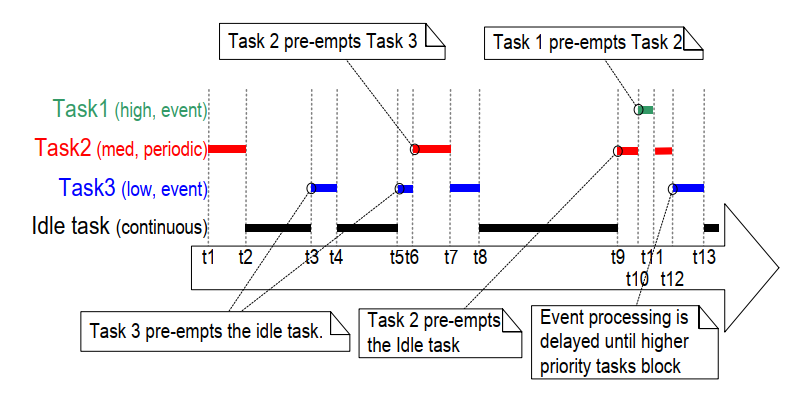
***图 4.18*** *假想应用中每个任务都分配唯一优先级时，
突出任务优先级与抢占行为的执行模式*
***

参见图 4.18：

- 空闲任务

  空闲任务优先级最低，
  因此每当更高优先级任务进入就绪态时都会被抢占，
  例如 t3、t5、t9。

- 任务 3

  任务 3 是事件驱动任务，优先级较低但高于空闲优先级。
  它大部分时间在 *阻塞* 状态等待目标事件，
  每次事件发生时从阻塞态转为就绪态。
  FreeRTOS 的所有任务间通信机制（任务通知、队列、信号量、事件组等）
  都可用于发出事件并以这种方式解阻塞任务。

  事件发生在 t3 与 t5，且在 t9 与 t12 之间还发生一次。
  t3 与 t5 的事件会被立即处理，
  因为这两个时刻任务 3 是可运行任务中优先级最高的。
  而 t9 与 t12 间发生的事件要到 t12 才处理，
  因为在此之前更高优先级任务 1 和任务 2 仍在执行。
  直到 t12，任务 1 与任务 2 都进入阻塞态，
  任务 3 才成为最高优先级就绪任务。

- 任务 2

  任务 2 是周期任务，优先级高于任务 3、低于任务 1。
  其周期意味着它希望在 t1、t6、t9 执行。

  t6 时任务 3 处于运行态，
  但任务 2 相对优先级更高，因此抢占任务 3 并立即执行。
  任务 2 在 t7 完成处理并重新进入阻塞态，
  随后任务 3 可重新进入运行态继续处理。
  任务 3 在 t8 自身阻塞。

- 任务 1

  任务 1 也是事件驱动任务，且优先级最高，
  因此可抢占系统内任意其他任务。
  图中任务 1 事件发生在 t10，
  此时任务 1 抢占任务 2。
  只有当任务 1 在 t11 重新进入阻塞态后，
  任务 2 才能继续完成处理。


<a name="fig4.19" title="图 4.19 假想应用中两个任务同优先级时，任务优先级与时间片行为的执行模式"></a>

***
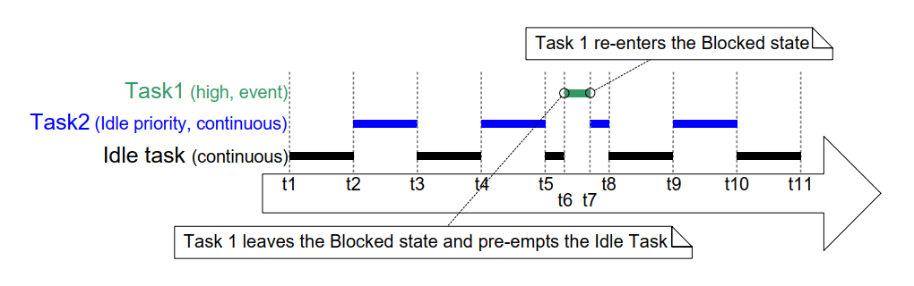
***图 4.19*** *假想应用中两个任务运行在相同优先级时，
突出任务优先级与时间片行为的执行模式*
***

参见图 4.19：

- 空闲任务与任务 2

  空闲任务和任务 2 都是持续处理任务，
  且优先级都为 0（最低优先级）。
  只有当没有更高优先级任务可运行时，
  调度器才会给优先级 0 任务分配处理时间；
  且这部分时间通过时间片在它们之间共享。
  每次 tick 中断都会开启新的时间片，
  在图 4.19 中发生于 t1、t2、t3、t4、t5、t8、t9、t10、t11。

  空闲任务与任务 2 轮流进入运行态，
  因此可能出现同一时间片内两者都运行过一部分时间，
  如 t5 到 t8 之间所示。

- 任务 1

  任务 1 优先级高于空闲优先级。
  它是事件驱动任务，大部分时间在阻塞态等待目标事件，
  每次事件发生时从阻塞态转为就绪态。

  目标事件在 t6 发生。
  t6 时任务 1 成为可运行任务中优先级最高者，
  因此在一个时间片中途抢占空闲任务。
  事件处理在 t7 完成，随后任务 1 重新进入阻塞态。

图 4.19 展示了空闲任务与应用创建任务共享处理时间。
若应用创建的空闲优先级任务有工作要做而空闲任务没有，
给空闲任务分配这么多时间可能并不理想。
可通过编译期配置常量 `configIDLE_SHOULD_YIELD`
改变空闲任务调度方式：

- 若 `configIDLE_SHOULD_YIELD` 设为 0，
  空闲任务会运行完整个时间片，
  除非被更高优先级任务抢占。

- 若 `configIDLE_SHOULD_YIELD` 设为 1，
  只要存在其他空闲优先级任务处于就绪态，
  空闲任务每次循环迭代都会主动让出
  （放弃其分配时间片中剩余部分）。

图 4.19 对应的是 `configIDLE_SHOULD_YIELD = 0` 的执行模式。
图 4.20 展示的是相同场景但 `configIDLE_SHOULD_YIELD = 1` 时的执行模式。


<a name="fig4.20" title="图 4.20 与图 4.19 相同场景下，configIDLE_SHOULD_YIELD 设为 1 的执行模式"></a>

***
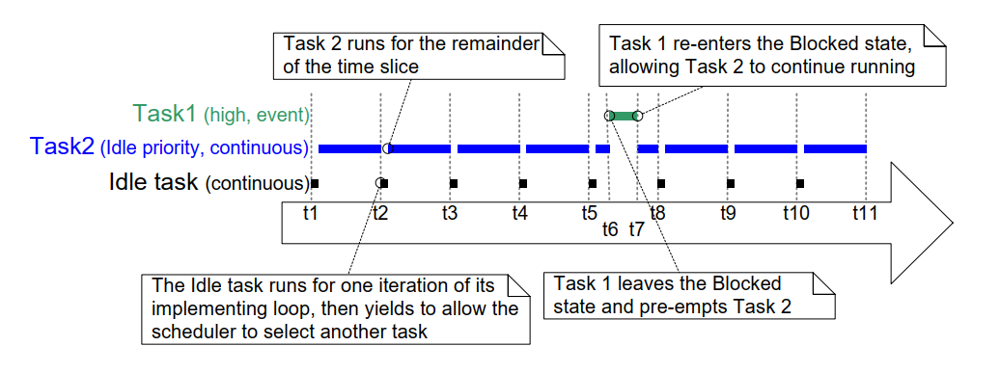
***图 4.20*** *与图 4.19 相同场景，但这次 `configIDLE_SHOULD_YIELD` 设为 1*
***

图 4.20 还展示了：当 `configIDLE_SHOULD_YIELD = 1` 时，
空闲任务之后被选入运行态的任务不会执行完整时间片，
而只会执行空闲任务主动让出后在当前时间片剩余的那一段时间。

### 4.12.4 不带时间片的按优先级抢占调度

不带时间片的按优先级抢占调度，
在任务选择与抢占规则上与前节相同，
但不会使用时间片在同优先级任务间共享处理时间。

表 5 给出了把 FreeRTOS 调度器配置为
“按优先级抢占、无时间片”的 FreeRTOSConfig.h 取值。

如图 4.19 所示，若启用时间片且在最高可运行优先级上
存在多个就绪任务，调度器会在每次 RTOS tick 中断
（即每个时间片结束）时选择新任务进入运行态。
若禁用时间片，则调度器只有在以下情况才会选择新运行任务：

- 有更高优先级任务进入 *就绪* 状态；

- 当前 *运行* 任务进入 *阻塞* 或 *挂起* 状态。

与启用时间片相比，禁用时间片时任务上下文切换更少。
因此会降低调度器处理开销。
但禁用时间片也可能导致同优先级任务获得的处理时间差异巨大，
图 4.21 展示了该情形。
因此，无时间片调度通常被视为高级用法，
建议仅由有经验用户采用。


<a name="fig4.21" title="图 4.21 演示无时间片时同优先级任务处理时间可能高度不均"></a>

***
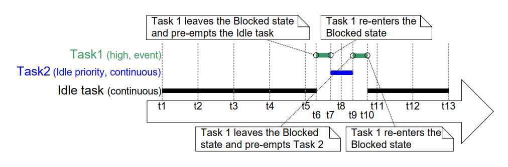
***图 4.21*** *演示无时间片时同优先级任务可能获得极不均衡处理时间的执行模式*
***

参见图 4.21（假设 `configIDLE_SHOULD_YIELD = 0`）：

- Tick 中断

  Tick 中断发生在 t1、t2、t3、t4、t5、t8、t11、t12、t13。

- 任务 1

  任务 1 是高优先级事件驱动任务，
  大部分时间在阻塞态等待目标事件。
  每次事件发生时，任务 1 都会从阻塞态转为就绪态，
  并因其为最高优先级就绪任务而进入运行态。
  图 4.21 显示任务 1 在 t6 到 t7 处理一次事件，
  又在 t9 到 t10 处理一次。

- 空闲任务与任务 2

  空闲任务与任务 2 都是持续处理任务，
  且优先级都为 0（空闲优先级）。
  持续处理任务不会进入阻塞态。

  由于未使用时间片，
  一个处于运行态的空闲优先级任务会一直运行，
  直到被更高优先级任务 1 抢占。

  在图 4.21 中，空闲任务从 t1 开始运行，
  并持续到 t6 被任务 1 抢占，
  即其在进入运行态后持续了四个以上完整 tick 周期。

  任务 2 在 t7 开始运行，即任务 1 回到阻塞态等待下一个事件时。
  任务 2 一直运行到 t9 再次被任务 1 抢占，
  这还不到一个 tick 周期。

  t10 时，空闲任务重新进入运行态，
  尽管它此前获得的处理时间已超过任务 2 的四倍。

### 4.12.5 协作式调度

本书重点讨论抢占式调度，但 FreeRTOS 也支持协作式调度。
表 5 给出了将 FreeRTOS 调度器配置为协作式的 FreeRTOSConfig.h 设置。

在使用协作式调度器时（并假设应用中断服务例程未显式请求上下文切换），
只有在运行态任务进入阻塞态，或运行态任务通过调用 `taskYIELD()`
显式让出（手动请求重新调度）时，才会发生上下文切换。
任务永远不会被抢占，因此也无法使用时间片。

图 4.22 展示了协作式调度器行为。
图中水平虚线表示任务处于就绪态的时段。


<a name="fig4.22" title="图 4.22 展示协作式调度器行为的执行模式"></a>

***
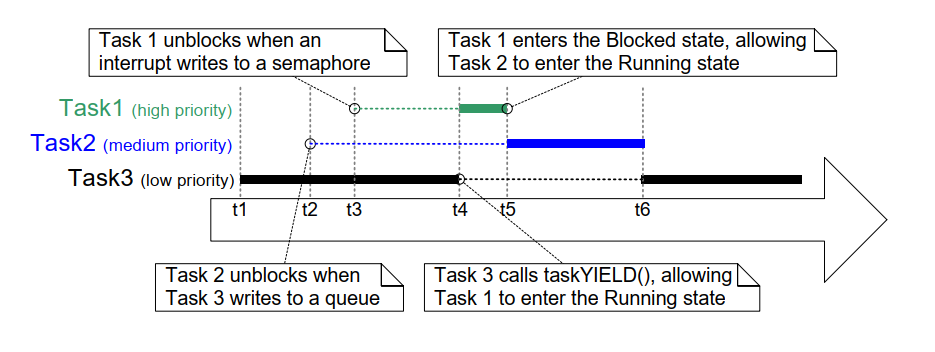
***图 4.22*** *展示协作式调度器行为的执行模式*
***

参见图 4.22：

- 任务 1

  任务 1 优先级最高。
  初始在阻塞态等待一个信号量。

  t3 时，中断释放该信号量，
  使任务 1 离开阻塞态并进入就绪态
  （第 6 章会介绍在中断中释放信号量）。

  在 t3，任务 1 是最高优先级就绪任务。
  若使用抢占式调度器，任务 1 此时会成为运行态任务。
  但由于当前使用协作式调度器，
  任务 1 保持就绪态直到 t4，
  即当前运行任务调用 `taskYIELD()` 之时。

- 任务 2

  任务 2 的优先级介于任务 1 与任务 3 之间。
  它初始在阻塞态，等待任务 3 在 t2 发送给它的消息。

  在 t2，任务 2 是最高优先级就绪任务。
  若使用抢占式调度器，它此时会成为运行态任务。
  但因使用协作式调度器，
  任务 2 会保持就绪态，直到运行态任务进入阻塞态或调用 `taskYIELD()`。

  运行态任务在 t4 调用 `taskYIELD()`，
  但此时任务 1 已成为最高优先级就绪任务，
  因此任务 2 实际要等到 t5（任务 1 重新进入阻塞态）
  才会进入运行态。

  t6 时任务 2 为等待下一条消息而重新进入阻塞态，
  此时任务 3 再次成为最高优先级就绪任务。

在多任务应用中，开发者必须确保某资源不会被多个任务同时访问，
否则并发访问可能破坏资源。
例如，设共享资源为 UART（串口）：
任务 1 写入字符串 "abcdefghijklmnop"，
任务 2 写入字符串 "123456789"：

1. 任务 1 在运行态开始写字符串。
   它向 UART 写入 "abcdefg"，但在写完前离开运行态。

1. 任务 2 进入运行态，向 UART 写入 "123456789"，
   然后离开运行态。

1. 任务 1 重新进入运行态，继续写完剩余字符。

在此场景中，UART 实际收到的是
"abcdefg123456789hijklmnop"。
任务 1 的字符串没有按预期连续输出，
而是被任务 2 的字符串插入，造成数据破坏。

与抢占式调度相比，使用协作式调度通常更容易避免并发访问问题[^7]：

[^7]: 本书后续章节会介绍在任务间安全共享资源的方法。
FreeRTOS 自身提供的资源（如队列、信号量）在任务间共享是安全的。

- 使用抢占式调度器时，运行态任务可在任意时刻被抢占，
  包括共享资源处于不一致状态时。
  如 UART 示例所示，资源在不一致状态下被切换可能导致数据破坏。

- 使用协作式调度器时，你可以控制何时切换到其他任务。
  因此可以确保不会在资源处于不一致状态时发生任务切换。

- 在上述 UART 示例中，可确保任务 1 在写完整个字符串前不离开运行态，
  从而消除被其他任务活动破坏该字符串的可能。

如图 4.22 所示，协作式调度的系统响应性通常低于抢占式：

- 使用抢占式调度器时，任务一旦成为最高优先级就绪任务，
  调度器会立即运行它。
  这在实时系统中往往至关重要，因为系统需在限定时间内响应高优先级事件。

- 使用协作式调度器时，
  对“已成为最高优先级就绪任务”的任务，
  只有当当前运行任务进入阻塞态或调用 `taskYIELD()` 后才会切换执行。
