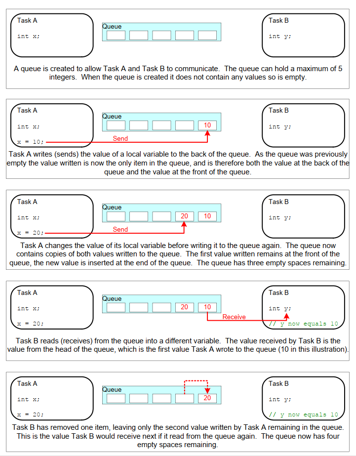
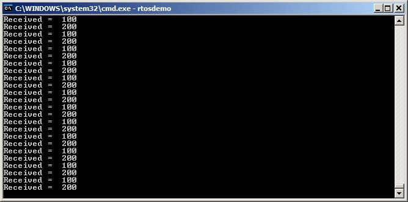
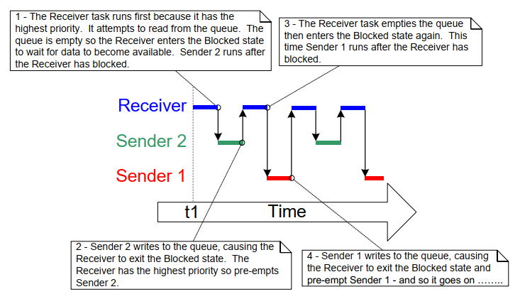
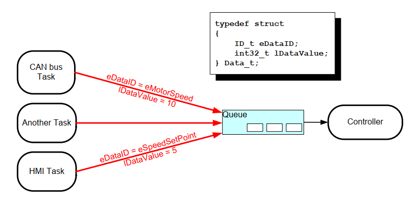
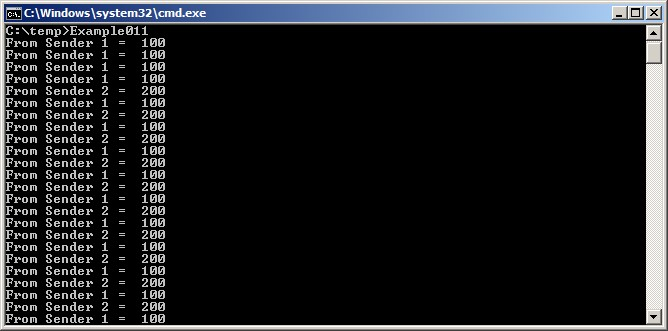
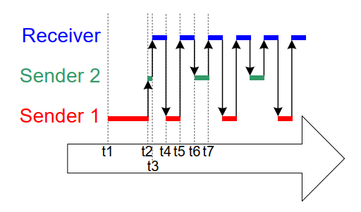
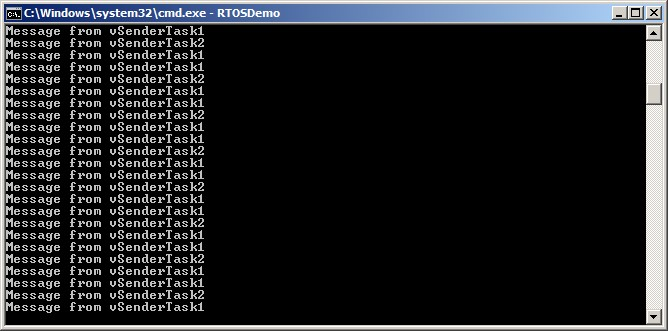

# 5 队列管理

## 5.1 引言

“队列（Queue）”提供任务到任务、任务到中断，以及中断到任务的通信机制。


### 5.1.1 范围

本章涵盖：

- 如何创建队列。
- 队列如何管理其包含的数据。
- 如何向队列发送数据。
- 如何从队列接收数据。
- 在队列上阻塞意味着什么。
- 如何在多个队列上阻塞。
- 如何覆盖队列中的数据。
- 如何清空队列。
- 写队列和读队列时任务优先级的影响。

本章仅覆盖任务到任务通信。第 7 章将介绍任务到中断及中断到任务通信。


## 5.2 队列的特性

### 5.2.1 数据存储

队列可以保存有限数量、固定大小的数据项[^8]。队列可容纳的数据项最大数量称为其“长度（length）”。队列长度和每个数据项大小都在创建队列时设定。

[^8]: 第 TBD 章会介绍 FreeRTOS 消息缓冲区（message buffer），它是保存可变长度消息时比队列更轻量的替代方案。

队列通常作为先进先出（FIFO）缓冲区使用：数据写入队列尾（tail），并从队列头（head）移出。图 5.1 演示了作为 FIFO 使用的队列中数据写入与读取过程。也可以向队列头写入，以及覆盖已经位于队列头的数据。

<a name="fig5.1" title="图 5.1 队列写入与读取顺序示例"></a>

* * *
   
***图 5.1*** *队列写入与读取顺序示例*
* * *

队列行为有两种实现方式：

1. 按拷贝入队（Queue by copy）

     按拷贝入队表示发送到队列的数据会按字节复制到队列中。

1. 按引用入队（Queue by reference）

     按引用入队表示队列仅保存指向发送数据的指针，而不保存数据本体。

FreeRTOS 采用按拷贝方式，因为与按引用方式相比，它更强大且更易用，原因包括：

- 按拷贝入队并不妨碍按引用使用队列。例如当待入队数据过大、不适合直接复制时，可以改为把指向数据的指针复制进队列。

- 可直接把栈变量发送到队列，即使该变量在其声明函数退出后将不再存在。

- 可在不先分配数据缓冲区的情况下发送数据——也可以先分配缓冲区、把数据拷入缓冲区，再把缓冲区引用入队。

- 发送任务可立即复用已经发送到队列的变量或缓冲区。

- 发送任务和接收任务完全解耦；应用设计者无需关心哪个任务“拥有”数据，或由哪个任务负责释放数据。

- RTOS 完全负责分配用于存储队列数据的内存。

- 在内存保护系统中，RAM 访问受限，此时只有当发送和接收任务都可访问被引用数据时才能按引用入队。按拷贝入队可让数据跨越内存保护边界传递。


### 5.2.2 多任务访问

队列本身是独立对象，任何知道其存在的任务或 ISR 都可以访问它。任意数量的任务都可以写同一个队列，任意数量任务也都可以读同一个队列。实践中，一个队列有多个写者很常见，而有多个读者相对少见。


### 5.2.3 在队列读操作上阻塞

当任务尝试从队列读取时，可以选择指定“阻塞”时间。如果队列已空，则任务会在阻塞态等待队列中有数据可读。处于阻塞态并等待队列数据的任务，在其他任务或中断向该队列写入数据时会自动转为就绪态。若在数据可用前阻塞时间到期，任务同样会自动从阻塞态转为就绪态。

队列可有多个读者，因此同一个队列上可能有多个任务同时阻塞等待数据。此时仅有一个任务会在数据可用时被解除阻塞，且总是等待数据的最高优先级任务先被解除阻塞。若两个或更多阻塞任务优先级相同，则等待时间最长的任务先被解除阻塞。


### 5.2.4 在队列写操作上阻塞

与读队列类似，任务在写队列时也可指定阻塞时间。此时阻塞时间表示：若队列已满，任务在阻塞态等待队列可用空间的最长时长。

队列可有多个写者，因此满队列上可能有多个任务同时阻塞等待发送完成。此时当队列出现可用空间，仅有一个任务会被解除阻塞。被解除阻塞的总是等待空间的最高优先级任务。若两个或更多阻塞任务优先级相同，则等待时间最长的任务先被解除阻塞。


### 5.2.5 在多个队列上阻塞

队列可以组成集合（set），使任务能够进入阻塞态，等待集合中任意一个队列出现可用数据。第 5.6 节“从多个队列接收”将演示队列集（queue set）。


### 5.2.6 创建队列：静态分配队列与动态分配队列

队列通过句柄引用，句柄变量类型为 `QueueHandle_t`。队列在使用前必须显式创建。

有两个 API 函数可创建队列：`xQueueCreate()`、`xQueueCreateStatic()`。

每个队列都需要两块 RAM：第一块保存队列数据结构，第二块保存队列数据。`xQueueCreate()` 从堆中动态分配所需 RAM。`xQueueCreateStatic()` 使用通过函数参数传入的预分配 RAM。


## 5.3 使用队列

### 5.3.1 `xQueueCreate()` API 函数

清单 5.1 给出了 `xQueueCreate()` 函数原型。`xQueueCreateStatic()` 额外包含两个参数，分别指向预分配的队列数据结构内存和数据存储区内存。

<a name="list5.1" title="清单 5.1 xQueueCreate() API 函数原型"></a>

```c
QueueHandle_t xQueueCreate( UBaseType_t uxQueueLength, UBaseType_t uxItemSize );
```
***清单 5.1*** *`xQueueCreate()` API 函数原型*


**`xQueueCreate()` 参数与返回值：**

- `uxQueueLength`

  被创建队列在任一时刻可容纳的数据项最大数量。

- `uxItemSize`

  队列中每个数据项的字节大小。

- 返回值

  若返回 NULL，表示由于可用堆内存不足，FreeRTOS 无法为队列数据结构和存储区分配内存，因此队列创建失败。第 2 章提供了更多 FreeRTOS 堆相关信息。

  若返回非 NULL 值，则队列创建成功，返回值即所创建队列的句柄。

`xQueueReset()` 是一个可将已创建队列恢复为初始空状态的 API 函数。


### 5.3.2 `xQueueSendToBack()` 与 `xQueueSendToFront()` API 函数

顾名思义，`xQueueSendToBack()` 将数据发送到队列尾（tail），`xQueueSendToFront()` 将数据发送到队列头（head）。

`xQueueSend()` 与 `xQueueSendToBack()` 等价，且实现完全相同。

> *注意：不要在中断服务函数中调用 `xQueueSendToFront()` 或 `xQueueSendToBack()`。应使用可在中断中安全调用的版本 `xQueueSendToFrontFromISR()` 与 `xQueueSendToBackFromISR()`。第 7 章会介绍这些函数。*

<a name="list5.2" title="清单 5.2 xQueueSendToFront() API 函数原型"></a>


```c
BaseType_t xQueueSendToFront( QueueHandle_t xQueue,
                                        const void * pvItemToQueue,
                                        TickType_t xTicksToWait );
```
***清单 5.2*** *`xQueueSendToFront()` API 函数原型*


<a name="list5.3" title="清单 5.3 xQueueSendToBack() API 函数原型"></a>


```c
BaseType_t xQueueSendToBack( QueueHandle_t xQueue,
                                      const void * pvItemToQueue,
                                      TickType_t xTicksToWait );
```
***清单 5.3*** *`xQueueSendToBack()` API 函数原型*


**`xQueueSendToFront()` 与 `xQueueSendToBack()` 参数与返回值**

- `xQueue`

  发送（写入）数据的目标队列句柄。该句柄来自 `xQueueCreate()` 或 `xQueueCreateStatic()` 的返回值。

- `pvItemToQueue`

  指向待复制入队数据的指针。

  队列可保存的每项数据大小在创建时已设定，因此会从 `pvItemToQueue` 指向地址复制相应字节数到队列存储区。

- `xTicksToWait`

  若队列已满，任务在阻塞态等待队列出现可用空间的最大时长。
  
  如果 `xTicksToWait` 为 0 且队列已满，`xQueueSendToFront()` 与 `xQueueSendToBack()` 都会立即返回。
  
  阻塞时间以 tick 周期为单位，因此其对应的绝对时间取决于 tick 频率。可用宏 `pdMS_TO_TICKS()` 将毫秒时间转换为 tick 时间。
  
  若将 `xTicksToWait` 设为 `portMAX_DELAY`，则任务会无限期等待（不超时），前提是 `FreeRTOSConfig.h` 中 `INCLUDE_vTaskSuspend` 被设为 1。

- 返回值

  有两个可能返回值：

  - `pdPASS`

     当数据成功发送到队列时返回 `pdPASS`。

     若指定了阻塞时间（`xTicksToWait` 非 0），调用任务可能会在函数返回前进入阻塞态等待队列可用空间，但会在阻塞超时前成功写入数据。

  - `errQUEUE_FULL`（与 `pdFAIL` 值相同）

     若队列已满、数据无法写入，则返回 `errQUEUE_FULL`。

     若指定了阻塞时间（`xTicksToWait` 非 0），调用任务会进入阻塞态等待其他任务或中断腾出队列空间；若在指定阻塞时间内未发生该情况，则返回此值。


### 5.3.3 `xQueueReceive()` API 函数

`xQueueReceive()` 从队列接收（读取）一个数据项。接收到的数据项会从队列中移除。

> *注意：不要在中断服务函数中调用 `xQueueReceive()`。可在中断中安全调用的 `xQueueReceiveFromISR()` API 函数见第 7 章。*

<a name="list5.4" title="清单 5.4 xQueueReceive() API 函数原型"></a>

```c
BaseType_t xQueueReceive( QueueHandle_t xQueue,
                                  void * const pvBuffer,
                                  TickType_t xTicksToWait );
```
***清单 5.4*** *`xQueueReceive()` API 函数原型*


**`xQueueReceive()` 参数与返回值**

- `xQueue`

  被接收（读取）数据的队列句柄。该句柄来自创建队列时调用 `xQueueCreate()` 或 `xQueueCreateStatic()` 的返回值。

- `pvBuffer`

  指向接收数据拷贝目标内存的指针。

  队列中每个数据项大小在创建时设定。`pvBuffer` 指向的内存至少要能容纳该字节数。

- `xTicksToWait`

  若队列已空，任务在阻塞态等待队列出现可用数据的最大时长。

  若 `xTicksToWait` 为 0，且队列已空，则 `xQueueReceive()` 会立即返回。

  阻塞时间以 tick 周期为单位，因此其对应的绝对时间取决于 tick 频率。可用宏 `pdMS_TO_TICKS()` 将毫秒时间转换为 tick 时间。

  若将 `xTicksToWait` 设为 `portMAX_DELAY`，则任务会无限期等待（不超时），前提是 `FreeRTOSConfig.h` 中 `INCLUDE_vTaskSuspend` 被设为 1。

- 返回值

  有两个可能返回值：
  
  - `pdPASS`

     当成功从队列读取数据时返回 `pdPASS`。

     若指定了阻塞时间（`xTicksToWait` 非 0），调用任务可能会进入阻塞态等待队列出现可用数据，但会在阻塞超时前成功读取。</p>

  - `errQUEUE_EMPTY`（与 `pdFAIL` 值相同）

     若队列已空、无法读取数据，则返回 `errQUEUE_EMPTY`。

     若指定了阻塞时间（`xTicksToWait` 非 0），调用任务会进入阻塞态等待其他任务或中断向队列发送数据；若在阻塞时间到期前未发生该情况，则返回此值。


### 5.3.4 `uxQueueMessagesWaiting()` API 函数

`uxQueueMessagesWaiting()` 用于查询当前队列中的数据项数量。

> *注意：不要在中断服务函数中调用 `uxQueueMessagesWaiting()`。应使用可在中断中安全调用的 `uxQueueMessagesWaitingFromISR()`。*

<a name="list5.5" title="清单 5.5 uxQueueMessagesWaiting() API 函数原型"></a>

```c
UBaseType_t uxQueueMessagesWaiting( QueueHandle_t xQueue );
```
***清单 5.5*** *`uxQueueMessagesWaiting()` API 函数原型*


**`uxQueueMessagesWaiting()` 参数与返回值**

- `xQueue`

  被查询队列的句柄。该句柄来自创建队列时调用 `xQueueCreate()` 或 `xQueueCreateStatic()` 的返回值。

- 返回值

  被查询队列中当前数据项数量。若返回 0，表示队列为空。


<a name="example5.1" title="示例 5.1 从队列接收时阻塞"></a>
---
***示例 5.1*** *从队列接收时阻塞*

---

本示例演示如何创建队列、由多个任务向队列发送数据，以及从队列接收数据。队列被创建为保存 `int32_t` 类型数据项。发送任务不指定阻塞时间，而接收任务会指定阻塞时间。

发送任务优先级低于接收任务。这意味着队列中不应同时存在超过一个数据项，因为一旦有数据发入队列，接收任务就会解除阻塞并抢占发送任务（因为其优先级更高），然后把数据取走，使队列再次变为空。

示例创建了清单 5.6 所示任务的两个实例：一个持续向队列写入 100，另一个持续向同一队列写入 200。任务参数用于向每个任务实例传入这些值。

<a name="list5.6" title="清单 5.6 示例 5.1 中发送任务的实现"></a>

```c
static void vSenderTask( void *pvParameters )
{

     int32_t lValueToSend;

     BaseType_t xStatus;

     /* Two instances of this task are created so the value that is sent to
         the queue is passed in via the task parameter - this way each instance 
         can use a different value. The queue was created to hold values of type 
         int32_t, so cast the parameter to the required type. */
     lValueToSend = ( int32_t ) pvParameters;

     /* As per most tasks, this task is implemented within an infinite loop. */
     for( ;; )
     {

          /* Send the value to the queue.

              The first parameter is the queue to which data is being sent. The
              queue was created before the scheduler was started, so before this 
              task started to execute.

              The second parameter is the address of the data to be sent, in this 
              case the address of lValueToSend.

              The third parameter is the Block time – the time the task should be 
              kept in the Blocked state to wait for space to become available on 
              the queue should the queue already be full. In this case a block 
              time is not specified because the queue should never contain more 
              than one item, and therefore never be full. */
          xStatus = xQueueSendToBack( xQueue, &lValueToSend, 0 );

          if( xStatus != pdPASS )
          {
                /* The send operation could not complete because the queue was full-
                    this must be an error as the queue should never contain more than
                    one item! */
                vPrintString( "Could not send to the queue.\r\n" );
          }
     }
}
```
***清单 5.6*** *示例 5.1 中发送任务的实现*


清单 5.7 展示了从队列接收数据任务的实现。接收任务指定 100ms 阻塞时间，然后进入阻塞态等待数据可用。当队列出现数据，或 100ms 内始终无数据时，它都会离开阻塞态。在本示例中，有两个任务持续写队列，因此 100ms 超时永远不会发生。

<a name="list5.7" title="清单 5.7 示例 5.1 中接收任务的实现"></a>

```c
static void vReceiverTask( void *pvParameters )
{
     /* Declare the variable that will hold the values received from the
         queue. */
     int32_t lReceivedValue;
     BaseType_t xStatus;
     const TickType_t xTicksToWait = pdMS_TO_TICKS( 100 );

     /* This task is also defined within an infinite loop. */
     for( ;; )
     {
          /* This call should always find the queue empty because this task will
              immediately remove any data that is written to the queue. */
          if( uxQueueMessagesWaiting( xQueue ) != 0 )
          {
                vPrintString( "Queue should have been empty!\r\n" );
          }

          /* Receive data from the queue.

              The first parameter is the queue from which data is to be received.
              The queue is created before the scheduler is started, and therefore
              before this task runs for the first time.

              The second parameter is the buffer into which the received data will
              be placed. In this case the buffer is simply the address of a 
              variable that has the required size to hold the received data.

              The last parameter is the block time – the maximum amount of time 
              that the task will remain in the Blocked state to wait for data to 
              be available should the queue already be empty. */
          xStatus = xQueueReceive( xQueue, &lReceivedValue, xTicksToWait );

          if( xStatus == pdPASS )
          {
                /* Data was successfully received from the queue, print out the
                    received value. */
                vPrintStringAndNumber( "Received = ", lReceivedValue );
          }
          else
          {
                /* Data was not received from the queue even after waiting for 
                    100ms. This must be an error as the sending tasks are free 
                    running and will be continuously writing to the queue. */
                vPrintString( "Could not receive from the queue.\r\n" );
          }
     }
}
```
***清单 5.7***  *示例 5.1 中接收任务的实现*


清单 5.8 给出了 `main()` 函数定义。它仅在启动调度器前创建队列和三个任务。尽管任务优先级关系意味着队列任意时刻不会超过一个数据项，但该队列仍被创建为最多保存五个 `int32_t` 值。

<a name="list5.8" title="清单 5.8 示例 5.1 中 main() 的实现"></a>

```c
/* Declare a variable of type QueueHandle_t. This is used to store the
    handle to the queue that is accessed by all three tasks. */
QueueHandle_t xQueue;

int main( void )
{
     /* The queue is created to hold a maximum of 5 values, each of which is
         large enough to hold a variable of type int32_t. */
     xQueue = xQueueCreate( 5, sizeof( int32_t ) );

     if( xQueue != NULL )
     {
          /* Create two instances of the task that will send to the queue. The
              task parameter is used to pass the value that the task will write 
              to the queue, so one task will continuously write 100 to the queue 
              while the other task will continuously write 200 to the queue. Both
              tasks are created at priority 1. */
          xTaskCreate( vSenderTask, "Sender1", 1000, ( void * ) 100, 1, NULL );
          xTaskCreate( vSenderTask, "Sender2", 1000, ( void * ) 200, 1, NULL );

          /* Create the task that will read from the queue. The task is created
              with priority 2, so above the priority of the sender tasks. */
          xTaskCreate( vReceiverTask, "Receiver", 1000, NULL, 2, NULL );

          /* Start the scheduler so the created tasks start executing. */
          vTaskStartScheduler();
     }
     else
     {
          /* The queue could not be created. */
     }

     /* If all is well then main() will never reach here as the scheduler will
         now be running the tasks. If main() does reach here then it is likely
         that there was insufficient FreeRTOS heap memory available for the idle 
         task to be created. Chapter 3 provides more information on heap memory 
         management. */
     for( ;; );
}
```
***清单 5.8*** *示例 5.1 中 `main()` 的实现*

图 5.2 显示了示例 5.1 产生的输出。

<a name="fig5.2" title="图 5.2 运行示例 5.1 时产生的输出"></a>

* * *
   
***图 5.2*** *运行示例 5.1 时产生的输出*
* * *


图 5.3 演示了其执行时序。

<a name="fig5.3" title="图 5.3 示例 5.1 产生的执行时序"></a>

* * *
   
***图 5.3*** *示例 5.1 产生的执行时序*
* * *


## 5.4 从多个来源接收数据

在 FreeRTOS 设计中，任务从多个来源接收数据非常常见。接收任务需要知道数据来源，才能决定如何处理。一个简单设计模式是：使用单个队列传输结构体，结构体同时包含“数据值”和“数据来源”，如图 5.4 所示。

<a name="fig5.4" title="图 5.4 在队列中发送结构体的示例场景"></a>

* * *
   
***图 5.4*** *在队列中发送结构体的示例场景*
* * *

参见图 5.4：

- 创建的队列保存 `Data_t` 类型结构体。该结构体允许在一条消息中同时发送“数据值”和“指示数据含义的枚举类型”。

- 中央控制器（Controller）任务执行主要系统功能。它需要对通过队列传入的输入与系统状态变化作出响应。

- CAN 总线任务用于封装 CAN 总线接口功能。当该任务接收并解码到消息后，会以 `Data_t` 结构体把已解码消息发给 Controller 任务。传输结构体中的 `eDataID` 成员告诉 Controller 任务该数据是什么。在此处示例中，它表示电机转速值。传输结构体中的 `lDataValue` 成员告诉 Controller 任务实际电机转速。

- 人机界面（HMI）任务用于封装全部 HMI 功能。设备操作员通常可通过多种方式输入命令和查询数值，这些输入需在 HMI 任务中被检测并解释。当有新命令输入时，HMI 任务通过 `Data_t` 结构体把命令发送给 Controller 任务。传输结构体中的 `eDataID` 成员告诉 Controller 任务该数据是什么。在此处示例中，它表示新的设定值。传输结构体中的 `lDataValue` 成员告诉 Controller 任务实际设定值。

第（RB-TBD）章展示了如何扩展该设计模式，使控制器任务能够直接回复发起结构体入队的任务。


<a name="example5.2" title="示例 5.2 向队列发送时阻塞，以及在队列中发送结构体"></a>
---
***示例 5.2*** *向队列发送时阻塞，以及在队列中发送结构体*

---

示例 5.2 与示例 5.1 类似，但任务优先级反过来了：接收任务优先级低于发送任务。此外，创建的队列保存的是结构体而不是整数。

清单 5.9 展示了示例 5.2 使用的结构体定义。

<a name="list5.9" title="清单 5.9 要通过队列传递的结构体定义，以及示例使用的两个变量声明"></a>

```c
/* Define an enumerated type used to identify the source of the data. */
typedef enum
{
     eSender1,
     eSender2
} DataSource_t;

/* Define the structure type that will be passed on the queue. */
typedef struct
{
     uint8_t ucValue;
     DataSource_t eDataSource;
} Data_t;

/* Declare two variables of type Data_t that will be passed on the queue. */
static const Data_t xStructsToSend[ 2 ] =
{
     { 100, eSender1 }, /* Used by Sender1. */
     { 200, eSender2 }  /* Used by Sender2. */
};
```
***清单 5.9*** *要通过队列传递的结构体定义，以及示例使用的两个变量声明*

在示例 5.1 中，接收任务优先级最高，因此队列中从不会超过一个数据项。这是因为一旦数据写入队列，接收任务就会抢占发送任务。示例 5.2 中，发送任务优先级更高，因此队列通常是满的。因为接收任务一旦从队列取走一个数据项，就会立刻被某个发送任务抢占并重新把队列填满。发送任务随后再次进入阻塞态，等待队列出现可用空间。

清单 5.10 展示发送任务实现。发送任务指定了 100ms 阻塞时间，因此每次队列变满都会进入阻塞态等待可用空间。当队列出现可用空间，或在 100ms 内一直没有空间可用时，它会离开阻塞态。在本示例中，接收任务持续从队列腾出空间，因此 100ms 超时不会发生。

<a name="list5.10" title="清单 5.10 示例 5.2 中发送任务的实现"></a>

```c
static void vSenderTask( void *pvParameters )
{
     BaseType_t xStatus;
     const TickType_t xTicksToWait = pdMS_TO_TICKS( 100 );

     /* As per most tasks, this task is implemented within an infinite loop. */
     for( ;; )
     {
          /* Send to the queue.

              The second parameter is the address of the structure being sent. The
              address is passed in as the task parameter so pvParameters is used
              directly.

              The third parameter is the Block time - the time the task should be 
              kept in the Blocked state to wait for space to become available on 
              the queue if the queue is already full. A block time is specified 
              because the sending tasks have a higher priority than the receiving 
              task so the queue is expected to become full. The receiving task 
              will remove items from the queue when both sending tasks are in the 
              Blocked state. */
          xStatus = xQueueSendToBack( xQueue, pvParameters, xTicksToWait );

          if( xStatus != pdPASS )
          {
                /* The send operation could not complete, even after waiting for 
                    100ms. This must be an error as the receiving task should make 
                    space in the queue as soon as both sending tasks are in the 
                    Blocked state. */
                vPrintString( "Could not send to the queue.\r\n" );
          }
     }
}
```
***清单 5.10*** *示例 5.2 中发送任务的实现*


接收任务优先级最低，因此仅当两个发送任务都处于阻塞态时才会运行。发送任务只有在队列满时才会进入阻塞态，因此接收任务只会在队列已满时执行。于是，即使不指定阻塞时间，它也总是预期能够接收到数据。

清单 5.11 展示了接收任务实现。

<a name="list5.11" title="清单 5.11 示例 5.2 中接收任务的定义"></a>

```c
static void vReceiverTask( void *pvParameters )
{
     /* Declare the structure that will hold the values received from the
         queue. */
     Data_t xReceivedStructure;
     BaseType_t xStatus;

     /* This task is also defined within an infinite loop. */
     for( ;; )
     {
          /* Because it has the lowest priority this task will only run when the
              sending tasks are in the Blocked state. The sending tasks will only
              enter the Blocked state when the queue is full so this task always 
              expects the number of items in the queue to be equal to the queue 
              length, which is 3 in this case. */
          if( uxQueueMessagesWaiting( xQueue ) != 3 )
          {
                vPrintString( "Queue should have been full!\r\n" );
          }

          /* Receive from the queue.

              The second parameter is the buffer into which the received data will
              be placed. In this case the buffer is simply the address of a 
              variable that has the required size to hold the received structure.

              The last parameter is the block time - the maximum amount of time 
              that the task will remain in the Blocked state to wait for data to 
              be available if the queue is already empty. In this case a block 
              time is not necessary because this task will only run when the 
              queue is full. */
          xStatus = xQueueReceive( xQueue, &xReceivedStructure, 0 );

          if( xStatus == pdPASS )
          {
                /* Data was successfully received from the queue, print out the
                    received value and the source of the value. */
                if( xReceivedStructure.eDataSource == eSender1 )
                {
                     vPrintStringAndNumber( "From Sender 1 = ", 
                                                    xReceivedStructure.ucValue );
                }
                else
                {
                     vPrintStringAndNumber( "From Sender 2 = ", 
                                                    xReceivedStructure.ucValue );
                }
          }
          else
          {
                /* Nothing was received from the queue. This must be an error as 
                    this task should only run when the queue is full. */
                vPrintString( "Could not receive from the queue.\r\n" );
          }
     }
}
```
***清单 5.11*** *示例 5.2 中接收任务的定义*

与前一个示例相比，`main()` 仅有轻微变化：队列创建为可保存三个 `Data_t` 结构体，并且发送任务与接收任务的优先级对调。清单 5.12 展示了 `main()` 实现。

<a name="list5.12" title="清单 5.12 示例 5.2 中 main() 的实现"></a>

```c
int main( void )
{
     /* The queue is created to hold a maximum of 3 structures of type Data_t. */
     xQueue = xQueueCreate( 3, sizeof( Data_t ) );

     if( xQueue != NULL )
     {
          /* Create two instances of the task that will write to the queue. The
              parameter is used to pass the structure that the task will write to
              the queue, so one task will continuously send xStructsToSend[ 0 ]
              to the queue while the other task will continuously send 
              xStructsToSend[ 1 ]. Both tasks are created at priority 2, which is
              above the priority of the receiver. */
          xTaskCreate( vSenderTask, "Sender1", 1000, &( xStructsToSend[ 0 ] ),
                            2, NULL );
          xTaskCreate( vSenderTask, "Sender2", 1000, &( xStructsToSend[ 1 ] ),
                            2, NULL );

          /* Create the task that will read from the queue. The task is created
              with priority 1, so below the priority of the sender tasks. */
          xTaskCreate( vReceiverTask, "Receiver", 1000, NULL, 1, NULL );

          /* Start the scheduler so the created tasks start executing. */
          vTaskStartScheduler();
     }
     else
     {
          /* The queue could not be created. */
     }

     /* If all is well then main() will never reach here as the scheduler will
         now be running the tasks. If main() does reach here then it is likely
         that there was insufficient heap memory available for the idle task to 
         be created. Chapter 3 provides more information on heap memory 
         management. */
     for( ;; );
}
```
***清单 5.12*** *示例 5.2 中 `main()` 的实现*

图 5.5 显示了示例 5.2 的输出。

<a name="fig5.5" title="图 5.5 示例 5.2 产生的输出"></a>

* * *
   
***图 5.5*** *示例 5.2 产生的输出*
* * *

图 5.6 演示了当发送任务优先级高于接收任务优先级时产生的执行时序。下文还会进一步解释图 5.6，并说明为什么前四条消息来自同一个任务。

<a name="fig5.6" title="图 5.6 示例 5.2 产生的执行时序"></a>

* * *
   
***图 5.6*** *示例 5.2 产生的执行时序*
* * *

**图 5.6 图例说明**

- 时间点 t1

  Sender 1 任务执行，并向队列发送 3 个数据项。

- 时间点 t2

  队列已满，因此 Sender 1 进入阻塞态等待下一次发送完成。此时 Sender 2 成为可运行任务中优先级最高者，于是进入运行态。

- 时间点 t3

  Sender 2 发现队列已满，因此进入阻塞态等待第一次发送完成。此时 Receiver 成为可运行任务中优先级最高者，于是进入运行态。

- 时间点 t4

  有两个优先级高于接收任务的任务在等待队列空间，因此 Receiver 一旦从队列移走一个数据项就会立即被抢占。Sender 1 与 Sender 2 优先级相同，因此调度器选择等待时间更长的任务进入运行态——此时是 Sender 1。

- 时间点 t5

  Sender 1 再次向队列发送一个数据项。由于队列只有一个空位，Sender 1 随后进入阻塞态等待下一次发送完成。Receiver 再次成为可运行任务中优先级最高者并进入运行态。

  此时 Sender 1 已向队列发送了 4 个数据项，而 Sender 2 仍在等待发送它的第一个数据项。

- 时间点 t6

  有两个优先级高于接收任务的任务在等待队列空间，因此 Receiver 一旦移走一个数据项就会被抢占。这次 Sender 2 的等待时间长于 Sender 1，因此 Sender 2 进入运行态。

- 时间点 t7

  Sender 2 向队列发送一个数据项。由于队列只有一个空位，Sender 2 随后进入阻塞态等待下一次发送完成。此时 Sender 1 与 Sender 2 都在等待队列空间，因此只有 Receiver 可以进入运行态。


## 5.5 处理大数据或可变长度数据

### 5.5.1 队列中传递指针

如果要存入队列的数据尺寸较大，通常更适合用队列传递“指向数据的指针”，而不是逐字节把数据本体进出队列。传递指针在处理时间和队列所需 RAM 上都更高效。但在队列中传递指针时，必须格外注意：

- 必须清晰定义被指向 RAM 的所有权。

  通过指针在任务间共享内存时，必须确保两个任务不会同时修改内存内容，也不会进行任何可能导致内容无效或不一致的操作。理想情况下，指针发送入队前仅允许发送任务访问该内存；指针从队列接收后仅允许接收任务访问该内存。

- 被指向 RAM 必须保持有效。

  若指向内存是动态分配得到，或来自预分配缓冲池，则应且仅应有一个任务负责释放该内存。内存释放后，任何任务都不应再访问它。

  永远不要用指针访问在任务栈上分配的数据。栈帧变化后，该数据将失效。

作为示例，清单 5.13、5.14 和 5.15 演示如何用队列把一个缓冲区指针从一个任务发送到另一个任务：

- 清单 5.13 创建一个最多可保存 5 个指针的队列。

- 清单 5.14 分配缓冲区、向缓冲区写字符串，然后将该缓冲区指针发送到队列。

- 清单 5.15 从队列接收缓冲区指针，然后打印缓冲区中的字符串。

<a name="list5.13" title="清单 5.13 创建一个保存指针的队列"></a>

```c
/* Declare a variable of type QueueHandle_t to hold the handle of the
    queue being created. */
QueueHandle_t xPointerQueue;

/* Create a queue that can hold a maximum of 5 pointers, in this case
    character pointers. */
xPointerQueue = xQueueCreate( 5, sizeof( char * ) );
```
***清单 5.13*** *创建一个保存指针的队列*

<a name="list5.14" title="清单 5.14 用队列发送缓冲区指针"></a>

```c
/* A task that obtains a buffer, writes a string to the buffer, then
    sends the address of the buffer to the queue created in Listing 5.13. */
void vStringSendingTask( void *pvParameters )
{
     char *pcStringToSend;
     const size_t xMaxStringLength = 50;
     BaseType_t xStringNumber = 0;

     for( ;; )
     {
          /* Obtain a buffer that is at least xMaxStringLength characters big.
              The implementation of prvGetBuffer() is not shown – it might obtain
              the buffer from a pool of pre-allocated buffers, or just allocate 
              the buffer dynamically. */
          pcStringToSend = ( char * ) prvGetBuffer( xMaxStringLength );

          /* Write a string into the buffer. */
          snprintf( pcStringToSend, xMaxStringLength, "String number %d\r\n",
                        xStringNumber );

          /* Increment the counter so the string is different on each iteration
              of this task. */
          xStringNumber++;

          /* Send the address of the buffer to the queue that was created in
              Listing 5.13. The address of the buffer is stored in the 
              pcStringToSend variable.*/
          xQueueSend( xPointerQueue,   /* The handle of the queue. */
                          &pcStringToSend, /* The address of the pointer that points
                                                     to the buffer. */
                          portMAX_DELAY );
     }
}
```
***清单 5.14*** *用队列发送缓冲区指针*

<a name="list5.15" title="清单 5.15 用队列接收缓冲区指针"></a>

```c
/* A task that receives the address of a buffer from the queue created
    in Listing 5.13, and written to in Listing 5.14. The buffer contains a
    string, which is printed out. */

void vStringReceivingTask( void *pvParameters )
{
     char *pcReceivedString;

     for( ;; )
     {
          /* Receive the address of a buffer. */
          xQueueReceive( xPointerQueue,     /* The handle of the queue. */
                              &pcReceivedString, /* Store the buffer's address in 
                                                            pcReceivedString. */
                              portMAX_DELAY );

          /* The buffer holds a string, print it out. */
          vPrintString( pcReceivedString );

          /* The buffer is not required any more - release it so it can be freed,
              or re-used. */
          prvReleaseBuffer( pcReceivedString );
     }
}
```
***清单 5.15*** *用队列接收缓冲区指针*

### 5.5.2 使用队列发送不同类型与长度的数据[^9]

[^9]: FreeRTOS 消息缓冲区是保存可变长度数据时比队列更轻量的替代方案。

本书前文演示了两种强大的设计模式：向队列发送结构体，以及向队列发送指针。结合这两种技术，就能让任务使用单个队列从任意数据源接收任意数据类型。FreeRTOS+TCP 的 TCP/IP 协议栈提供了这一做法的实际示例。

TCP/IP 协议栈在自身任务中运行，必须处理来自许多不同来源的事件。不同事件类型对应不同类型与长度的数据。`IPStackEvent_t` 结构体描述所有发生在 TCP/IP 任务外部的事件，并通过队列发送给 TCP/IP 任务。清单 5.16 展示了 `IPStackEvent_t` 结构体。`IPStackEvent_t` 的 `pvData` 成员是一个指针，可直接保存值，或指向一个缓冲区。

<a name="list5.16" title="清单 5.16 FreeRTOS+TCP 中向 TCP/IP 栈任务发送事件所用结构体"></a>

```c
/* A subset of the enumerated types used in the TCP/IP stack to
    identify events. */
typedef enum
{
     eNetworkDownEvent = 0, /* The network interface has been lost, or needs
                                        (re)connecting. */
     eNetworkRxEvent,       /* A packet has been received from the network. */
     eTCPAcceptEvent,       /* FreeRTOS_accept() called to accept or wait for a
                                        new client. */

/* Other event types appear here but are not shown in this listing. */

} eIPEvent_t;

/* The structure that describes events, and is sent on a queue to the
    TCP/IP task. */
typedef struct IP_TASK_COMMANDS
{
     /* An enumerated type that identifies the event. See the eIPEvent_t
         definition above. */
     eIPEvent_t eEventType;

     /* A generic pointer that can hold a value, or point to a buffer. */
     void *pvData;

} IPStackEvent_t;
```
***清单 5.16*** *FreeRTOS+TCP 中向 TCP/IP 栈任务发送事件所用结构体*

下面是一些 TCP/IP 事件及其关联数据：

- `eNetworkRxEvent`：从网络接收到一个数据包。

  网络接口通过 `IPStackEvent_t` 结构体向 TCP/IP 任务发送“收到数据”事件。结构体的 `eEventType` 成员设为 `eNetworkRxEvent`，`pvData` 成员用于指向包含接收数据的缓冲区。清单 5.17 给出伪代码示例。

  <a name="list5.17" title="清单 5.17 使用 IPStackEvent_t 结构体将网络接收数据发送至 TCP/IP 任务的伪代码"></a>

  ```c
  void vSendRxDataToTheTCPTask( NetworkBufferDescriptor_t *pxRxedData )
  {
        IPStackEvent_t xEventStruct;
  
        /* Complete the IPStackEvent_t structure. The received data is stored in
            pxRxedData. */
        xEventStruct.eEventType = eNetworkRxEvent;
        xEventStruct.pvData = ( void * ) pxRxedData;
  
        /* Send the IPStackEvent_t structure to the TCP/IP task. */
        xSendEventStructToIPTask( &xEventStruct );
  }
  ```
  ***清单 5.17*** *使用 IPStackEvent_t 结构体将网络接收数据发送至 TCP/IP 任务的伪代码*

- `eTCPAcceptEvent`：某个 socket 要接受（或等待）来自客户端的连接。

  调用 `FreeRTOS_accept()` 的任务通过 `IPStackEvent_t` 结构体向 TCP/IP 任务发送 accept 事件。结构体的 `eEventType` 成员设为 `eTCPAcceptEvent`，`pvData` 成员设为正在接受连接的 socket 句柄。清单 5.18 给出伪代码示例。

  <a name="list5.18" title="清单 5.18 使用 IPStackEvent_t 结构体向 TCP/IP 任务发送正在接受连接的 socket 句柄的伪代码"></a>

  ```c
  void vSendAcceptRequestToTheTCPTask( Socket_t xSocket )
  {
        IPStackEvent_t xEventStruct;

        /* Complete the IPStackEvent_t structure. */
        xEventStruct.eEventType = eTCPAcceptEvent;
        xEventStruct.pvData = ( void * ) xSocket;

        /* Send the IPStackEvent_t structure to the TCP/IP task. */
        xSendEventStructToIPTask( &xEventStruct );
  }
  ```
  ***清单 5.18*** *使用 IPStackEvent_t 结构体向 TCP/IP 任务发送正在接受连接的 socket 句柄的伪代码*
  
- `eNetworkDownEvent`：网络需要连接或重连。

  网络接口通过 `IPStackEvent_t` 结构体向 TCP/IP 任务发送网络断开事件。结构体的 `eEventType` 成员设为 `eNetworkDownEvent`。网络断开事件不关联具体数据，因此不使用结构体的 `pvData` 成员。清单 5.19 给出伪代码示例。

  <a name="list5.19" title="清单 5.19 使用 IPStackEvent_t 结构体向 TCP/IP 任务发送网络断开事件的伪代码"></a>

  ```c
  void vSendNetworkDownEventToTheTCPTask( Socket_t xSocket )
  {
        IPStackEvent_t xEventStruct;

        /* Complete the IPStackEvent_t structure. */
        xEventStruct.eEventType = eNetworkDownEvent;

        xEventStruct.pvData = NULL; /* Not used, but set to NULL for
                                                 completeness. */

        /* Send the IPStackEvent_t structure to the TCP/IP task. */
        xSendEventStructToIPTask( &xEventStruct );
  }
  ```
  ***清单 5.19*** *使用 IPStackEvent_t 结构体向 TCP/IP 任务发送网络断开事件的伪代码*
  
  清单 5.20 展示了 TCP/IP 任务内部接收并处理这些事件的代码。可以看到，队列中接收的 `IPStackEvent_t` 结构体其 `eEventType` 成员用于决定如何解释 `pvData` 成员。

  <a name="list5.20" title="清单 5.20 接收并处理 IPStackEvent_t 结构体的伪代码"></a>

  ```c
  IPStackEvent_t xReceivedEvent;

  /* Block on the network event queue until either an event is received, or 
      xNextIPSleep ticks pass without an event being received. eEventType is 
      set to eNoEvent in case the call to xQueueReceive() returns because it 
      timed out, rather than because an event was received. */
  xReceivedEvent.eEventType = eNoEvent;
  xQueueReceive( xNetworkEventQueue, &xReceivedEvent, xNextIPSleep );

  /* Which event was received, if any? */
  switch( xReceivedEvent.eEventType )
  {
        case eNetworkDownEvent :
              /* Attempt to (re)establish a connection. This event is not 
                  associated with any data. */
              prvProcessNetworkDownEvent();
              break;

        case eNetworkRxEvent:
              /* The network interface has received a new packet. A pointer to the
                  received data is stored in the pvData member of the received 
                  IPStackEvent_t structure. Process the received data. */
              prvHandleEthernetPacket( ( NetworkBufferDescriptor_t * )
                                                ( xReceivedEvent.pvData ) );
              break;

        case eTCPAcceptEvent:
              /* The FreeRTOS_accept() API function was called. The handle of the
                  socket that is accepting a connection is stored in the pvData 
                  member of the received IPStackEvent_t structure. */
              xSocket = ( FreeRTOS_Socket_t * ) ( xReceivedEvent.pvData );
              xTCPCheckNewClient( xSocket );
              break;

        /* Other event types are processed in the same way, but are not shown
            here. */

  }
  ```
  ***清单 5.20*** *接收并处理 IPStackEvent_t 结构体的伪代码*  

## 5.6 从多个队列接收

### 5.6.1 队列集

应用设计经常需要单个任务接收不同尺寸、不同含义、不同来源的数据。上一节演示了如何通过“单队列接收结构体”的方式优雅且高效地实现这一点。但有时应用设计者会受到约束，无法自由选择设计方案，从而必须为某些数据源使用独立队列。例如，集成到设计中的第三方代码可能默认存在专用队列。此时可使用“队列集（queue set）”。

队列集允许一个任务从多个队列接收数据，而无需轮询每个队列来判断哪个队列（如果有）包含数据。

与“单队列接收结构体”实现同等功能相比，“使用队列集从多源接收数据”的设计更不整洁、效率也更低。因此仅建议在设计约束确有必要时才使用队列集。

下面各节将通过以下步骤说明如何使用队列集：

- 创建队列集。

- 向队列集中添加队列。

  信号量也可加入队列集。信号量会在本书后续章节介绍。

- 读取队列集，确定集合内哪些队列包含数据。

  当属于某个队列集的队列接收到数据时，该接收队列的句柄会被发送到队列集中，并在任务调用读取队列集函数时返回。因此，如果从队列集返回了某个队列句柄，就可确定该句柄所引用队列中包含数据，任务随后可直接从该队列读取。

  > *注意：若某队列属于某个队列集，则每次从队列集收到该队列句柄后都必须从该队列读取一次；并且在收到该队列句柄之前，不得直接从该队列读取。*

在 `FreeRTOSConfig.h` 中将编译期配置常量 `configUSE_QUEUE_SETS` 设为 1，可启用队列集功能。


### 5.6.2 `xQueueCreateSet()` API 函数

队列集在使用前必须显式创建。撰写本书时尚未提供 `xQueueCreateSetStatic()` 实现。不过，队列集本质上也是队列，因此可以通过特定方式调用 `xQueueCreateStatic()` 来用预分配内存创建队列集。

队列集通过句柄引用，句柄变量类型为 `QueueSetHandle_t`。`xQueueCreateSet()` API 函数创建一个队列集，并返回引用该队列集的 `QueueSetHandle_t`。

<a name="list5.21" title="清单 5.21 xQueueCreateSet() API 函数原型"></a>

```c
QueueSetHandle_t xQueueCreateSet( const UBaseType_t uxEventQueueLength);
```
***清单 5.21*** *`xQueueCreateSet()` API 函数原型*


**`xQueueCreateSet()` 参数与返回值**

- `uxEventQueueLength`

  当属于某个队列集的队列接收到数据时，该接收队列句柄会发送到队列集。`uxEventQueueLength` 定义了新建队列集在任一时刻可保存的队列句柄最大数量。

  只有当集合内某个队列接收到数据时，队列句柄才会发送到队列集。若队列已满则无法再接收数据，因此当集合内所有队列都满时，不会有任何队列句柄被发送到队列集。故队列集任一时刻可能需要保存的数据项最大数量，是集合内所有队列长度之和。

  例如：若集合中有三个空队列，每个队列长度都为 5，那么在所有队列都满之前，集合内队列总共可接收 15 个数据项（3 个队列 × 每队列 5 项）。在该例中，`uxEventQueueLength` 必须设为 15，才能保证队列集可接收发送给它的每一个队列句柄。

  信号量也可以加入队列集。信号量会在本书后文介绍。用于计算 `uxEventQueueLength` 时，二值信号量长度为 1，互斥量长度为 1，计数信号量长度为其最大计数值。

  再举一例：若队列集包含一个长度为 3 的队列和一个二值信号量（长度为 1），则 `uxEventQueueLength` 必须设为 4（3+1）。

- 返回值

  若返回 NULL，则因可用堆内存不足，FreeRTOS 无法分配队列集数据结构和存储区，因此队列集创建失败。第 3 章提供了更多 FreeRTOS 堆信息。

  若返回非 NULL 值，则队列集创建成功，返回值即创建出的队列集句柄。


### 5.6.3 `xQueueAddToSet()` API 函数

`xQueueAddToSet()` 用于把队列或信号量加入队列集。信号量会在本书后续章节介绍。

<a name="list5.22" title="清单 5.22 xQueueAddToSet() API 函数原型"></a>

```c
BaseType_t xQueueAddToSet( QueueSetMemberHandle_t xQueueOrSemaphore,
                                    QueueSetHandle_t xQueueSet );
```
***清单 5.22*** *`xQueueAddToSet()` API 函数原型*

**`xQueueAddToSet()` 参数与返回值**

- `xQueueOrSemaphore`

  被添加到队列集的队列或信号量句柄。

  队列句柄和信号量句柄都可转换为 `QueueSetMemberHandle_t` 类型。

- `xQueueSet`

  要添加队列或信号量的目标队列集句柄。

- 返回值

  有两个可能返回值：

  1. `pdPASS`

        表示加入队列集成功。

  1. `pdFAIL`

      表示队列或信号量无法加入队列集。

  队列和二值信号量只能在“空”状态时加入集合。计数信号量只能在计数值为 0 时加入集合。队列和信号量在任一时刻只能属于一个集合。


### 5.6.4 `xQueueSelectFromSet()` API 函数

`xQueueSelectFromSet()` 从队列集中读取一个队列句柄。

当属于集合的队列或信号量接收到数据时，接收对象（队列或信号量）的句柄会发送到队列集，并在任务调用 `xQueueSelectFromSet()` 时返回。若 `xQueueSelectFromSet()` 返回了一个句柄，则该句柄引用的队列或信号量可确定为“包含数据/可获取”，调用任务随后必须直接从该队列或信号量读取（或获取）。

> *注意：若队列或信号量属于某个集合，则在其句柄未先由 `xQueueSelectFromSet()` 返回之前，不要直接读取该队列或信号量。并且每次 `xQueueSelectFromSet()` 返回某个队列句柄或信号量句柄时，只读取（或获取）一个数据项。*

<a name="list5.23" title="清单 5.23 xQueueSelectFromSet() API 函数原型"></a>

```c
QueueSetMemberHandle_t xQueueSelectFromSet( QueueSetHandle_t xQueueSet,
                                                          const TickType_t xTicksToWait );
```
***清单 5.23*** *`xQueueSelectFromSet()` API 函数原型*

**`xQueueSelectFromSet()` 参数与返回值**

- `xQueueSet`

  被接收（读取）队列句柄或信号量句柄的来源队列集句柄。该句柄来自创建队列集时调用 `xQueueCreateSet()` 的返回值。

- `xTicksToWait`

  若集合内所有队列和信号量均为空，调用任务在阻塞态等待从队列集接收队列句柄或信号量句柄的最大时长。

  若 `xTicksToWait` 为 0，当集合内所有队列和信号量均为空时，`xQueueSelectFromSet()` 立即返回。

  阻塞时间以 tick 周期为单位，因此其对应的绝对时间取决于 tick 频率。可使用宏 `pdMS_TO_TICKS()` 将毫秒时间转换为 tick 时间。

  若将 `xTicksToWait` 设为 `portMAX_DELAY`，则任务会无限期等待（不超时），前提是 `FreeRTOSConfig.h` 中 `INCLUDE_vTaskSuspend` 被设为 1。

- 返回值

  若返回值非 NULL，则其为一个已知包含数据（或可获取）的队列或信号量句柄。若指定了阻塞时间（`xTicksToWait` 非 0），调用任务可能在函数返回前进入阻塞态等待集合内队列或信号量出现数据，但会在阻塞时间到期前成功从队列集读到一个句柄。句柄返回类型为 `QueueSetMemberHandle_t`，可转换为 `QueueHandle_t` 或 `SemaphoreHandle_t`。

  若返回值为 NULL，则表示未能从队列集读到句柄。若指定了阻塞时间（`xTicksToWait` 非 0），说明调用任务进入阻塞态等待其他任务或中断向集合中的队列或信号量发送数据（或释放信号量），但阻塞超时先发生。


<a name="example5.3" title="示例 5.3 使用队列集"></a>
---
***示例 5.3*** *使用队列集</i></h3>

---

本示例创建两个发送任务和一个接收任务。两个发送任务分别通过两个独立队列向接收任务发送数据（每个任务一个队列）。这两个队列被加入同一个队列集，接收任务通过读取队列集判断哪一个队列包含数据。

任务、队列和队列集都在 `main()` 中创建——其实现见清单 5.24。

<a name="list5.24" title="清单 5.24 示例 5.3 中 main() 的实现"></a>

```c
/* Declare two variables of type QueueHandle_t. Both queues are added
    to the same queue set. */
static QueueHandle_t xQueue1 = NULL, xQueue2 = NULL;

/* Declare a variable of type QueueSetHandle_t. This is the queue set
    to which the two queues are added. */
static QueueSetHandle_t xQueueSet = NULL;

int main( void )
{
     /* Create the two queues, both of which send character pointers. The 
         priority of the receiving task is above the priority of the sending 
         tasks, so the queues will never have more than one item in them at 
         any one time*/
     xQueue1 = xQueueCreate( 1, sizeof( char * ) );
     xQueue2 = xQueueCreate( 1, sizeof( char * ) );

     /* Create the queue set. Two queues will be added to the set, each of
         which can contain 1 item, so the maximum number of queue handles the 
         queue set will ever have to hold at one time is 2 (2 queues multiplied 
         by 1 item per queue). */
     xQueueSet = xQueueCreateSet( 1 * 2 );

     /* Add the two queues to the set. */
     xQueueAddToSet( xQueue1, xQueueSet );
     xQueueAddToSet( xQueue2, xQueueSet );

     /* Create the tasks that send to the queues. */
     xTaskCreate( vSenderTask1, "Sender1", 1000, NULL, 1, NULL );
     xTaskCreate( vSenderTask2, "Sender2", 1000, NULL, 1, NULL );

     /* Create the task that reads from the queue set to determine which of
         the two queues contain data. */
     xTaskCreate( vReceiverTask, "Receiver", 1000, NULL, 2, NULL );

     /* Start the scheduler so the created tasks start executing. */
     vTaskStartScheduler();

     /* As normal, vTaskStartScheduler() should not return, so the following
         lines will never execute. */
     for( ;; );
     return 0;
}
```
***清单 5.24*** *示例 5.3 中 `main()` 的实现*

第一个发送任务每 100ms 通过 `xQueue1` 向接收任务发送一个字符指针。第二个发送任务每 200ms 通过 `xQueue2` 向接收任务发送一个字符指针。字符指针指向标识发送任务的字符串。清单 5.25 展示了两个任务的实现。

<a name="list5.25" title="清单 5.25 示例 5.3 中的发送任务"></a>

```c
void vSenderTask1( void *pvParameters )
{
     const TickType_t xBlockTime = pdMS_TO_TICKS( 100 );
     const char * const pcMessage = "Message from vSenderTask1\r\n";

     /* As per most tasks, this task is implemented within an infinite loop. */

     for( ;; )
     {

          /* Block for 100ms. */
          vTaskDelay( xBlockTime );

          /* Send this task's string to xQueue1. It is not necessary to use a
              block time, even though the queue can only hold one item. This is 
              because the priority of the task that reads from the queue is 
              higher than the priority of this task; as soon as this task writes 
              to the queue it will be pre-empted by the task that reads from the 
              queue, so the queue will already be empty again by the time the 
              call to xQueueSend() returns. The block time is set to 0. */
          xQueueSend( xQueue1, &pcMessage, 0 );
     }
}

/*-----------------------------------------------------------*/

void vSenderTask2( void *pvParameters )
{
     const TickType_t xBlockTime = pdMS_TO_TICKS( 200 );
     const char * const pcMessage = "Message from vSenderTask2\r\n";

     /* As per most tasks, this task is implemented within an infinite loop. */
     for( ;; )
     {
          /* Block for 200ms. */
          vTaskDelay( xBlockTime );

          /* Send this task's string to xQueue2. It is not necessary to use a
              block time, even though the queue can only hold one item. This is 
              because the priority of the task that reads from the queue is 
              higher than the priority of this task; as soon as this task writes 
              to the queue it will be pre-empted by the task that reads from the 
              queue, so the queue will already be empty again by the time the 
              call to xQueueSend() returns. The block time is set to 0. */
          xQueueSend( xQueue2, &pcMessage, 0 );
     }
}
```
***清单 5.25*** *示例 5.3 中的发送任务*


发送任务写入的两个队列同属一个队列集。每当任务向其中任一队列发送数据时，该队列句柄就会被发送到队列集。接收任务调用 `xQueueSelectFromSet()` 从队列集中读取队列句柄。接收任务从集合中收到某个队列句柄后，即可确定该句柄引用的队列包含数据，随后直接从该队列读取。它读到的是字符串指针，接收任务将其打印出来。

若 `xQueueSelectFromSet()` 调用超时，会返回 NULL。在示例 5.3 中，`xQueueSelectFromSet()` 使用无限阻塞时间调用，因此不会超时，只会返回有效队列句柄。因此接收任务在使用返回值前无需检查是否为 NULL。

`xQueueSelectFromSet()` 仅在句柄对应队列包含数据时才返回该队列句柄，因此从该队列读取时无需再使用阻塞时间。

清单 5.26 展示了接收任务实现。

<a name="list5.26" title="清单 5.26 示例 5.3 中的接收任务"></a>

```c
void vReceiverTask( void *pvParameters )
{
     QueueHandle_t xQueueThatContainsData;
     char *pcReceivedString;

     /* As per most tasks, this task is implemented within an infinite loop. */
     for( ;; )
     {
          /* Block on the queue set to wait for one of the queues in the set to
              contain data. Cast the QueueSetMemberHandle_t value returned from
              xQueueSelectFromSet() to a QueueHandle_t, as it is known all the 
              members of the set are queues (the queue set does not contain any 
              semaphores). */
          xQueueThatContainsData = ( QueueHandle_t ) xQueueSelectFromSet(
                                                                      xQueueSet, portMAX_DELAY );

          /* An indefinite block time was used when reading from the queue set,
              so xQueueSelectFromSet() will not have returned unless one of the 
              queues in the set contained data, and xQueueThatContainsData cannot
              be NULL. Read from the queue. It is not necessary to specify a 
              block time because it is known the queue contains data. The block 
              time is set to 0. */
          xQueueReceive( xQueueThatContainsData, &pcReceivedString, 0 );

          /* Print the string received from the queue. */
          vPrintString( pcReceivedString );
     }
}
```
***清单 5.26*** *示例 5.3 中的接收任务*

图 5.7 显示了示例 5.3 产生的输出。可以看到接收任务从两个发送任务都接收到了字符串。`vSenderTask1()` 的阻塞时间是 `vSenderTask2()` 的一半，因此由 `vSenderTask1()` 发送的字符串打印频率是后者的两倍。

<a name="fig5.7" title="图 5.7 运行示例 5.3 时产生的输出"></a>

* * *
   
***图 5.7*** *运行示例 5.3 时产生的输出*
* * *


### 5.6.5 更贴近真实场景的队列集用法

示例 5.3 演示的是非常简化的场景：队列集中只包含队列，而且两个队列都用于发送字符指针。在真实应用中，队列集可能同时包含队列与信号量，且各队列保存的数据类型可能不同。此时必须在使用返回值前先判断 `xQueueSelectFromSet()` 的返回值。清单 5.27 演示了当集合包含以下成员时如何处理 `xQueueSelectFromSet()` 的返回值：

- 一个二值信号量。
- 一个读取字符指针的队列。
- 一个读取 `uint32_t` 值的队列。

清单 5.27 假定这些队列和信号量已经创建并加入队列集。

<a name="list5.27" title="清单 5.27 使用同时包含队列与信号量的队列集"></a>

```c
/* The handle of the queue from which character pointers are received. */
QueueHandle_t xCharPointerQueue;

/* The handle of the queue from which uint32_t values are received. */
QueueHandle_t xUint32tQueue;

/* The handle of the binary semaphore. */
SemaphoreHandle_t xBinarySemaphore;

/* The queue set to which the two queues and the binary semaphore belong. */
QueueSetHandle_t xQueueSet;

void vAMoreRealisticReceiverTask( void *pvParameters )
{
     QueueSetMemberHandle_t xHandle;
     char *pcReceivedString;
     uint32_t ulRecievedValue;
     const TickType_t xDelay100ms = pdMS_TO_TICKS( 100 );

     for( ;; )
     {
          /* Block on the queue set for a maximum of 100ms to wait for one of the
              members of the set to contain data. */
          xHandle = xQueueSelectFromSet( xQueueSet, xDelay100ms );

          /* Test the value returned from xQueueSelectFromSet(). If the returned
              value is NULL then the call to xQueueSelectFromSet() timed out. If 
              the returned value is not NULL then the returned value will be the 
              handle of one of the set's members. The QueueSetMemberHandle_t 
              value can be cast to either a QueueHandle_t or a SemaphoreHandle_t.
              Whether an explicit cast is required depends on the compiler. */

          if( xHandle == NULL )
          {
                /* The call to xQueueSelectFromSet() timed out. */
          }
          else if( xHandle == ( QueueSetMemberHandle_t ) xCharPointerQueue )
          {
                /* The call to xQueueSelectFromSet() returned the handle of the 
                    queue that receives character pointers. Read from the queue. 
                    The queue is known to contain data, so a block time of 0 is 
                    used. */
                xQueueReceive( xCharPointerQueue, &pcReceivedString, 0 );

                /* The received character pointer can be processed here... */
          }
          else if( xHandle == ( QueueSetMemberHandle_t ) xUint32tQueue )
          {
                /* The call to xQueueSelectFromSet() returned the handle of the 
                    queue that receives uint32_t types. Read from the queue. The 
                    queue is known to contain data, so a block time of 0 is used. */
                xQueueReceive(xUint32tQueue, &ulRecievedValue, 0 );

                /* The received value can be processed here... */
          }
          else if( xHandle == ( QueueSetMemberHandle_t ) xBinarySemaphore )
          {
                /* The call to xQueueSelectFromSet() returned the handle of the 
                    binary semaphore. Take the semaphore now. The semaphore is 
                    known to be available so a block time of 0 is used. */
                xSemaphoreTake( xBinarySemaphore, 0 );

                /* Whatever processing is necessary when the semaphore is taken 
                    can be performed here... */
          }
     }
}
```
***清单 5.27*** *使用同时包含队列与信号量的队列集*


## 5.7 使用队列实现邮箱

在嵌入式领域对术语并无统一共识，“mailbox” 在不同 RTOS 中含义不同。本书中，mailbox 指“长度为 1 的队列”。一个队列是否称为 mailbox，更多是由应用中的用法决定，而不是它与普通队列在功能上的差异：

- 队列用于把数据从一个任务发送到另一个任务，或从中断服务函数发送到任务。发送者将数据项放入队列，接收者从队列移除数据项。数据会“穿过”队列，从发送者流向接收者。

- 邮箱用于保存可被任意任务或任意中断服务函数读取的数据。数据不会“穿过”邮箱，而是会一直留在邮箱中直到被覆盖。发送者覆盖邮箱中的值；接收者读取邮箱中的值，但不会将其移除。

本章将介绍两个使队列可按 mailbox 方式使用的队列 API 函数。

清单 5.28 展示了如何创建一个用于 mailbox 的队列。

<a name="list5.28" title="清单 5.28 创建用于邮箱的队列"></a>

```c
/* A mailbox can hold a fixed size data item. The size of the data item is set
    when the mailbox (queue) is created. In this example the mailbox is created 
    to hold an Example_t structure. Example_t includes a time stamp to allow the
    data held in the mailbox to note the time at which the mailbox was last 
    updated. The time stamp used in this example is for demonstration purposes 
    only - a mailbox can hold any data the application writer wants, and the 
    data does not need to include a time stamp. */
typedef struct xExampleStructure
{
     TickType_t xTimeStamp;
     uint32_t ulValue;
} Example_t;

/* A mailbox is a queue, so its handle is stored in a variable of type
    QueueHandle_t. */
QueueHandle_t xMailbox;

void vAFunction( void )
{
     /* Create the queue that is going to be used as a mailbox. The queue has 
         a length of 1 to allow it to be used with the xQueueOverwrite() API 
         function, which is described below. */
     xMailbox = xQueueCreate( 1, sizeof( Example_t ) );
}
```
***清单 5.28*** *创建用于邮箱的队列*


### 5.7.1 `xQueueOverwrite()` API 函数

与 `xQueueSendToBack()` 一样，`xQueueOverwrite()` 也用于向队列发送数据。不同之处在于：若队列已满，`xQueueOverwrite()` 会覆盖队列中已有数据。

`xQueueOverwrite()` 只能用于长度为 1 的队列。覆盖模式总是写入队列头并更新队列头指针，但不会更新“等待消息数（messages waiting）”。如果定义了 `configASSERT`，当队列长度大于 1 时会触发断言。

> *注意：不要在中断服务函数中调用 `xQueueOverwrite()`。应使用可在中断中安全调用的 `xQueueOverwriteFromISR()`。*

<a name="list5.29" title="清单 5.29 xQueueOverwrite() API 函数原型"></a>

```c
BaseType_t xQueueOverwrite( QueueHandle_t xQueue, const void * pvItemToQueue );
```
***清单 5.29*** *`xQueueOverwrite()` API 函数原型*

**`xQueueOverwrite()` 参数与返回值**

- `xQueue`

  被发送（写入）数据的队列句柄。该句柄来自创建队列时调用 `xQueueCreate()` 或 `xQueueCreateStatic()` 的返回值。

- `pvItemToQueue`

    指向待复制入队数据的指针。

    队列每项可保存数据大小在创建时设定，因此会从 `pvItemToQueue` 指向地址复制相应字节数到队列存储区。

- 返回值

  `xQueueOverwrite()` 即使队列满也会写入队列，因此唯一可能返回值是 `pdPASS`。

清单 5.30 展示了如何使用 `xQueueOverwrite()` 向清单 5.28 创建的 mailbox（队列）写数据。

<a name="list5.30" title="清单 5.30 使用 xQueueOverwrite() API 函数"></a>

```c
void vUpdateMailbox( uint32_t ulNewValue )
{
     /* Example_t was defined in Listing 5.28. */
     Example_t xData;

     /* Write the new data into the Example_t structure.*/
     xData.ulValue = ulNewValue;

     /* Use the RTOS tick count as the time stamp stored in the Example_t
         structure. */
     xData.xTimeStamp = xTaskGetTickCount();

     /* Send the structure to the mailbox - overwriting any data that is 
         already in the mailbox. */
     xQueueOverwrite( xMailbox, &xData );
}
```
***清单 5.30*** *使用 `xQueueOverwrite()` API 函数*


### 5.7.2 `xQueuePeek()` API 函数

`xQueuePeek()` 从队列接收（读取）一个数据项，但*不会*把该数据项从队列中移除。`xQueuePeek()` 从队列头接收数据，同时不修改队列中保存的数据，也不改变数据在队列中的顺序。

> *注意：不要在中断服务函数中调用 `xQueuePeek()`。应使用可在中断中安全调用的 `xQueuePeekFromISR()`。*

*`xQueuePeek()` 的函数参数与返回值与 `xQueueReceive()` 相同。*

<a name="list5.31" title="清单 5.31 xQueuePeek() API 函数原型"></a>

```c
BaseType_t xQueuePeek( QueueHandle_t xQueue,
                              void * const pvBuffer,
                              TickType_t xTicksToWait );
```
***清单 5.31*** *`xQueuePeek()` API 函数原型*


清单 5.32 展示了如何使用 `xQueuePeek()` 接收清单 5.30 所写入 mailbox（队列）的数据项。

<a name="list5.32" title="清单 5.32 使用 xQueuePeek() API 函数"></a>

```c
BaseType_t vReadMailbox( Example_t *pxData )
{
     TickType_t xPreviousTimeStamp;
     BaseType_t xDataUpdated;

     /* This function updates an Example_t structure with the latest value
         received from the mailbox. Record the time stamp already contained in 
         *pxData before it gets overwritten by the new data. */
     xPreviousTimeStamp = pxData->xTimeStamp;

     /* Update the Example_t structure pointed to by pxData with the data
         contained in the mailbox. If xQueueReceive() was used here then the 
         mailbox would be left empty, and the data could not then be read by 
         any other tasks. Using xQueuePeek() instead of xQueueReceive() ensures 
         the data remains in the mailbox.

         A block time is specified, so the calling task will be placed in the
         Blocked state to wait for the mailbox to contain data should the mailbox
         be empty. An infinite block time is used, so it is not necessary to 
         check the value returned from xQueuePeek(), as xQueuePeek() will only 
         return when data is available. */
     xQueuePeek( xMailbox, pxData, portMAX_DELAY );

     /* Return pdTRUE if the value read from the mailbox has been updated since
         this function was last called. Otherwise return pdFALSE. */
     if( pxData->xTimeStamp > xPreviousTimeStamp )
     {
          xDataUpdated = pdTRUE;
     }
     else
     {
          xDataUpdated = pdFALSE;
     }

     return xDataUpdated;
}
```
***清单 5.32*** *使用 `xQueuePeek()` API 函数*
