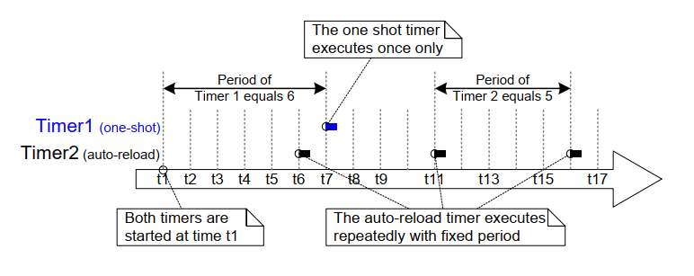
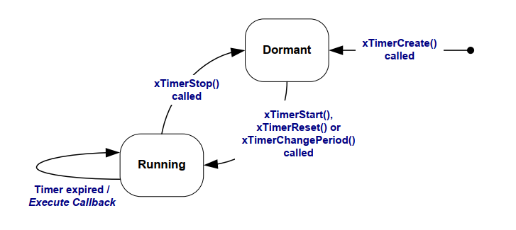
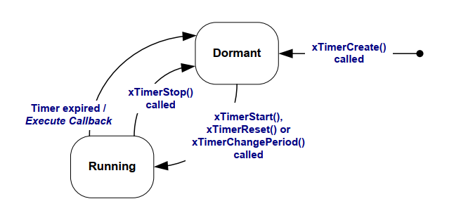
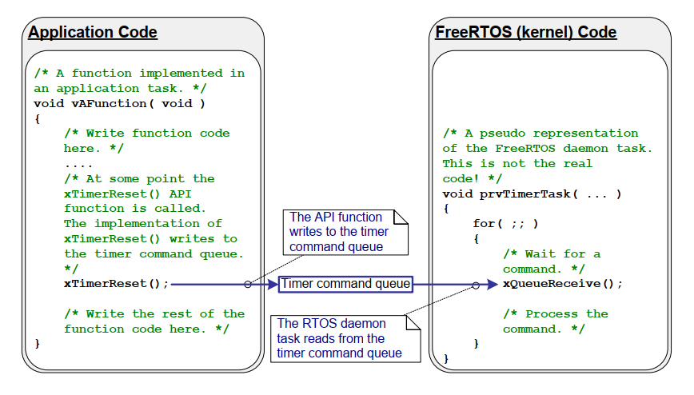
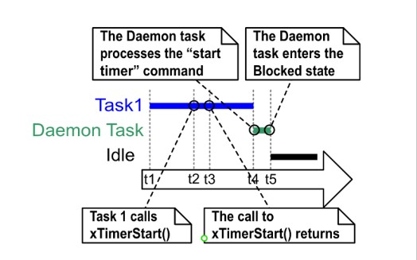
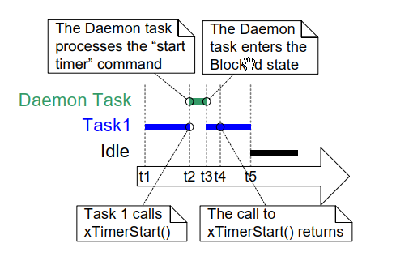
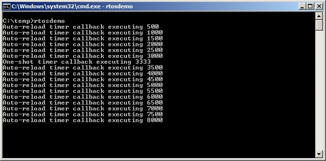
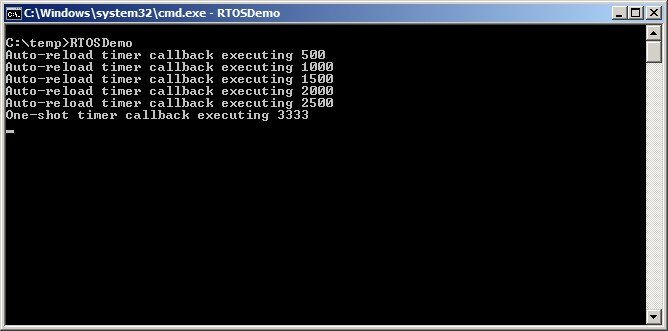
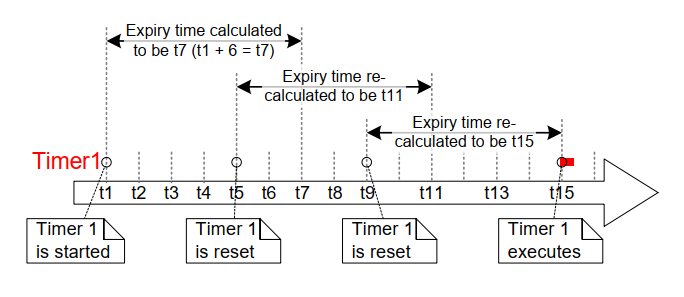
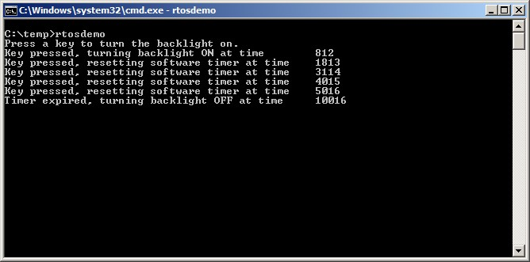

# 6 软件定时器管理

## 6.1 本章介绍与范围

软件定时器用于在未来某个设定时刻调度执行一个函数，或者按固定频率周期性执行。由软件定时器执行的函数称为软件定时器的回调函数。

软件定时器由 FreeRTOS 内核实现并受其控制。它不需要硬件支持，也与硬件定时器或硬件计数器无关。

请注意，遵循 FreeRTOS “通过创新设计保证最高效率”的理念，软件定时器只有在其回调函数实际执行时才会消耗处理器时间。

软件定时器功能是可选的。若要包含软件定时器功能：

1. 将 FreeRTOS 源文件 `FreeRTOS/Source/timers.c` 编译进你的工程。

2. 在应用的 `FreeRTOSConfig.h` 头文件中定义下述常量：

- `configUSE_TIMERS`

  在 `FreeRTOSConfig.h` 中将 `configUSE_TIMERS` 置为 1。

- `configTIMER_TASK_PRIORITY`

  设置定时器服务任务优先级，取值范围为 0 到（ `configMAX_PRIORITIES` - 1 ）。

- `configTIMER_QUEUE_LENGTH`

  设置定时器命令队列在任意时刻可容纳的“尚未处理命令”的最大数量。

- `configTIMER_TASK_STACK_DEPTH`

  设置分配给定时器服务任务的栈大小（单位是 word，不是 byte）。

### 6.1.1 范围

本章涵盖：

- 软件定时器与任务在特性上的对比。
- RTOS 守护任务。
- 定时器命令队列。
- 单次（one shot）软件定时器与自动重装载（periodic）软件定时器的区别。
- 如何创建、启动、复位以及修改软件定时器周期。


## 6.2 软件定时器回调函数

软件定时器回调函数以 C 函数实现。其特殊之处仅在于函数原型：必须返回 `void`，并且只接收一个参数——软件定时器句柄。清单 6.1 展示了该回调函数原型。


<a name="list" title="清单 6.1 软件定时器回调函数原型"></a>

```c
void ATimerCallback( TimerHandle_t xTimer );
```
***清单 6.1*** *软件定时器回调函数原型*

软件定时器回调函数应从头执行到尾，并以常规方式退出。回调函数应尽量短小，而且绝不能进入阻塞态。

> *注意：如后文所示，软件定时器回调函数运行在一个任务的上下文中，而该任务会在 FreeRTOS 调度器启动时自动创建。因此，软件定时器回调函数绝不能调用会导致调用任务进入阻塞态的 FreeRTOS API。可以调用 `xQueueReceive()` 这类函数，但前提是其 `xTicksToWait` 参数（用于指定阻塞时间）必须设为 0。不能调用 `vTaskDelay()` 这类函数，因为调用 `vTaskDelay()` 必然会让调用任务进入阻塞态。*


## 6.3 软件定时器的属性与状态

### 6.3.1 软件定时器的周期

软件定时器的“周期（period）”是指：软件定时器被启动后，到其回调函数执行之间的时间。

### 6.3.2 单次定时器与自动重装载定时器

软件定时器有两类：

1. 单次（One-shot）定时器

   单次定时器启动后，其回调函数只会执行一次。单次定时器可以手动重新启动，但不会自行重启。

1. 自动重装载（Auto-reload）定时器

   自动重装载定时器启动后，每次到期都会自动重新启动，因此其回调函数会周期性执行。

图 6.1 展示了单次定时器与自动重装载定时器在行为上的差异。图中的虚线竖线表示系统发生 tick 中断的时刻。


<a name="fig6.1" title="图 6.1 单次与自动重装载软件定时器行为差异"></a>

* * *

***图 6.1*** *单次与自动重装载软件定时器行为差异*
* * *

参见图 6.1：

- 定时器 1

  定时器 1 是一个周期为 6 个 tick 的单次定时器。它在时刻 t1 启动，因此其回调函数会在 6 个 tick 之后（即 t7）执行。由于定时器 1 是单次定时器，回调函数不会再次执行。

- 定时器 2

  定时器 2 是一个周期为 5 个 tick 的自动重装载定时器。它在时刻 t1 启动，因此从 t1 之后每隔 5 个 tick 执行一次回调函数。在图 6.1 中，这些时刻分别是 t6、t11 和 t16。


### 6.3.3 软件定时器状态

软件定时器可处于以下两种状态之一：

- 休眠（Dormant）

  休眠态软件定时器已经存在，并可通过其句柄被引用，但它不在运行，因此其回调函数不会执行。

- 运行（Running）

  运行态软件定时器会在其进入运行态后经过一个“等于其周期”的时间，或在其上次复位后经过一个“等于其周期”的时间，执行其回调函数。

图 6.2 和图 6.3 分别展示了自动重装载定时器与单次定时器在休眠态和运行态之间可能发生的状态迁移。两张图的关键区别在于“定时器到期后进入的状态”：自动重装载定时器执行回调后重新进入运行态；单次定时器执行回调后进入休眠态。


<a name="fig6.2" title="图 6.2 自动重装载软件定时器状态与迁移"></a>
<a name="fig6.3" title="图 6.3 单次软件定时器状态与迁移"></a>

* * *

***图 6.2*** *自动重装载软件定时器状态与迁移*


***图 6.3*** *单次软件定时器状态与迁移*
* * *

`xTimerDelete()` API 函数用于删除定时器。定时器可在任意时刻删除。其函数原型见清单 6.2。


<a name="list6.2" title="清单 6.2 xTimerDelete() API 函数原型"></a>

```c
BaseType_t xTimerDelete( TimerHandle_t xTimer, TickType_t xTicksToWait );
```
***清单 6.2*** *`xTimerDelete()` API 函数原型*


**`xTimerDelete()` 参数与返回值**

- `xTimer`

  要删除的定时器句柄。

- `xTicksToWait`

  指定调用任务在阻塞态等待的时间（单位：tick）：当调用 `xTimerDelete()` 时若定时器命令队列已满，则需要等待删除命令成功发送到定时器命令队列。若在调度器启动前调用 `xTimerDelete()`，则会忽略 `xTicksToWait`。

- 返回值

  可能返回以下两种值：

  - `pdPASS`

    当命令成功发送到定时器命令队列时返回 `pdPASS`。

  - `pdFAIL`

    若即使等待了 `xBlockTime` 个 tick，删除命令仍无法发送到定时器命令队列，则返回 `pdFAIL`。


## 6.4 软件定时器的执行上下文

### 6.4.1 RTOS 守护（定时器服务）任务

所有软件定时器回调函数都运行在同一个 RTOS 守护（或“定时器服务”）任务上下文中[^10]。

[^10]: 该任务过去叫“定时器服务任务（timer service task）”，因为最初它只用于执行软件定时器回调函数。现在同一任务还承担其他用途，因此改称更通用的“RTOS 守护任务（RTOS daemon task）”。

守护任务是一个标准 FreeRTOS 任务，会在调度器启动时自动创建。其优先级与栈大小分别由编译期配置常量 `configTIMER_TASK_PRIORITY` 与 `configTIMER_TASK_STACK_DEPTH` 决定，这两个常量都在 `FreeRTOSConfig.h` 中定义。

软件定时器回调函数不得调用会导致调用任务进入阻塞态的 FreeRTOS API；否则将导致守护任务进入阻塞态。


### 6.4.2 定时器命令队列

软件定时器 API 函数通过一个名为“定时器命令队列（timer command queue）”的队列，把命令从调用任务发送到守护任务。图 6.4 展示了这一点。命令示例包括“启动定时器”“停止定时器”“复位定时器”。

定时器命令队列是一个标准 FreeRTOS 队列，会在调度器启动时自动创建。其长度由 `FreeRTOSConfig.h` 中的编译期配置常量 `configTIMER_QUEUE_LENGTH` 设置。


<a name="fig6.4" title="图 6.4 软件定时器 API 通过定时器命令队列与 RTOS 守护任务通信"></a>

* * *

***图 6.4*** *软件定时器 API 通过定时器命令队列与 RTOS 守护任务通信*
* * *


### 6.4.3 守护任务的调度

守护任务与其他 FreeRTOS 任务一样参与调度；只有当它是“可运行且优先级最高”的任务时，才会处理命令或执行定时器回调。图 6.5 与图 6.6 演示了 `configTIMER_TASK_PRIORITY` 配置对执行时序的影响。

图 6.5 展示了以下场景：调用 `xTimerStart()` API 的任务优先级高于守护任务优先级。


<a name="fig6.5" title="图 6.5 调用 xTimerStart() 的任务优先级高于守护任务时的执行时序"></a>

* * *

***图 6.5*** *调用 xTimerStart() 的任务优先级高于守护任务时的执行时序*
* * *

参见图 6.5（其中 Task 1 优先级高于守护任务，守护任务优先级高于空闲任务）：

1. 在时刻 t1

   Task 1 处于运行态，守护任务处于阻塞态。

   当有命令发送到定时器命令队列时，守护任务会离开阻塞态；此时它要么处理该命令，要么（若有软件定时器到期）执行该定时器回调函数。

1. 在时刻 t2

   Task 1 调用 `xTimerStart()`。

   `xTimerStart()` 向定时器命令队列发送命令，导致守护任务离开阻塞态。由于 Task 1 优先级高于守护任务，守护任务不会抢占 Task 1。

   此时 Task 1 仍处于运行态；守护任务已离开阻塞态并进入就绪态。

1. 在时刻 t3

   Task 1 执行完 `xTimerStart()` API 函数。Task 1 从 `xTimerStart()` 函数入口一直执行到函数返回，中间未离开运行态。

1. 在时刻 t4

   Task 1 调用另一个 API 函数并因此进入阻塞态。此时守护任务成为就绪态中优先级最高的任务，调度器选择守护任务进入运行态。随后守护任务开始处理由 Task 1 发送到定时器命令队列的命令。

   > *注意：被启动软件定时器的到期时刻，是从“启动定时器命令被发送到定时器命令队列”这一时刻起算，而不是从守护任务“从队列中取到该命令”的时刻起算。*

1. 在时刻 t5

   守护任务完成了 Task 1 发来的命令处理后，尝试继续从定时器命令队列接收数据。由于队列为空，守护任务重新进入阻塞态。当有命令发送到队列，或有软件定时器到期时，守护任务会再次离开阻塞态。

   此时空闲任务成为就绪态中优先级最高的任务，因此调度器选择空闲任务进入运行态。

图 6.6 与图 6.5 场景相近，但这次守护任务优先级高于调用 `xTimerStart()` 的任务优先级。


<a name="fig6.6" title="图 6.6 调用 xTimerStart() 的任务优先级低于守护任务时的执行时序"></a>

* * *

***图 6.6*** *调用 xTimerStart() 的任务优先级低于守护任务时的执行时序*
* * *

参见图 6.6（其中守护任务优先级高于 Task 1，Task 1 优先级高于空闲任务）：

1. 在时刻 t1

   与之前相同，Task 1 处于运行态，守护任务处于阻塞态。

1. 在时刻 t2

   Task 1 调用 `xTimerStart()`。

   `xTimerStart()` 向定时器命令队列发送命令，导致守护任务离开阻塞态。由于守护任务优先级高于 Task 1，调度器会选择守护任务进入运行态。

   Task 1 在尚未执行完 `xTimerStart()` 之前就被守护任务抢占，随后进入就绪态。

   守护任务开始处理 Task 1 发送到定时器命令队列的命令。

1. 在时刻 t3

   守护任务处理完 Task 1 发来的命令后，尝试继续从定时器命令队列接收数据。由于队列为空，守护任务重新进入阻塞态。

   此时 Task 1 成为就绪态中优先级最高的任务，因此调度器选择 Task 1 进入运行态。

1. 在时刻 t4

   Task 1 在尚未执行完 `xTimerStart()` 时被守护任务抢占，因此它只有在重新进入运行态后，才会退出（返回）`xTimerStart()`。

1. 在时刻 t5

   Task 1 调用了一个会导致其进入阻塞态的 API 函数。此时空闲任务成为就绪态中优先级最高的任务，因此调度器选择空闲任务进入运行态。

在图 6.5 所示场景中，从 Task 1 向定时器命令队列发送命令，到守护任务接收并处理命令之间存在时间间隔。而在图 6.6 场景中，守护任务在 Task 1 从“发送命令的函数”返回之前，就已接收并处理了该命令。

发送到定时器命令队列的命令包含时间戳。时间戳用于补偿“应用任务发送命令”到“守护任务处理同一命令”之间流逝的时间。比如，若发送了“启动一个周期为 10 tick 的定时器”命令，则时间戳会确保该定时器在“命令发送后 10 tick”到期，而不是“命令被守护任务处理后 10 tick”到期。


##  6.5 创建并启动软件定时器

### 6.5.1 `xTimerCreate()` API 函数

FreeRTOS 还提供了 `xTimerCreateStatic()` 函数，它可在编译期以静态方式分配创建定时器所需内存。软件定时器在使用前必须显式创建。

软件定时器通过 `TimerHandle_t` 类型变量来引用。`xTimerCreate()` 用于创建软件定时器，并返回一个 `TimerHandle_t` 句柄用于引用所创建的定时器。软件定时器在创建后处于休眠态。

软件定时器既可以在调度器运行前创建，也可以在调度器启动后由任务创建。

[第 2.5 节：数据类型与编码风格指南](ch02-FreeRTOS%20内核分发包.md) 描述了所使用的数据类型与命名约定。


<a name="list6.3" title="清单 6.3 xTimerCreate() API 函数原型"></a>

```c
TimerHandle_t xTimerCreate( const char * const pcTimerName,
                            const TickType_t xTimerPeriodInTicks,
                            const BaseType_t xAutoReload,
                            void * const pvTimerID,
                            TimerCallbackFunction_t pxCallbackFunction );
```
***清单 6.3*** *`xTimerCreate()` API 函数原型*

**`xTimerCreate()` 参数与返回值**

- `pcTimerName`

  定时器的描述性名称。FreeRTOS 不会以任何方式使用该名称，它仅用于调试辅助。与通过句柄识别相比，使用可读名称识别定时器通常更容易。

- `xTimerPeriodInTicks`

  以 tick 为单位指定定时器周期。可使用 `pdMS_TO_TICKS()` 宏将毫秒时间转换为 tick 时间。该值不能为 0。

- `xAutoReload`

  将 `xAutoReload` 设为 `pdTRUE` 可创建自动重装载定时器；设为 `pdFALSE` 可创建单次定时器。

- `pvTimerID`

  每个软件定时器都有一个 ID 值。该 ID 是一个 `void *` 指针，应用开发者可按任意用途使用。
  当多个软件定时器共用同一个回调函数时，ID 尤其有用，因为它可用于保存“定时器特定”的存储数据。本章示例会演示定时器 ID 的使用。

  `pvTimerID` 用于设置被创建任务 ID 的初始值。

- `pxCallbackFunction`

  软件定时器回调函数就是符合清单 6.1 所示原型的普通 C 函数。`pxCallbackFunction` 参数是一个函数指针（实质上可理解为函数名），用于指定所创建软件定时器的回调函数。

- 返回值

  若返回 NULL，表示由于可用堆内存不足，FreeRTOS 无法分配必要的数据结构，因此软件定时器创建失败。

  若返回非 NULL 值，表示软件定时器创建成功。返回值即创建出的定时器句柄。

  第 3 章提供了更多堆内存管理信息。


### 6.5.2 `xTimerStart()` API 函数

`xTimerStart()` 用于启动处于休眠态的软件定时器，或者复位（重新启动）处于运行态的软件定时器。`xTimerStop()` 用于停止处于运行态的软件定时器。停止软件定时器等价于将其切换到休眠态。

`xTimerStart()` 可在调度器启动前调用，但在这种情况下，软件定时器不会立即启动，而是在调度器启动时才真正开始计时。

> *注意：不要在中断服务程序中调用 `xTimerStart()`。应使用其中断安全版本 `xTimerStartFromISR()`。*


<a name="list6.4" title="清单 6.4 xTimerStart() API 函数原型"></a>

```c
BaseType_t xTimerStart( TimerHandle_t xTimer, TickType_t xTicksToWait );
```
***清单 6.4*** *`xTimerStart()` API 函数原型*


**`xTimerStart()` 参数与返回值**

- `xTimer`

  要启动或复位的软件定时器句柄。该句柄来自创建该软件定时器时对 `xTimerCreate()` 的调用返回值。

- `xTicksToWait`

  `xTimerStart()` 通过定时器命令队列向守护任务发送“启动定时器”命令。`xTicksToWait` 指定：若队列已满，调用任务在阻塞态等待队列可用空间的最长时间。

  若 `xTicksToWait` 为 0 且定时器命令队列已满，`xTimerStart()` 会立即返回。

  阻塞时间以 tick 周期计量，因此其绝对时间取决于 tick 频率。可使用 `pdMS_TO_TICKS()` 将毫秒时间转换为 tick 时间。

  若 `FreeRTOSConfig.h` 中 `INCLUDE_vTaskSuspend` 设为 1，则将 `xTicksToWait` 设为 `portMAX_DELAY` 会使调用任务无限期阻塞（无超时）以等待命令队列出现可用空间。

  若在调度器启动前调用 `xTimerStart()`，则会忽略 `xTicksToWait` 的值，`xTimerStart()` 的行为等同于 `xTicksToWait` 为 0。

- 返回值

  可能返回以下两种值：

  - `pdPASS`

    仅当“启动定时器”命令成功发送到定时器命令队列时，才返回 `pdPASS`。

    若守护任务优先级高于调用 `xTimerStart()` 的任务优先级，调度器会确保启动命令在 `xTimerStart()` 返回前就被处理。这是因为一旦定时器命令队列中有数据，守护任务就会抢占调用 `xTimerStart()` 的任务。

    若指定了阻塞时间（`xTicksToWait` 非 0），则调用任务在函数返回前可能先进入阻塞态等待队列空间，但在阻塞超时之前成功写入了命令。

  - `pdFAIL`

    若“启动定时器”命令无法写入定时器命令队列（因为队列已满），则返回 `pdFAIL`。

    若指定了阻塞时间（`xTicksToWait` 非 0），则调用任务会进入阻塞态等待守护任务为命令队列腾出空间；若在指定阻塞时间内仍未腾出空间，则返回 `pdFAIL`。


<a name="example6.1" title="示例 6.1 创建单次和自动重装载定时器"></a>
---
***示例 6.1*** *创建单次和自动重装载定时器*

---

本示例创建并启动一个单次定时器和一个自动重装载定时器——如清单 6.5 所示。


<a name="list6.5" title="清单 6.5 创建并启动示例 6.1 使用的定时器"></a>

```c
/* The periods assigned to the one-shot and auto-reload timers are 3.333
   second and half a second respectively. */
#define mainONE_SHOT_TIMER_PERIOD pdMS_TO_TICKS( 3333 )
#define mainAUTO_RELOAD_TIMER_PERIOD pdMS_TO_TICKS( 500 )

int main( void )
{
    TimerHandle_t xAutoReloadTimer, xOneShotTimer;
    BaseType_t xTimer1Started, xTimer2Started;

    /* Create the one shot timer, storing the handle to the created timer in
       xOneShotTimer. */
    xOneShotTimer = xTimerCreate(
        /* Text name for the software timer - not used by FreeRTOS. */
                                  "OneShot",
        /* The software timer's period in ticks. */
                                   mainONE_SHOT_TIMER_PERIOD,
        /* Setting uxAutoRealod to pdFALSE creates a one-shot software timer. */
                                   pdFALSE,
        /* This example does not use the timer id. */
                                   0,
        /* Callback function to be used by the software timer being created. */
                                   prvOneShotTimerCallback );

    /* Create the auto-reload timer, storing the handle to the created timer
       in xAutoReloadTimer. */
    xAutoReloadTimer = xTimerCreate(
        /* Text name for the software timer - not used by FreeRTOS. */
                                     "AutoReload",
        /* The software timer's period in ticks. */
                                     mainAUTO_RELOAD_TIMER_PERIOD,
        /* Setting uxAutoRealod to pdTRUE creates an auto-reload timer. */
                                     pdTRUE,
        /* This example does not use the timer id. */
                                     0,
        /* Callback function to be used by the software timer being created. */
                                     prvAutoReloadTimerCallback );

    /* Check the software timers were created. */
    if( ( xOneShotTimer != NULL ) && ( xAutoReloadTimer != NULL ) )
    {
        /* Start the software timers, using a block time of 0 (no block time).
           The scheduler has not been started yet so any block time specified
           here would be ignored anyway. */
        xTimer1Started = xTimerStart( xOneShotTimer, 0 );
        xTimer2Started = xTimerStart( xAutoReloadTimer, 0 );

        /* The implementation of xTimerStart() uses the timer command queue,
           and xTimerStart() will fail if the timer command queue gets full.
           The timer service task does not get created until the scheduler is
           started, so all commands sent to the command queue will stay in the
           queue until after the scheduler has been started. Check both calls
           to xTimerStart() passed. */
        if( ( xTimer1Started == pdPASS ) && ( xTimer2Started == pdPASS ) )
        {
            /* Start the scheduler. */
            vTaskStartScheduler();
        }
    }

    /* As always, this line should not be reached. */
    for( ;; );
}
```
***清单 6.5*** *创建并启动示例 6.1 使用的定时器*


定时器回调函数只是每次被调用时打印一条消息。单次定时器回调函数实现见清单 6.6。自动重装载定时器回调函数实现见清单 6.7。


<a name="list6.5" title="清单 6.6 示例 6.1 中单次定时器使用的回调函数"></a>

```c
static void prvOneShotTimerCallback( TimerHandle_t xTimer )
{
    TickType_t xTimeNow;

    /* Obtain the current tick count. */
    xTimeNow = xTaskGetTickCount();

    /* Output a string to show the time at which the callback was executed. */
    vPrintStringAndNumber( "One-shot timer callback executing", xTimeNow );

    /* File scope variable. */
    ulCallCount++;
}
```
***清单 6.6*** *示例 6.1 中单次定时器使用的回调函数*


<a name="list6.7" title="清单 6.7 示例 6.1 中自动重装载定时器使用的回调函数"></a>

```c
static void prvAutoReloadTimerCallback( TimerHandle_t xTimer )
{
    TickType_t xTimeNow;

    /* Obtain the current tick count. */
    xTimeNow = xTaskGetTickCount();

    /* Output a string to show the time at which the callback was executed. */
    vPrintStringAndNumber( "Auto-reload timer callback executing", xTimeNow);

    ulCallCount++;
}
```
***清单 6.7*** *示例 6.1 中自动重装载定时器使用的回调函数*

运行本示例会产生图 6.7 所示输出。图 6.7 显示：自动重装载定时器回调函数以固定 500 tick 周期执行（清单 6.5 中 `mainAUTO_RELOAD_TIMER_PERIOD` 设为 500）；单次定时器回调函数只执行一次，发生在 tick 计数为 3333 时（清单 6.5 中 `mainONE_SHOT_TIMER_PERIOD` 设为 3333）。


<a name="fig6.7" title="图 6.7 执行示例 6.1 时产生的输出"></a>

* * *

***图 6.7*** *执行示例 6.1 时产生的输出*
* * *


## 6.6 定时器 ID

每个软件定时器都有一个 ID。ID 是一个标记值，应用开发者可将其用于任意用途。ID 存储在 `void` 指针（`void *`）中，因此它既可以直接存放整数值，也可以指向任意对象，或者作为函数指针使用。

定时器创建时会给 ID 赋一个初值。之后可通过 `vTimerSetTimerID()` API 更新 ID，并通过 `pvTimerGetTimerID()` API 查询 ID。

不同于其他软件定时器 API，`vTimerSetTimerID()` 与 `pvTimerGetTimerID()` 直接访问软件定时器本体——它们不会向定时器命令队列发送命令。


### 6.6.1 `vTimerSetTimerID()` API 函数


<a name="list6.8" title="清单 6.8 vTimerSetTimerID() API 函数原型"></a>

```c
void vTimerSetTimerID( const TimerHandle_t xTimer, void *pvNewID );
```
***清单 6.8*** *`vTimerSetTimerID()` API 函数原型*


**`vTimerSetTimerID()` 参数**

- `xTimer`

  需要更新 ID 值的软件定时器句柄。该句柄来自创建该软件定时器时对 `xTimerCreate()` 的调用返回值。

- `pvNewID`

  软件定时器 ID 将被设置为此值。


### 6.6.2 `pvTimerGetTimerID()` API 函数


<a name="list6.9" title="清单 6.9 pvTimerGetTimerID() API 函数原型"></a>

```c
void *pvTimerGetTimerID( const TimerHandle_t xTimer );
```
***清单 6.9*** *`pvTimerGetTimerID()` API 函数原型*


**`pvTimerGetTimerID()` 参数与返回值**

- `xTimer`

  被查询的软件定时器句柄。该句柄来自创建该软件定时器时对 `xTimerCreate()` 的调用返回值。

- 返回值

  被查询软件定时器的 ID。


<a name="example6.2" title="示例 6.2 使用回调函数参数和软件定时器 ID"></a>
---
***示例 6.2*** *使用回调函数参数和软件定时器 ID*

---

同一个回调函数可以分配给多个软件定时器。此时可通过回调函数参数判断究竟是哪个软件定时器到期。

示例 6.1 使用了两个独立回调函数：一个用于单次定时器，另一个用于自动重装载定时器。示例 6.2 实现了与示例 6.1 类似的功能，但把同一个回调函数同时分配给两个软件定时器。

示例 6.2 使用的 `main()` 函数与示例 6.1 基本一致，唯一差异在于创建软件定时器的位置。该差异见清单 6.10，其中两个定时器都以 `prvTimerCallback()` 作为回调函数。


<a name="list6.10" title="清单 6.10 创建示例 6.2 使用的定时器"></a>

```c
/* Create the one shot timer software timer, storing the handle in
   xOneShotTimer. */
xOneShotTimer = xTimerCreate( "OneShot",
                              mainONE_SHOT_TIMER_PERIOD,
                              pdFALSE,
                              /* The timer's ID is initialized to NULL. */
                              NULL,
                              /* prvTimerCallback() is used by both timers. */
                              prvTimerCallback );

/* Create the auto-reload software timer, storing the handle in
   xAutoReloadTimer */
xAutoReloadTimer = xTimerCreate( "AutoReload",
                                 mainAUTO_RELOAD_TIMER_PERIOD,
                                 pdTRUE,
                                 /* The timer's ID is initialized to NULL. */
                                 NULL,
                                 /* prvTimerCallback() is used by both timers. */
                                 prvTimerCallback );
```
***清单 6.10*** *创建示例 6.2 使用的定时器*

当任一软件定时器到期时，`prvTimerCallback()` 都会执行。`prvTimerCallback()` 的实现使用该函数参数判断：本次调用是由单次定时器到期触发，还是由自动重装载定时器到期触发。

`prvTimerCallback()` 还演示了如何将软件定时器 ID 用作“定时器私有存储”：每个软件定时器在自身 ID 中维护一个“到期次数”计数，自动重装载定时器在执行第 5 次后会使用该计数停止自身。

`prvTimerCallback()` 的实现见清单 6.9。


<a name="list6.11" title="清单 6.11 示例 6.2 使用的定时器回调函数"></a>

```c
static void prvTimerCallback( TimerHandle_t xTimer )
{
    TickType_t xTimeNow;
    uint32_t ulExecutionCount;

    /* A count of the number of times this software timer has expired is
       stored in the timer's ID. Obtain the ID, increment it, then save it as
       the new ID value. The ID is a void pointer, so is cast to a uint32_t. */
    ulExecutionCount = ( uint32_t ) pvTimerGetTimerID( xTimer );
    ulExecutionCount++;
    vTimerSetTimerID( xTimer, ( void * ) ulExecutionCount );

    /* Obtain the current tick count. */
    xTimeNow = xTaskGetTickCount();

    /* The handle of the one-shot timer was stored in xOneShotTimer when the
       timer was created. Compare the handle passed into this function with
       xOneShotTimer to determine if it was the one-shot or auto-reload timer
       that expired, then output a string to show the time at which the
       callback was executed. */
    if( xTimer == xOneShotTimer )
    {
        vPrintStringAndNumber( "One-shot timer callback executing", xTimeNow );
    }
    else
    {
        /* xTimer did not equal xOneShotTimer, so it must have been the
           auto-reload timer that expired. */
        vPrintStringAndNumber( "Auto-reload timer callback executing", xTimeNow);

        if( ulExecutionCount == 5 )
        {
            /* Stop the auto-reload timer after it has executed 5 times. This
               callback function executes in the context of the RTOS daemon
               task so must not call any functions that might place the daemon
               task into the Blocked state. Therefore a block time of 0 is
               used. */
            xTimerStop( xTimer, 0 );
        }
    }
}
```
***清单 6.11*** *示例 6.2 使用的定时器回调函数*


示例 6.2 的输出见图 6.8。可以看到，自动重装载定时器只执行了 5 次。


<a name="fig6.8" title="图 6.8 执行示例 6.2 时产生的输出"></a>

* * *

***图 6.8*** *执行示例 6.2 时产生的输出*
* * *


## 6.7 修改定时器周期

每个官方 FreeRTOS 移植版本都会提供一个或多个示例工程。大多数示例工程都带有自检机制，并使用一个 LED 进行可视化状态反馈：若自检始终通过，LED 慢速翻转；若任何一次自检失败，LED 快速翻转。

部分示例工程在任务中执行自检，并使用 `vTaskDelay()` 控制 LED 翻转频率。另一些示例工程在软件定时器回调函数中执行自检，并使用定时器周期控制 LED 翻转频率。


### 6.7.1 `xTimerChangePeriod()` API 函数

软件定时器周期通过 `xTimerChangePeriod()` 函数修改。

若对一个已经运行的定时器调用 `xTimerChangePeriod()` 修改周期，则该定时器将使用新的周期值重新计算到期时间。重新计算的到期时间是相对于调用 `xTimerChangePeriod()` 的时刻，而不是相对于定时器最初启动的时刻。

若对一个处于休眠态（未运行）的定时器调用 `xTimerChangePeriod()` 修改周期，则该定时器会计算到期时间并切换到运行态（即开始运行）。

> *注意：不要在中断服务程序中调用 `xTimerChangePeriod()`。应使用其中断安全版本 `xTimerChangePeriodFromISR()`。*


<a name="list6.12" title="清单 6.12 xTimerChangePeriod() API 函数原型"></a>

```c
BaseType_t xTimerChangePeriod( TimerHandle_t xTimer,
                               TickType_t xNewPeriod,
                               TickType_t xTicksToWait );
```
***清单 6.12*** *`xTimerChangePeriod()` API 函数原型*


**`xTimerChangePeriod()` 参数与返回值**

- `xTimer`

  需要更新周期值的软件定时器句柄。该句柄来自创建该软件定时器时对 `xTimerCreate()` 的调用返回值。

- `xTimerPeriodInTicks`

  以 tick 指定的软件定时器新周期。可使用 `pdMS_TO_TICKS()` 宏将毫秒时间转换为 tick 时间。

- `xTicksToWait`

  `xTimerChangePeriod()` 通过定时器命令队列向守护任务发送“修改周期”命令。`xTicksToWait` 指定：若队列已满，调用任务在阻塞态等待队列可用空间的最长时间。

  若 `xTicksToWait` 为 0 且定时器命令队列已满，`xTimerChangePeriod()` 会立即返回。

  可使用 `pdMS_TO_TICKS()` 宏将毫秒时间转换为 tick 时间。

  若 `FreeRTOSConfig.h` 中 `INCLUDE_vTaskSuspend` 设为 1，则将 `xTicksToWait` 设为 `portMAX_DELAY` 会使调用任务无限期阻塞（无超时）以等待定时器命令队列出现可用空间。

  若在调度器启动前调用 `xTimerChangePeriod()`，则会忽略 `xTicksToWait` 的值，`xTimerChangePeriod()` 的行为等同于 `xTicksToWait` 为 0。

- 返回值

  可能返回以下两种值：

  - `pdPASS`

    仅当数据成功发送到定时器命令队列时返回 `pdPASS`。

    若指定了阻塞时间（`xTicksToWait` 非 0），则调用任务在函数返回前可能先进入阻塞态等待命令队列可用空间，但在阻塞超时之前成功把数据写入了命令队列。

  - `pdFAIL`

    若“修改周期”命令无法写入定时器命令队列（因为队列已满），则返回 `pdFAIL`。

    若指定了阻塞时间（`xTicksToWait` 非 0），则调用任务会进入阻塞态等待守护任务为队列腾出空间；若在指定阻塞时间内仍未发生，则返回 `pdFAIL`。

清单 6.13 展示了 FreeRTOS 示例中一种常见做法：当在软件定时器回调函数中执行自检并检测到失败时，使用 `xTimerChangePeriod()` 提高 LED 翻转频率。用于执行自检的软件定时器被称为“检查定时器（check timer）”。


<a name="list6.13" title="清单 6.13 使用 xTimerChangePeriod()"></a>

```c
/* The check timer is created with a period of 3000 milliseconds, resulting
   in the LED toggling every 3 seconds. If the self-checking functionality
   detects an unexpected state, then the check timer's period is changed to
   just 200 milliseconds, resulting in a much faster toggle rate. */
const TickType_t xHealthyTimerPeriod = pdMS_TO_TICKS( 3000 );
const TickType_t xErrorTimerPeriod = pdMS_TO_TICKS( 200 );

/* The callback function used by the check timer. */
static void prvCheckTimerCallbackFunction( TimerHandle_t xTimer )
{
    static BaseType_t xErrorDetected = pdFALSE;

    if( xErrorDetected == pdFALSE )
    {
        /* No errors have yet been detected. Run the self-checking function
           again. The function asks each task created by the example to report
           its own status, and also checks that all the tasks are actually
           still running (and so able to report their status correctly). */
        if( CheckTasksAreRunningWithoutError() == pdFAIL )
        {
            /* One or more tasks reported an unexpected status. An error might
               have occurred. Reduce the check timer's period to increase the
               rate at which this callback function executes, and in so doing
               also increase the rate at which the LED is toggled. This
               callback function is executing in the context of the RTOS daemon
               task, so a block time of 0 is used to ensure the Daemon task
               never enters the Blocked state. */
            xTimerChangePeriod(
                  xTimer,            /* The timer being updated */
                  xErrorTimerPeriod, /* The new period for the timer */
                  0 );               /* Do not block when sending this command */

            /* Latch that an error has already been detected. */
            xErrorDetected = pdTRUE;
        }
    }

    /* Toggle the LED. The rate at which the LED toggles will depend on how
       often this function is called, which is determined by the period of the
       check timer. The timer's period will have been reduced from 3000ms to
       just 200ms if CheckTasksAreRunningWithoutError() has ever returned
       pdFAIL. */
    ToggleLED();
}
```
***清单 6.13*** *使用 `xTimerChangePeriod()`*

## 6.8 复位软件定时器

复位软件定时器意味着“重新开始计时”；定时器到期时间会改为相对于“复位时刻”重新计算，而不是相对于“首次启动时刻”计算。图 6.9 展示了这一过程：一个周期为 6 的定时器被启动后，又被复位两次，最终才到期并执行回调函数。


<a name="fig6.9" title="图 6.9 启动并复位一个周期为 6 tick 的软件定时器"></a>

* * *

***图 6.9*** *启动并复位一个周期为 6 tick 的软件定时器*
* * *

参见图 6.9：

- 定时器 1 在时刻 t1 启动。其周期为 6，因此最初计算的回调执行时刻是 t7（即启动后 6 个 tick）。

- 在到达 t7 之前，定时器 1 被复位，即它尚未到期、也尚未执行回调函数。定时器 1 在时刻 t5 被复位，因此其回调执行时刻被重新计算为 t11（即复位后 6 个 tick）。

- 在到达 t11 之前，定时器 1 又被复位，即同样是在其到期并执行回调之前。定时器 1 在时刻 t9 被复位，因此其回调执行时刻再次被重新计算为 t15（即最近一次复位后 6 个 tick）。

- 定时器 1 未再被复位，因此它在时刻 t15 到期，并相应执行其回调函数。


### 6.8.1 `xTimerReset()` API 函数

定时器通过 `xTimerReset()` API 函数进行复位。

`xTimerReset()` 也可用于启动处于休眠态的定时器。

> *注意：不要在中断服务程序中调用 `xTimerReset()`。应使用其中断安全版本 `xTimerResetFromISR()`。*


<a name="list6.14" title="清单 6.14 xTimerReset() API 函数原型"></a>

```c
BaseType_t xTimerReset( TimerHandle_t xTimer, TickType_t xTicksToWait );
```
***清单 6.14*** *`xTimerReset()` API 函数原型*


**`xTimerReset()` 参数与返回值**

- `xTimer`

  要复位或启动的软件定时器句柄。该句柄来自创建该软件定时器时对 `xTimerCreate()` 的调用返回值。

- `xTicksToWait`

  `xTimerReset()` 使用定时器命令队列向守护任务发送“复位”命令。`xTicksToWait` 指定：若队列已满，调用任务在阻塞态等待定时器命令队列出现可用空间的最长时间。

  若 `xTicksToWait` 为 0 且定时器命令队列已满，`xTimerReset()` 会立即返回。

  若 `FreeRTOSConfig.h` 中 `INCLUDE_vTaskSuspend` 设为 1，则将 `xTicksToWait` 设为 `portMAX_DELAY` 会使调用任务无限期阻塞（无超时）以等待命令队列出现可用空间。

- 返回值

  可能返回以下两种值：

  - `pdPASS`

    仅当数据成功发送到定时器命令队列时返回 `pdPASS`。

    若指定了阻塞时间（`xTicksToWait` 非 0），则调用任务在函数返回前可能先进入阻塞态等待命令队列可用空间，但在阻塞超时前成功写入了命令。

  - `pdFAIL`

    若“复位”命令无法写入定时器命令队列（因为队列已满），则返回 `pdFAIL`。

    若指定了阻塞时间（`xTicksToWait` 非 0），则调用任务会进入阻塞态等待守护任务为队列腾出空间；若在指定阻塞时间内仍未发生，则返回 `pdFAIL`。


<a name="example6.3" title="示例 6.3 复位软件定时器"></a>
---
***示例 6.3*** *复位软件定时器*

---

本示例模拟手机背光行为。背光行为如下：

- 按键按下时点亮背光。

- 只要在一定时间内持续有按键按下，背光保持点亮。

- 若在一定时间内没有按键，则背光自动熄灭。

该行为通过一个单次软件定时器实现：

- 当按键按下时，\[模拟\]背光被点亮；当软件定时器回调函数执行时，背光被熄灭。

- 每次按键按下都会复位该软件定时器。

- 因此，“为了避免背光熄灭而必须再次按键的时间窗口”就等于软件定时器周期；若在定时器到期前没有按键复位定时器，则定时器回调函数执行，背光熄灭。

变量 `xSimulatedBacklightOn` 保存背光状态。
`xSimulatedBacklightOn` 设为 `pdTRUE` 表示背光亮，设为 `pdFALSE` 表示背光灭。

软件定时器回调函数见清单 6.15。


<a name="list6.15" title="清单 6.15 示例 6.3 中单次定时器的回调函数"></a>

```c
static void prvBacklightTimerCallback( TimerHandle_t xTimer )
{
    TickType_t xTimeNow = xTaskGetTickCount();

    /* The backlight timer expired, turn the backlight off. */
    xSimulatedBacklightOn = pdFALSE;

    /* Print the time at which the backlight was turned off. */
    vPrintStringAndNumber(
            "Timer expired, turning backlight OFF at time\t\t", xTimeNow );
}
```
***清单 6.15*** *示例 6.3 中单次定时器的回调函数*


示例 6.3 创建了一个用于轮询键盘的任务[^11]。该任务见清单 6.16。不过，基于下一段描述的原因，清单 6.16 并不代表最优设计。

[^11]: 向 Windows 控制台打印、以及从 Windows 控制台读取按键，都会触发 Windows 系统调用。Windows 系统调用（包括使用 Windows 控制台、磁盘或 TCP/IP 协议栈）会对 FreeRTOS Windows 移植层行为产生不利影响，因此通常应尽量避免。

使用 FreeRTOS 可以让应用采用事件驱动。事件驱动设计能高效利用处理器时间：仅当事件发生时才消耗处理器时间，不会把时间浪费在“轮询尚未发生的事件”上。示例 6.3 无法做成事件驱动，因为在 FreeRTOS Windows 移植层下处理键盘中断并不实际，所以不得不采用效率较低的轮询方式。若清单 6.16 是一个中断服务程序，则应使用 `xTimerResetFromISR()` 替代 `xTimerReset()`。


<a name="list6.16" title="清单 6.16 示例 6.3 中用于复位软件定时器的任务"></a>

```c
static void vKeyHitTask( void *pvParameters )
{
    const TickType_t xShortDelay = pdMS_TO_TICKS( 50 );
    TickType_t xTimeNow;

    vPrintString( "Press a key to turn the backlight on.\r\n" );

    /* Ideally an application would be event driven, and use an interrupt to
       process key presses. It is not practical to use keyboard interrupts
       when using the FreeRTOS Windows port, so this task is used to poll for
       a key press. */
    for( ;; )
    {
        /* Has a key been pressed? */
        if( _kbhit() != 0 )
        {
            /* A key has been pressed. Record the time. */
            xTimeNow = xTaskGetTickCount();

            if( xSimulatedBacklightOn == pdFALSE )
            {

                /* The backlight was off, so turn it on and print the time at
                   which it was turned on. */
                xSimulatedBacklightOn = pdTRUE;
                vPrintStringAndNumber(
                    "Key pressed, turning backlight ON at time\t\t",
                    xTimeNow );
            }
            else
            {
                /* The backlight was already on, so print a message to say the
                   timer is about to be reset and the time at which it was
                   reset. */
                vPrintStringAndNumber(
                    "Key pressed, resetting software timer at time\t\t",
                    xTimeNow );
            }

            /* Reset the software timer. If the backlight was previously off,
               then this call will start the timer. If the backlight was
               previously on, then this call will restart the timer. A real
               application may read key presses in an interrupt. If this
               function was an interrupt service routine then
               xTimerResetFromISR() must be used instead of xTimerReset(). */
            xTimerReset( xBacklightTimer, xShortDelay );

            /* Read and discard the key that was pressed – it is not required
               by this simple example. */
            ( void ) _getch();
        }
    }
}
```
***清单 6.16*** *示例 6.3 中用于复位软件定时器的任务*

执行示例 6.3 时的输出见图 6.10。
结合图 6.10：

- 第一次按键发生在 tick 计数为 812 时。此时背光被点亮，单次定时器启动。

- 后续按键发生在 tick 计数为 1813、3114、4015 和 5016 时。所有这些按键都使定时器在到期前被复位。

- 定时器在 tick 计数为 10016 时到期。此时背光被熄灭。


<a name="fig6.10" title="图 6.10 执行示例 6.3 时产生的输出"></a>

* * *

***图 6.10*** *执行示例 6.3 时产生的输出*
* * *

从图 6.10 可以看到，该定时器周期为 5000 tick；背光恰好在“最后一次按键”之后 5000 tick 被关闭，也就是在定时器最后一次复位之后 5000 tick 被关闭。
