# 7 中断管理

## 7.1 引言

### 7.1.1 事件

嵌入式实时系统必须对来自环境的事件作出响应。例如，以太网外设收到一个数据包（事件）后，可能需要将其交给 `TCP/IP` 协议栈处理（动作）。在非简单系统中，事件来源往往不止一个，而且不同来源在处理开销和响应时间上的要求也不同。针对每一种情况，都需要权衡最合适的事件处理策略：

- 如何检测事件？通常使用中断，也可以用轮询输入。

- 使用中断时，应在中断服务程序（`ISR`）内完成多少处理？又应将多少处理放到 `ISR` 外？通常希望每个 `ISR` 都尽量短小。

- 如何把事件传递给主代码（非 `ISR` 上下文）？又如何组织这些代码，才能更好地处理可能异步发生的事件？

`FreeRTOS` 不会强制应用设计者采用某一种特定事件处理策略，但提供了足够的机制，使所选策略可以以简洁且易维护的方式实现。

必须区分“任务优先级”和“中断优先级”：

- 任务是与硬件无关的软件实体。任务优先级由应用编写者在软件中指定，由软件调度算法（调度器）决定哪个任务进入运行态。

- 中断服务程序虽然也是软件编写，但它属于硬件机制的一部分，因为由硬件决定哪个中断服务程序在何时运行。只有在没有 `ISR` 运行时任务才会执行，因此即便是最低优先级中断也能打断最高优先级任务，而任务无法抢占 `ISR`。

所有可运行 `FreeRTOS` 的体系结构都支持中断，但中断进入细节与中断优先级分配方式会因体系结构而异。


### 7.1.2 范围

本章涵盖：

- 哪些 `FreeRTOS API` 可以在中断服务程序中使用。
- 将中断处理延后到任务中的方法。
- 如何创建与使用二值信号量和计数信号量。
- 二值信号量与计数信号量的区别。
- 如何在中断服务程序内外使用队列传递数据。
- 某些 `FreeRTOS` 端口支持的中断嵌套模型。


## 7.2 在 `ISR` 中使用 `FreeRTOS API`

### 7.2.1 中断安全 `API`

很多场景需要在中断服务程序（`ISR`）中调用 `FreeRTOS API`，但并非所有 `API` 都能在 `ISR` 中使用。最典型的问题是：某些 `API` 会将调用者任务置为阻塞态；而当函数从 `ISR` 调用时，并不存在“调用者任务”，因此无法进入阻塞态。`FreeRTOS` 的解决办法是：为部分 `API` 提供两个版本，一个用于任务上下文，一个用于 `ISR` 上下文。用于 `ISR` 的版本都在函数名后加上 `FromISR` 后缀。

> *注意：在 `ISR` 中，绝不要调用函数名不包含 `FromISR` 的 `FreeRTOS API`。*


### 7.2.2 单独提供中断安全 `API` 的好处

将中断场景与任务场景分成两套 `API`，可同时提升任务代码效率、`ISR` 代码效率，并简化中断入口处理。若反过来只保留“一套可同时用于任务和 `ISR` 的 `API`”，会带来以下问题：

- `API` 内部必须增加逻辑以判断调用上下文（任务或 `ISR`），从而引入更多执行路径，导致函数更长、更复杂、更难测试。

- 某些参数在任务上下文下无意义，而另一些参数在 `ISR` 上下文下无意义。

- 每个 `FreeRTOS` 端口都必须提供识别当前上下文（任务或 `ISR`）的机制。

- 对于难以判断上下文的体系结构，需要额外、低效、更复杂且非标准的中断入口代码，由软件传递上下文信息。


### 7.2.3 单独中断安全 `API` 的代价

虽然两套 `API` 能提升效率，但也会引入一个问题：某些并非 `FreeRTOS API` 的上层函数，其内部会调用 `FreeRTOS API`，并且可能同时被任务和 `ISR` 调用。

这类问题通常出现在集成第三方代码时，因为此时软件架构不完全受应用编写者控制。若出现该问题，可采用以下方法：

-  将中断处理延后到任务中执行[^12]，从而使相关 `API` 只在任务上下文调用。

- 若所用端口支持中断嵌套，可直接使用带 `FromISR` 后缀的版本，因为这类函数既可在任务中调用，也可在 `ISR` 中调用（反之不成立：不带 `FromISR` 的函数不能在 `ISR` 中调用）。

- 第三方代码通常含有 `RTOS` 抽象层，可在抽象层判断当前上下文（任务或中断），再调用对应版本的 `API`。


[^12]: 中断延后处理将在本书下一节介绍。


### 7.2.4 `xHigherPriorityTaskWoken` 参数

本节先介绍 `xHigherPriorityTaskWoken` 概念。若暂时不能完全理解无需担心，后续章节有实战示例。

若由中断触发上下文切换，则中断退出后继续运行的任务可能不是中断进入前的任务——中断打断了任务 `A`，却可能返回到任务 `B`。

某些 `FreeRTOS API` 能把任务从阻塞态转为就绪态。例如前文的 `xQueueSendToBack()`：若有任务在目标队列上等待数据，则该函数会将其解除阻塞。

当 `API` 解除阻塞的任务优先级高于当前运行任务时，根据 `FreeRTOS` 调度策略，应切换到该高优先级任务。实际切换时机取决于 `API` 调用上下文：

- 若 `API` 从任务中调用：

  当 `FreeRTOSConfig.h` 中 `configUSE_PREEMPTION` 为 `1` 时，会在 `API` 内自动切换到高优先级任务，也就是在 `API` 返回前完成切换。这一点在图 6.6 已展示：向定时器命令队列写入后，写函数返回前就已切到 `RTOS` 守护任务。

- 若 `API` 从中断中调用：

  中断内不会自动立即切到高优先级任务。取而代之的是通过一个变量通知应用编写者“应请求一次上下文切换”。中断安全 `API`（名称以 `FromISR` 结尾）都带有 `pxHigherPriorityTaskWoken` 指针参数用于此目的。

  如果需要切换，这类函数会把 `*pxHigherPriorityTaskWoken` 置为 `pdTRUE`。因此，`pxHigherPriorityTaskWoken` 指向的变量在首次使用前必须先初始化为 `pdFALSE`。

  若应用编写者选择不在 `ISR` 中请求切换，则高优先级任务会留在就绪态，直到调度器下次运行；最坏情况下要等到下一次节拍中断。

  `FreeRTOS API` 只能把 `*pxHigherPriorityTaskWoken` 置为 `pdTRUE`，不会将其改回 `pdFALSE`。因此一个 `ISR` 中若调用多个 `FreeRTOS API`，可在每次调用时传入同一个变量，只需在第一次使用前初始化为 `pdFALSE`。

中断安全 `API` 不自动切换上下文有多方面原因：

- 避免不必要切换

  一个中断可能多次触发后才需要任务处理。例如串口 `UART` 按字符中断接收字符串：每收一个字符就切到任务会很浪费，因为往往等整串接收完才有处理价值。

- 控制执行序列

  中断发生具有突发性和不确定性。高级用户有时希望在应用特定阶段暂时避免“不可预测地切到其他任务”，虽然也可用调度器锁达到类似效果。

- 可移植性

  这是可跨所有 `FreeRTOS` 端口使用的最简单机制。

- 效率

  面向小型处理器的部分端口只允许在 `ISR` 末尾请求切换；若放宽限制，需要更多且更复杂的代码。并且该机制允许在同一个 `ISR` 内多次调用 `FreeRTOS API`，却只产生一次切换请求。

- 在 `RTOS` 节拍中断内执行代码

  如后文所示，应用代码可插入 `RTOS` 节拍中断。若尝试在节拍中断内切换，其结果与端口实现相关；最好情况也只是一次不必要的调度器调用。

`pxHigherPriorityTaskWoken` 参数是可选的，不需要时可将其设为 `NULL`。


### 7.2.5 `portYIELD_FROM_ISR()` 与 `portEND_SWITCHING_ISR()` 宏

本节介绍如何在 `ISR` 中请求上下文切换。若暂时不能完全理解无需担心，后续有实战示例。

`taskYIELD()` 宏用于在任务中请求上下文切换。`portYIELD_FROM_ISR()` 与 `portEND_SWITCHING_ISR()` 是 `taskYIELD()` 的中断安全版本。二者用法相同、作用相同[^13]。有些端口只提供其中一个，新版端口通常两个都提供。本书示例使用 `portYIELD_FROM_ISR()`。

[^13]: 从历史上看，需要汇编封装中断处理器的端口通常使用 `portEND_SWITCHING_ISR()`；允许整个中断处理器用 `C` 编写的端口通常使用 `portYIELD_FROM_ISR()`。


<a name="list7.1" title="清单 7.1 portEND_SWITCHING_ISR() 宏"></a>

```c
portEND_SWITCHING_ISR( xHigherPriorityTaskWoken );
```
***清单 7.1*** *`portEND_SWITCHING_ISR()` 宏*


<a name="list7.2" title="清单 7.2 portYIELD_FROM_ISR() 宏"></a>

```c
portYIELD_FROM_ISR( xHigherPriorityTaskWoken );
```
***清单 7.2*** *`portYIELD_FROM_ISR()` 宏*


中断安全 `API` 输出的 `xHigherPriorityTaskWoken` 参数可直接传给 `portYIELD_FROM_ISR()`。

若传给 `portYIELD_FROM_ISR()` 的 `xHigherPriorityTaskWoken` 为 `pdFALSE`（零），则不会请求上下文切换，宏无效果；若不为 `pdFALSE`，则会请求切换，运行态任务可能变化。无论是否发生变化，中断最终总是返回到当时的运行态任务。

多数 `FreeRTOS` 端口允许在 `ISR` 任意位置调用 `portYIELD_FROM_ISR()`；少数端口（尤其小型体系结构）只允许在 `ISR` 末尾调用。


## 7.3 中断延后处理

通常认为，`ISR` 应尽可能短小，原因包括：

- 即使任务优先级很高，只要硬件仍在服务中断，任务就不能运行。

- `ISR` 会给任务启动时刻与执行时长带来扰动（`jitter`）。

- 取决于 `FreeRTOS` 所在体系结构，`ISR` 执行期间可能无法接收新的中断，或至少无法接收其中一部分中断。

- 应用编写者必须考虑并防范任务与 `ISR` 同时访问变量、外设、内存缓冲区等共享资源带来的后果。

- 某些端口允许中断嵌套，但嵌套会增加复杂度并降低可预测性。中断越短，越不易发生嵌套。

`ISR` 必须记录中断原因并清除中断。除此之外，许多由中断触发的处理工作都可以放到任务中完成，从而让 `ISR` 尽快退出。这就是“中断延后处理”：把原本由中断引发的处理，从 `ISR` 延后到任务执行。

将处理中延到任务还允许应用编写者相对其他任务对其设置优先级，并可使用全部 `FreeRTOS API`。

若承接延后处理的任务优先级高于其他所有任务，则处理几乎会立即执行，效果接近“在 `ISR` 内直接处理”。图 7.1 展示了该场景：任务 1 为普通应用任务，任务 2 为承接中断延后处理的任务。


<a name="fig7.1" title="图 7.1 在高优先级任务中完成中断处理"></a>

* * *
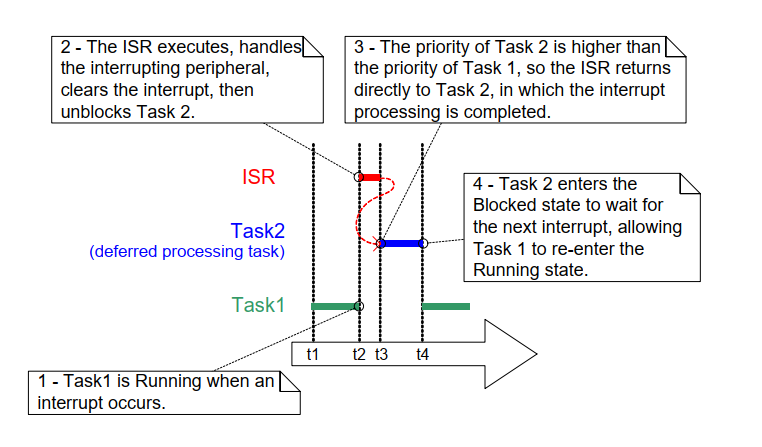
***图 7.1*** *在高优先级任务中完成中断处理*
* * *

在图 7.1 中，中断处理在 t2 开始、在 t4 实质结束，但只有 t2 到 t3 这一段在 `ISR` 中执行。若不使用延后处理，则 t2 到 t4 的整段时间都要停留在 `ISR`。

并不存在绝对规则规定“何时应在 `ISR` 内做完全部处理”与“何时应延后到任务”。延后处理在以下场景尤为有用：

- 中断触发的处理并不简单。例如仅保存一次模数转换结果，通常适合放在 `ISR`；但若还要经过软件滤波，则更适合放到任务。

- 中断后处理需要执行 `ISR` 中不能做的动作，如写控制台或动态分配内存。

- 中断后处理非确定性，即无法预先知道处理耗时。

后续各节将通过 `FreeRTOS` 机制与示例，进一步说明本章引入的这些概念，并展示如何实现中断延后处理。


## 7.4 用于同步的二值信号量

二值信号量的中断安全 `API` 可在特定中断每次发生时解除阻塞一个任务，从而实现“任务与中断同步”。这样，中断事件的大部分处理可在同步任务中完成，只在 `ISR` 保留极短、极快的部分。正如上一节所述，这是将中断处理“延后”到任务的一种方式[^14]。

[^14]: 与二值信号量相比，使用“直接到任务通知”从中断解除任务阻塞更高效。直接到任务通知要到第 10 章“任务通知”再介绍。

如图 7.1 所示，若处理时效性要求极高，可将延后处理任务优先级设得足够高，确保其总能抢占系统中其他任务。此时在 `ISR` 中调用 `portYIELD_FROM_ISR()`，即可保证 `ISR` 直接返回到该延后处理任务。效果是整段事件处理在时间上连续执行（无空隙），看起来就像全部都在 `ISR` 内完成。图 7.2 在图 7.1 场景基础上，改用信号量描述如何控制延后处理任务执行。


<a name="fig7.2" title="图 7.2 使用二值信号量实现中断延后处理"></a>

* * *
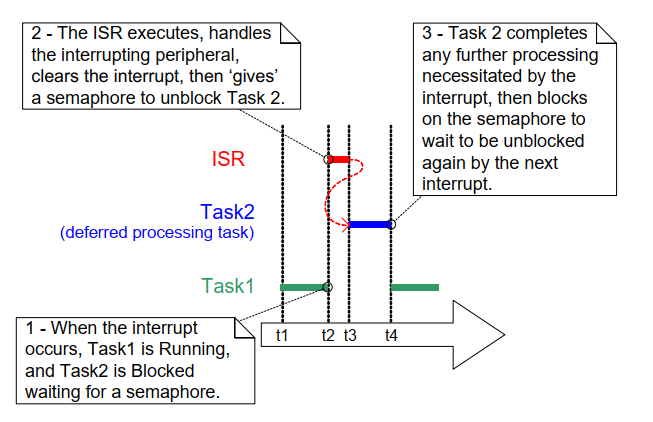
***图 7.2*** *使用二值信号量实现中断延后处理*
* * *

延后处理任务通过对信号量执行“带阻塞时间的获取（take）”进入阻塞态，以等待事件发生。事件发生时，`ISR` 对同一信号量执行“释放（give）”，解除该任务阻塞，随后继续执行所需处理。

“获取信号量”与“释放信号量”在不同场景语义不同。在本节“中断同步”场景里，可把二值信号量概念化为一个长度为 1 的队列。该队列任意时刻最多容纳一个项目，因此只会“空”或“满”（这就是“二值”）。延后任务调用 `xSemaphoreTake()`，等效于“从队列读数据并允许阻塞”：若队列为空，任务进入阻塞态。事件发生时，`ISR` 调用 `xSemaphoreGiveFromISR()` 把一个令牌（信号量）放入队列，使队列变满，从而让任务离开阻塞态并取走令牌，队列再次变空。任务处理完成后，再次尝试读取队列；发现为空后重新阻塞，等待下一次事件。图 7.3 展示了该流程。

图 7.3 中可以看到：中断“释放”信号量，但并未先“获取”；任务“获取”信号量后也不会“归还”。这也是为什么该场景更接近“向队列写入/读取”。这常令初学者困惑，因为它不遵循其他信号量场景下“谁取走谁归还”的规则——例如第 8 章“资源管理”中的资源互斥场景。


<a name="fig7.3" title="图 7.3 使用二值信号量让任务与中断同步"></a>

* * *
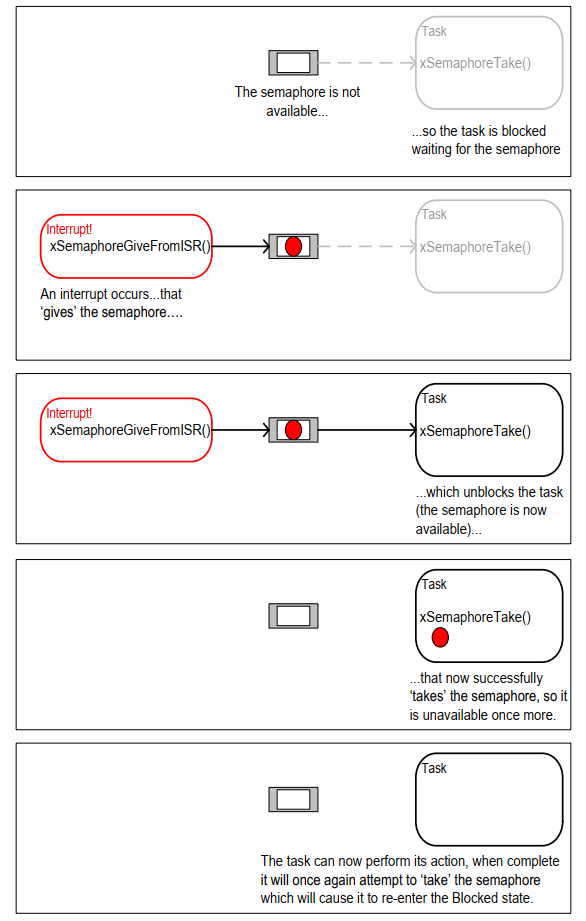
***图 7.3*** *使用二值信号量让任务与中断同步*
* * *


### 7.4.1 `xSemaphoreCreateBinary()` `API` 函数

`FreeRTOS` 还提供 `xSemaphoreCreateBinaryStatic()`，可在编译期静态分配创建二值信号量所需内存。各类 `FreeRTOS` 信号量句柄都使用 `SemaphoreHandle_t` 类型变量保存。

信号量必须先创建再使用。创建二值信号量可使用 `xSemaphoreCreateBinary()`[^15]。

[^15]: 部分信号量 `API` 实际是宏而非函数。为叙述简洁，本书统一称其为函数。


<a name="list7.3" title="清单 7.3 xSemaphoreCreateBinary() API 函数原型"></a>

```c
SemaphoreHandle_t xSemaphoreCreateBinary( void );
```
***清单 7.3*** *`xSemaphoreCreateBinary()` `API` 函数原型*

**`xSemaphoreCreateBinary()` 返回值**

- 返回值

  若返回 `NULL`，表示可用堆内存不足，`FreeRTOS` 无法为信号量控制结构分配内存，因此创建失败。

  若返回非 `NULL`，表示创建成功。该返回值应保存为所创建信号量的句柄。


### 7.4.2 `xSemaphoreTake()` `API` 函数

“获取（take）信号量”指“取得/接收信号量”。只有当信号量可用时才能获取成功。

除递归互斥量外，`FreeRTOS` 各类信号量都可用 `xSemaphoreTake()` 获取。

`xSemaphoreTake()` 不可在中断服务程序中调用。


<a name="list7.4" title="清单 7.4 xSemaphoreTake() API 函数原型"></a>

```c
BaseType_t xSemaphoreTake( SemaphoreHandle_t xSemaphore, TickType_t xTicksToWait );
```
***清单 7.4*** *`xSemaphoreTake()` `API` 函数原型*

**`xSemaphoreTake()` 参数与返回值**

- `xSemaphore`

  被“获取”的信号量。

  信号量通过 `SemaphoreHandle_t` 类型变量引用，使用前必须显式创建。

- `xTicksToWait`

  若信号量尚不可用，调用任务在阻塞态最多等待的时间。

  当 `xTicksToWait` 为 0 时，若信号量不可用则 `xSemaphoreTake()` 立即返回。

  阻塞时间以节拍为单位，因此对应的绝对时间取决于节拍频率。可用 `pdMS_TO_TICKS()` 将毫秒值转换为节拍数。

  若 `INCLUDE_vTaskSuspend` 在 `FreeRTOSConfig.h` 中设为 1，则把 `xTicksToWait` 设为 `portMAX_DELAY` 会导致任务无限期等待（无超时）。

- 返回值

  可能值有两种：

  - `pdPASS`

	 仅当调用成功获取信号量时返回 `pdPASS`。

	 若指定了阻塞时间（`xTicksToWait` 非 0），调用任务可能先进入阻塞态等待；但在超时前信号量变为可用，最终仍可成功返回。

  - `pdFALSE`

	 表示信号量不可用。

	 若指定了阻塞时间（`xTicksToWait` 非 0），调用任务会进入阻塞态等待，但在超时到达前信号量仍未可用。


### 7.4.3 `xSemaphoreGiveFromISR()` `API` 函数

二值信号量和计数信号量[^16]都可通过 `xSemaphoreGiveFromISR()` 执行“释放”。

[^16]: 计数信号量将在本章后续小节介绍。

`xSemaphoreGiveFromISR()` 是 `xSemaphoreGive()` 的中断安全版本，因此也带有本章开头介绍的 `pxHigherPriorityTaskWoken` 参数。


<a name="list" title="清单 7.5 xSemaphoreGiveFromISR() API 函数原型"></a>

```c
BaseType_t xSemaphoreGiveFromISR( SemaphoreHandle_t xSemaphore,
											 BaseType_t *pxHigherPriorityTaskWoken );
```
***清单 7.5*** *`xSemaphoreGiveFromISR()` `API` 函数原型*

**`xSemaphoreGiveFromISR()` 参数与返回值**

- `xSemaphore`

  被“释放”的信号量。

  信号量通过 `SemaphoreHandle_t` 变量引用，使用前必须显式创建。

- `pxHigherPriorityTaskWoken`

  同一个信号量上可能有一个或多个任务阻塞等待其可用。调用 `xSemaphoreGiveFromISR()` 可能使信号量可用，从而让等待任务离开阻塞态。若确实有任务离开阻塞态，且其优先级高于当前执行任务（即被中断打断的任务），则 `xSemaphoreGiveFromISR()` 会在内部把 `*pxHigherPriorityTaskWoken` 置为 `pdTRUE`。

  若该值被置为 `pdTRUE`，通常应在退出中断前进行一次上下文切换，确保中断直接返回到最高优先级就绪任务。

- 返回值

  可能值有两种：

  - `pdPASS`

	 仅当 `xSemaphoreGiveFromISR()` 调用成功时返回 `pdPASS`。

  - `pdFAIL`

	 若信号量本就处于可用状态，则不能再次“释放”，此时 `xSemaphoreGiveFromISR()` 返回 `pdFAIL`。


<a name="example7.1" title="示例 7.1 使用二值信号量让任务与中断同步"></a>
---
***示例 7.1*** *使用二值信号量让任务与中断同步*

---

本示例通过二值信号量，在中断服务程序中解除任务阻塞，从而实现任务与中断同步。

示例使用一个简单的周期任务每 500 毫秒触发一次软件中断。这里使用软件中断仅为方便演示，因为在某些目标环境中挂接真实硬件中断比较复杂。清单 7.6 给出了周期任务实现。注意任务在触发中断前后都打印字符串，这样可从输出中直接观察执行顺序。


<a name="list7.6" title="清单 7.6 示例 7.1 中周期触发软件中断任务的实现"></a>

```c
/* The number of the software interrupt used in this example. The code
	shown is from the Windows project, where numbers 0 to 2 are used by the
	FreeRTOS Windows port itself, so 3 is the first number available to the
	application. */
#define mainINTERRUPT_NUMBER 3

static void vPeriodicTask( void *pvParameters )
{
	 const TickType_t xDelay500ms = pdMS_TO_TICKS( 500UL );

	 /* As per most tasks, this task is implemented within an infinite loop. */
	 for( ;; )
	 {
		  /* Block until it is time to generate the software interrupt again. */
		  vTaskDelay( xDelay500ms );

		  /* Generate the interrupt, printing a message both before and after
			  the interrupt has been generated, so the sequence of execution is
			  evident from the output.

			  The syntax used to generate a software interrupt is dependent on
			  the FreeRTOS port being used. The syntax used below can only be
			  used with the FreeRTOS Windows port, in which such interrupts are
			  only simulated. */
		  vPrintString( "Periodic task - About to generate an interrupt.\r\n" );
		  vPortGenerateSimulatedInterrupt( mainINTERRUPT_NUMBER );
		  vPrintString( "Periodic task - Interrupt generated.\r\n\r\n\r\n" );
	 }
}
```
***清单 7.6*** *示例 7.1 中周期触发软件中断任务的实现*


清单 7.7 给出了“承接中断延后处理”的任务实现——该任务通过二值信号量与软件中断同步。同样地，任务每次迭代都会打印字符串，因此可从示例输出中观察任务与中断的执行先后。

需注意：清单 7.7 的结构对示例 7.1（软件触发中断）是足够的，但对“硬件外设触发中断”的场景并不充分。后续小节会说明应如何调整代码结构，才能适用于硬件中断。


<a name="list7.7." title="清单 7.7 承接中断延后处理任务（与中断同步的任务）实现"></a>

```c
static void vHandlerTask( void *pvParameters )
{
	 /* As per most tasks, this task is implemented within an infinite loop. */
	 for( ;; )
	 {
		  /* Use the semaphore to wait for the event. The semaphore was created
			  before the scheduler was started, so before this task ran for the
			  first time. The task blocks indefinitely, meaning this function
			  call will only return once the semaphore has been successfully
			  obtained - so there is no need to check the value returned by
			  xSemaphoreTake(). */
		  xSemaphoreTake( xBinarySemaphore, portMAX_DELAY );

		  /* To get here the event must have occurred. Process the event (in
			  this Case, just print out a message). */
		  vPrintString( "Handler task - Processing event.\r\n" );
	 }
}
```
***清单 7.7*** *示例 7.1 中承接中断延后处理任务（与中断同步任务）的实现*


清单 7.8 展示了 `ISR` 实现。它几乎只做一件事：`give` 信号量以解除延后处理任务阻塞。

请关注 `xHigherPriorityTaskWoken` 的使用方式：在调用 `xSemaphoreGiveFromISR()` 前先设为 `pdFALSE`，随后将其传给 `portYIELD_FROM_ISR()`。若 `xHigherPriorityTaskWoken` 变为 `pdTRUE`，`portYIELD_FROM_ISR()` 就会请求一次上下文切换。

该 `ISR` 原型和用于强制切换的宏都适用于 `FreeRTOS Windows` 端口，其他端口可能不同。请参考 `FreeRTOS.org` 对应端口文档及发行包示例，确认你所用端口的语法。

与多数 `FreeRTOS` 运行架构不同，`FreeRTOS Windows` 端口要求 `ISR` 返回一个值。该端口实现的 `portYIELD_FROM_ISR()` 宏已包含返回语句，因此清单 7.8 未显式 `return`。


<a name="list7.8" title="清单 7.8 示例 7.1 所用软件中断 ISR"></a>

```c
static uint32_t ulExampleInterruptHandler( void )
{
	 BaseType_t xHigherPriorityTaskWoken;

	 /* The xHigherPriorityTaskWoken parameter must be initialized to
		 pdFALSE as it will get set to pdTRUE inside the interrupt safe
		 API function if a context switch is required. */
	 xHigherPriorityTaskWoken = pdFALSE;

	 /* 'Give' the semaphore to unblock the task, passing in the address of
		 xHigherPriorityTaskWoken as the interrupt safe API function's
		 pxHigherPriorityTaskWoken parameter. */
	 xSemaphoreGiveFromISR( xBinarySemaphore, &xHigherPriorityTaskWoken );

	 /* Pass the xHigherPriorityTaskWoken value into portYIELD_FROM_ISR().
		 If xHigherPriorityTaskWoken was set to pdTRUE inside
		 xSemaphoreGiveFromISR() then calling portYIELD_FROM_ISR() will request
		 a context switch. If xHigherPriorityTaskWoken is still pdFALSE then
		 calling portYIELD_FROM_ISR() will have no effect. Unlike most FreeRTOS
		 ports, the Windows port requires the ISR to return a value - the return
		 statement is inside the Windows version of portYIELD_FROM_ISR(). */
	 portYIELD_FROM_ISR( xHigherPriorityTaskWoken );
}
```
***清单 7.8*** *示例 7.1 所用软件中断 `ISR`*

`main()` 函数负责创建二值信号量、创建任务、安装中断处理函数并启动调度器，见清单 7.9。

安装中断处理函数所用 `API` 语法是 `FreeRTOS Windows` 端口特有，其他端口可能不同。请参考 `FreeRTOS.org` 端口文档与下载包示例。


<a name="list7.9" title="清单 7.9 示例 7.1 的 main() 实现"></a>

```c
int main( void )
{
	 /* Before a semaphore is used it must be explicitly created. In this
		 example a binary semaphore is created. */
	 xBinarySemaphore = xSemaphoreCreateBinary();

	 /* Check the semaphore was created successfully. */
	 if( xBinarySemaphore != NULL )
	 {
		  /* Create the 'handler' task, which is the task to which interrupt
			  processing is deferred. This is the task that will be synchronized
			  with the interrupt. The handler task is created with a high priority
			  to ensure it runs immediately after the interrupt exits. In this
			  case a priority of 3 is chosen. */
		  xTaskCreate( vHandlerTask, "Handler", 1000, NULL, 3, NULL );

		  /* Create the task that will periodically generate a software
			  interrupt. This is created with a priority below the handler task
			  to ensure it will get preempted each time the handler task exits
			  the Blocked state. */
		  xTaskCreate( vPeriodicTask, "Periodic", 1000, NULL, 1, NULL );

		  /* Install the handler for the software interrupt. The syntax necessary
			  to do this is dependent on the FreeRTOS port being used. The syntax
			  shown here can only be used with the FreeRTOS windows port, where
			  such interrupts are only simulated. */
		  vPortSetInterruptHandler( mainINTERRUPT_NUMBER,
											 ulExampleInterruptHandler );

		  /* Start the scheduler so the created tasks start executing. */
		  vTaskStartScheduler();
	 }

	 /* As normal, the following line should never be reached. */
	 for( ;; );
}
```
***清单 7.9*** *示例 7.1 的 `main()` 实现*


示例 7.1 的输出如图 7.4 所示。符合预期：中断一触发，`vHandlerTask()` 立刻进入运行态，因此该任务输出会插入到周期任务输出之间。图 7.5 给出更详细解释。


<a name="fig7.4" title="图 7.4 示例 7.1 运行输出"></a>
<a name="fig7.5" title="图 7.5 示例 7.1 执行时序"></a>

* * *
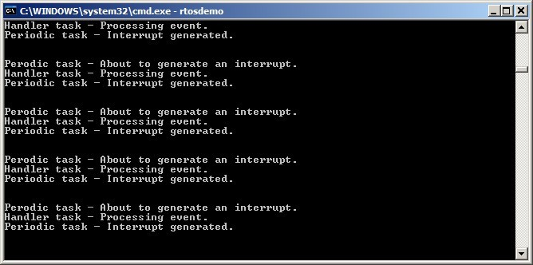
***图 7.4*** *示例 7.1 运行输出*

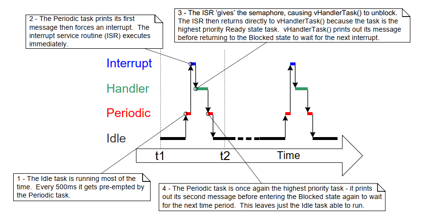
***图 7.5*** *示例 7.1 执行时序*
* * *


### 7.4.4 改进示例 7.1 中任务的实现

示例 7.1 使用二值信号量实现任务与中断同步，其执行序列如下：

1. 中断发生。

1. `ISR` 执行并 `give` 信号量，解除任务阻塞。

1. 任务在 `ISR` 后立刻执行，并 `take` 信号量。

1. 任务处理事件，然后再次尝试 `take` 信号量——由于信号量尚不可用（下一次中断还未发生），任务进入阻塞态。

示例 7.1 的任务结构仅在中断频率较低时才足够。若任务尚未处理完第一次中断事件时，又发生第二次甚至第三次中断，会怎样？

- 当第二次 `ISR` 执行时，信号量为空，因此可再次 `give`，任务处理完第一次事件后会立刻处理第二次事件。图 7.6 展示了该场景。

- 当第三次 `ISR` 执行时，信号量可能已处于可用状态，导致无法再次 `give`，于是任务将“感知不到”第三次事件。图 7.7 展示了该场景。


<a name="fig7.6" title="图 7.6 任务尚未处理完首个事件时又发生一次中断"></a>
<a name="fig7.7" title="图 7.7 任务尚未处理完首个事件时又发生两次中断"></a>

* * *
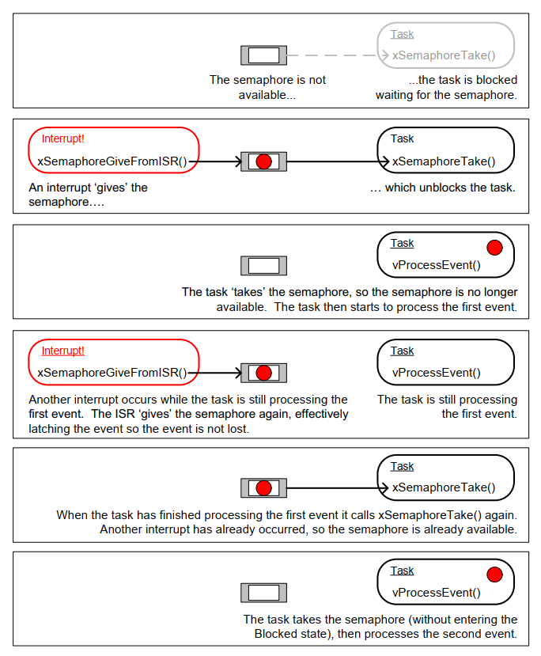
***图 7.6*** *任务尚未处理完首个事件时又发生一次中断*

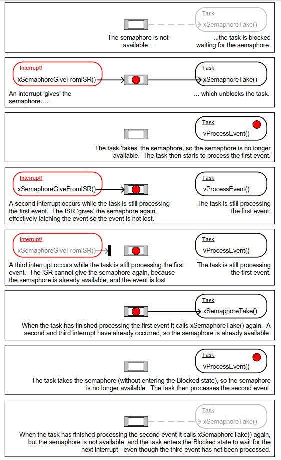
***图 7.7*** *任务尚未处理完首个事件时又发生两次中断*
* * *

示例 7.1（清单 7.7）中的延后中断处理任务结构，是在每次调用 `xSemaphoreTake()` 之间只处理一个事件。对示例 7.1 之所以可行，是因为事件由软件触发，中断时间可预测。真实应用中，中断多由硬件触发，发生时间不可预测。为降低漏中断风险，延后处理任务应在每次 `xSemaphoreTake()` 之间，把“已经可用的所有事件”都处理完[^17]。清单 7.10 给出了 `UART` 场景的建议结构：假设 `UART` 每收到一个字符触发一次接收中断，并把字符放入硬件 `FIFO` 缓冲。

[^17]: 另一种办法是使用计数信号量或直接到任务通知来计数事件。计数信号量在下一节介绍；直接到任务通知在第 10 章介绍。直接到任务通知在运行时效率和 `RAM` 占用方面通常更优。

示例 7.1 的延后处理任务还有一个弱点：调用 `xSemaphoreTake()` 时未设置超时，直接传入 `portMAX_DELAY`，即无限等待（无超时）。示例代码常这么写是为了结构简单、便于理解，但在真实应用中通常不是好实践，因为会降低错误恢复能力。例如任务等待中断释放信号量时，若硬件错误导致中断不再产生：

- 若任务无限等待，它将永远不知道错误发生，会一直卡住。

- 若设置超时，超时后 `xSemaphoreTake()` 返回 `pdFAIL`，任务下次运行时就可检测并清除错误。清单 7.10 也演示了这一点。


<a name="list7.10" title="清单 7.10 延后中断处理任务推荐结构（以 UART 接收处理为例）"></a>

```c
static void vUARTReceiveHandlerTask( void *pvParameters )
{
	 /* xMaxExpectedBlockTime holds the maximum time expected between two
		 interrupts. */
	 const TickType_t xMaxExpectedBlockTime = pdMS_TO_TICKS( 500 );

	 /* As per most tasks, this task is implemented within an infinite loop. */
	 for( ;; )
	 {
		  /* The semaphore is 'given' by the UART's receive (Rx) interrupt.
			  Wait a maximum of xMaxExpectedBlockTime ticks for the next
			  interrupt. */
		  if( xSemaphoreTake( xBinarySemaphore, xMaxExpectedBlockTime ) == pdPASS)
		  {
				/* The semaphore was obtained. Process ALL pending Rx events before
					calling xSemaphoreTake() again. Each Rx event will have placed a
					character in the UART's receive FIFO, and UART_RxCount() is
					assumed to return the number of characters in the FIFO. */
				while( UART_RxCount() > 0 )
				{
					 /* UART_ProcessNextRxEvent() is assumed to process one Rx
						 character, reducing the number of characters in the FIFO
						 by 1. */
					 UART_ProcessNextRxEvent();
				}

				/* No more Rx events are pending (there are no more characters in
					the FIFO), so loop back and call xSemaphoreTake() to wait for
					the next interrupt. Any interrupts occurring between this point
					in the code and the call to xSemaphoreTake() will be latched in
					the semaphore, so will not be lost. */
		  }
		  else
		  {
				/* An event was not received within the expected time. Check for,
					and if necessary clear, any error conditions in the UART that
					might be preventing the UART from generating any more
					interrupts. */
				UART_ClearErrors();
		  }
	 }
}
```
***清单 7.10*** *延后中断处理任务推荐结构（以 `UART` 接收处理为例）*


## 7.5 计数信号量

若把二值信号量视作长度为 1 的队列，那么计数信号量可视作长度大于 1 的队列。任务并不关心队列里“数据是什么”，只关心“队列里有多少项”。要使计数信号量可用，需在 `FreeRTOSConfig.h` 中将 `configUSE_COUNTING_SEMAPHORES` 设为 `1`。

计数信号量每被 `give` 一次，其内部队列就多占一个位置。队列当前项目数就是信号量的“计数值”。

计数信号量通常用于两类场景：

1. 事件计数[^18]

	在该场景中，事件处理者每发生一次事件就 `give` 一次信号量，计数值随每次 `give` 递增；任务每处理一次事件就 `take` 一次信号量，计数值随每次 `take` 递减。计数值等于“已发生事件数 - 已处理事件数”。图 7.8 展示了这一机制。

	用于事件计数的计数信号量，创建时初始计数值应设为 0。

	[^18]: 与计数信号量相比，使用直接到任务通知进行事件计数更高效。直接到任务通知将在第 10 章介绍。

1. 资源管理。

	在该场景中，计数值表示“可用资源数量”。任务要获取某个资源，必须先获取信号量，使计数值减 1；当计数减到 0 时，说明无空闲资源。任务用完资源后 `give` 回信号量，使计数值加 1。

	用于资源管理的计数信号量，创建时初始计数值应等于可用资源总数。第 8 章会介绍如何用信号量管理资源。


<a name="fig7.8" title="图 7.8 使用计数信号量“计数”事件"></a>

* * *
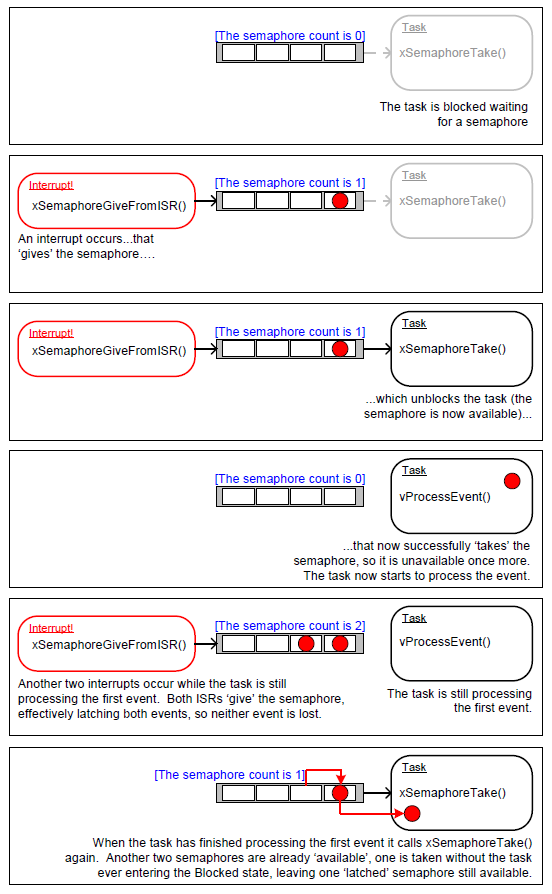
***图 7.8*** *使用计数信号量“计数”事件*
* * *

### 7.5.1 `xSemaphoreCreateCounting()` `API` 函数

`FreeRTOS` 还提供 `xSemaphoreCreateCountingStatic()`，可在编译期静态分配创建计数信号量所需内存。各类 `FreeRTOS` 信号量句柄都保存在 `SemaphoreHandle_t` 类型变量中。

信号量必须先创建再使用。创建计数信号量可调用 `xSemaphoreCreateCounting()`。


<a name="list7.11" title="清单 7.11 xSemaphoreCreateCounting() API 函数原型"></a>

```c
SemaphoreHandle_t xSemaphoreCreateCounting( UBaseType_t uxMaxCount,
														  UBaseType_t uxInitialCount );
```
***清单 7.11*** *`xSemaphoreCreateCounting()` `API` 函数原型*


**`xSemaphoreCreateCounting()` 参数与返回值**

- `uxMaxCount`

	信号量可计数到的最大值。沿用队列类比，`uxMaxCount` 相当于队列长度。

	当用于计数或锁存事件时，`uxMaxCount` 是可锁存的最大事件数。

	当用于管理一组资源访问时，`uxMaxCount` 应设为资源总数。

- `uxInitialCount`

  信号量创建后的初始计数值。

  当用于计数或锁存事件时，`uxInitialCount` 应设为 0（创建时假定尚无事件发生）。

  当用于管理一组资源访问时，`uxInitialCount` 应设为 `uxMaxCount`（创建时假定所有资源都可用）。

- 返回值

  若返回 `NULL`，表示可用堆内存不足，`FreeRTOS` 无法分配信号量数据结构。第 3 章提供更多堆内存管理信息。

  若返回非 `NULL`，表示信号量创建成功。返回值应保存为该信号量句柄。


<a name="example7.2" title="示例 7.2 使用计数信号量让任务与中断同步"></a>
---
***示例 7.2*** *使用计数信号量让任务与中断同步*

---

示例 7.2 在示例 7.1 基础上改进：把二值信号量换成计数信号量。`main()` 中将原本调用 `xSemaphoreCreateBinary()` 的位置改为调用 `xSemaphoreCreateCounting()`，如清单 7.12 所示。


<a name="list7.12" title="清单 7.12 示例 7.2 中创建计数信号量的 xSemaphoreCreateCounting() 调用"></a>

```c
/* Before a semaphore is used it must be explicitly created. In this example a
	counting semaphore is created. The semaphore is created to have a maximum
	count value of 10, and an initial count value of 0. */
xCountingSemaphore = xSemaphoreCreateCounting( 10, 0 );
```
***清单 7.12*** *示例 7.2 中创建计数信号量的 `xSemaphoreCreateCounting()` 调用*


为了模拟“高频下多个事件连续发生”，中断服务程序被修改为每次中断中多次 `give` 信号量。每个事件都会锁存在信号量计数值中。修改后的 `ISR` 见清单 7.13。


<a name="list7.13" title="清单 7.13 示例 7.2 使用的中断服务程序实现"></a>

```c
static uint32_t ulExampleInterruptHandler( void )
{
	 BaseType_t xHigherPriorityTaskWoken;

	 /* The xHigherPriorityTaskWoken parameter must be initialized to pdFALSE
		 as it will get set to pdTRUE inside the interrupt safe API function if
		 a context switch is required. */
	 xHigherPriorityTaskWoken = pdFALSE;

	 /* 'Give' the semaphore multiple times. The first will unblock the deferred
		 interrupt handling task, the following 'gives' are to demonstrate that
		 the semaphore latches the events to allow the task to which interrupts
		 are deferred to process them in turn, without events getting lost. This
		 simulates multiple interrupts being received by the processor, even
		 though in this case the events are simulated within a single interrupt
		 occurrence. */
	 xSemaphoreGiveFromISR( xCountingSemaphore, &xHigherPriorityTaskWoken );
	 xSemaphoreGiveFromISR( xCountingSemaphore, &xHigherPriorityTaskWoken );
	 xSemaphoreGiveFromISR( xCountingSemaphore, &xHigherPriorityTaskWoken );

	 /* Pass the xHigherPriorityTaskWoken value into portYIELD_FROM_ISR().
		 If xHigherPriorityTaskWoken was set to pdTRUE inside
		 xSemaphoreGiveFromISR() then calling portYIELD_FROM_ISR() will request
		 a context switch. If xHigherPriorityTaskWoken is still pdFALSE then
		 calling portYIELD_FROM_ISR() will have no effect. Unlike most FreeRTOS
		 ports, the Windows port requires the ISR to return a value - the return
		 statement is inside the Windows version of portYIELD_FROM_ISR(). */
	 portYIELD_FROM_ISR( xHigherPriorityTaskWoken );
}
```
***清单 7.13*** *示例 7.2 使用的中断服务程序实现*

其余函数与示例 7.1 保持不变。

示例 7.2 运行输出见图 7.9。可以看到，每次触发中断时，承接延后处理的任务都会处理 3 个（模拟）事件。事件被锁存在信号量计数值中，使任务可逐个处理，不会丢失。


<a name="fig7.9" title="图 7.9 示例 7.2 运行输出"></a>

* * *

***图 7.9*** *示例 7.2 运行输出*
* * *


## 7.6 将工作延后到 `RTOS` 守护任务

前述延后处理中断示例都要求“每个中断配一个延后处理任务”。还可以通过 `xTimerPendFunctionCallFromISR()`[^19] 把处理中断的工作延后到 `RTOS` 守护任务，从而无需为每个中断创建独立任务。这称为“集中式中断延后处理”。

[^19]: 守护任务最初称为“定时器服务任务”，因为最初它只执行软件定时器回调。因此 `xTimerPendFunctionCall()` 实现在 `timers.c` 中，并按“函数名前缀取自实现文件名”的约定，以 `Timer` 作为函数名前缀。

第 6 章说明了“与软件定时器相关的 `FreeRTOS API` 如何通过定时器命令队列向守护任务发命令”。`xTimerPendFunctionCall()` 与 `xTimerPendFunctionCallFromISR()` 使用同一条定时器命令队列向守护任务发送“执行函数”命令。被发送的函数最终会在守护任务上下文中执行。

集中式中断延后处理的优点：

- 更低的资源占用

  不必为每个延后处理中断创建独立任务。

- 更简单的用户模型

  延后处理函数就是普通 `C` 函数。

集中式中断延后处理的缺点：

- 灵活性较低

  无法分别设置每个延后处理任务优先级。所有延后处理函数都以守护任务优先级运行。第 6 章介绍过，守护任务优先级由 `FreeRTOSConfig.h` 中编译期常量 `configTIMER_TASK_PRIORITY` 设置。

- 确定性较弱

  `xTimerPendFunctionCallFromISR()` 是把命令写入定时器命令队列队尾。队列中已有命令会先于该“执行函数”命令被守护任务处理。

不同中断的时序约束不同，因此同一应用里同时使用“专用任务延后处理”和“守护任务集中延后处理”是很常见的。


### 7.6.1 `xTimerPendFunctionCallFromISR()` `API` 函数

`xTimerPendFunctionCallFromISR()` 是 `xTimerPendFunctionCall()` 的中断安全版本。两者都允许应用编写者提供一个函数，由 `RTOS` 守护任务执行（因此运行在守护任务上下文）。要执行的函数及其参数值会通过定时器命令队列发送给守护任务。函数何时真正执行，取决于守护任务相对系统中其他任务的优先级。


<a name="list7.14" title="清单 7.14 xTimerPendFunctionCallFromISR() API 函数原型"></a>

```c
BaseType_t xTimerPendFunctionCallFromISR( PendedFunction_t
														xFunctionToPend,
														void *pvParameter1,
														uint32_t ulParameter2,
														BaseType_t *pxHigherPriorityTaskWoken );
```
***清单 7.14*** *`xTimerPendFunctionCallFromISR()` `API` 函数原型*


<a name="list7.15" title="清单 7.15 传给 xTimerPendFunctionCallFromISR() 的 xFunctionToPend 参数的函数必须符合的原型"></a>

```c
void vPendableFunction( void *pvParameter1, uint32_t ulParameter2 );
```
***清单 7.15*** *传给 `xTimerPendFunctionCallFromISR()` 的 `xFunctionToPend` 参数的函数必须符合的原型*


**`xTimerPendFunctionCallFromISR()` 参数与返回值**

- `xFunctionToPend`

  指向将在守护任务中执行的函数（本质上就是函数名指针）。该函数原型必须与清单 7.15 一致。

- `pvParameter1`

  该值会作为守护任务执行函数时的 `pvParameter1` 参数。其类型为 `void *`，可传递任意数据类型。例如整数可直接强转为 `void *`，也可用 `void *` 指向一个结构体。

- `ulParameter2`

  该值会作为守护任务执行函数时的 `ulParameter2` 参数。

- `pxHigherPriorityTaskWoken`

  `xTimerPendFunctionCallFromISR()` 会向定时器命令队列写入命令。若守护任务原本阻塞等待该队列数据，写入后守护任务将离开阻塞态。若守护任务优先级高于当前执行任务（被中断打断的任务），则 `xTimerPendFunctionCallFromISR()` 内部会把 `*pxHigherPriorityTaskWoken` 置为 `pdTRUE`。

  若该值变为 `pdTRUE`，则必须在中断退出前执行一次上下文切换，确保中断直接返回守护任务（此时守护任务将是最高优先级就绪任务）。

- 返回值

  可能值有两种：

  - `pdPASS`

	 若“执行函数”命令成功写入定时器命令队列，返回 `pdPASS`。

  - `pdFAIL`

	 若定时器命令队列已满，导致“执行函数”命令写入失败，返回 `pdFAIL`。第 6 章介绍了如何配置定时器命令队列长度。


<a name="example7.3" title="示例 7.3 集中式中断延后处理"></a>
---
***示例 7.3*** *集中式中断延后处理*

---

示例 7.3 与示例 7.1 功能类似，但不再使用信号量，也不再创建专门处理中断后续工作的任务；改由 `RTOS` 守护任务完成处理。

示例 7.3 的中断服务程序见清单 7.16。它调用 `xTimerPendFunctionCallFromISR()`，把 `vDeferredHandlingFunction()` 函数指针投递给守护任务。中断后续处理由 `vDeferredHandlingFunction()` 完成。

该 `ISR` 每执行一次都会将 `ulParameterValue` 变量加 1。随后在调用 `xTimerPendFunctionCallFromISR()` 时把 `ulParameterValue` 作为 `ulParameter2` 传入，因此守护任务实际调用 `vDeferredHandlingFunction()` 时，`ulParameter2` 也会取该值。本示例未使用函数另一个参数 `pvParameter1`。


<a name="list7.16" title="清单 7.16 示例 7.3 使用的软件中断处理函数"></a>

```c
static uint32_t ulExampleInterruptHandler( void )
{
	 static uint32_t ulParameterValue = 0;
	 BaseType_t xHigherPriorityTaskWoken;

	 /* The xHigherPriorityTaskWoken parameter must be initialized to pdFALSE
		 as it will get set to pdTRUE inside the interrupt safe API function if
		 a context switch is required. */
	 xHigherPriorityTaskWoken = pdFALSE;

	 /* Send a pointer to the interrupt's deferred handling function to the
		 daemon task. The deferred handling function's pvParameter1 parameter
		 is not used so just set to NULL. The deferred handling function's
		 ulParameter2 parameter is used to pass a number that is incremented by
		 one each time this interrupt handler executes. */
	 xTimerPendFunctionCallFromISR( vDeferredHandlingFunction, /* Function to execute */
											  NULL, /* Not used */
											  ulParameterValue, /* Incrementing value. */
											  &xHigherPriorityTaskWoken );
	 ulParameterValue++;

	 /* Pass the xHigherPriorityTaskWoken value into portYIELD_FROM_ISR(). If
		 xHigherPriorityTaskWoken was set to pdTRUE inside
		 xTimerPendFunctionCallFromISR() then calling portYIELD_FROM_ISR() will
		 request a context switch. If xHigherPriorityTaskWoken is still pdFALSE
		 then calling portYIELD_FROM_ISR() will have no effect. Unlike most
		 FreeRTOS ports, the Windows port requires the ISR to return a value -
		 the return statement is inside the Windows version
		 of portYIELD_FROM_ISR(). */
	 portYIELD_FROM_ISR( xHigherPriorityTaskWoken );
}
```
***清单 7.16*** *示例 7.3 使用的软件中断处理函数*


`vDeferredHandlingFunction()` 实现见清单 7.17。它输出固定字符串以及参数 `ulParameter2` 的值。

即使本示例只使用其中一个参数，`vDeferredHandlingFunction()` 仍必须满足清单 7.15 所示函数原型。


<a name="list7.17" title="清单 7.17 示例 7.3 中执行中断后续处理的函数"></a>

```c
static void vDeferredHandlingFunction( void *pvParameter1, uint32_t ulParameter2 )
{
	 /* Process the event - in this case just print out a message and the value
		 of ulParameter2. pvParameter1 is not used in this example. */
	 vPrintStringAndNumber( "Handler function - Processing event ", ulParameter2 );
}
```
***清单 7.17*** *示例 7.3 中执行中断后续处理的函数*


示例 7.3 的 `main()` 实现见清单 7.18。与示例 7.1 相比，它更简单，因为无需创建信号量，也无需创建专门的延后处理中断任务。

`vPeriodicTask()` 用于周期性触发软件中断。该任务优先级设置为低于守护任务，确保守护任务一旦离开阻塞态即可抢占该任务。


<a name="list7.18" title="清单 7.18 示例 7.3 的 main() 实现"></a>

```c
int main( void )
{
	 /* The task that generates the software interrupt is created at a priority
		 below the priority of the daemon task. The priority of the daemon task
		 is set by the configTIMER_TASK_PRIORITY compile time configuration
		 constant in FreeRTOSConfig.h. */
	 const UBaseType_t ulPeriodicTaskPriority = configTIMER_TASK_PRIORITY - 1;

	 /* Create the task that will periodically generate a software interrupt. */
	 xTaskCreate( vPeriodicTask, "Periodic", 1000, NULL, ulPeriodicTaskPriority,
					  NULL );

	 /* Install the handler for the software interrupt. The syntax necessary to
		 do this is dependent on the FreeRTOS port being used. The syntax shown
		 here can only be used with the FreeRTOS windows port, where such
		 interrupts are only simulated. */
	 vPortSetInterruptHandler( mainINTERRUPT_NUMBER, ulExampleInterruptHandler );

	 /* Start the scheduler so the created task starts executing. */
	 vTaskStartScheduler();

	 /* As normal, the following line should never be reached. */
	 for( ;; );
}
```
***清单 7.18*** *示例 7.3 的 `main()` 实现*


示例 7.3 输出见图 7.10。由于守护任务优先级高于软件中断触发任务，`vDeferredHandlingFunction()` 会在中断发生后立即由守护任务执行。因此它输出的信息会出现在周期任务两条输出之间，与“使用信号量唤醒专用延后处理任务”的效果一致。图 7.11 给出更详细解释。


<a name="fig7.10" title="图 7.10 示例 7.3 运行输出"></a>
<a name="fig7.11" title="图 7.11 示例 7.3 执行时序"></a>

* * *
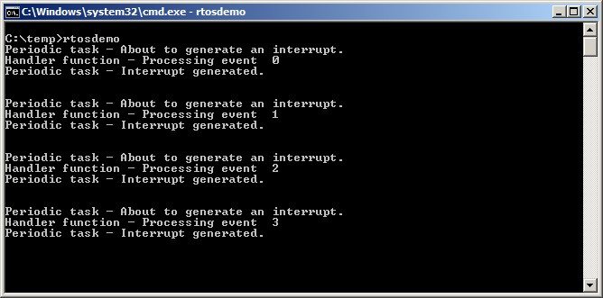
***图 7.10*** *示例 7.3 运行输出*

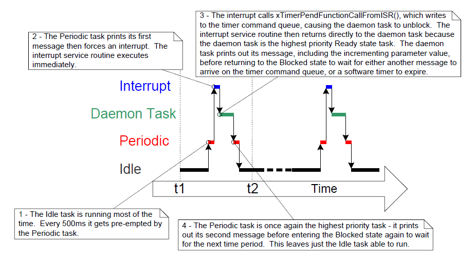
***图 7.11*** *示例 7.3 执行时序*
* * *


## 7.7 在中断服务程序中使用队列

二值信号量和计数信号量主要用于传递事件；队列既可传递事件，也可传输数据。

`xQueueSendToFrontFromISR()` 是 `xQueueSendToFront()` 的中断安全版本；`xQueueSendToBackFromISR()` 是 `xQueueSendToBack()` 的中断安全版本；`xQueueReceiveFromISR()` 是 `xQueueReceive()` 的中断安全版本。


### 7.7.1 `xQueueSendToFrontFromISR()` 与 `xQueueSendToBackFromISR()` `API` 函数


<a name="list7.19" title="清单 7.19 xQueueSendToFrontFromISR() API 函数原型"></a>

```c
BaseType_t xQueueSendToFrontFromISR( QueueHandle_t xQueue,
												 const void *pvItemToQueue
												 BaseType_t *pxHigherPriorityTaskWoken );
```
***清单 7.19*** *`xQueueSendToFrontFromISR()` `API` 函数原型*


<a name="list7.20" title="清单 7.20 xQueueSendToBackFromISR() API 函数原型"></a>

```c
BaseType_t xQueueSendToBackFromISR( QueueHandle_t xQueue,
												const void *pvItemToQueue
												BaseType_t *pxHigherPriorityTaskWoken );
```
***清单 7.20*** *`xQueueSendToBackFromISR()` `API` 函数原型*


`xQueueSendFromISR()` 与 `xQueueSendToBackFromISR()` 在功能上等价。

**`xQueueSendToFrontFromISR()` 与 `xQueueSendToBackFromISR()` 参数与返回值**

- `xQueue`

  目标队列句柄，即将要写入数据的队列。该句柄来自创建队列时的 `xQueueCreate()` 返回值。

- `pvItemToQueue`

  指向待入队项目的指针。

  队列每项大小在创建时已确定，因此会从 `pvItemToQueue` 指向地址复制对应字节数到队列存储区。

- `pxHigherPriorityTaskWoken`

  某个队列上可能有一个或多个任务阻塞等待数据可用。调用 `xQueueSendToFrontFromISR()` 或 `xQueueSendToBackFromISR()` 后，可能使数据变为可用并解除其中任务阻塞。若确有任务离开阻塞态，且该任务优先级高于当前执行任务（被中断打断的任务），则相应 `API` 内部会把 `*pxHigherPriorityTaskWoken` 置为 `pdTRUE`。

  若该值被置为 `pdTRUE`，应在中断退出前执行一次上下文切换，以确保中断直接返回到最高优先级就绪任务。

- 返回值

  可能值有两种：

  - `pdPASS`

	 仅当数据成功发送到队列时返回 `pdPASS`。

  - `errQUEUE_FULL`

	 若队列已满导致发送失败，返回 `errQUEUE_FULL`。


### 7.7.2 在 `ISR` 中使用队列时的注意事项

队列是“从中断向任务传递数据”的一种易用方式，但若数据到达频率很高，则使用队列并不高效。

`FreeRTOS` 下载包中的很多演示程序都包含一个简化 `UART` 驱动：在 `UART` 接收 `ISR` 中把字符写入队列。演示里这么做有两个目的：一是展示队列在 `ISR` 中的用法，二是故意增加系统负载来测试端口。这类 `ISR` 设计并非效率导向，不应作为生产代码模板（除非数据到达速率很低）。更高效且适合生产环境的方法包括：

- 使用 `DMA` 硬件接收并缓冲字符。该方法软件开销几乎为零。之后可用直接到任务通知[^20]，在检测到传输间隙后再解除处理任务阻塞。

  [^20]: 直接到任务通知是从 `ISR` 解除任务阻塞的最高效方式，将在第 10 章介绍。

- 将每个接收字符复制到线程安全 `RAM` 缓冲区[^21]。同样可在完整消息到达或检测到传输间隙后，用直接到任务通知唤醒处理任务。

  [^21]: `FreeRTOS+TCP` 提供的 `Stream Buffer`
  （[https://www.FreeRTOS.org/tcp](http://www.FreeRTOS.org/tcp)）可用于此目的。

- 在 `ISR` 内直接处理收到字符，再把“处理结果”而非“原始数据”通过队列发送给任务。图 5.4 已演示过该思路。

<a name="example7.4" title="示例 7.4 在中断中对队列进行发送与接收"></a>
---
***示例 7.4*** *在中断中对队列进行发送与接收*

---

本示例演示在同一个中断中同时使用 `xQueueSendToBackFromISR()` 与 `xQueueReceiveFromISR()`。与前文一样，为了方便，仍使用软件触发中断。

示例创建一个周期任务，每 200 毫秒向队列发送 5 个数字；全部发送完后才触发一次软件中断。任务实现见清单 7.21。


<a name="list7.21" title="清单 7.21 示例 7.4 中向队列写入数据任务的实现"></a>

```c
static void vIntegerGenerator( void *pvParameters )
{
	 TickType_t xLastExecutionTime;
	 uint32_t ulValueToSend = 0;
	 int i;

	 /* Initialize the variable used by the call to vTaskDelayUntil(). */
	 xLastExecutionTime = xTaskGetTickCount();

	 for( ;; )
	 {
		  /* This is a periodic task. Block until it is time to run again. The
			  task will execute every 200ms. */
		  vTaskDelayUntil( &xLastExecutionTime, pdMS_TO_TICKS( 200 ) );

		  /* Send five numbers to the queue, each value one higher than the
			  previous value. The numbers are read from the queue by the interrupt
			  service routine. The interrupt service routine always empties the
			  queue, so this task is guaranteed to be able to write all five
			  values without needing to specify a block time. */
		  for( i = 0; i < 5; i++ )
		  {
				xQueueSendToBack( xIntegerQueue, &ulValueToSend, 0 );
				ulValueToSend++;
		  }

		  /* Generate the interrupt so the interrupt service routine can read the
			  values from the queue. The syntax used to generate a software
			  interrupt is dependent on the FreeRTOS port being used. The syntax
			  used below can only be used with the FreeRTOS Windows port, in which
			  such interrupts are only simulated. */
		  vPrintString( "Generator task - About to generate an interrupt.\r\n" );
		  vPortGenerateSimulatedInterrupt( mainINTERRUPT_NUMBER );
		  vPrintString( "Generator task - Interrupt generated.\r\n\r\n\r\n" );
	 }
}
```
***清单 7.21*** *示例 7.4 中向队列写入数据任务的实现*


该 `ISR` 会反复调用 `xQueueReceiveFromISR()`，直到把周期任务写入队列的值全部读完并清空队列。每个收到值的最低两位会被用作字符串数组索引，再把对应字符串指针通过 `xQueueSendFromISR()` 发送到另一条队列。`ISR` 实现见清单 7.22。


<a name="list7.22" title="清单 7.22 示例 7.4 使用的中断服务程序实现"></a>

```c
static uint32_t ulExampleInterruptHandler( void )
{
	 BaseType_t xHigherPriorityTaskWoken;
	 uint32_t ulReceivedNumber;

	 /* The strings are declared static const to ensure they are not allocated
		 on the interrupt service routine's stack, and so exist even when the
		 interrupt service routine is not executing. */

	 static const char *pcStrings[] =
	 {
		  "String 0\r\n",
		  "String 1\r\n",
		  "String 2\r\n",
		  "String 3\r\n"
	 };

	 /* As always, xHigherPriorityTaskWoken is initialized to pdFALSE to be
		 able to detect it getting set to pdTRUE inside an interrupt safe API
		 function.  Note that as an interrupt safe API function can only set
		 xHigherPriorityTaskWoken to pdTRUE, it is safe to use the same
		 xHigherPriorityTaskWoken variable in both the call to
		 xQueueReceiveFromISR() and the call to xQueueSendToBackFromISR(). */
	 xHigherPriorityTaskWoken = pdFALSE;

	 /* Read from the queue until the queue is empty. */
	 while( xQueueReceiveFromISR( xIntegerQueue,
											&ulReceivedNumber,
											&xHigherPriorityTaskWoken ) != errQUEUE_EMPTY )
	 {
		  /* Truncate the received value to the last two bits (values 0 to 3
			  inclusive), then use the truncated value as an index into the
			  pcStrings[] array to select a string (char *) to send on the other
			  queue. */
		  ulReceivedNumber &= 0x03;
		  xQueueSendToBackFromISR( xStringQueue,
											&pcStrings[ ulReceivedNumber ],
											&xHigherPriorityTaskWoken );
	 }

	 /* If receiving from xIntegerQueue caused a task to leave the Blocked
		 state, and if the priority of the task that left the Blocked state is
		 higher than the priority of the task in the Running state, then
		 xHigherPriorityTaskWoken will have been set to pdTRUE inside
		 xQueueReceiveFromISR().

		 If sending to xStringQueue caused a task to leave the Blocked state, and
		 if the priority of the task that left the Blocked state is higher than
		 the priority of the task in the Running state, then
		 xHigherPriorityTaskWoken will have been set to pdTRUE inside
		 xQueueSendToBackFromISR().

		 xHigherPriorityTaskWoken is used as the parameter to portYIELD_FROM_ISR().
		 If xHigherPriorityTaskWoken equals pdTRUE then calling portYIELD_FROM_ISR()
		 will request a context switch. If xHigherPriorityTaskWoken is still
		 pdFALSE then calling portYIELD_FROM_ISR() will have no effect.

		 The implementation of portYIELD_FROM_ISR() used by the Windows port
		 includes a return statement, which is why this function does not
		 explicitly return a value. */
	 portYIELD_FROM_ISR( xHigherPriorityTaskWoken );
}
```
***清单 7.22*** *示例 7.4 使用的中断服务程序实现*


接收字符串指针的任务在队列上阻塞等待消息，到达后打印字符串。其实现见清单 7.23。


<a name="list7.23" title="清单 7.23 示例 7.4 中打印 ISR 发来字符串的任务"></a>

```c
static void vStringPrinter( void *pvParameters )
{
	 char *pcString;

	 for( ;; )
	 {
		  /* Block on the queue to wait for data to arrive. */
		  xQueueReceive( xStringQueue, &pcString, portMAX_DELAY );

		  /* Print out the string received. */
		  vPrintString( pcString );
	 }
}
```
***清单 7.23*** *示例 7.4 中打印 `ISR` 发来字符串的任务*

同样地，`main()` 先创建所需队列与任务，再启动调度器，见清单 7.24。


<a name="list7.24" title="清单 7.24 示例 7.4 的 main() 函数"></a>

```c
int main( void )
{
	 /* Before a queue can be used it must first be created. Create both queues
		 used by this example. One queue can hold variables of type uint32_t, the
		 other queue can hold variables of type char*. Both queues can hold a
		 maximum of 10 items. A real application should check the return values
		 to ensure the queues have been successfully created. */
	 xIntegerQueue = xQueueCreate( 10, sizeof( uint32_t ) );
	 xStringQueue = xQueueCreate( 10, sizeof( char * ) );

	 /* Create the task that uses a queue to pass integers to the interrupt
		 service routine. The task is created at priority 1. */
	 xTaskCreate( vIntegerGenerator, "IntGen", 1000, NULL, 1, NULL );

	 /* Create the task that prints out the strings sent to it from the
		 interrupt service routine. This task is created at the higher
		 priority of 2. */
	 xTaskCreate( vStringPrinter, "String", 1000, NULL, 2, NULL );

	 /* Install the handler for the software interrupt. The syntax necessary to
		 do this is dependent on the FreeRTOS port being used. The syntax shown
		 here can only be used with the FreeRTOS Windows port, where such
		 interrupts are only simulated. */
	 vPortSetInterruptHandler( mainINTERRUPT_NUMBER, ulExampleInterruptHandler );

	 /* Start the scheduler so the created tasks start executing. */
	 vTaskStartScheduler();

	 /* If all is well then main() will never reach here as the scheduler will
		 now be running the tasks. If main() does reach here then it is likely
		 that there was insufficient heap memory available for the idle task
		 to be created. Chapter 2 provides more information on heap memory
		 management. */
	 for( ;; );
}
```
***清单 7.24*** *示例 7.4 的 `main()` 函数*

示例 7.4 输出见图 7.12。可见中断接收了全部 5 个整数，并相应输出 5 条字符串。更多说明见图 7.13。


<a name="fig7.12" title="图 7.12 示例 7.4 运行输出"></a>
<a name="fig7.13" title="图 7.13 示例 7.4 生成的执行时序"></a>

* * *
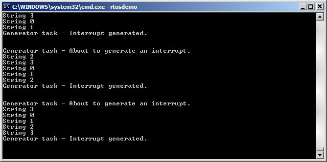
***图 7.12*** *示例 7.4 运行输出*

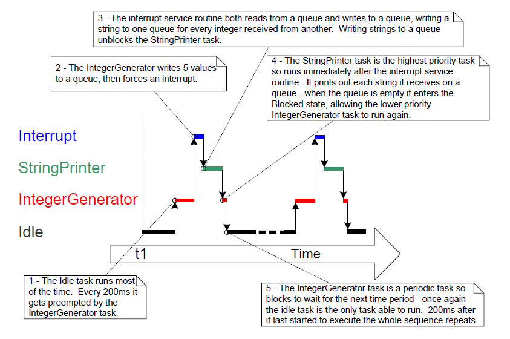
***图 7.13*** *示例 7.4 生成的执行时序*
* * *


## 7.8 中断嵌套

任务优先级与中断优先级经常被混淆。本节讨论的是“中断彼此之间”的优先级，也就是各 `ISR` 的相对执行优先关系。任务优先级与中断优先级没有直接关系：任务何时运行由软件决定；`ISR` 何时运行由硬件决定。硬件中断会打断任务，但任务不能抢占 `ISR`。

支持中断嵌套的端口需要在 `FreeRTOSConfig.h` 中定义以下一个或两个常量：`configMAX_SYSCALL_INTERRUPT_PRIORITY` 与 `configMAX_API_CALL_INTERRUPT_PRIORITY`。两者表达的是同一属性：老端口常用前者，新端口常用后者。

**控制中断嵌套的常量**

- `configMAX_SYSCALL_INTERRUPT_PRIORITY` 或 `configMAX_API_CALL_INTERRUPT_PRIORITY`

  设定“可调用中断安全 `FreeRTOS API`”的最高中断优先级。

- `configKERNEL_INTERRUPT_PRIORITY`

  设定节拍中断使用的优先级，且必须始终设为“最低可能中断优先级”。

  若所用端口不使用 `configMAX_SYSCALL_INTERRUPT_PRIORITY`，则所有会调用中断安全 `FreeRTOS API` 的中断都必须运行在 `configKERNEL_INTERRUPT_PRIORITY` 指定的优先级。

每个中断源既有“数值优先级”，也有“逻辑优先级”：

- 数值优先级

  数值优先级就是分配给中断的数字。例如分配为 7，则其数值优先级是 7；分配为 200，则数值优先级是 200。

- 逻辑优先级

  逻辑优先级描述该中断相对于其他中断的先后关系。

  若两个不同优先级中断同时发生，处理器会先执行“逻辑优先级更高”的 `ISR`，再执行“逻辑优先级更低”的 `ISR`。

  一个中断可打断（嵌套）任何逻辑优先级低于它的中断，但不能打断逻辑优先级与它相同或更高的中断。

“数值优先级”和“逻辑优先级”的对应关系由处理器体系结构决定：某些处理器上数值越大逻辑越高；另一些处理器上则数值越大逻辑越低。

当把 `configMAX_SYSCALL_INTERRUPT_PRIORITY` 设置为“逻辑上高于 `configKERNEL_INTERRUPT_PRIORITY`”时，可形成完整中断嵌套模型。图 7.14 展示了一个示例场景：

- 处理器有 7 个不同中断优先级。
- 中断若被分配数值优先级 7，其逻辑优先级高于数值优先级 1 的中断。
- `configKERNEL_INTERRUPT_PRIORITY` 设为 1。
- `configMAX_SYSCALL_INTERRUPT_PRIORITY` 设为 3。


<a name="fig7.14" title="图 7.14 影响中断嵌套行为的常量"></a>

* * *
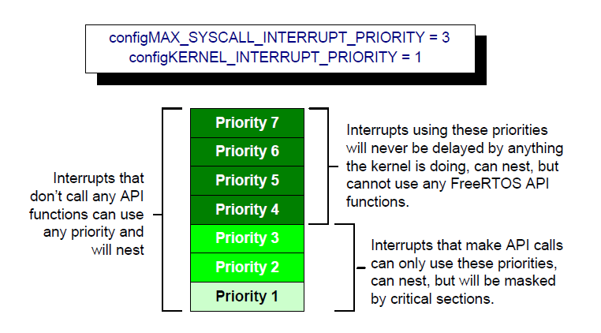
***图 7.14*** *影响中断嵌套行为的常量*
* * *

结合图 7.14：

- 使用优先级 1 到 3（含）的中断，在内核或应用处于临界区时会被禁止执行。运行在这些优先级的 `ISR` 可调用中断安全 `FreeRTOS API`。临界区将在第 8 章介绍。

- 使用优先级 4 及以上的中断不受临界区影响，因此在硬件能力允许范围内，调度器行为不会阻止其立即执行。运行在这些优先级的 `ISR` 不能调用任何 `FreeRTOS API`。

- 对时序精度要求极高的功能（如电机控制）通常会使用高于 `configMAX_SYSCALL_INTERRUPT_PRIORITY` 的优先级，以避免调度器给中断响应时间引入抖动。


### 7.8.1 给 `ARM Cortex-M`[^22] 与 `ARM GIC` 用户的说明

[^22]: 本节仅部分适用于 `Cortex-M0` 与 `Cortex-M0+` 内核。

`Cortex-M` 处理器上的中断配置容易让人困惑，也容易出错。为便于开发，`FreeRTOS` 的 `Cortex-M` 端口会自动检查中断配置，但前提是定义了 `configASSERT()`。`configASSERT()` 见第 11.2 节。

`ARM Cortex` 内核和 `ARM GIC`（通用中断控制器）采用“数值越小，逻辑优先级越高”的规则。这与直觉相反，且容易遗忘。若希望中断逻辑优先级低，就要给它较大的数值；若希望逻辑优先级高，就要给它较小的数值。

`Cortex-M` 中断控制器最多允许用 8 位表示每个中断优先级，因此最低优先级可到 255，最高优先级是 0。但多数 `Cortex-M` 微控制器只实现了这 8 位中的一部分，具体实现位数取决于芯片系列。

当只实现了部分位时，只有字节高位（最高有效位）可用，低位（最低有效位）未实现。未实现位可为任意值，但通常置为 1。图 7.15 展示了一个实现了 4 位优先级的 `Cortex-M` 微控制器如何存储二进制优先级 `101`。


<a name="fig7.15" title="图 7.15 在实现 4 位优先级的 Cortex-M 上如何存储二进制 101"></a>

* * *
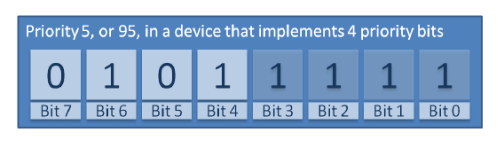
***图 7.15*** *在实现 4 位优先级的 `Cortex-M` 上如何存储二进制 `101`*
* * *

在图 7.15 中，二进制 `101` 被左移到最高 4 位，因为最低 4 位未实现；未实现位被置为 1。

某些库函数要求“已左移到已实现位”的优先级值。对图 7.15 示例而言，应填写十进制 95。十进制 95 可理解为：二进制 `101` 左移 4 位得到 `101nnnn`（`n` 为未实现位），再将未实现位设为 1，得到 `1011111`。

某些库函数要求“尚未左移”的优先级值。对图 7.15 示例而言，应填写十进制 5，即未经左移的二进制 `101`。

`configMAX_SYSCALL_INTERRUPT_PRIORITY` 与 `configKERNEL_INTERRUPT_PRIORITY` 必须采用“可直接写入 `Cortex-M` 寄存器”的形式，因此应使用“已左移到实现位后”的值。

`configKERNEL_INTERRUPT_PRIORITY` 必须始终设置为“最低可能中断优先级”。未实现位可置为 1，因此无论实际实现了多少优先级位，该常量都可设为 255。

`Cortex-M` 中断默认优先级是 0（最高优先级）。而 `Cortex-M` 硬件实现不允许把 `configMAX_SYSCALL_INTERRUPT_PRIORITY` 设为 0，所以凡是需要调用 `FreeRTOS API` 的中断，优先级都不能保持默认值。
