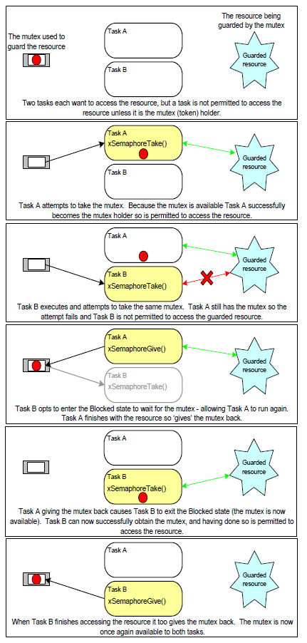
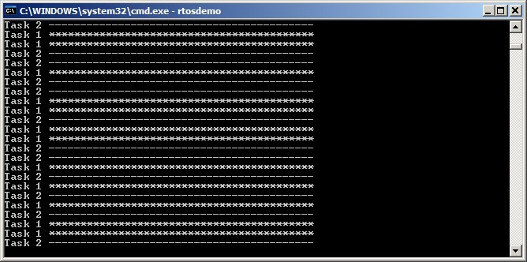
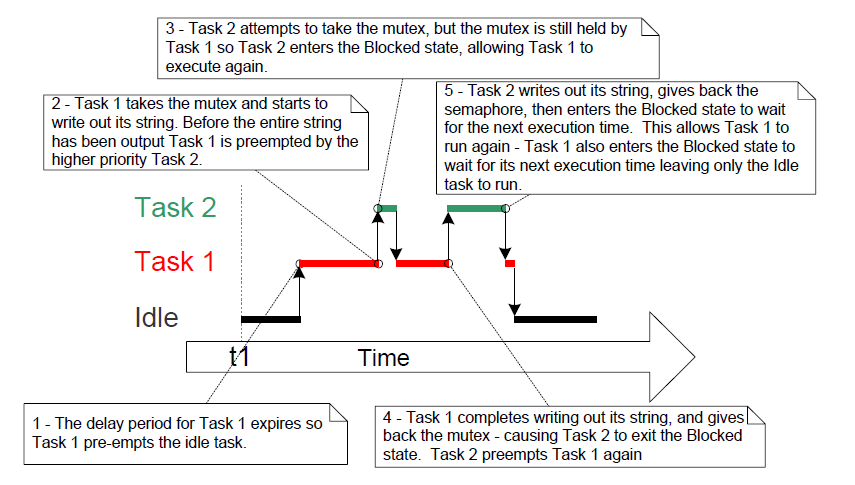
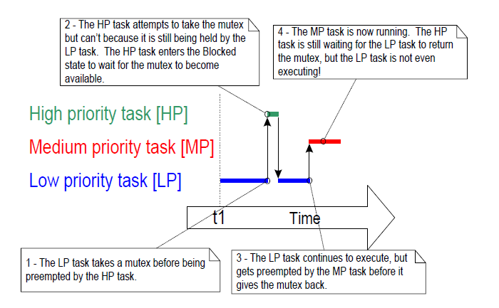
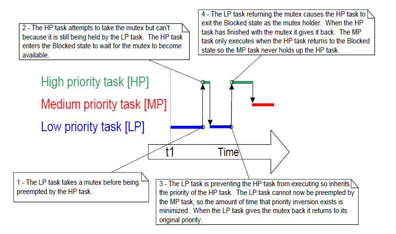
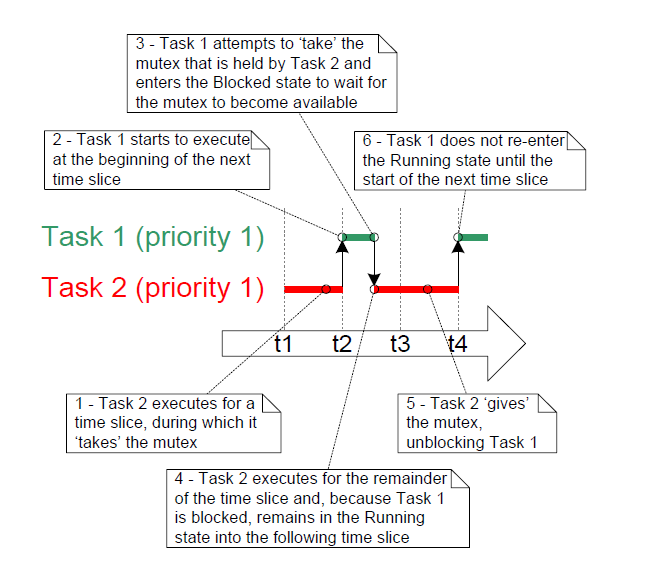
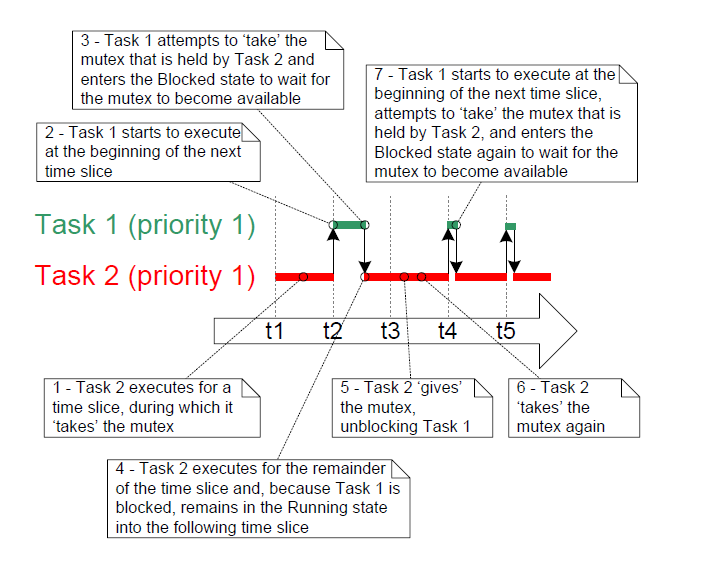
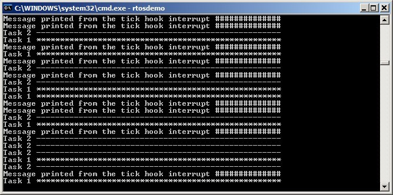

# 8 资源管理

## 8.1 本章介绍与范围

在多任务系统中，如果某个任务开始访问资源后，在完成访问之前就离开运行态，就可能出错。若该任务离开时把资源留在不一致状态，那么其他任务或中断再访问同一资源时，可能造成数据损坏或类似问题。

下面给出一些示例：

* 访问外设

  考虑两个任务同时尝试向液晶显示器（`LCD`）写数据的场景：

  1. 任务 A 开始运行，准备向 `LCD` 输出字符串 “Hello world”。

  2. 任务 A 仅输出到 “Hello w” 时被任务 B 抢占。

  3. 任务 B 在进入阻塞态前向 `LCD` 输出 “Abort, Retry, Fail?”。

  4. 任务 A 从被抢占处继续运行，输出剩余字符 “orld”。

  此时 `LCD` 上显示将被破坏为 “Hello wAbort, Retry, Fail?orld”。

* 读—改—写操作

  清单 8.1 展示了一行 `C` 代码及其常见汇编翻译方式。可以看到：先把 `PORTA` 从内存读入寄存器，再在寄存器中修改，最后写回内存。这就是“读—改—写”操作。


	<a name="list8.1" title="清单 8.1 读—改—写序列示例"></a>

	```c
	/* The C code being compiled. */
	PORTA |= 0x01;

	/* The assembly code produced when the C code is compiled. */
	LOAD  R1,[#PORTA] ; Read a value from PORTA into R1
	MOVE  R2,#0x01    ; Move the absolute constant 1 into R2
	OR    R1,R2       ; Bitwise OR R1 (PORTA) with R2 (constant 1)
	STORE R1,[#PORTA] ; Store the new value back to PORTA
	```
	***清单 8.1*** *读—改—写序列示例*
 
	该操作并非“原子操作”，因为需要多条指令完成，期间可能被打断。考虑两个任务都要更新内存映射寄存器 `PORTA` 的场景：

	1. 任务 A 把 `PORTA` 读入寄存器（完成“读”阶段）。

	2. 任务 A 在执行“改”和“写”前被任务 B 抢占。

	3. 任务 B 更新 `PORTA`，随后进入阻塞态。

	4. 任务 A 从被抢占处继续运行，修改自己寄存器中旧的 `PORTA` 副本，再写回 `PORTA`。

	在此场景中，任务 A 写回的是过期值。任务 B 对 `PORTA` 的修改发生在“任务 A 读取 `PORTA`”与“任务 A 写回 `PORTA`”之间。最终任务 A 的写回覆盖了任务 B 的修改，造成 `PORTA` 值损坏。

	该例使用外设寄存器说明问题，但同样原理也适用于变量上的读—改—写操作。

- 对变量的非原子访问

  更新一个结构体的多个成员，或在字长较小架构上更新更大位宽变量（例如在 16 位机器上更新 32 位变量），都属于非原子操作。若中途被打断，可能导致数据丢失或损坏。

- 函数可重入性

  若函数可被多个任务，或被任务与中断并发调用且仍然安全，则称该函数“可重入（`reentrant`）”。可重入函数也常称“线程安全（`thread safe`）”，即可以被多个执行线程访问而不导致数据或逻辑损坏。

  每个任务都维护自己的栈和处理器（硬件）寄存器值集合。若函数只访问栈上或寄存器中的数据，不访问共享状态，则该函数是可重入且线程安全的。清单 8.2 给出可重入函数示例，清单 8.3 给出不可重入函数示例。
  
  若应用使用 `newlib C` 库，必须在 `FreeRTOSConfig.h` 中将 `configUSE_NEWLIB_REENTRANT` 设为 `1`，以确保 `newlib` 所需线程局部存储正确分配。

  若应用使用 `picolibc C` 库，必须在 `FreeRTOSConfig.h` 中将 `configUSE_PICOLIBC_TLS` 设为 `1`，以确保 `picolibc` 所需线程局部存储正确分配。

  若应用使用其他需要线程局部存储（`TLS`）的 `C` 库，则必须在 `FreeRTOSConfig.h` 中将 `configUSE_C_RUNTIME_TLS_SUPPORT` 设为 `1`，并实现下列宏：
  - `configTLS_BLOCK_TYPE`：每任务 `TLS` 块类型。
  - `configINIT_TLS_BLOCK`：初始化每任务 `TLS` 块。
  - `configSET_TLS_BLOCK`：切换当前 `TLS` 块。在上下文切换期间调用，以确保使用正确 `TLS` 块。
  - `configDEINIT_TLS_BLOCK`：释放 `TLS` 块。


  <a name="list8.2" title="清单 8.2 可重入函数示例"></a>

  ```c
  /* A parameter is passed into the function. This will either be passed on the 
	  stack, or in a processor register. Either way is safe as each task or 
	  interrupt that calls the function maintains its own stack and its own set 
	  of register values, so each task or interrupt that calls the function will 
	  have its own copy of lVar1. */
  long lAddOneHundred( long lVar1 )
  {
		/* This function scope variable will also be allocated to the stack or a 
			register, depending on the compiler and optimization level. Each task
			or interrupt that calls this function will have its own copy of lVar2. */
		long lVar2;

		lVar2 = lVar1 + 100;
		return lVar2;
  }
  ```
  ***清单 8.2*** *可重入函数示例*


  <a name="list8.3" title="清单 8.3 不可重入函数示例"></a>

  ```c
  /* In this case lVar1 is a global variable, so every task that calls
	  lNonsenseFunction will access the same single copy of the variable. */
  long lVar1;

  long lNonsenseFunction( void )
  {
		/* lState is static, so is not allocated on the stack. Each task that
			calls this function will access the same single copy of the variable. */
		static long lState = 0;
		long lReturn;

		switch( lState )
		{
			 case 0 : lReturn = lVar1 + 10;
						 lState = 1;
						 break;

			 case 1 : lReturn = lVar1 + 20;
						 lState = 0;
						 break;
		}
  }
  ```
  ***清单 8.3*** *不可重入函数示例*


### 8.1.1 互斥

要始终保持数据一致性，凡是“任务间共享”或“任务与中断共享”的资源访问，都必须采用互斥技术管理。目标是：当某任务开始访问一个“不可重入、非线程安全”的共享资源后，在该资源恢复到一致状态前，该任务应拥有该资源的独占访问权。

`FreeRTOS` 提供多种实现互斥的机制。但最好的互斥方法仍是：在可能情况下（尽管常不易做到）通过系统设计避免共享资源，使每个资源只被单一任务访问。


### 8.1.2 范围

本章涵盖：

- 何时以及为什么需要资源管理与访问控制。
- 什么是临界区。
- 什么是互斥。
- 什么是挂起调度器。
- 如何使用互斥量。
- 如何创建并使用守门员任务（`Gatekeeper Task`）。
- 什么是优先级反转，以及优先级继承如何降低（但不能消除）其影响。


## 8.2 临界区与挂起调度器

### 8.2.1 基本临界区

基本临界区指由 `taskENTER_CRITICAL()` 和 `taskEXIT_CRITICAL()` 宏包围的代码区域，也称“关键区”。

`taskENTER_CRITICAL()` 与 `taskEXIT_CRITICAL()` 不接收参数，也不返回值[^23]。其用法见清单 8.4。

[^23]: 类函数宏与真实函数在“返回值”语义上并不完全相同。本书为便于理解，在合适场景下仍把宏按“像函数一样返回值”来描述。


<a name="list8.4" title="清单 8.4 使用临界区保护寄存器访问"></a>

```c
/* Ensure access to the PORTA register cannot be interrupted by placing
	it within a critical section. Enter the critical section. */
taskENTER_CRITICAL();

/* A switch to another task cannot occur between the call to
	taskENTER_CRITICAL() and the call to taskEXIT_CRITICAL(). Interrupts may
	still execute on FreeRTOS ports that allow interrupt nesting, but only
	interrupts whose logical priority is above the value assigned to the
	configMAX_SYSCALL_INTERRUPT_PRIORITY constant – and those interrupts are
	not permitted to call FreeRTOS API functions. */
PORTA |= 0x01;

/* Access to PORTA has finished, so it is safe to exit the critical section. */
taskEXIT_CRITICAL();
```
***清单 8.4*** *使用临界区保护寄存器访问*


本书配套示例工程中，使用 `vPrintString()` 向标准输出写字符串（在 `FreeRTOS Windows` 端口中即终端窗口）。`vPrintString()` 会被多个任务调用；理论上，它可像清单 8.5 一样用临界区保护标准输出访问。


<a name="list8.5" title="清单 8.5 vPrintString() 的一种可能实现"></a>

```c
void vPrintString( const char *pcString )
{
	 /* Write the string to stdout, using a critical section as a crude method of
		 mutual exclusion. */
	 taskENTER_CRITICAL();
	 {
		  printf( "%s", pcString );
		  fflush( stdout );
	 }
	 taskEXIT_CRITICAL();
}
```
***清单 8.5*** *`vPrintString()` 的一种可能实现*


这种方式实现的临界区是较粗糙的互斥方法。它通过关闭中断（完全关闭或关闭到 `configMAX_SYSCALL_INTERRUPT_PRIORITY`，取决于端口）实现保护。由于抢占式任务切换只能在中断中发生，因此只要中断保持关闭，调用 `taskENTER_CRITICAL()` 的任务就必然保持运行态，直到退出临界区。

基本临界区必须非常短，否则会显著恶化中断响应时间。每次 `taskENTER_CRITICAL()` 必须与一次 `taskEXIT_CRITICAL()` 紧密配对。因此，不应像清单 8.5 那样用临界区保护标准输出——向终端写数据可能耗时较长。本章后续会给出替代方案。

临界区可安全嵌套，因为内核会记录嵌套深度。只有当嵌套深度回到零（即每个 `taskENTER_CRITICAL()` 都有对应的 `taskEXIT_CRITICAL()`）时才真正退出临界区。

对任务而言，改变处理器中断使能状态的唯一合法方式就是调用 `taskENTER_CRITICAL()` 与 `taskEXIT_CRITICAL()`。若以其他方式改动中断使能状态，会破坏该宏维护的嵌套计数。

`taskENTER_CRITICAL()` 与 `taskEXIT_CRITICAL()` 名称不含 `FromISR`，因此不能在 `ISR` 中调用。`taskENTER_CRITICAL_FROM_ISR()` 是 `taskENTER_CRITICAL()` 的中断安全版本，`taskEXIT_CRITICAL_FROM_ISR()` 是 `taskEXIT_CRITICAL()` 的中断安全版本。这两个版本仅在“支持中断嵌套”的端口中提供——对不支持嵌套的端口它们并无必要。

`taskENTER_CRITICAL_FROM_ISR()` 会返回一个值，必须传给与之匹配的 `taskEXIT_CRITICAL_FROM_ISR()` 调用。见清单 8.6。


<a name="list8.6" title="清单 8.6 在中断服务程序中使用临界区"></a>

```c
void vAnInterruptServiceRoutine( void )
{
	 /* Declare a variable in which the return value from 
		 taskENTER_CRITICAL_FROM_ISR() will be saved. */
	 UBaseType_t uxSavedInterruptStatus;

	 /* This part of the ISR can be interrupted by any higher priority 
		 interrupt. */

	 /* Use taskENTER_CRITICAL_FROM_ISR() to protect a region of this ISR.
		 Save the value returned from taskENTER_CRITICAL_FROM_ISR() so it can 
		 be passed into the matching call to taskEXIT_CRITICAL_FROM_ISR(). */
	 uxSavedInterruptStatus = taskENTER_CRITICAL_FROM_ISR();

	 /* This part of the ISR is between the call to 
		 taskENTER_CRITICAL_FROM_ISR() and taskEXIT_CRITICAL_FROM_ISR(), so can 
		 only be interrupted by interrupts that have a priority above that set 
		 by the configMAX_SYSCALL_INTERRUPT_PRIORITY constant. */

	 /* Exit the critical section again by calling taskEXIT_CRITICAL_FROM_ISR(),
		 passing in the value returned by the matching call to 
		 taskENTER_CRITICAL_FROM_ISR(). */
	 taskEXIT_CRITICAL_FROM_ISR( uxSavedInterruptStatus );

	 /* This part of the ISR can be interrupted by any higher priority 
		 interrupt. */
}
```
***清单 8.6*** *在中断服务程序中使用临界区*


若进入/退出临界区所花处理时间，比受保护代码本身还长，就得不偿失。基本临界区进入快、退出快、且确定性高，因此非常适合保护极短代码段。


### 8.2.2 挂起（或锁定）调度器

还可通过挂起调度器来创建临界区。挂起调度器也常称“锁定调度器”。

基本临界区可防止“其他任务与中断”访问受保护区域；而通过挂起调度器实现的临界区，只能防止“其他任务”访问，因为中断仍保持使能。

若某段临界区过长，不适合简单地关中断，可考虑用挂起调度器实现。不过，在调度器挂起期间若中断活跃，恢复（解挂）调度器可能变成较耗时操作，因此每个场景都需权衡最优方法。


### 8.2.3 `vTaskSuspendAll()` `API` 函数


<a name="list8.7" title="清单 8.7 vTaskSuspendAll() API 函数原型"></a>

```c
void vTaskSuspendAll( void );
```
***清单 8.7*** *`vTaskSuspendAll()` `API` 函数原型*


调用 `vTaskSuspendAll()` 可挂起调度器。挂起后不会发生上下文切换，但中断仍可执行。若某中断在调度器挂起期间请求切换，该请求会被挂起，直到调度器恢复后才执行。

调度器挂起期间不得调用 `FreeRTOS API` 函数。


### 8.2.4 `xTaskResumeAll()` `API` 函数


<a name="list8.8" title="清单 8.8 xTaskResumeAll() API 函数原型"></a>

```c
BaseType_t xTaskResumeAll( void );
```
***清单 8.8*** *`xTaskResumeAll()` `API` 函数原型*


调用 `xTaskResumeAll()` 可恢复（解挂）调度器。

**`xTaskResumeAll()` 返回值**

- 返回值

  在调度器挂起期间产生的上下文切换请求会被延后，并在恢复过程中执行。若 `xTaskResumeAll()` 返回前执行了待处理切换，则返回 `pdTRUE`；否则返回 `pdFALSE`。

`vTaskSuspendAll()` 与 `xTaskResumeAll()` 可安全嵌套，因为内核会维护嵌套深度。只有当深度回到 0（即每次 `vTaskSuspendAll()` 都有对应 `xTaskResumeAll()`）时调度器才真正恢复。

清单 8.9 给出了 `vPrintString()` 的实际实现：通过挂起调度器来保护终端输出访问。


<a name="list8.9" title="清单 8.9 vPrintString() 实现"></a>

```c
void vPrintString( const char *pcString )
{
	 /* Write the string to stdout, suspending the scheduler as a method of 
		 mutual exclusion. */
	 vTaskSuspendScheduler();
	 {
		  printf( "%s", pcString );
		  fflush( stdout );
	 }
	 xTaskResumeScheduler();
}
```
***清单 8.9*** *`vPrintString()` 实现*


## 8.3 互斥量（以及二值信号量）

互斥量（`Mutex`）是一种特殊的二值信号量，用于控制两个或多个任务对共享资源的访问。`MUTEX` 一词来自 `MUTual EXclusion`。要启用互斥量，需在 `FreeRTOSConfig.h` 中将 `configUSE_MUTEXES` 设为 `1`。

在互斥场景中，可把互斥量看作“与共享资源绑定的令牌”。任务若要合法访问资源，必须先成功 `take` 该令牌（成为持有者）。持有者使用完资源后必须 `give` 归还令牌。只有令牌归还后，其他任务才能成功获取令牌并安全访问同一资源。未持有令牌的任务不应访问该共享资源。图 8.1 展示了该机制。

尽管互斥量与二值信号量有许多共性，但图 8.1（互斥）与图 7.6（同步）场景本质不同。关键差异在于“获取信号量后如何处理”：

- 用于互斥的信号量必须归还。
- 用于同步的信号量通常被消费掉而不归还。


<a name="fig8.1" title="图 8.1 使用互斥量实现互斥"></a>

* * *
   
***图 8.1*** *使用互斥量实现互斥*
* * *

这一机制依赖应用编写者的自律。技术上任务随时都可直接访问资源，但各任务“约定”只有在持有互斥量时才这样做。


### 8.3.1 `xSemaphoreCreateMutex()` `API` 函数

`FreeRTOS` 还提供 `xSemaphoreCreateMutexStatic()`，可在编译期静态分配创建互斥量所需内存。互斥量本质是信号量的一种。所有类型的 `FreeRTOS` 信号量句柄都由 `SemaphoreHandle_t` 类型变量保存。

互斥量必须先创建再使用。创建互斥量可调用 `xSemaphoreCreateMutex()`。


<a name="list8.10" title="清单 8.10 xSemaphoreCreateMutex() API 函数原型"></a>

```c
SemaphoreHandle_t xSemaphoreCreateMutex( void );
```
***清单 8.10*** *`xSemaphoreCreateMutex()` `API` 函数原型*


**`xSemaphoreCreateMutex()` 返回值**

- 返回值

  若返回 `NULL`，表示堆内存不足，`FreeRTOS` 无法分配互斥量数据结构。第 3 章提供更多堆内存管理信息。

  若返回非 `NULL`，表示互斥量创建成功。该值应保存为所创建互斥量句柄。


<a name="example8.1" title="示例 8.1 使用信号量重写 vPrintString()"></a>
---
***示例 8.1*** *使用信号量重写 `vPrintString()`*

---

本示例创建 `vPrintString()` 的新版本 `prvNewPrintString()`，并在多个任务中调用。`prvNewPrintString()` 与 `vPrintString()` 功能相同，但它通过互斥量而不是锁定调度器来控制标准输出访问。实现见清单 8.11。


<a name="list8.11" title="清单 8.11 prvNewPrintString() 实现"></a>

```c
static void prvNewPrintString( const char *pcString )
{
	 /* The mutex is created before the scheduler is started, so already exists
		 by the time this task executes.

		 Attempt to take the mutex, blocking indefinitely to wait for the mutex
		 if it is not available straight away. The call to xSemaphoreTake() will
		 only return when the mutex has been successfully obtained, so there is 
		 no need to check the function return value. If any other delay period 
		 was used then the code must check that xSemaphoreTake() returns pdTRUE 
		 before accessing the shared resource (which in this case is standard 
		 out). As noted earlier in this book, indefinite time outs are not 
		 recommended for production code. */
	 xSemaphoreTake( xMutex, portMAX_DELAY );
	 {
		  /* The following line will only execute once the mutex has been 
			  successfully obtained. Standard out can be accessed freely now as 
			  only one task can have the mutex at any one time. */
		  printf( "%s", pcString );
		  fflush( stdout );

		  /* The mutex MUST be given back! */
	 }
	 xSemaphoreGive( xMutex );
}
```
***清单 8.11*** *`prvNewPrintString()` 实现*


`prvNewPrintString()` 由 `prvPrintTask()` 实现的任务反复调用，两份任务实例都运行该代码，并在每次调用间插入随机延时。任务参数用于向每个任务实例传入不同字符串。`prvPrintTask()` 实现见清单 8.12。


<a name="list8.12" title="清单 8.12 示例 8.1 中 prvPrintTask() 实现"></a>

```c
static void prvPrintTask( void *pvParameters )
{
	 char *pcStringToPrint;
	 const TickType_t xMaxBlockTimeTicks = 0x20;

	 /* Two instances of this task are created. The string printed by the task 
		 is passed into the task using the task's parameter. The parameter is 
		 cast to the required type. */
	 pcStringToPrint = ( char * ) pvParameters;

	 for( ;; )
	 {
		  /* Print out the string using the newly defined function. */
		  prvNewPrintString( pcStringToPrint );

		  /* Wait a pseudo random time. Note that rand() is not necessarily
			  reentrant, but in this case it does not really matter as the code 
			  does not care what value is returned. In a more secure application 
			  a version of rand() that is known to be reentrant should be used - 
			  or calls to rand() should be protected using a critical section. */
		  vTaskDelay( ( rand() % xMaxBlockTimeTicks ) );
	 }
}
```
***清单 8.12*** *示例 8.1 中 `prvPrintTask()` 实现*


如常规流程，`main()` 只需创建互斥量、创建任务、启动调度器，见清单 8.13。

示例中两个 `prvPrintTask()` 实例优先级不同，因此低优先级任务有时会被高优先级任务抢占。由于使用互斥量保证任务对终端访问互斥，即便发生抢占，输出字符串也不会被破坏。减小 `xMaxBlockTimeTicks` 可提高抢占发生频率。

将示例 8.1 运行在 `FreeRTOS Windows` 端口时需注意：

- 调用 `printf()` 会触发 `Windows` 系统调用，而系统调用不受 `FreeRTOS` 控制，可能引入不稳定性。

- `Windows` 系统调用执行方式决定了：即便不使用互斥量，也较少看到字符串明显损坏。


<a name="list8.13" title="清单 8.13 示例 8.1 的 main() 实现"></a>

```c
int main( void )
{
	 /* Before a semaphore is used it must be explicitly created. In this
		 example a mutex type semaphore is created. */
	 xMutex = xSemaphoreCreateMutex();

	 /* Check the semaphore was created successfully before creating the
		 tasks. */
	 if( xMutex != NULL )
	 {
		  /* Create two instances of the tasks that write to stdout. The string
			  they write is passed in to the task as the task's parameter. The 
			  tasks are created at different priorities so some pre-emption will 
			  occur. */
		  xTaskCreate( prvPrintTask, "Print1", 1000,
							"Task 1 ***************************************\r\n",
							1, NULL );

		  xTaskCreate( prvPrintTask, "Print2", 1000,
							"Task 2 ---------------------------------------\r\n", 
							2, NULL );

		  /* Start the scheduler so the created tasks start executing. */
		  vTaskStartScheduler();
	 }

	 /* If all is well then main() will never reach here as the scheduler will
		 now be running the tasks. If main() does reach here then it is likely 
		 that there was insufficient heap memory available for the idle task to 
		 be created.  Chapter 3 provides more information on heap memory 
		 management. */
	 for( ;; );
}
```
***清单 8.13*** *示例 8.1 的 `main()` 实现*


示例 8.1 输出见图 8.2。图 8.3 给出了一个可能的执行时序。

<a name="fig8.2" title="图 8.2 示例 8.1 运行输出"></a>

* * *
   
***图 8.2*** *示例 8.1 运行输出*
* * *

图 8.2 可见，终端字符串没有损坏，符合预期。输出先后顺序随机，源于任务使用了随机延时。


<a name="fig8.3" title="图 8.3 示例 8.1 的一种可能执行时序"></a>

* * *
   
***图 8.3*** *示例 8.1 的一种可能执行时序*
* * *


### 8.3.2 优先级反转

图 8.3 也展示了使用互斥量互斥访问时的一个潜在陷阱：高优先级任务 2 需要等待低优先级任务 1 释放互斥量。高优先级任务被低优先级任务延迟的现象称为“优先级反转”。

如果此时又有一个中等优先级任务开始执行，问题会更严重：高优先级任务在等待低优先级任务，而低优先级任务又可能被中优先级任务持续压住无法运行。该情况常称“无界优先级反转”，因为中优先级任务可能无限期阻塞高低两个任务。图 8.4 展示了这一最坏场景。


<a name="fig8.4" title="图 8.4 最坏情况下的优先级反转"></a>

* * *
   
***图 8.4*** *最坏情况下的优先级反转*
* * *

优先级反转可能是严重问题，但在小型嵌入式系统中，常可在系统设计阶段通过合理规划资源访问来避免。


### 8.3.3 优先级继承

`FreeRTOS` 互斥量与二值信号量非常相似，差别在于：互斥量带基础“优先级继承”机制，而二值信号量不带。优先级继承用于减轻优先级反转负面影响。它并不能“修复”优先级反转，只是把反转约束为有界时间。但优先级继承会增加时序分析复杂度，因此不应依赖它来保证系统正确性。

优先级继承的工作方式是：当高优先级任务等待某互斥量时，临时把当前互斥量持有者提升到该等待任务的优先级。即低优先级持有者“继承”了等待者优先级。图 8.5 展示了该过程。持有者释放互斥量后，其优先级会自动恢复为原值。


<a name="fig8.5" title="图 8.5 优先级继承降低优先级反转影响"></a>

* * *
   
***图 8.5*** *优先级继承降低优先级反转影响*
* * *

如上所示，优先级继承会影响正在使用互斥量的任务优先级，因此互斥量不能在 `ISR` 中使用。

`FreeRTOS` 实现的是“基础版优先级继承”，设计重点是优化空间和执行开销。完整优先级继承机制需要更多数据和处理周期，尤其在任务同时持有多个互斥量时，要实时计算继承优先级会更复杂。

关于该机制，需要记住以下行为：
* 若任务在未释放已持有互斥量前又获取了新互斥量，其继承优先级可能继续提升。
* 任务会保持在“其获得过的最高继承优先级”，直到它释放手中所有互斥量，与释放顺序无关。
* 当任务持有多个互斥量时，即便某些等待者已超时或不再等待，只要仍持有多个互斥量，任务仍会保持最高继承优先级。


### 8.3.4 死锁（或“致命拥抱”）

使用互斥量还有另一个陷阱：死锁。死锁有时也被称作更形象的“致命拥抱”。

死锁发生在两个任务都无法继续执行，因为它们各自在等待对方持有的资源。考虑任务 A 与任务 B 都需要同时获取互斥量 X 和互斥量 Y 才能完成某操作的场景：

1. 任务 A 运行并成功获取互斥量 X。

2. 任务 A 被任务 B 抢占。

3. 任务 B 成功获取互斥量 Y，然后尝试获取互斥量 X；但 X 被任务 A 持有，任务 B 进入阻塞态等待 X。

4. 任务 A 继续运行，尝试获取互斥量 Y；但 Y 被任务 B 持有，任务 A 进入阻塞态等待 Y。

场景结束时，任务 A 等任务 B 的锁，任务 B 等任务 A 的锁，二者都无法推进，死锁发生。

与优先级反转一样，避免死锁的最佳方法是在设计阶段评估并消除潜在死锁路径。尤其是，本书前文已强调：任务无限期等待（无超时）获取互斥量通常不是好实践。应设置一个略大于“正常最大等待时间”的超时值——若超时仍未拿到锁，通常意味着设计存在问题，可能就是死锁。

在实践中，小型嵌入式系统中死锁通常不是大问题，因为系统设计者往往能较完整掌握全局并提前规避。


### 8.3.5 递归互斥量

任务也可能“与自己死锁”。当任务在未归还互斥量前再次获取同一互斥量时，就会发生。考虑以下场景：

1. 任务成功获取某互斥量。

2. 持锁期间，任务调用某库函数。

3. 该库函数实现里又尝试获取同一互斥量，并进入阻塞态等待其可用。

最终该任务阻塞等待“自己释放自己持有的锁”，因此发生死锁。

这种死锁可通过“递归互斥量”避免。与标准互斥量不同，同一任务可多次 `take` 递归互斥量；只有当 `give` 调用次数与此前 `take` 次数完全匹配后，互斥量才真正被归还。

标准互斥量与递归互斥量的创建与使用方式对比如下：

- 标准互斥量用 `xSemaphoreCreateMutex()` 创建；递归互斥量用 `xSemaphoreCreateRecursiveMutex()` 创建。二者函数原型一致。

- 标准互斥量用 `xSemaphoreTake()` 获取；递归互斥量用 `xSemaphoreTakeRecursive()` 获取。二者函数原型一致。

- 标准互斥量用 `xSemaphoreGive()` 归还；递归互斥量用 `xSemaphoreGiveRecursive()` 归还。二者函数原型一致。

清单 8.14 演示了递归互斥量的创建与使用。


<a name="list8.14" title="清单 8.14 创建并使用递归互斥量"></a>

```c
/* Recursive mutexes are variables of type SemaphoreHandle_t. */
SemaphoreHandle_t xRecursiveMutex;

/* The implementation of a task that creates and uses a recursive mutex. */
void vTaskFunction( void *pvParameters )
{
	 const TickType_t xMaxBlock20ms = pdMS_TO_TICKS( 20 );

	 /* Before a recursive mutex is used it must be explicitly created. */
	 xRecursiveMutex = xSemaphoreCreateRecursiveMutex();

	 /* Check the semaphore was created successfully. configASSERT() is 
		 described in section 11.2. */
	 configASSERT( xRecursiveMutex );

	 /* As per most tasks, this task is implemented as an infinite loop. */
	 for( ;; )
	 {
		  /* ... */

		  /* Take the recursive mutex. */
		  if( xSemaphoreTakeRecursive( xRecursiveMutex, xMaxBlock20ms ) == pdPASS )
		  {
				/* The recursive mutex was successfully obtained. The task can now
					access the resource the mutex is protecting. At this point the 
					recursive call count (which is the number of nested calls to 
					xSemaphoreTakeRecursive()) is 1, as the recursive mutex has 
					only been taken once. */

				/* While it already holds the recursive mutex, the task takes the 
					mutex again. In a real application, this is only likely to occur
					inside a sub-function called by this task, as there is no 
					practical reason to knowingly take the same mutex more than 
					once. The calling task is already the mutex holder, so the 
					second call to xSemaphoreTakeRecursive() does nothing more than
					increment the recursive call count to 2. */
				xSemaphoreTakeRecursive( xRecursiveMutex, xMaxBlock20ms );

				/* ... */

				/* The task returns the mutex after it has finished accessing the
					resource the mutex is protecting. At this point the recursive 
					call count is 2, so the first call to xSemaphoreGiveRecursive()
					does not return the mutex. Instead, it simply decrements the 
					recursive call count back to 1. */
				xSemaphoreGiveRecursive( xRecursiveMutex );

				/* The next call to xSemaphoreGiveRecursive() decrements the 
					recursive call count to 0, so this time the recursive mutex is 
					returned. */
				xSemaphoreGiveRecursive( xRecursiveMutex );

				/* Now one call to xSemaphoreGiveRecursive() has been executed for
					every proceeding call to xSemaphoreTakeRecursive(), so the task
					is no longer the mutex holder. */
		  }
	 }
}
```
***清单 8.14*** *创建并使用递归互斥量*


### 8.3.6 互斥量与任务调度

若不同优先级任务使用同一互斥量，`FreeRTOS` 调度策略能明确执行顺序：可运行任务中优先级最高者进入运行态。举例：若高优先级任务阻塞等待某个由低优先级任务持有的互斥量，那么低优先级任务一旦归还互斥量，高优先级任务就会抢占并成为新持有者。这一场景已在图 8.5 出现。

但在“任务优先级相同”时，常有人误判执行顺序。若任务 1 与任务 2 同优先级，且任务 1 阻塞等待任务 2 持有的互斥量，那么任务 2 在 `give` 该互斥量后，任务 1 不会立刻抢占任务 2。任务 2 继续保持运行态，任务 1 只是从阻塞态转为就绪态。图 8.6 展示了该场景（图中竖线表示节拍中断时刻）。


<a name="fig8.6" title="图 8.6 同优先级任务共享同一互斥量时的一种可能执行序列"></a>

* * *
   
***图 8.6*** *同优先级任务共享同一互斥量时的一种可能执行序列*
* * *

在图 8.6 场景中，调度器不会在互斥量一可用就立刻让任务 1 进入运行态，原因是：

- 任务 1 与任务 2 同优先级。因此在任务 2 未进入阻塞态前，按规则应等到下一次节拍中断才切换到任务 1（假设 `FreeRTOSConfig.h` 中 `configUSE_TIME_SLICING` 为 `1`）。

- 若任务在紧密循环中频繁使用互斥量，并在每次 `give` 时都立即发生切换，则每次运行片段会很短。多个任务在同一互斥量上紧密竞争时，系统将浪费大量时间在频繁切换上。

若有多个同优先级任务在紧密循环中使用同一互斥量，需要额外注意保证各任务获得大致均衡的处理器时间。图 8.7 展示了一个可能导致不均衡的执行序列：假设创建了两个清单 8.15 所示任务实例，且它们优先级相同。


<a name="list8.15" title="清单 8.15 在紧密循环中使用互斥量的任务"></a>

```c
/* The implementation of a task that uses a mutex in a tight loop. The task 
	creates a text string in a local buffer, then writes the string to a display.
	Access to the display is protected by a mutex. */

void vATask( void *pvParameter )
{
	 extern SemaphoreHandle_t xMutex;
	 char cTextBuffer[ 128 ];

	 for( ;; )
	 {
		  /* Generate the text string – this is a fast operation. */
		  vGenerateTextInALocalBuffer( cTextBuffer );

		  /* Obtain the mutex that is protecting access to the display. */
		  xSemaphoreTake( xMutex, portMAX_DELAY );

		  /* Write the generated text to the display–this is a slow operation. */
		  vCopyTextToFrameBuffer( cTextBuffer );

		  /* The text has been written to the display, so return the mutex. */
		  xSemaphoreGive( xMutex );
	 }
}
```
***清单 8.15*** *在紧密循环中使用互斥量的任务*


清单 8.15 注释指出：构造字符串是快操作，刷新显示是慢操作。因此互斥量在显示更新期间被持有，而这段时间占任务运行时间的大头。

图 8.7 中竖线表示节拍中断时刻。


<a name="fig8.7" title="图 8.7 若两个清单 8.15 任务实例以同优先级创建，可能出现的执行序列"></a>

* * *
   
***图 8.7*** *若两个清单 8.15 任务实例以同优先级创建，可能出现的执行序列*
* * *

图 8.7 的步骤 7 显示任务 1 重新进入阻塞态——该动作发生在 `xSemaphoreTake()` 内部。

图 8.7 说明：只有当“时间片起点”恰好落在任务 2 不持有互斥量的短时间窗口内，任务 1 才能成功获取互斥量。

可在 `xSemaphoreGive()` 后增加 `taskYIELD()` 来避免该问题。清单 8.16 展示了这一做法：仅当任务持锁期间节拍计数发生变化时才调用 `taskYIELD()`。


<a name="list8.16" title="清单 8.16 让循环中使用互斥量的任务更均衡获得处理时间，同时避免过度切换"></a>

```c
void vFunction( void *pvParameter )
{
	 extern SemaphoreHandle_t xMutex;
	 char cTextBuffer[ 128 ];
	 TickType_t xTimeAtWhichMutexWasTaken;

	 for( ;; )
	 {
		  /* Generate the text string – this is a fast operation. */
		  vGenerateTextInALocalBuffer( cTextBuffer );

		  /* Obtain the mutex that is protecting access to the display. */
		  xSemaphoreTake( xMutex, portMAX_DELAY );

		  /* Record the time at which the mutex was taken. */
		  xTimeAtWhichMutexWasTaken = xTaskGetTickCount();

		  /* Write the generated text to the display–this is a slow operation. */
		  vCopyTextToFrameBuffer( cTextBuffer );

		  /* The text has been written to the display, so return the mutex. */
		  xSemaphoreGive( xMutex );

		  /* If taskYIELD() was called on each iteration then this task would
			  only ever remain in the Running state for a short period of time, 
			  and processing time would be wasted by rapidly switching between 
			  tasks. Therefore, only call taskYIELD() if the tick count changed 
			  while the mutex was held. */
		  if( xTaskGetTickCount() != xTimeAtWhichMutexWasTaken )
		  {
				taskYIELD();
		  }
	 }
}
```
***清单 8.16*** *让循环中使用互斥量的任务更均衡获得处理时间，同时避免过度切换*


## 8.4 守门员任务（`Gatekeeper Task`）

守门员任务是一种更整洁的互斥实现方式，且可避免优先级反转与死锁风险。

守门员任务指“独占某资源的任务”。只有守门员任务能直接访问该资源；其他任务若要访问，只能间接通过守门员提供的服务完成。


### 8.4.1 使用守门员任务重写 `vPrintString()`

示例 8.2 给出 `vPrintString()` 的另一种实现：由守门员任务管理标准输出访问。任务要输出消息时，不再直接调用打印函数，而是把消息发送给守门员任务。

守门员任务通过 `FreeRTOS` 队列串行化标准输出访问。由于只有它自己可以直接访问标准输出，其内部实现无需处理互斥问题。

守门员任务大部分时间处于阻塞态，等待队列消息到达。消息到达后，守门员输出该消息，然后再次阻塞等待下一条。实现见清单 8.18。

中断也可向队列发送，因此 `ISR` 同样可以借守门员任务安全地向终端输出。本示例使用节拍钩子函数每 200 个节拍输出一次消息。

节拍钩子（`tick hook` 或 `tick callback`）是在每次节拍中断期间由内核调用的函数。启用方式如下：

1.  在 `FreeRTOSConfig.h` 中将 `configUSE_TICK_HOOK` 设为 `1`。

2. 按清单 8.17 给出的“函数名与原型”提供钩子实现。


<a name="list8.17" title="清单 8.17 节拍钩子函数名称与原型"></a>

```c
void vApplicationTickHook( void );
```
***清单 8.17*** *节拍钩子函数名称与原型*


节拍钩子在节拍中断上下文执行，因此必须保持非常短小、栈占用适中，且不能调用任何不以 `FromISR()` 结尾的 `FreeRTOS API`。

节拍钩子函数之后调度器总会立即运行，因此在钩子中调用中断安全 `FreeRTOS API` 时，无需使用其 `pxHigherPriorityTaskWoken` 参数，可将该参数设为 `NULL`。


<a name="list8.18" title="清单 8.18 守门员任务"></a>

```c
static void prvStdioGatekeeperTask( void *pvParameters )
{
	 char *pcMessageToPrint;

	 /* This is the only task that is allowed to write to standard out. Any
		 other task wanting to write a string to the output does not access 
		 standard out directly, but instead sends the string to this task. As 
		 only this task accesses standard out there are no mutual exclusion or 
		 serialization issues to consider within the implementation of the task 
		 itself. */
	 for( ;; )
	 {
		  /* Wait for a message to arrive. An indefinite block time is specified
			  so there is no need to check the return value – the function will 
			  only return when a message has been successfully received. */
		  xQueueReceive( xPrintQueue, &pcMessageToPrint, portMAX_DELAY );

		  /* Output the received string. */
		  printf( "%s", pcMessageToPrint );
		  fflush( stdout );

		  /* Loop back to wait for the next message. */
	 }
}
```
***清单 8.18*** *守门员任务*


<a name="example8.2" title="示例 8.2 打印任务的替代实现"></a>
---
***示例 8.2*** *打印任务的替代实现*

---

向队列写消息的任务见清单 8.19。与前例相同，本示例创建该任务的两个实例，并通过任务参数传入各自要发送的字符串索引。

<a name="list8.19" title="示例 8.2 的打印任务实现"></a>


```c
static void prvPrintTask( void *pvParameters )
{
	 int iIndexToString;
	 const TickType_t xMaxBlockTimeTicks = 0x20;

	 /* Two instances of this task are created. The task parameter is used to 
		 pass an index into an array of strings into the task. Cast this to the
		 required type. */
	 iIndexToString = ( int ) pvParameters;

	 for( ;; )
	 {
		  /* Print out the string, not directly, but instead by passing a pointer
			  to the string to the gatekeeper task via a queue. The queue is 
			  created before the scheduler is started so will already exist by the
			  time this task executes for the first time. A block time is not 
			  specified because there should always be space in the queue. */
		  xQueueSendToBack( xPrintQueue, &( pcStringsToPrint[ iIndexToString ]), 0 );

		  /* Wait a pseudo random time. Note that rand() is not necessarily
			  reentrant, but in this case it does not really matter as the code 
			  does not care what value is returned. In a more secure application 
			  a version of rand() that is known to be reentrant should be used - 
			  or calls to rand() should be protected using a critical section. */
		  vTaskDelay( ( rand() % xMaxBlockTimeTicks ) );
	 }
}
```

***清单 8.19*** *示例 8.2 的打印任务实现*


节拍钩子函数会统计调用次数；计数达到 200 时，就把消息发送给守门员任务。仅为演示目的，钩子向队列头发送，而任务向队列尾发送。实现见清单 8.20。


<a name="list8.20" title="清单 8.20 节拍钩子实现"></a>

```c
void vApplicationTickHook( void )
{
	 static int iCount = 0;

	 /* Print out a message every 200 ticks. The message is not written out
		 directly, but sent to the gatekeeper task. */
	 iCount++;

	 if( iCount >= 200 )
	 {
		  /* As xQueueSendToFrontFromISR() is being called from the tick hook, it
			  is not necessary to use the xHigherPriorityTaskWoken parameter (the 
			  third parameter), and the parameter is set to NULL. */
		  xQueueSendToFrontFromISR( xPrintQueue, 
											 &( pcStringsToPrint[ 2 ] ), 
											 NULL );

		  /* Reset the count ready to print out the string again in 200 ticks
			  time. */
		  iCount = 0;
	 }
}
```
***清单 8.20*** *节拍钩子实现*


如常规流程，`main()` 创建运行示例所需队列与任务后启动调度器。实现见清单 8.21。

```c
/* Define the strings that the tasks and interrupt will print out via the
	gatekeeper. */
static char *pcStringsToPrint[] =
{
	 "Task 1 ****************************************************\r\n",
	 "Task 2 ----------------------------------------------------\r\n",
	 "Message printed from the tick hook interrupt ##############\r\n"
};

/*-----------------------------------------------------------*/

/* Declare a variable of type QueueHandle_t. The queue is used to send messages
	from the print tasks and the tick interrupt to the gatekeeper task. */
QueueHandle_t xPrintQueue;

/*-----------------------------------------------------------*/

int main( void )
{
	 /* Before a queue is used it must be explicitly created. The queue is 
		 created to hold a maximum of 5 character pointers. */
	 xPrintQueue = xQueueCreate( 5, sizeof( char * ) );

	 /* Check the queue was created successfully. */
	 if( xPrintQueue != NULL )
	 {
		  /* Create two instances of the tasks that send messages to the 
			  gatekeeper. The index to the string the task uses is passed to the 
			  task via the task parameter (the 4th parameter to xTaskCreate()). 
			  The tasks are created at different priorities so the higher priority
			  task will occasionally preempt the lower priority task. */
		  xTaskCreate( prvPrintTask, "Print1", 1000, ( void * ) 0, 1, NULL );
		  xTaskCreate( prvPrintTask, "Print2", 1000, ( void * ) 1, 2, NULL );

		  /* Create the gatekeeper task. This is the only task that is permitted
			  to directly access standard out. */
		  xTaskCreate( prvStdioGatekeeperTask, "Gatekeeper", 1000, NULL, 0, NULL );

		  /* Start the scheduler so the created tasks start executing. */
		  vTaskStartScheduler();
	 }

	 /* If all is well then main() will never reach here as the scheduler will 
		 now be running the tasks. If main() does reach here then it is likely 
		 that there was insufficient heap memory available for the idle task to 
		 be created. Chapter 3 provides more information on heap memory 
		 management. */
	 for( ;; );
}
```
<a name="list8.21" title="清单 8.21 示例 8.2 的 main() 实现"></a>

***清单 8.21*** *示例 8.2 的 `main()` 实现*


示例 8.2 输出见图 8.8。可以看到，来自任务和来自中断的字符串都被正确打印，未发生破坏。


<a name="fig8.8" title="图 8.8 示例 8.2 运行输出"></a>

* * *
   
***图 8.8*** *示例 8.2 运行输出*
* * *

守门员任务优先级低于打印任务，因此发给守门员的消息会留在队列中，直到两个打印任务都进入阻塞态才会被处理。在某些场景下，给守门员更高优先级更合适，可让消息立刻处理；但代价是守门员在访问受保护资源期间会延迟低优先级任务执行。
