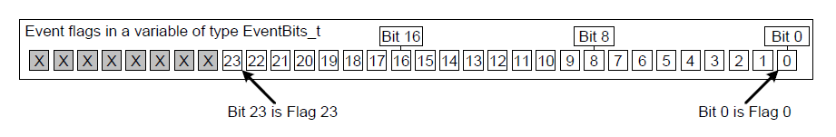
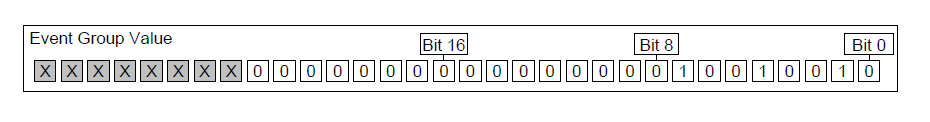
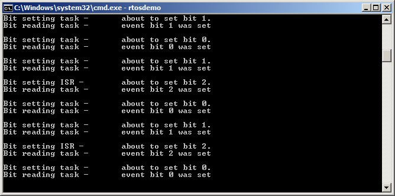
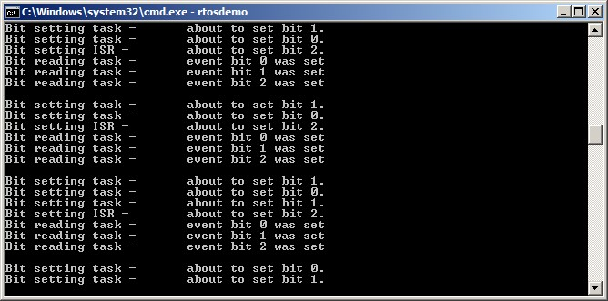
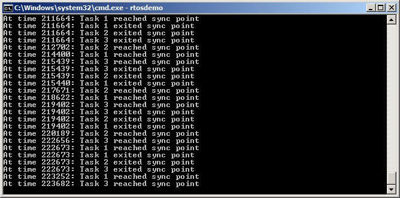

# 9 事件组

## 9.1 本章介绍与范围

前文已经提到，实时嵌入式系统必须对事件作出响应。前面的章节描述了 FreeRTOS 中可用于向任务传递事件的特性，例如信号量和队列，它们都具有以下属性：

- 它们允许任务在阻塞态等待单个事件发生。

- 当事件发生时，它们只会解除一个任务的阻塞。被解除阻塞的任务是等待该事件的最高优先级任务。

事件组是 FreeRTOS 的另一项特性，也可用于向任务传递事件。与队列和信号量不同：

- 事件组允许任务在阻塞态等待“一个或多个事件的组合条件”发生。

- 当事件发生时，事件组会解除所有等待同一事件（或同一事件组合）的任务阻塞。

事件组的这些独特属性使其非常适合：同步多个任务、向多个任务广播事件、让任务在一组事件中等待任意一个发生、以及让任务等待多个动作全部完成。

事件组还可能减少应用的 RAM 占用，因为在很多场景下，可以用一个事件组替换多个二值信号量。

事件组功能是可选的。若要启用事件组功能，需要将 FreeRTOS 源文件 `event_groups.c` 编译进你的工程。


### 9.1.1 范围

本章旨在帮助读者理解：

- 事件组的实际用途。
- 相对其他 FreeRTOS 特性，事件组的优缺点。
- 如何在事件组中置位。
- 如何在阻塞态等待事件组中的位被置位。
- 如何使用事件组同步一组任务。


## 9.2 事件组的特性

### 9.2.1 事件组、事件标志与事件位

事件“标志（flag）”是一个布尔值（1 或 0），用于表示某事件是否发生。事件“组（group）”是一组事件标志。

事件标志只能是 1 或 0，因此单个事件标志的状态可以存储在 1 个 bit 中，而一个事件组内所有事件标志的状态可以存储在一个变量中；事件组内每个事件标志都对应 `EventBits_t` 类型变量中的一个 bit。基于这个原因，事件标志也被称为事件“位（bit）”。如果 `EventBits_t` 变量中的某 bit 为 1，则表示该 bit 对应的事件已发生；如果该 bit 为 0，则表示该事件未发生。

图 9.1 展示了如何将单个事件标志映射到 `EventBits_t` 类型变量中的单个位。


<a name="fig9.1" title="图 9.1 EventBits_t 类型变量中的事件标志与位号映射"></a>

* * *

***图 9.1*** *`EventBits_t` 类型变量中的事件标志与位号映射*
* * *

例如，若某事件组的值为 0x92（二进制 1001 0010），则只有事件位 1、4、7 被置位，也就表示仅这三个位对应的事件已经发生。图 9.2 展示了一个 `EventBits_t` 变量：位 1、4、7 置位，其余位清零，因此该事件组值为 0x92。


<a name="fig9.2" title="图 9.2 仅位 1、4、7 置位，其余事件标志清零时，事件组值为 0x92"></a>

* * *

***图 9.2*** *仅位 1、4、7 置位，其余事件标志清零时，事件组值为 0x92*
* * *

事件组中每一位的具体含义由应用编写者自行定义。比如可以创建一个事件组，然后：

- 将 bit 0 定义为“收到网络消息”。

- 将 bit 1 定义为“有消息待发送到网络”。

- 将 bit 2 定义为“中止当前网络连接”。


### 9.2.2 关于 EventBits_t 数据类型的更多说明

事件组中可用事件位数量取决于 FreeRTOSConfig.h 中的 `configTICK_TYPE_WIDTH_IN_BITS` 编译期配置常量[^24]：

[^24]: `configTICK_TYPE_WIDTH_IN_BITS` 用于配置 RTOS tick 计数所使用的类型，看起来与事件组无关。它对 `EventBits_t` 类型的影响是 FreeRTOS 内部实现带来的结果。虽然将 `configTICK_TYPE_WIDTH_IN_BITS` 设为 `TICK_TYPE_WIDTH_16_BITS` 很有吸引力，但仅应在运行 FreeRTOS 的架构对 16 位类型处理效率高于 32 位类型时这样做。

- 若 `configTICK_TYPE_WIDTH_IN_BITS` 为 `TICK_TYPE_WIDTH_16_BITS`，每个事件组包含 8 个可用事件位。

- 若 `configTICK_TYPE_WIDTH_IN_BITS` 为 `TICK_TYPE_WIDTH_32_BITS`，每个事件组包含 24 个可用事件位。

- 若 `configTICK_TYPE_WIDTH_IN_BITS` 为 `TICK_TYPE_WIDTH_64_BITS`，每个事件组包含 56 个可用事件位。


### 9.2.3 多任务访问

事件组本身就是一个对象，任何知道其存在的任务或 ISR 都可以访问。任意数量的任务都可以向同一事件组置位，也可以从同一事件组读取位。


### 9.2.4 使用事件组的一个实际示例

FreeRTOS+TCP TCP/IP 协议栈的实现提供了一个很实用的示例，说明如何使用事件组在简化设计的同时降低资源占用。

一个 TCP 套接字必须响应很多不同事件，例如 accept、bind、read 和 close 事件。套接字在任一时刻可能接收哪些事件，取决于其状态。比如套接字已创建但尚未绑定地址，则它可能接收 bind 事件，但不应接收 read 事件（没有地址就无法读数据）。

FreeRTOS+TCP 套接字状态存储在 `FreeRTOS_Socket_t` 结构体中。该结构体包含一个事件组，套接字需要处理的每种事件都对应一个事件位。凡是需要阻塞等待某事件或事件组的 FreeRTOS+TCP API 调用，都只需阻塞在该事件组上。

该事件组还包含一个“abort”位，使得无论套接字当前在等待哪类事件，都可以中止 TCP 连接。


## 9.3 使用事件组进行事件管理

### 9.3.1 xEventGroupCreate() API 函数

FreeRTOS 还提供了 `xEventGroupCreateStatic()` 函数，用于在编译期静态分配创建事件组所需内存：事件组在使用前必须先显式创建。

事件组通过 `EventGroupHandle_t` 类型变量进行引用。`xEventGroupCreate()` API 函数用于创建事件组，并返回 `EventGroupHandle_t` 句柄供后续引用。


<a name="list9.1" title="清单 9.1 xEventGroupCreate() API 函数原型"></a>

```c
EventGroupHandle_t xEventGroupCreate( void );
```
***清单 9.1*** *`xEventGroupCreate()` API 函数原型*


**xEventGroupCreate() 返回值**

- 返回值

  若返回 NULL，则表示可用堆内存不足，FreeRTOS 无法分配事件组数据结构，因此事件组创建失败。第 3 章提供了更多堆内存管理信息。

  若返回非 NULL，则表示事件组创建成功。返回值应保存为该事件组的句柄。


### 9.3.2 xEventGroupSetBits() API 函数

`xEventGroupSetBits()` API 函数用于在事件组中置位一个或多个 bit，通常用于通知任务：被置位 bit 所表示的事件已经发生。

> *注意：绝不能在中断服务程序中调用 `xEventGroupSetBits()`。在 ISR 中应使用其中断安全版本 `xEventGroupSetBitsFromISR()`。*


<a name="list9.2" title="清单 9.2 xEventGroupSetBits() API 函数原型"></a>

```c
EventBits_t xEventGroupSetBits( EventGroupHandle_t xEventGroup,

const EventBits_t uxBitsToSet );
```
***清单 9.2*** *`xEventGroupSetBits()` API 函数原型*


**xEventGroupSetBits() 参数与返回值**

- `xEventGroup`

  要置位的目标事件组句柄。该句柄应来自创建事件组时对 `xEventGroupCreate()` 的调用返回值。

- `uxBitsToSet`

  指定位掩码，指定要在事件组中置为 1 的事件位。事件组的值会通过“事件组当前值 与 `uxBitsToSet` 做按位或”来更新。

  例如将 `uxBitsToSet` 设为 0x04（二进制 0100），会导致事件组中的事件位 2 被置位（若原本未置位），而不改变其他事件位。

- 返回值

  调用 `xEventGroupSetBits()` 返回时事件组的值。注意：返回值不一定包含 `uxBitsToSet` 指定的位，因为这些位可能已被其他任务再次清零。


### 9.3.3 xEventGroupSetBitsFromISR() API 函数

`xEventGroupSetBitsFromISR()` 是 `xEventGroupSetBits()` 的中断安全版本。

“给一个信号量”是确定性操作，因为可以预先知道最多只有一个任务会离开阻塞态。而在事件组里置位时，无法预先知道会有多少任务离开阻塞态，因此“事件组置位”不是确定性操作。

FreeRTOS 的设计与实现规范不允许在 ISR 或关中断期间执行非确定性操作。基于这个原因，`xEventGroupSetBitsFromISR()` 不会在 ISR 内直接置位，而是把该动作延后到 RTOS 守护任务（daemon task）中执行。


<a name="list9.3" title="清单 9.3 xEventGroupSetBitsFromISR() API 函数原型"></a>

```c
BaseType_t xEventGroupSetBitsFromISR( EventGroupHandle_t xEventGroup,
                                                  const EventBits_t uxBitsToSet,
                                                  BaseType_t *pxHigherPriorityTaskWoken );
```
***清单 9.3*** *`xEventGroupSetBitsFromISR()` API 函数原型*


**xEventGroupSetBitsFromISR() 参数与返回值**

- `xEventGroup`

  要置位的目标事件组句柄。该句柄应来自创建事件组时对 `xEventGroupCreate()` 的调用返回值。

- `uxBitsToSet`

  指定位掩码，指定要在事件组中置为 1 的事件位。事件组的值通过与 `uxBitsToSet` 做按位或更新。

  例如将 `uxBitsToSet` 设为 0x05（二进制 0101），会导致事件组中的事件位 0 和事件位 2 被置位（若它们原本未置位），其余位不变。

- `pxHigherPriorityTaskWoken`

  `xEventGroupSetBitsFromISR()` 不在 ISR 中直接置位，而是通过向定时器命令队列发送命令，将操作延后给 RTOS 守护任务。若守护任务当时阻塞在等待该队列数据，那么写队列会使守护任务离开阻塞态。若守护任务优先级高于当前被中断任务（即 ISR 打断的任务），则 `xEventGroupSetBitsFromISR()` 内部会将 `*pxHigherPriorityTaskWoken` 置为 `pdTRUE`。

  如果该值被设为 `pdTRUE`，则在退出中断前应进行一次上下文切换，以确保中断直接返回到守护任务，因为此时它将是最高优先级的就绪态任务。

- 返回值

  可能返回两个值：

  - 仅当“置位命令”成功写入定时器命令队列时，返回 `pdPASS`。

  - 若“置位命令”无法写入（因为队列已满），返回 `pdFALSE`。


### 9.3.4 xEventGroupWaitBits() API 函数

`xEventGroupWaitBits()` API 函数允许任务读取事件组值，并可选地在阻塞态等待事件组中一个或多个事件位被置位（若这些位尚未置位）。


<a name="list9.4" title="清单 9.4 xEventGroupWaitBits() API 函数原型"></a>

```c
EventBits_t xEventGroupWaitBits( EventGroupHandle_t xEventGroup,
                                            const EventBits_t uxBitsToWaitFor,
                                            const BaseType_t xClearOnExit,
                                            const BaseType_t xWaitForAllBits,
                                            TickType_t xTicksToWait );
```
***清单 9.4*** *`xEventGroupWaitBits()` API 函数原型*

调度器用于判断任务是否进入阻塞态、以及何时离开阻塞态的条件称为“解除阻塞条件（unblock condition）”。该条件由 `uxBitsToWaitFor` 与 `xWaitForAllBits` 参数组合指定：

- `uxBitsToWaitFor` 指定要测试的事件组位。

- `xWaitForAllBits` 指定使用按位 OR 条件还是按位 AND 条件。

若调用 `xEventGroupWaitBits()` 时任务的解除阻塞条件已满足，任务就不会进入阻塞态。

表 6 给出了会导致任务进入阻塞态或离开阻塞态的一些条件示例。表 6 仅展示事件组值和 `uxBitsToWaitFor` 值的低 4 位二进制位，其余位均假设为 0。

<a name="tbl6" title="表 6 uxBitsToWaitFor 与 xWaitForAllBits 参数的影响"></a>

* * *
| 事件组当前值 | uxBitsToWaitFor 值 | xWaitForAllBits 值 | 结果行为 |
| -------------------------- | --------------------- | --------------------- | ------------------ |
| 0000 | 0101 | pdFALSE | 调用任务将进入阻塞态，因为事件组中 bit0 与 bit2 都未置位；当 bit0 **或** bit2 任一被置位时离开阻塞态。 |
| 0100 | 0101 | pdTRUE | 调用任务将进入阻塞态，因为 bit0 与 bit2 并未同时置位；当 bit0 **且** bit2 同时置位时离开阻塞态。 |
| 0100 | 0110 | pdFALSE | 调用任务不会进入阻塞态，因为 `xWaitForAllBits` 为 `pdFALSE`，且 `uxBitsToWaitFor` 指定的两个位中已有一个位被置位。 |
| 0100 | 0110 | pdTRUE | 调用任务将进入阻塞态，因为 `xWaitForAllBits` 为 `pdTRUE`，而 `uxBitsToWaitFor` 指定的两个位中只有一个已置位。任务会在 bit1 与 bit2 同时置位时离开阻塞态。 |

***表 6*** *`uxBitsToWaitFor` 与 `xWaitForAllBits` 参数的影响*
* * *

调用任务通过 `uxBitsToWaitFor` 参数指定要测试的位。通常在解除阻塞条件满足后，调用任务还需要把这些位清零。虽然可以通过 `xEventGroupClearBits()` API 函数清位，但若满足以下条件，手动清位会在应用代码中引入竞争：

- 同一个事件组被多个任务使用。
- 事件组位由其他任务或 ISR 置位。

`xClearOnExit` 参数用于避免这些潜在竞争条件。若 `xClearOnExit` 设为 `pdTRUE`，则“测试位 + 清位”对调用任务而言是原子操作（不会被其他任务或中断打断）。

**xEventGroupWaitBits() 参数与返回值**

- `xEventGroup`

  包含待读取事件位的事件组句柄。该句柄应来自创建事件组时对 `xEventGroupCreate()` 的调用返回值。

- `uxBitsToWaitFor`

  位掩码，指定事件组中要测试的事件位。

  例如，若调用任务希望等待事件位 0 和/或事件位 2 被置位，则将 `uxBitsToWaitFor` 设为 0x05（二进制 0101）。更多示例可参考表 6。

- `xClearOnExit`

  若调用任务的解除阻塞条件已满足，且 `xClearOnExit` 设为 `pdTRUE`，则 `uxBitsToWaitFor` 指定的事件位会在调用任务退出 `xEventGroupWaitBits()` 前被清零。

  若 `xClearOnExit` 设为 `pdFALSE`，则 `xEventGroupWaitBits()` 不会修改事件组中事件位状态。

- `xWaitForAllBits`

  `uxBitsToWaitFor` 指定要测试哪些位；`xWaitForAllBits` 指定调用任务在以下哪种情况离开阻塞态：

  - `uxBitsToWaitFor` 指定的位中“一个或多个”被置位；
  - 还是“全部”被置位。

  若 `xWaitForAllBits` 设为 `pdFALSE`，则进入阻塞态等待解除条件的任务会在 `uxBitsToWaitFor` 指定位中任意一位被置位时离开阻塞态（或 `xTicksToWait` 超时）。

  若 `xWaitForAllBits` 设为 `pdTRUE`，则该任务仅在 `uxBitsToWaitFor` 指定位全部置位时才离开阻塞态（或 `xTicksToWait` 超时）。

  示例见表 6。

- `xTicksToWait`

  任务在阻塞态等待解除阻塞条件满足的最长时间。

  若 `xTicksToWait` 为 0，或调用 `xEventGroupWaitBits()` 时解除阻塞条件已满足，则函数立即返回。

  阻塞时间单位是 tick 周期，因此其绝对时长取决于系统 tick 频率。可使用 `pdMS_TO_TICKS()` 宏把毫秒转换为 tick。

  若将 `xTicksToWait` 设为 `portMAX_DELAY`，则任务将无限期等待（不超时），前提是 FreeRTOSConfig.h 中 `INCLUDE_vTaskSuspend` 设为 1。

- 返回值

  若 `xEventGroupWaitBits()` 因调用任务解除阻塞条件满足而返回，则返回值是“解除阻塞条件满足时”的事件组值（若 `xClearOnExit` 为 `pdTRUE`，则是自动清位之前的值）。这种情况下，返回值必然满足解除阻塞条件。

  若 `xEventGroupWaitBits()` 因 `xTicksToWait` 指定的阻塞时间到期而返回，则返回值是超时瞬间的事件组值。这种情况下，返回值不会满足解除阻塞条件。


### 9.3.5 xEventGroupGetStaticBuffer() API 函数

`xEventGroupGetStaticBuffer()` API 函数用于获取静态创建事件组所使用缓冲区的指针。该缓冲区与创建事件组时传入的是同一个。

*注意：绝不要在中断服务程序中调用 `xEventGroupGetStaticBuffer()`。*


<a name="list9.5" title="清单 9.5 xEventGroupGetStaticBuffer() API 函数原型"></a>

```c
BaseType_t xEventGroupGetStaticBuffer( EventGroupHandle_t xEventGroup,

StaticEventGroup_t ** ppxEventGroupBuffer );
```
***清单 9.5*** *`xEventGroupGetStaticBuffer()` API 函数原型*


**xEventGroupGetStaticBuffer() 参数与返回值**

- `xEventGroup`

  要获取缓冲区的事件组。该事件组必须由 `xEventGroupCreateStatic()` 创建。

- `ppxEventGroupBuffer`

  用于返回事件组数据结构缓冲区的指针。该缓冲区就是创建事件组时提供的同一缓冲区。

- 返回值

  可能返回两个值：

  - 成功获取缓冲区时返回 `pdTRUE`。

  - 获取失败时返回 `pdFALSE`。

<a name="example9.1" title="示例 9.1 事件组实验"></a>
---
***示例 9.1*** *事件组实验*

---

本示例演示如何：

- 创建事件组。
- 在 ISR 中向事件组置位。
- 在任务中向事件组置位。
- 阻塞等待事件组。

`xEventGroupWaitBits()` 的 `xWaitForAllBits` 参数效果将通过两次运行来展示：先将 `xWaitForAllBits` 设为 `pdFALSE`，再设为 `pdTRUE`。

事件位 0 与事件位 1 由任务置位；事件位 2 由 ISR 置位。这三个位通过清单 9.6 中的 `#define` 语句赋予了可读性名称。


<a name="list9.6" title="清单 9.6 示例 9.1 使用的事件位定义"></a>

```c
/* Definitions for the event bits in the event group. */
#define mainFIRST_TASK_BIT ( 1UL << 0UL )  /* Event bit 0, set by a task */
#define mainSECOND_TASK_BIT ( 1UL << 1UL ) /* Event bit 1, set by a task */
#define mainISR_BIT ( 1UL << 2UL )         /* Event bit 2, set by an ISR */
```
***清单 9.6*** *示例 9.1 使用的事件位定义*


清单 9.7 展示了“置位事件位 0 与事件位 1”的任务实现。它在循环中交替置位两个 bit，并在每次调用 `xEventGroupSetBits()` 之间延时 200 毫秒。每次置位前会打印一条字符串，便于在控制台观察执行顺序。


<a name="list9.7" title="清单 9.7 示例 9.1 中向事件组置两个位的任务"></a>

```c
static void vEventBitSettingTask( void *pvParameters )
{
     const TickType_t xDelay200ms = pdMS_TO_TICKS( 200UL );

     for( ;; )
     {
          /* Delay for a short while before starting the next loop. */
          vTaskDelay( xDelay200ms );

          /* Print out a message to say event bit 0 is about to be set by the
              task, then set event bit 0. */
          vPrintString( "Bit setting task -\t about to set bit 0.\r\n" );
          xEventGroupSetBits( xEventGroup, mainFIRST_TASK_BIT );

          /* Delay for a short while before setting the other bit. */
          vTaskDelay( xDelay200ms );

          /* Print out a message to say event bit 1 is about to be set by the
              task, then set event bit 1. */
          vPrintString( "Bit setting task -\t about to set bit 1.\r\n" );
          xEventGroupSetBits( xEventGroup, mainSECOND_TASK_BIT );
     }
}
```
***清单 9.7*** *示例 9.1 中向事件组置两个位的任务*


清单 9.8 展示了在事件组中置位 bit 2 的 ISR 实现。与前面类似，置位前会打印消息，以便观察执行顺序。但本例中由于不应在 ISR 里直接输出到控制台，因此使用 `xTimerPendFunctionCallFromISR()` 将输出动作放到 RTOS 守护任务上下文中执行。

与前面的示例一样，这个 ISR 由一个简单的周期任务触发，该任务会强制产生软件中断。本示例中中断每 500 毫秒产生一次。


<a name="list9.8" title="清单 9.8 示例 9.1 中在事件组内置位 bit 2 的 ISR"></a>

```c
static uint32_t ulEventBitSettingISR( void )
{
     /* The string is not printed within the interrupt service routine, but is
         instead sent to the RTOS daemon task for printing. It is therefore
         declared static to ensure the compiler does not allocate the string on
         the stack of the ISR, as the ISR's stack frame will not exist when the
         string is printed from the daemon task. */
     static const char *pcString = "Bit setting ISR -\t about to set bit 2.\r\n";
     BaseType_t xHigherPriorityTaskWoken = pdFALSE;

     /* Print out a message to say bit 2 is about to be set. Messages cannot
         be printed from an ISR, so defer the actual output to the RTOS daemon
         task by pending a function call to run in the context of the RTOS
         daemon task. */
     xTimerPendFunctionCallFromISR( vPrintStringFromDaemonTask,
                                              ( void * ) pcString,
                                              0,
                                              &xHigherPriorityTaskWoken );

     /* Set bit 2 in the event group. */
     xEventGroupSetBitsFromISR( xEventGroup,
                                         mainISR_BIT,
                                         &xHigherPriorityTaskWoken );

     /* xTimerPendFunctionCallFromISR() and xEventGroupSetBitsFromISR() both
         write to the timer command queue, and both used the same
         xHigherPriorityTaskWoken variable. If writing to the timer command
         queue resulted in the RTOS daemon task leaving the Blocked state, and
         if the priority of the RTOS daemon task is higher than the priority of
         the currently executing task (the task this interrupt interrupted) then
         xHigherPriorityTaskWoken will have been set to pdTRUE.

         xHigherPriorityTaskWoken is used as the parameter to
         portYIELD_FROM_ISR(). If xHigherPriorityTaskWoken equals pdTRUE, then
         calling portYIELD_FROM_ISR() will request a context switch. If
         xHigherPriorityTaskWoken is still pdFALSE, then calling
         portYIELD_FROM_ISR() will have no effect.

         The implementation of portYIELD_FROM_ISR() used by the Windows port
         includes a return statement, which is why this function does not
         explicitly return a value. */

     portYIELD_FROM_ISR( xHigherPriorityTaskWoken );
}
```
***清单 9.8*** *示例 9.1 中在事件组内置位 bit 2 的 ISR*


清单 9.9 展示了调用 `xEventGroupWaitBits()` 并阻塞等待事件组的任务实现。该任务会针对事件组中每一个被置位的 bit 打印一条字符串。

`xEventGroupWaitBits()` 的 `xClearOnExit` 参数设为 `pdTRUE`，因此使 `xEventGroupWaitBits()` 返回的事件位会在函数返回前自动清零。


<a name="list9.9" title="清单 9.9 示例 9.1 中阻塞等待事件位被置位的任务"></a>

```c
static void vEventBitReadingTask( void *pvParameters )
{
     EventBits_t xEventGroupValue;
     const EventBits_t xBitsToWaitFor = ( mainFIRST_TASK_BIT  |
                                                      mainSECOND_TASK_BIT |
                                                      mainISR_BIT );

     for( ;; )
     {
          /* Block to wait for event bits to become set within the event
              group. */
          xEventGroupValue = xEventGroupWaitBits( /* The event group to read */
                                                                xEventGroup,

                                                                /* Bits to test */
                                                                xBitsToWaitFor,

                                                                /* Clear bits on exit if the
                                                                    unblock condition is met */
                                                                pdTRUE,

                                                                /* Don't wait for all bits. This
                                                                    parameter is set to pdTRUE for the
                                                                    second execution. */
                                                                pdFALSE,

                                                                /* Don't time out. */
                                                                portMAX_DELAY );

          /* Print a message for each bit that was set. */
          if( ( xEventGroupValue & mainFIRST_TASK_BIT ) != 0 )
          {
                vPrintString( "Bit reading task -\t Event bit 0 was set\r\n" );
          }

          if( ( xEventGroupValue & mainSECOND_TASK_BIT ) != 0 )
          {
                vPrintString( "Bit reading task -\t Event bit 1 was set\r\n" );
          }

          if( ( xEventGroupValue & mainISR_BIT ) != 0 )
          {
                vPrintString( "Bit reading task -\t Event bit 2 was set\r\n" );
          }
     }
}
```
***清单 9.9*** *示例 9.1 中阻塞等待事件位被置位的任务*


`main()` 函数先创建事件组和各任务，再启动调度器。实现见清单 9.10。读取事件组的任务优先级高于写事件组的任务，因此每次其解除阻塞条件满足时，读取任务都会抢占写任务。


<a name="list9.10" title="清单 9.10 示例 9.1 中创建事件组与任务"></a>

```c
int main( void )
{
     /* Before an event group can be used it must first be created. */
     xEventGroup = xEventGroupCreate();

     /* Create the task that sets event bits in the event group. */
     xTaskCreate( vEventBitSettingTask, "Bit Setter", 1000, NULL, 1, NULL );

     /* Create the task that waits for event bits to get set in the event
         group. */
     xTaskCreate( vEventBitReadingTask, "Bit Reader", 1000, NULL, 2, NULL );

     /* Create the task that is used to periodically generate a software
         interrupt. */
     xTaskCreate( vInterruptGenerator, "Int Gen", 1000, NULL, 3, NULL );

     /* Install the handler for the software interrupt. The syntax necessary
         to do this is dependent on the FreeRTOS port being used. The syntax
         shown here can only be used with the FreeRTOS Windows port, where such
         interrupts are only simulated. */
     vPortSetInterruptHandler( mainINTERRUPT_NUMBER, ulEventBitSettingISR );

     /* Start the scheduler so the created tasks start executing. */
     vTaskStartScheduler();

     /* The following line should never be reached. */
     for( ;; );
     return 0;
}
```
***清单 9.10*** *示例 9.1 中创建事件组与任务*


当示例 9.1 在 `xEventGroupWaitBits()` 的 `xWaitForAllBits` 参数设为 `pdFALSE` 时运行，输出如图 9.3 所示。图中可以看到，由于 `xEventGroupWaitBits()` 调用中 `xWaitForAllBits` 为 `pdFALSE`，读取事件组的任务在任意一个事件位被置位时都会立即离开阻塞态并执行。


<a name="fig9.3" title="图 9.3 示例 9.1 以 xWaitForAllBits=pdFALSE 运行时的输出"></a>

* * *

***图 9.3*** *示例 9.1 以 `xWaitForAllBits=pdFALSE` 运行时的输出*
* * *

当示例 9.1 在 `xEventGroupWaitBits()` 的 `xWaitForAllBits` 参数设为 `pdTRUE` 时运行，输出如图 9.4 所示。图 9.4 中可以看到，由于 `xWaitForAllBits` 为 `pdTRUE`，读取事件组的任务只有在三个事件位全部置位后才会离开阻塞态。


<a name="fig9.4" title="图 9.4 示例 9.1 以 xWaitForAllBits=pdTRUE 运行时的输出"></a>

* * *

***图 9.4*** *示例 9.1 以 `xWaitForAllBits=pdTRUE` 运行时的输出*
* * *


## 9.4 使用事件组进行任务同步

有时应用设计要求两个或更多任务彼此同步。比如：任务 A 接收到一个事件后，将部分处理委托给任务 B、C、D。若任务 A 在 B、C、D 全部完成前不能接收下一个事件，那么这四个任务就必须同步。每个任务的同步点位于“该任务完成其处理之后”，且在其他任务也完成之前不能继续。只有当四个任务都到达同步点后，任务 A 才能接收下一个事件。

在 FreeRTOS+TCP 某个演示工程中有一个更具体的同步需求：两个任务共享一个 TCP 套接字；一个任务向套接字发送数据，另一个任务从同一套接字接收数据[^25]。在未确认对方任务不会再访问该套接字之前，任何一方都不能安全地关闭它。若其中一方想关闭套接字，必须先通知另一方，然后等待另一方停止使用套接字后再继续。清单 9.11 的伪代码演示了“发送任务希望关闭套接字”的场景。

[^25]: 在撰写本书时，这是在任务间共享单个 FreeRTOS+TCP 套接字的唯一方式。

清单 9.11 演示的场景只有两个任务参与同步，因此较为简单；但很容易看出，如果还有其他依赖套接字保持打开状态的处理任务加入，同步场景会更复杂、参与任务也会更多。


<a name="list9.11" title="清单 9.11 两个任务相互同步，确保共享 TCP 套接字在关闭前已不再被任何一方使用的伪代码"></a>

```c
void SocketTxTask( void *pvParameters )
{
     xSocket_t xSocket;
     uint32_t ulTxCount = 0UL;

     for( ;; )
     {
          /* Create a new socket. This task will send to this socket, and another
              task will receive from this socket. */
          xSocket = FreeRTOS_socket( ... );

          /* Connect the socket. */
          FreeRTOS_connect( xSocket, ... );

          /* Use a queue to send the socket to the task that receives data. */
          xQueueSend( xSocketPassingQueue, &xSocket, portMAX_DELAY );

          /* Send 1000 messages to the socket before closing the socket. */
          for( ulTxCount = 0; ulTxCount < 1000; ulTxCount++ )
          {
                if( FreeRTOS_send( xSocket, ... ) < 0 )
                {
                     /* Unexpected error - exit the loop, after which the socket
                         will be closed. */
                     break;
                }
          }

          /* Let the Rx task know the Tx task wants to close the socket. */
          TxTaskWantsToCloseSocket();

          /* This is the Tx task's synchronization point. The Tx task waits here
              for the Rx task to reach its synchronization point. The Rx task will
              only reach its synchronization point when it is no longer using the
              socket, and the socket can be closed safely. */
          xEventGroupSync( ... );

          /* Neither task is using the socket. Shut down the connection, then
              close the socket. */
          FreeRTOS_shutdown( xSocket, ... );
          WaitForSocketToDisconnect();
          FreeRTOS_closesocket( xSocket );
     }
}
/*-----------------------------------------------------------*/

void SocketRxTask( void *pvParameters )
{
     xSocket_t xSocket;

     for( ;; )
     {
          /* Wait to receive a socket that was created and connected by the Tx
              task. */
          xQueueReceive( xSocketPassingQueue, &xSocket, portMAX_DELAY );

          /* Keep receiving from the socket until the Tx task wants to close the
              socket. */
          while( TxTaskWantsToCloseSocket() == pdFALSE )
          {
              /* Receive then process data. */
              FreeRTOS_recv( xSocket, ... );
              ProcessReceivedData();
          }

          /* This is the Rx task's synchronization point - it only reaches here
              when it is no longer using the socket, and it is therefore safe for
              the Tx task to close the socket. */
          xEventGroupSync( ... );
     }
}
```
***清单 9.11*** *两个任务相互同步，确保共享 TCP 套接字在关闭前已不再被任何一方使用的伪代码*


可以使用事件组创建同步点：

- 为每个参与同步的任务分配一个唯一事件位。

- 每个任务到达同步点时置位自己的事件位。

- 置位自己的位后，每个任务在该事件组上阻塞，等待表示“其他所有同步任务”的事件位也被置位。

但在该场景中不能直接使用 `xEventGroupSetBits()` 与 `xEventGroupWaitBits()`。如果这么做，“置位（表示任务到达同步点）”和“测位（判断其他任务是否到达同步点）”会是两个分离操作。看下面这个任务 A、B、C 尝试用事件组同步的例子：

1. 任务 A 和任务 B 已到达同步点，它们的事件位已置位，并都阻塞等待任务 C 的事件位也被置位。

2. 任务 C 到达同步点，并调用 `xEventGroupSetBits()` 置自己的位。C 的位一置上，A 与 B 立刻离开阻塞态，并清除三个事件位。

3. 任务 C 随后调用 `xEventGroupWaitBits()` 等待三个事件位全部置位，但此时三个位已经被清掉，A 与 B 也已离开各自同步点，因此同步失败。

要让事件组可靠地用于同步点，“置位”与“后续测位”必须作为一个不可中断的单一操作执行。为此提供了 `xEventGroupSync()` API 函数。


### 9.4.1 xEventGroupSync() API 函数

`xEventGroupSync()` 用于让两个或更多任务使用事件组彼此同步。它允许任务先在事件组中置一个或多个位，再等待同一事件组中的某个位组合被置位，并且两步是单个不可中断操作。

`xEventGroupSync()` 的 `uxBitsToWaitFor` 参数用于指定调用任务的解除阻塞条件。若 `xEventGroupSync()` 是因为解除阻塞条件满足而返回，则 `uxBitsToWaitFor` 指定的位会在返回前自动清零。


<a name="list9.12" title="清单 9.12 xEventGroupSync() API 函数原型"></a>

```c
EventBits_t xEventGroupSync( EventGroupHandle_t xEventGroup,
                                      const EventBits_t uxBitsToSet,
                                      const EventBits_t uxBitsToWaitFor,
                                      TickType_t xTicksToWait );
```
***清单 9.12*** *`xEventGroupSync()` API 函数原型*


**xEventGroupSync() 参数与返回值**

- `xEventGroup`

  要置位并随后测试的事件组句柄。该句柄应来自创建事件组时对 `xEventGroupCreate()` 的调用返回值。

- `uxBitsToSet`

  位掩码，指定要在事件组中置为 1 的事件位。事件组值会通过“当前值 与 `uxBitsToSet` 按位或”更新。

  例如将 `uxBitsToSet` 设为 0x04（二进制 0100）会导致事件位 2 被置位（若尚未置位），其余位不变。

- `uxBitsToWaitFor`

  位掩码，指定在事件组中要测试的事件位。

  例如，若调用任务希望等待事件位 0、1、2 全部置位，可将 `uxBitsToWaitFor` 设为 0x07（二进制 111）。

- `xTicksToWait`

  任务在阻塞态等待解除阻塞条件满足的最长时间。

  若 `xTicksToWait` 为 0，或调用 `xEventGroupSync()` 时解除阻塞条件已满足，则函数立即返回。

  阻塞时间单位为 tick 周期，绝对时长取决于 tick 频率。可使用 `pdMS_TO_TICKS()` 宏把毫秒转换为 tick。

  若将 `xTicksToWait` 设为 `portMAX_DELAY`，则任务会无限期等待（不超时），前提是 FreeRTOSConfig.h 中 `INCLUDE_vTaskSuspend` 设为 1。

- 返回值

  若 `xEventGroupSync()` 因调用任务解除阻塞条件满足而返回，则返回值是解除条件满足瞬间的事件组值（自动清零之前）。这种情况下返回值也会满足调用任务的解除阻塞条件。

  若 `xEventGroupSync()` 因 `xTicksToWait` 指定阻塞时间超时而返回，则返回值是超时时刻事件组值。这种情况下返回值不会满足调用任务的解除阻塞条件。


<a name="example9.2" title="示例 9.2 任务同步"></a>
---
***示例 9.2*** *任务同步*

---

示例 9.2 使用 `xEventGroupSync()` 同步同一个任务实现的三个实例。通过任务参数向每个实例传入“该任务调用 `xEventGroupSync()` 时要置位的事件位”。

任务在调用 `xEventGroupSync()` 前后各打印一条消息，且每条消息都带时间戳。这样可以在输出中观察执行顺序。示例还使用伪随机延时，避免所有任务在同一时刻到达同步点。

任务实现见清单 9.13。


<a name="list9.13" title="清单 9.13 示例 9.2 中任务实现"></a>

```c
static void vSyncingTask( void *pvParameters )
{
     const TickType_t xMaxDelay = pdMS_TO_TICKS( 4000UL );
     const TickType_t xMinDelay = pdMS_TO_TICKS( 200UL );
     TickType_t xDelayTime;
     EventBits_t uxThisTasksSyncBit;
     const EventBits_t uxAllSyncBits = ( mainFIRST_TASK_BIT  |
                                                     mainSECOND_TASK_BIT |
                                                     mainTHIRD_TASK_BIT );

     /* Three instances of this task are created - each task uses a different
         event bit in the synchronization. The event bit to use is passed into
         each task instance using the task parameter. Store it in the
         uxThisTasksSyncBit variable. */
     uxThisTasksSyncBit = ( EventBits_t ) pvParameters;

     for( ;; )
     {
          /* Simulate this task taking some time to perform an action by delaying
              for a pseudo random time. This prevents all three instances of this
              task reaching the synchronization point at the same time, and so
              allows the example's behavior to be observed more easily. */
          xDelayTime = ( rand() % xMaxDelay ) + xMinDelay;
          vTaskDelay( xDelayTime );

          /* Print out a message to show this task has reached its synchronization
              point. pcTaskGetTaskName() is an API function that returns the name
              assigned to the task when the task was created. */
          vPrintTwoStrings( pcTaskGetTaskName( NULL ), "reached sync point" );

          /* Wait for all the tasks to have reached their respective
              synchronization points. */
          xEventGroupSync( /* The event group used to synchronize. */
                                 xEventGroup,

                                 /* The bit set by this task to indicate it has reached
                                     the synchronization point. */
                                 uxThisTasksSyncBit,

                                 /* The bits to wait for, one bit for each task taking
                                     part in the synchronization. */
                                 uxAllSyncBits,

                                 /* Wait indefinitely for all three tasks to reach the
                                     synchronization point. */
                                 portMAX_DELAY );

          /* Print out a message to show this task has passed its synchronization
              point. As an indefinite delay was used the following line will only
              be executed after all the tasks reached their respective
              synchronization points. */
          vPrintTwoStrings( pcTaskGetTaskName( NULL ), "exited sync point" );
     }
}
```
***清单 9.13*** *示例 9.2 中任务实现*

`main()` 函数创建事件组、创建三个任务并启动调度器，见清单 9.14。


<a name="list9.14" title="清单 9.14 示例 9.2 使用的 main() 函数"></a>

```c
/* Definitions for the event bits in the event group. */

#define mainFIRST_TASK_BIT ( 1UL << 0UL ) /* Event bit 0, set by the 1st task */
#define mainSECOND_TASK_BIT( 1UL << 1UL ) /* Event bit 1, set by the 2nd task */
#define mainTHIRD_TASK_BIT ( 1UL << 2UL ) /* Event bit 2, set by the 3rd task */

/* Declare the event group used to synchronize the three tasks. */
EventGroupHandle_t xEventGroup;

int main( void )
{
     /* Before an event group can be used it must first be created. */
     xEventGroup = xEventGroupCreate();

     /* Create three instances of the task. Each task is given a different
         name, which is later printed out to give a visual indication of which
         task is executing. The event bit to use when the task reaches its
         synchronization point is passed into the task using the task parameter. */
     xTaskCreate( vSyncingTask, "Task 1", 1000, mainFIRST_TASK_BIT, 1, NULL );
     xTaskCreate( vSyncingTask, "Task 2", 1000, mainSECOND_TASK_BIT, 1, NULL );
     xTaskCreate( vSyncingTask, "Task 3", 1000, mainTHIRD_TASK_BIT, 1, NULL );

     /* Start the scheduler so the created tasks start executing. */
     vTaskStartScheduler();

     /* As always, the following line should never be reached. */
     for( ;; );
     return 0;
}
```
***清单 9.14*** *示例 9.2 使用的 `main()` 函数*

示例 9.2 的输出见图 9.5。可以看到，虽然每个任务到达同步点的时间不同（伪随机），但它们离开同步点的时刻相同[^26]（即最后一个任务到达同步点的时刻）。

[^26]: 图 9.5 展示的是示例在 FreeRTOS Windows 端口上运行的结果，该端口不具备严格实时行为（尤其当使用 Windows 系统调用向控制台打印时），因此会看到一些时序抖动。


<a name="fig9.5" title="图 9.5 示例 9.2 运行输出"></a>

* * *

***图 9.5*** *示例 9.2 运行输出*
* * *
