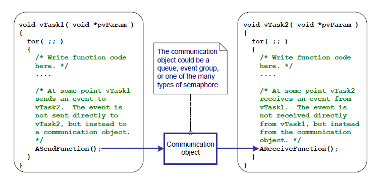
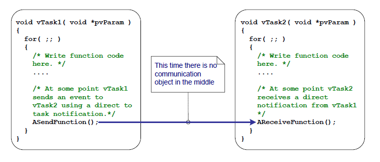
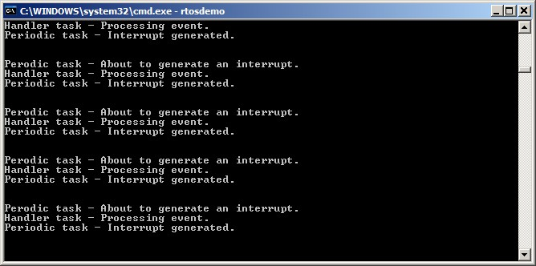
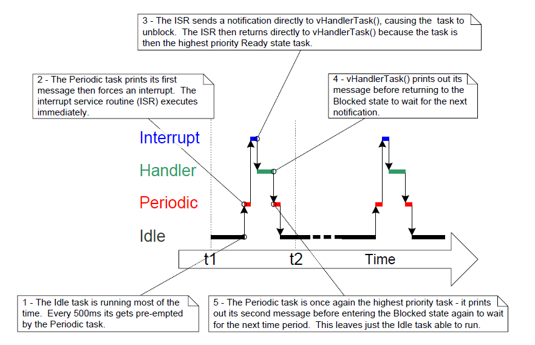
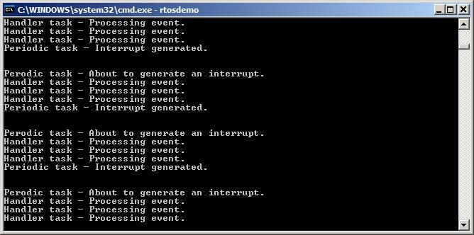
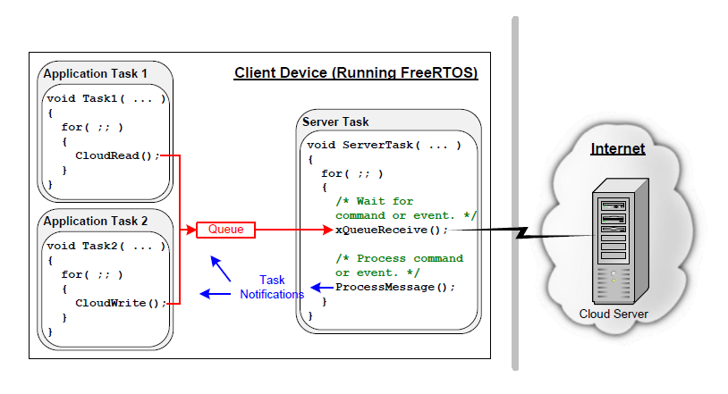

# 10 任务通知

## 10.1 引言

FreeRTOS 应用通常由一组相互独立的任务构成，这些任务通过彼此通信协同实现系统功能。任务通知是一种高效机制，允许一个任务直接通知另一个任务。

### 10.1.1 通过中间对象通信

本书前文已经介绍了多种任务间通信方式。到目前为止介绍的方法都需要先创建一个通信对象。通信对象的例子包括队列、事件组和多种不同类型的信号量。

使用通信对象时，事件和数据并不是直接发给接收任务（或接收 ISR），而是先发送到通信对象。同样地，任务和 ISR 也是从通信对象中接收事件与数据，而不是直接从发送方任务或 ISR 接收。图 10.1 展示了该过程。


<a name="fig10.1" title="图 10.1 使用通信对象将事件从一个任务发送到另一个任务"></a>

* * *
    
***图 10.1*** *使用通信对象将事件从一个任务发送到另一个任务*
* * *

### 10.1.2 任务通知——直接面向任务的通信

“任务通知（Task Notifications）”允许任务之间交互，也允许任务与 ISR 同步，而且不需要单独的通信对象。通过任务通知，任务或 ISR 可以把事件直接发送给目标任务。图 10.2 展示了这种方式。


<a name="fig10.2" title="图 10.2 使用任务通知将事件从一个任务直接发送到另一个任务"></a>

* * *
    
***图 10.2*** *使用任务通知将事件从一个任务直接发送到另一个任务*
* * *

任务通知功能是可选的。要启用任务通知功能，请在 FreeRTOSConfig.h 中将 `configUSE_TASK_NOTIFICATIONS` 设为 1。

当 `configUSE_TASK_NOTIFICATIONS` 为 1 时，每个任务至少拥有一个“通知状态（Notification State）”（取值为“Pending”或“Not-Pending”）和一个“通知值（Notification Value）”（32 位无符号整数）。当任务收到通知时，其通知状态会变为 pending；当任务读取通知值时，其通知状态会变为 not-pending。若 `configTASK_NOTIFICATION_ARRAY_ENTRIES` 设为大于 1，则会存在多个通过索引区分的通知状态和通知值。

任务可以在阻塞态（可选超时）等待其通知状态变为 pending。

### 10.1.3 范围

本章将讨论：

- 任务的通知状态与通知值。
- 在何种情况下可用任务通知替代通信对象（例如信号量）。
- 使用任务通知替代通信对象的优势。

## 10.2 任务通知：优势与限制

### 10.2.1 任务通知的性能优势

使用任务通知向任务发送事件或数据，速度显著快于使用队列、信号量或事件组执行等效操作。

### 10.2.2 任务通知的 RAM 占用优势

同样地，使用任务通知向任务发送事件或数据所需 RAM 显著少于使用队列、信号量或事件组执行等效操作。原因在于：每个通信对象（队列、信号量或事件组）在使用前都必须被创建，而启用任务通知功能只有固定开销。任务通知的 RAM 成本是每个任务 `configTASK_NOTIFICATION_ARRAY_ENTRIES * 5` 字节。`configTASK_NOTIFICATION_ARRAY_ENTRIES` 默认值为 1，因此默认任务通知开销是每任务 5 字节。

### 10.2.3 任务通知的限制

任务通知比通信对象更快、占用 RAM 更少，但并非所有场景都适用。以下场景不适合使用任务通知：

- 向 ISR 发送事件或数据

  通信对象可用于 ISR→任务，也可用于任务→ISR 的事件/数据传递。

  任务通知可用于 ISR→任务，但不能用于任务→ISR。

- 启用多个接收任务

  通信对象可被任何知道其句柄的任务或 ISR 访问（句柄可能是队列句柄、信号量句柄或事件组句柄）。任意数量的任务和 ISR 都可以处理发送到某个通信对象的数据或事件。

  任务通知是直接发送到接收任务，因此只能由该任务处理。不过在实践中这很少是限制，因为虽然多个任务/ISR 向同一通信对象发送很常见，但多个任务/ISR 从同一通信对象接收并不常见。

- 缓冲多个数据项

  队列是一种可同时容纳多个数据项的通信对象。已经发送到队列但尚未被接收的数据会缓冲在队列对象内部。

  任务通知通过更新目标任务的通知值来传递数据，而任务通知值同一时刻只能保存一个值。

- 向多个任务广播

  事件组是一种可以同时向多个任务发送事件的通信对象。

  任务通知是直接发往单个目标任务的，因此只能被该接收任务处理。

- 在阻塞态等待“发送完成”

  若通信对象暂时处于“无法继续写入”的状态（例如队列满，无法继续发送），尝试写入的任务可以选择进入阻塞态等待写操作完成。

  若任务尝试向一个“已经有通知 pending”的任务发送任务通知，则发送任务无法进入阻塞态等待接收任务重置其通知状态。正如后文将看到的，在任务通知常见用法中，这通常也不构成实际限制。

## 10.3 使用任务通知

### 10.3.1 任务通知 API 选项

任务通知功能非常强大，很多情况下可替代二值信号量、计数信号量、事件组，甚至有时可替代队列。实现这类广泛用法可通过 `xTaskNotify()` 发送通知、`xTaskNotifyWait()` 接收通知。

但在大多数场景中，并不需要 `xTaskNotify()` / `xTaskNotifyWait()` 提供的全部灵活性，更简单的函数就足够。因此提供了 `xTaskNotifyGive()` 作为更简单但不那么灵活的 `xTaskNotify()` 替代项，同时提供了 `ulTaskNotifyTake()` 作为更简单但不那么灵活的 `xTaskNotifyWait()` 替代项。

任务通知系统不只支持一个通知事件。配置参数 `configTASK_NOTIFICATION_ARRAY_ENTRIES` 默认值为 1。若其设置为大于 1，则每个任务内部会创建一个通知数组，从而可通过索引管理通知。每个任务通知 API 函数都有对应的“带索引版本”。使用非索引版本时，默认访问 `notification[0]`（数组中的第一个）。每个 API 的带索引版本以 `Indexed` 后缀标识，例如 `xTaskNotify` 对应 `xTaskNotifyIndexed`。为简化叙述，本书后续仅使用非索引版本。

任务通知 API 实际上以宏形式实现，宏会调用底层 `Generic` 版本函数。为简化表达，本书仍把这些 API 宏称为“函数”。

#### 10.3.1.1 API 函数完整列表 <sup>27</sup>

- `xTaskNotifyGive`
- `xTaskNotifyGiveIndexed`
- `vTaskNotifyGiveFromISR`
- `vTaskNotifyGiveIndexedFromISR`
- `vTaskNotifyTake`
- `vTaskNotifyTakeIndexed`
- `xTaskNotify`
- `xTaskNotifyIndexed`
- `xTaskNotifyWait`
- `xTaskNotifyWaitIndexed`
- `xTaskNotifyStateClear`
- `xTaskNotifyStateClearIndexed`
- `ulTaskNotifyValueClear`
- `ulTaskNotifyValueClearIndexed`
- `xTaskNotifyAndQueryIndexedFromISR`
- `xTaskNotifyAndQueryFromISR`
- `xTaskNotifyFromISR`
- `xTaskNotifyIndexedFromISR`
- `xTaskNotifyAndQuery`
- `xTaskNotifyAndQueryIndexed`

*(27): 这些函数实际都以宏方式实现。*

>注意：不存在“在 ISR 中接收通知”的 `FromISR` 函数，因为通知总是发送给任务，而中断并不与某个任务关联。

### 10.3.2 xTaskNotifyGive() API 函数

`xTaskNotifyGive()` 会直接向任务发送通知，并将接收任务的通知值加 1。调用 `xTaskNotifyGive()` 会把接收任务通知状态设为 pending（若之前不是 pending）。

`xTaskNotifyGive()` 旨在让任务通知可作为二值/计数信号量的更轻量、更快速替代方案。


<a name="list10.1" title="清单 10.1 xTaskNotifyGive() API 函数原型"></a>


```c
BaseType_t xTaskNotifyGive( TaskHandle_t xTaskToNotify );
BaseType_t xTaskNotifyGiveIndexed( TaskHandle_t xTaskToNotify, UBaseType_t uxIndexToNotify );
```

***清单 10.1*** *`xTaskNotifyGive()` API 函数原型*

**xTaskNotifyGive()/xTaskNotifyGiveIndexed() 参数与返回值**

- `xTaskToNotify`

  要接收通知的任务句柄——关于如何获取任务句柄，请参考 `xTaskCreate()` API 函数的 `pxCreatedTask` 参数说明。

- `uxIndexToNotify`

  通知数组中的索引。

- 返回值

  `xTaskNotifyGive()` 是调用 `xTaskNotify()` 的宏。该宏传给 `xTaskNotify()` 的参数配置保证了其唯一可能返回值是 `pdPASS`。`xTaskNotify()` 会在本章后文介绍。

### 10.3.3 vTaskNotifyGiveFromISR() API 函数

`vTaskNotifyGiveFromISR()` 是 `xTaskNotifyGive()` 的 ISR 版本，可在中断服务程序中使用。


<a name="list10.2" title="清单 10.2 vTaskNotifyGiveFromISR() API 函数原型"></a>


```c
void vTaskNotifyGiveFromISR( TaskHandle_t xTaskToNotify,
									  BaseType_t *pxHigherPriorityTaskWoken );
```

***清单 10.2*** *`vTaskNotifyGiveFromISR()` API 函数原型*

**vTaskNotifyGiveFromISR() 参数与返回值**

- `xTaskToNotify`

  要接收通知的任务句柄——关于如何获取任务句柄，请参考 `xTaskCreate()` API 函数的 `pxCreatedTask` 参数说明。

- `pxHigherPriorityTaskWoken`

  若被通知任务正阻塞等待通知，则发送通知会使其离开阻塞态。

  若调用 `vTaskNotifyGiveFromISR()` 导致某任务离开阻塞态，且该任务优先级高于当前执行任务（被中断的任务），则 `vTaskNotifyGiveFromISR()` 内部会将 `*pxHigherPriorityTaskWoken` 设为 `pdTRUE`。

  若该值被设为 `pdTRUE`，则应在退出中断前执行一次上下文切换，以确保中断直接返回到最高优先级就绪态任务。

  与所有中断安全 API 一样，`pxHigherPriorityTaskWoken` 在使用前必须初始化为 `pdFALSE`。

### 10.3.4 ulTaskNotifyTake() API 函数

`ulTaskNotifyTake()` 允许任务在阻塞态等待其通知值大于 0；函数返回前会将该通知值减 1（decrement）或清零。

`ulTaskNotifyTake()` 的目标是让任务通知成为二值/计数信号量的更轻量、更快速替代方案。


<a name="list10.3" title="清单 10.3 ulTaskNotifyTake() API 函数原型"></a>


```c
uint32_t ulTaskNotifyTake( BaseType_t xClearCountOnExit, TickType_t
xTicksToWait );
```

***清单 10.3*** *`ulTaskNotifyTake()` API 函数原型*

**ulTaskNotifyTake() 参数与返回值**

- `xClearCountOnExit`

  若 `xClearCountOnExit` 设为 `pdTRUE`，则调用任务的通知值会在 `ulTaskNotifyTake()` 返回前被清零。

  若 `xClearCountOnExit` 设为 `pdFALSE`，且调用任务通知值大于 0，则调用任务通知值会在 `ulTaskNotifyTake()` 返回前减 1。

- `xTicksToWait`

  调用任务在阻塞态等待通知值大于 0 的最长时间。

  阻塞时间单位为 tick 周期，其绝对时间取决于 tick 频率。可使用 `pdMS_TO_TICKS()` 将毫秒转换为 tick。

  若将 `xTicksToWait` 设为 `portMAX_DELAY`，则任务会无限期等待（不超时），前提是 `FreeRTOSConfig.h` 中 `INCLUDE_vTaskSuspend` 设为 1。

- 返回值

  返回值是调用任务的通知值在被清零或减 1 *之前* 的值，具体由 `xClearCountOnExit` 参数决定。

  若指定了阻塞时间（`xTicksToWait` 非 0），且返回值非 0，则调用任务可能先进入阻塞态等待通知值大于 0，随后在超时前通知值被更新。

  若指定了阻塞时间（`xTicksToWait` 非 0），且返回值为 0，则调用任务进入阻塞态后在通知值变为大于 0 之前先超时。


<a name="example10.1" title="示例 10.1 用任务通知替代信号量，方法 1"></a>
---
***示例 10.1*** *用任务通知替代信号量，方法 1*

---

示例 7.1 使用二值信号量在 ISR 中解除任务阻塞——本质上实现了任务与中断同步。本示例复现示例 7.1 的功能，但把二值信号量替换为“直接到任务”的通知。

清单 10.4 展示了与中断同步的任务实现。示例 7.1 中使用的 `xSemaphoreTake()` 被替换为 `ulTaskNotifyTake()`。

`ulTaskNotifyTake()` 的 `xClearCountOnExit` 参数设为 `pdTRUE`，这会在 `ulTaskNotifyTake()` 返回前把接收任务通知值清零。因此，两次 `ulTaskNotifyTake()` 调用之间必须处理所有已到达事件。示例 7.1 中使用二值信号量，因此待处理事件数需从硬件判断，这并不总是方便。示例 10.1 中待处理事件数由 `ulTaskNotifyTake()` 返回。

两次 `ulTaskNotifyTake` 调用之间发生的中断事件会被“锁存”在任务通知值中。若调用任务已存在 pending 通知，`ulTaskNotifyTake()` 会立即返回。


<a name="list10.4" title="清单 10.4 示例 10.1 中将中断处理延后到任务执行（与中断同步的任务）"></a>


```c
/* The rate at which the periodic task generates software interrupts. */
const TickType_t xInterruptFrequency = pdMS_TO_TICKS( 500UL );

static void vHandlerTask( void *pvParameters )
{
	 /* xMaxExpectedBlockTime is set to be a little longer than the maximum
		 expected time between events. */
	 const TickType_t xMaxExpectedBlockTime = xInterruptFrequency +
															pdMS_TO_TICKS( 10 );
	 uint32_t ulEventsToProcess;

	 /* As per most tasks, this task is implemented within an infinite loop. */
	 for( ;; )
	 {
		  /* Wait to receive a notification sent directly to this task from the
			  interrupt service routine. */
		  ulEventsToProcess = ulTaskNotifyTake( pdTRUE, xMaxExpectedBlockTime );
		  if( ulEventsToProcess != 0 )
		  {
				/* To get here at least one event must have occurred. Loop here 
					until all the pending events have been processed (in this case,
					just print out a message for each event). */
				while( ulEventsToProcess > 0 )
				{
					 vPrintString( "Handler task - Processing event.\r\n" );
					 ulEventsToProcess--;
				}
		  }
		  else
		  {
				/* If this part of the function is reached then an interrupt did 
					not arrive within the expected time, and (in a real application)
					it may be necessary to perform some error recovery operations. */
		  }
	 }
}
```

***清单 10.4*** *示例 10.1 中将中断处理延后到任务执行（与中断同步的任务）*

用于产生软件中断的周期任务会在中断产生前后各打印一条消息，以便在输出中观察执行顺序。

清单 10.5 展示中断处理函数实现。其核心动作很少，主要就是直接向“被延后处理的任务”发送通知。


<a name="list10.5" title="清单 10.5 示例 10.1 中断服务程序实现"></a>


```c
static uint32_t ulExampleInterruptHandler( void )
{
	 BaseType_t xHigherPriorityTaskWoken;

	 /* The xHigherPriorityTaskWoken parameter must be initialized to pdFALSE as
		 it will get set to pdTRUE inside the interrupt safe API function if a
		 context switch is required. */
	 xHigherPriorityTaskWoken = pdFALSE;

	 /* Send a notification directly to the task to which interrupt processing 
		 is being deferred. */
	 vTaskNotifyGiveFromISR( /* The handle of the task to which the notification
										 is being sent. The handle was saved when the task
										 was created. */
									 xHandlerTask,

									 /* xHigherPriorityTaskWoken is used in the usual 
										 way. */
									 &xHigherPriorityTaskWoken );

	 /* Pass the xHigherPriorityTaskWoken value into portYIELD_FROM_ISR(). If 
		 xHigherPriorityTaskWoken was set to pdTRUE inside vTaskNotifyGiveFromISR()
		 then calling portYIELD_FROM_ISR() will request a context switch. If
		 xHigherPriorityTaskWoken is still pdFALSE then calling 
		 portYIELD_FROM_ISR() will have no effect. The implementation of
		 portYIELD_FROM_ISR() used by the Windows port includes a return statement,
		 which is why this function does not explicitly return a value. */
	 portYIELD_FROM_ISR( xHigherPriorityTaskWoken );
}
```

***清单 10.5*** *示例 10.1 中断服务程序实现*

示例 10.1 的输出如图 10.3 所示。正如预期，它与示例 7.1 的输出相同。`vHandlerTask()` 在中断产生后立即进入运行态，因此该任务输出会“切开”周期任务输出。图 10.4 提供了更进一步说明。


<a name="fig10.3" title="图 10.3 示例 7.1 执行输出"></a>
<a name="fig10.4" title="图 10.4 示例 10.1 执行时序"></a>

* * *
    
***图 10.3*** *示例 7.1 执行输出*

    
***图 10.4*** *示例 10.1 执行时序*
* * *

<a name="example10.2" title="示例 10.2 用任务通知替代信号量，方法 2"></a>
---
***示例 10.2*** *用任务通知替代信号量，方法 2*

---

在示例 10.1 中，`ulTaskNotifyTake()` 的 `xClearOnExit` 参数设置为 `pdTRUE`。示例 10.2 在示例 10.1 基础上做了小幅修改，用于展示 `ulTaskNotifyTake()` 的 `xClearOnExit` 改为 `pdFALSE` 时的行为。

当 `xClearOnExit` 为 `pdFALSE` 时，调用 `ulTaskNotifyTake()` 只会把调用任务通知值减 1，而不是清零。因此通知计数表示“已发生事件数 - 已处理事件数”。这使 `vHandlerTask()` 可在两个方面简化：

1. 待处理事件数保存在通知值中，无需再用局部变量保存。

2. 两次 `ulTaskNotifyTake()` 调用之间只需处理一个事件。

示例 10.2 的 `vHandlerTask()` 实现见清单 10.6。


<a name="list10.6" title="清单 10.6 示例 10.2 中将中断处理延后到任务执行（与中断同步的任务）"></a>


```c
static void vHandlerTask( void *pvParameters )
{
	 /* xMaxExpectedBlockTime is set to be a little longer than the maximum 
		 expected time between events. */
	 const TickType_t xMaxExpectedBlockTime = xInterruptFrequency + 
															pdMS_TO_TICKS( 10 );

	 /* As per most tasks, this task is implemented within an infinite loop. */
	 for( ;; )
	 {
		  /* Wait to receive a notification sent directly to this task from the
			  interrupt service routine. The xClearCountOnExit parameter is now
			  pdFALSE, so the task's notification value will be decremented by
			  ulTaskNotifyTake(), and not cleared to zero. */
		  if( ulTaskNotifyTake( pdFALSE, xMaxExpectedBlockTime ) != 0 )
		  {
				/* To get here an event must have occurred. Process the event (in 
					this case just print out a message). */
				vPrintString( "Handler task - Processing event.\r\n" );
		  }
		  else
		  {
				/* If this part of the function is reached then an interrupt did 
					not arrive within the expected time, and (in a real application)
					it may be necessary to perform some error recovery operations. */
		  }
	 }
}
```

***清单 10.6*** *示例 10.2 中将中断处理延后到任务执行（与中断同步的任务）*

为了演示效果，中断服务程序也改为“每次中断发送多个任务通知”，从而模拟高频多次中断。示例 10.2 的 ISR 实现见清单 10.7。


<a name="list10.7" title="清单 10.7 示例 10.2 中断服务程序实现"></a>


```c
static uint32_t ulExampleInterruptHandler( void )
{
	 BaseType_t xHigherPriorityTaskWoken;

	 xHigherPriorityTaskWoken = pdFALSE;

	 /* Send a notification to the handler task multiple times. The first
		 'give' will unblock the task, the following 'gives' are to demonstrate 
		 that the receiving task's notification value is being used to count 
		 (latch) events - allowing the task to process each event in turn. */
	 vTaskNotifyGiveFromISR( xHandlerTask, &xHigherPriorityTaskWoken );
	 vTaskNotifyGiveFromISR( xHandlerTask, &xHigherPriorityTaskWoken );
	 vTaskNotifyGiveFromISR( xHandlerTask, &xHigherPriorityTaskWoken );

	 portYIELD_FROM_ISR( xHigherPriorityTaskWoken );
}
```

***清单 10.7*** *示例 10.2 中断服务程序实现*

示例 10.2 的输出如图 10.5 所示。可以看到，每次中断产生时，`vHandlerTask()` 都会处理全部三个事件。


<a name="fig10.5" title="图 10.5 示例 10.2 执行输出"></a>

* * *
    
***图 10.5*** *示例 10.2 执行输出*
* * *

### 10.3.5 xTaskNotify() 与 xTaskNotifyFromISR() API 函数

`xTaskNotify()` 是 `xTaskNotifyGive()` 的增强版本，可按以下任一方式更新接收任务的通知值：

- 对接收任务通知值递增（加 1），此时 `xTaskNotify()` 等价于 `xTaskNotifyGive()`。

- 在接收任务通知值中置一个或多个 bit。
  这样可将任务通知值用作事件组的更轻量、更快速替代。

- 把一个全新数值写入接收任务通知值，但前提是接收任务自上次更新后已读取过该通知值。
  这样可获得类似“长度为 1 的队列”的语义。

- 无论接收任务是否已读取上次通知值，都把一个全新数值写入通知值。
  这样可获得类似 `xQueueOverwrite()` API 函数的语义，常被称为“邮箱（mailbox）”行为。

`xTaskNotify()` 比 `xTaskNotifyGive()` 更灵活、能力更强，但也因此稍复杂一些。

`xTaskNotifyFromISR()` 是 `xTaskNotify()` 的 ISR 版本，因此额外包含 `pxHigherPriorityTaskWoken` 参数。

调用 `xTaskNotify()` 总会把接收任务通知状态设为 pending（若此前不是 pending）。


<a name="list10.8" title="清单 10.8 xTaskNotify() 与 xTaskNotifyFromISR() API 函数原型"></a>


```c
BaseType_t xTaskNotify( TaskHandle_t xTaskToNotify,
								uint32_t ulValue,
								eNotifyAction eAction );

BaseType_t xTaskNotifyFromISR( TaskHandle_t xTaskToNotify,
										 uint32_t ulValue,
										 eNotifyAction eAction,
										 BaseType_t *pxHigherPriorityTaskWoken );
```

***清单 10.8*** *`xTaskNotify()` 与 `xTaskNotifyFromISR()` API 函数原型*

**xTaskNotify() 参数与返回值**

- `xTaskToNotify`

  要接收通知的任务句柄——关于如何获取任务句柄，请参考 `xTaskCreate()` API 函数的 `pxCreatedTask` 参数说明。

- `ulValue`

  `ulValue` 的用途取决于 `eNotifyAction` 的取值，详见下文。

- `eNotifyAction`

  枚举类型，指定如何更新接收任务通知值，详见下文。

- 返回值

  `xTaskNotify()` 除了下文注明的一种情况外，都会返回 `pdPASS`。

**xTaskNotify() 的有效 eNotifyAction 取值及其对接收任务通知值的影响**

- `eNoAction`

  将接收任务通知状态设为 pending，但不更新其通知值。`xTaskNotify()` 的 `ulValue` 参数在此模式下不使用。

  `eNoAction` 可将任务通知用作二值信号量的更快、更轻量替代。

- `eSetBits`

  接收任务通知值与 `xTaskNotify()` 的 `ulValue` 做按位 OR。比如 `ulValue=0x01` 时会置通知值 bit0；再如 `ulValue=0x06`（二进制 0110）时会置 bit1 与 bit2。

  `eSetBits` 可将任务通知用作事件组的更快、更轻量替代。

- `eIncrement`

  接收任务通知值加 1。`xTaskNotify()` 的 `ulValue` 参数在此模式下不使用。

  `eIncrement` 可将任务通知用作二值/计数信号量的更快、更轻量替代，其行为等价于更简单的 `xTaskNotifyGive()`。

- `eSetValueWithoutOverwrite`

  若 `xTaskNotify()` 调用前接收任务已是 pending，则不执行任何操作并返回 `pdFAIL`。

  若调用前接收任务不是 pending，则将其通知值设置为 `xTaskNotify()` 的 `ulValue` 参数。

- `eSetValueWithOverwrite`

  无论 `xTaskNotify()` 调用前接收任务是否为 pending，都将其通知值设为 `ulValue`。

### 10.3.6 xTaskNotifyWait() API 函数

`xTaskNotifyWait()` 是 `ulTaskNotifyTake()` 的增强版本。它允许任务在通知状态尚未 pending 时，以可选超时方式等待其变为 pending。`xTaskNotifyWait()` 支持在函数入口与出口分别清除调用任务通知值中的指定位。


<a name="list10.9" title="清单 10.9 xTaskNotifyWait() API 函数原型"></a>


```c
BaseType_t xTaskNotifyWait( uint32_t   ulBitsToClearOnEntry,
									 uint32_t   ulBitsToClearOnExit,
									 uint32_t   *pulNotificationValue,
									 TickType_t xTicksToWait );
```

***清单 10.9*** *`xTaskNotifyWait()` API 函数原型*

**xTaskNotifyWait() 参数与返回值**

- `ulBitsToClearOnEntry`

  若调用任务在进入 `xTaskNotifyWait()` 前并非 pending，则 `ulBitsToClearOnEntry` 中置位的 bit 会在函数入口处从任务通知值中清除。

  例如，若 `ulBitsToClearOnEntry` 为 0x01，则清除任务通知值 bit0；若设为 0xffffffff（`ULONG_MAX`），则清除通知值全部 bit（即清零）。

- `ulBitsToClearOnExit`

  若调用任务因收到通知而退出 `xTaskNotifyWait()`，或调用时已是 pending，则 `ulBitsToClearOnExit` 中置位的 bit 会在函数返回前从任务通知值中清除。

  清位操作发生在通知值写入 `*pulNotificationValue` 之后（见下文 `pulNotificationValue` 说明）。

  例如，若 `ulBitsToClearOnExit` 为 0x03，则函数返回前会清除通知值 bit0 与 bit1。

  将 `ulBitsToClearOnExit` 设为 0xffffffff（`ULONG_MAX`）可清除通知值全部 bit（即清零）。

- `pulNotificationValue`

  用于传出任务通知值。写入 `*pulNotificationValue` 的值是“按 `ulBitsToClearOnExit` 清位之前”的通知值。

  `pulNotificationValue` 是可选参数，如不需要可设为 NULL。

- `xTicksToWait`

  调用任务在阻塞态等待通知状态变为 pending 的最长时间。

  阻塞时间以 tick 周期表示，绝对时间取决于 tick 频率。可用 `pdMS_TO_TICKS()` 将毫秒转换为 tick。

  若设为 `portMAX_DELAY`，任务将无限期等待（不超时），前提是 `FreeRTOSConfig.h` 中 `INCLUDE_vTaskSuspend` 设为 1。

- 返回值

  可能返回两个值：

  - `pdTRUE`

	 表示 `xTaskNotifyWait()` 返回是因为收到了通知，或调用时任务本就已有 pending 通知。

	 若指定了阻塞时间（`xTicksToWait` 非 0），调用任务可能先进入阻塞态等待通知状态变为 pending，并在超时前收到通知。

  - `pdFALSE`

	 表示 `xTaskNotifyWait()` 返回时调用任务未收到任务通知。

	 若 `xTicksToWait` 非 0，说明调用任务曾阻塞等待通知状态变为 pending，但在超时前未等到。

### 10.3.7 在外设驱动中使用任务通知：UART 示例

外设驱动库通常提供用于常见硬件接口操作的函数。常见外设包括 UART、SPI、ADC、以太网口等。此类库函数通常包括：外设初始化、向外设发送数据、从外设接收数据等。

有些外设操作完成时间较长，例如高精度 ADC 转换、大包 UART 发送。对此，驱动库函数可以通过轮询（反复读取）外设状态寄存器来判断操作何时结束。但这种轮询通常很浪费：在没有有效处理发生时，它可能占满 100% 处理器时间。对于多任务系统，这种浪费尤其昂贵，因为轮询外设的任务可能阻止了低优先级任务执行，而后者可能有真正有价值的工作要做。

为避免处理器时间浪费，高效的 RTOS 感知驱动应采用中断驱动，并让发起耗时操作的任务可选择进入阻塞态等待完成。这样，在该任务阻塞期间，低优先级任务可运行；也避免任务在无法产生有效工作时占用处理器。

RTOS 感知驱动库常见做法是使用二值信号量将任务置入阻塞态。清单 10.10 的伪代码演示了该技术，给出了一个 RTOS 感知 UART 发送库函数的轮廓。清单 10.10 中：

- `xUART` 是描述 UART 外设并保存状态信息的结构体。其成员 `xTxSemaphore` 类型为 `SemaphoreHandle_t`，假设该信号量已创建。

- `xUART_Send()` 函数不包含互斥逻辑。若多个任务会调用 `xUART_Send()`，应用编写者需在应用层自行管理互斥，例如先获取一个互斥量再调用 `xUART_Send()`。

- `xSemaphoreTake()` 用于在启动 UART 发送后将调用任务置入阻塞态。

- `xSemaphoreGiveFromISR()` 用于在发送完成后（即 UART 发送完成 ISR 执行时）将任务从阻塞态移出。


<a name="list10.10" title="清单 10.10 使用二值信号量实现驱动库发送函数的伪代码"></a>


```c
/* Driver library function to send data to a UART. */

BaseType_t xUART_Send( xUART *pxUARTInstance, 
							  uint8_t *pucDataSource, 
							  size_t uxLength )
{
	 BaseType_t xReturn;

	 /* Ensure the UART's transmit semaphore is not already available by 
		 attempting to take the semaphore without a timeout. */
	 xSemaphoreTake( pxUARTInstance->xTxSemaphore, 0 );

	 /* Start the transmission. */
	 UART_low_level_send( pxUARTInstance, pucDataSource, uxLength );

	 /* Block on the semaphore to wait for the transmission to complete. If 
		 the semaphore is obtained then xReturn will get set to pdPASS. If the 
		 semaphore take operation times out then xReturn will get set to pdFAIL. 
		 Note that, if the interrupt occurs between UART_low_level_send() being 
		 called, and xSemaphoreTake() being called, then the event will be 
		 latched in the binary semaphore, and the call to xSemaphoreTake() will 
		 return immediately. */
	 xReturn = xSemaphoreTake( pxUARTInstance->xTxSemaphore, 
										pxUARTInstance->xTxTimeout );

	 return xReturn;
}
/*-----------------------------------------------------------*/

/* The service routine for the UART's transmit end interrupt, which executes 
	after the last byte has been sent to the UART. */
void xUART_TransmitEndISR( xUART *pxUARTInstance )
{
	 BaseType_t xHigherPriorityTaskWoken = pdFALSE;

	 /* Clear the interrupt. */
	 UART_low_level_interrupt_clear( pxUARTInstance );

	 /* Give the Tx semaphore to signal the end of the transmission. If a task 
		 is Blocked waiting for the semaphore then the task will be removed from
		 the Blocked state. */
	 xSemaphoreGiveFromISR( pxUARTInstance->xTxSemaphore, 
									&xHigherPriorityTaskWoken );
	 portYIELD_FROM_ISR( xHigherPriorityTaskWoken );
}
```

***清单 10.10*** *使用二值信号量实现驱动库发送函数的伪代码*

清单 10.10 的方法完全可行，也非常常见，但有一些缺点：

- 库使用了多个信号量，增加 RAM 占用。

- 信号量必须先创建再使用，因此使用信号量的库必须先显式初始化。

- 信号量是通用对象，适配广泛场景；其内部包含“允许多个任务阻塞等待信号量可用”以及“信号量可用时确定性选择唤醒哪个任务”的逻辑。执行这些逻辑需要时间，而在清单 10.10 的场景中，同一时刻最多只会有一个任务等待该信号量，这些额外开销并不必要。

清单 10.11 展示了如何用任务通知替代二值信号量，避免上述缺点。

> *注意：如果库使用任务通知，库文档必须明确说明：调用库函数可能改变调用任务的通知状态和通知值。*

在清单 10.11 中：

- `xUART` 结构体中的 `xTxSemaphore` 成员替换为 `xTaskToNotify`。`xTaskToNotify` 类型为 `TaskHandle_t`，用于保存等待 UART 操作完成的任务句柄。

- 使用 FreeRTOS API 函数 `xTaskGetCurrentTaskHandle()` 获取当前运行态任务句柄。

- 库不再创建 FreeRTOS 对象，因此无 RAM 额外开销，也无需显式初始化。

- 任务通知直接发送给等待 UART 完成的任务，因此不会执行不必要的调度逻辑。

`xUART` 结构体成员 `xTaskToNotify` 同时被任务与 ISR 访问，因此要考虑处理器如何更新该值：

- 若更新 `xTaskToNotify` 只需一次内存写操作，则可像清单 10.11 那样在临界区外更新。
  例如 `xTaskToNotify` 为 32 位变量（`TaskHandle_t` 为 32 位类型），且 FreeRTOS 运行在 32 位处理器上。

- 若更新 `xTaskToNotify` 需要多次内存写操作，则只能在临界区内更新；否则 ISR 可能在其处于不一致状态时访问该值。
  例如 `xTaskToNotify` 为 32 位变量，而 FreeRTOS 运行在 16 位处理器上，更新全部 32 位需要两次 16 位写操作。

在 FreeRTOS 内部实现中，`TaskHandle_t` 本质是指针类型，因此 `sizeof( TaskHandle_t )` 总等于 `sizeof( void * )`。


<a name="list10.11" title="清单 10.11 使用任务通知实现驱动库发送函数的伪代码"></a>


```c
/* Driver library function to send data to a UART. */
BaseType_t xUART_Send( xUART *pxUARTInstance, 
							  uint8_t *pucDataSource, 
							  size_t uxLength )
{
	 BaseType_t xReturn;

	 /* Save the handle of the task that called this function. The book text
		 contains notes as to whether the following line needs to be protected 
		 by a critical section or not. */
	 pxUARTInstance->xTaskToNotify = xTaskGetCurrentTaskHandle();

	 /* Ensure the calling task does not already have a notification pending by 
		 calling ulTaskNotifyTake() with the xClearCountOnExit parameter set to 
		 pdTRUE, and a block time of 0 (don't block). */
	 ulTaskNotifyTake( pdTRUE, 0 );

	 /* Start the transmission. */
	 UART_low_level_send( pxUARTInstance, pucDataSource, uxLength );

	 /* Block until notified that the transmission is complete. If the 
		 notification is received then xReturn will be set to 1 because the ISR 
		 will have incremented this task's notification value to 1 (pdTRUE). If 
		 the operation times out then xReturn will be 0 (pdFALSE) because this 
		 task's notification value will not have been changed since it was 
		 cleared to 0 above. Note that, if the ISR executes between the calls to
		 UART_low_level_send() and the call to ulTaskNotifyTake(), then the 
		 event will be latched in the task's notification value, and the call to 
		 ulTaskNotifyTake() will return immediately. */
	 xReturn = ( BaseType_t ) ulTaskNotifyTake( pdTRUE, 
															  pxUARTInstance->xTxTimeout );

	 return xReturn;
}
/*-----------------------------------------------------------*/

/* The ISR that executes after the last byte has been sent to the UART. */
void xUART_TransmitEndISR( xUART *pxUARTInstance )
{
	 BaseType_t xHigherPriorityTaskWoken = pdFALSE;

	 /* This function should not execute unless there is a task waiting to be 
		 notified. Test this condition with an assert. This step is not strictly
		 necessary, but will aid debugging. configASSERT() is described in 
		 section 12.2. */
	 configASSERT( pxUARTInstance->xTaskToNotify != NULL );

	 /* Clear the interrupt. */
	 UART_low_level_interrupt_clear( pxUARTInstance );

	 /* Send a notification directly to the task that called xUART_Send(). If 
		 the task is Blocked waiting for the notification then the task will be 
		 removed from the Blocked state. */
	 vTaskNotifyGiveFromISR( pxUARTInstance->xTaskToNotify,
									 &xHigherPriorityTaskWoken );

	 /* Now there are no tasks waiting to be notified. Set the xTaskToNotify 
		 member of the xUART structure back to NULL. This step is not strictly 
		 necessary but will aid debugging. */
	 pxUARTInstance->xTaskToNotify = NULL;
	 portYIELD_FROM_ISR( xHigherPriorityTaskWoken );
}
```

***清单 10.11*** *使用任务通知实现驱动库发送函数的伪代码*

在接收函数中，任务通知同样可以替代信号量。清单 10.12 的伪代码给出了 RTOS 感知 UART 接收库函数的轮廓。结合清单 10.12：

- `xUART_Receive()` 函数不包含互斥逻辑。若多个任务会调用 `xUART_Receive()`，应用编写者需在应用层自行管理互斥，例如先获取互斥量再调用该函数。

- UART 接收 ISR 把收到的字符放入 RAM 缓冲区，`xUART_Receive()` 从该缓冲区取出字符并返回。

- `xUART_Receive()` 的 `uxWantedBytes` 参数用于指定希望接收的字符数。若 RAM 缓冲区中的字符不足，则调用任务进入阻塞态，等待“缓冲区字符数增加”的通知。`while()` 循环会重复该过程，直到缓冲区字符数满足要求或发生超时。

- 调用任务可能多次进入阻塞态，因此会动态调整阻塞时间，扣除自 `xUART_Receive()` 调用以来已耗时，确保函数总耗时不超过 `xUART` 结构体 `xRxTimeout` 指定值。该调整通过 FreeRTOS 辅助函数 `vTaskSetTimeOutState()` 与 `xTaskCheckForTimeOut()` 完成。


<a name="list10.12" title="清单 10.12 使用任务通知实现驱动库接收函数的伪代码"></a>


```c
/* Driver library function to receive data from a UART. */

size_t xUART_Receive( xUART *pxUARTInstance, 
							 uint8_t *pucBuffer,
							 size_t uxWantedBytes )
{
	 size_t uxReceived = 0;
	 TickType_t xTicksToWait;
	 TimeOut_t xTimeOut;

	 /* Record the time at which this function was entered. */
	 vTaskSetTimeOutState( &xTimeOut );

	 /* xTicksToWait is the timeout value - it is initially set to the maximum 
		 receive timeout for this UART instance. */
	 xTicksToWait = pxUARTInstance->xRxTimeout;

	 /* Save the handle of the task that called this function. The book text 
		 contains notes as to whether the following line needs to be protected 
		 by a critical section or not. */
	 pxUARTInstance->xTaskToNotify = xTaskGetCurrentTaskHandle();

	 /* Loop until the buffer contains the wanted number of bytes, or a
		 timeout occurs. */
	 while( UART_bytes_in_rx_buffer( pxUARTInstance ) < uxWantedBytes )
	 {
		  /* Look for a timeout, adjusting xTicksToWait to account for the time
			  spent in this function so far. */
		  if( xTaskCheckForTimeOut( &xTimeOut, &xTicksToWait ) != pdFALSE )
		  {
				/* Timed out before the wanted number of bytes were available, 
					exit the loop. */
				break;
		  }

		  /* The receive buffer does not yet contain the required amount of 
			  bytes. Wait for a maximum of xTicksToWait ticks to be notified that 
			  the receive interrupt service routine has placed more data into the 
			  buffer. It does not matter if the calling task already had a 
			  notification pending when it called this function, if it did, it
			  would just iteration around this while loop one extra time. */
		  ulTaskNotifyTake( pdTRUE, xTicksToWait );
	 }

	 /* No tasks are waiting for receive notifications, so set xTaskToNotify
		 back to NULL. The book text contains notes as to whether the following 
		 line needs to be protected by a critical section or not. */
	 pxUARTInstance->xTaskToNotify = NULL;

	 /* Attempt to read uxWantedBytes from the receive buffer into pucBuffer. 
		 The actual number of bytes read (which might be less than uxWantedBytes)
		 is returned. */
	 uxReceived = UART_read_from_receive_buffer( pxUARTInstance, 
																pucBuffer,
																uxWantedBytes );
	 return uxReceived;
}

/*-----------------------------------------------------------*/

/* The interrupt service routine for the UART's receive interrupt */
void xUART_ReceiveISR( xUART *pxUARTInstance )
{
	 BaseType_t xHigherPriorityTaskWoken = pdFALSE;

	 /* Copy received data into this UART's receive buffer and clear the
		 interrupt. */
	 UART_low_level_receive( pxUARTInstance );

	 /* If a task is waiting to be notified of the new data then notify it now. */
	 if( pxUARTInstance->xTaskToNotify != NULL )
	 {
		  vTaskNotifyGiveFromISR( pxUARTInstance->xTaskToNotify,
										  &xHigherPriorityTaskWoken );
		  portYIELD_FROM_ISR( xHigherPriorityTaskWoken );
	 }
}
```

***清单 10.12*** *使用任务通知实现驱动库接收函数的伪代码*

### 10.3.8 在外设驱动中使用任务通知：ADC 示例

上一节演示了如何在 ISR 中使用 `vTaskNotifyGiveFromISR()` 发送任务通知。`vTaskNotifyGiveFromISR()` 使用简单，但能力有限：它只能发送“无值事件”，不能携带数据。本节演示如何使用 `xTaskNotifyFromISR()` 在发送通知事件的同时携带数据。

该技术通过清单 10.13 的伪代码演示，清单给出了一个 RTOS 感知 ADC ISR 的轮廓。清单 10.13 中：

- 假设至少每 50 毫秒触发一次 ADC 转换。

- `ADC_ConversionEndISR()` 是 ADC 转换结束中断 ISR，每次新的 ADC 值可用时执行。

- `vADCTask()` 任务负责处理 ADC 产生的每个值。假设任务创建时已将其句柄保存在 `xADCTaskToNotify`。

- `ADC_ConversionEndISR()` 使用 `xTaskNotifyFromISR()`，并将 `eAction` 参数设为 `eSetValueWithoutOverwrite`，把 ADC 转换结果写入 `vADCTask()` 的通知值并发送通知。

- `vADCTask()` 使用 `xTaskNotifyWait()` 等待“新 ADC 值可用”的通知，并从其通知值读取 ADC 结果。


<a name="list10.13" title="清单 10.13 使用任务通知向任务传递数值的伪代码"></a>


```c
/* A task that uses an ADC. */
void vADCTask( void *pvParameters )
{
	 uint32_t ulADCValue;
	 BaseType_t xResult;

	 /* The rate at which ADC conversions are triggered. */
	 const TickType_t xADCConversionFrequency = pdMS_TO_TICKS( 50 );

	 for( ;; )
	 {
		  /* Wait for the next ADC conversion result. */
		  xResult = xTaskNotifyWait(
						  /* The new ADC value will overwrite the old value, so there
							  is no need to clear any bits before waiting for the new 
							  notification value. */
						  0,
						  /* Future ADC values will overwrite the existing value, so
							  there is no need to clear any bits before exiting 
							  xTaskNotifyWait(). */
						  0,
						  /* The address of the variable into which the task's 
							  notification value (which holds the latest ADC 
							  conversion result) will be copied. */
						  &ulADCValue,
						  /* A new ADC value should be received every 
							  xADCConversionFrequency ticks. */
						  xADCConversionFrequency * 2 );

		  if( xResult == pdPASS )
		  {
				/* A new ADC value was received. Process it now. */
				ProcessADCResult( ulADCValue );
		  }
		  else
		  {
				/* The call to xTaskNotifyWait() did not return within the expected
					time, something must be wrong with the input that triggers the 
					ADC conversion, or with the ADC itself. Handle the error here. */
		  }
	 }
}

/*-----------------------------------------------------------*/

/* The interrupt service routine that executes each time an ADC conversion 
	completes. */
void ADC_ConversionEndISR( xADC *pxADCInstance )
{
	 uint32_t ulConversionResult;
	 BaseType_t xHigherPriorityTaskWoken = pdFALSE, xResult;

	 /* Read the new ADC value and clear the interrupt. */
	 ulConversionResult = ADC_low_level_read( pxADCInstance );

	 /* Send a notification, and the ADC conversion result, directly to
		 vADCTask(). */
	 xResult = xTaskNotifyFromISR( xADCTaskToNotify, /* xTaskToNotify parameter */
											 ulConversionResult, /* ulValue parameter */
											 eSetValueWithoutOverwrite, /* eAction parameter. */
											 &xHigherPriorityTaskWoken );

	 /* If the call to xTaskNotifyFromISR() returns pdFAIL then the task is not
		 keeping up with the rate at which ADC values are being generated. 
		 configASSERT() is described in section 11.2. */
	 configASSERT( xResult == pdPASS );
	 portYIELD_FROM_ISR( xHigherPriorityTaskWoken );
}
```

***清单 10.13*** *使用任务通知向任务传递数值的伪代码*

### 10.3.9 在应用中直接使用任务通知

本节通过一个假设应用进一步展示任务通知的能力。该应用包含以下功能：

- 应用通过慢速互联网连接与远程数据服务器通信：向其发送数据，并向其请求数据。后文将该远程数据服务器称为 *cloud server*（云服务器）。

- 任务向云服务器请求数据后，必须进入阻塞态等待所请求数据返回。

- 任务向云服务器发送数据后，必须进入阻塞态等待云服务器返回“数据已正确接收”的确认。

软件设计示意如图 10.6。图 10.6 中：

- 与云服务器建立和管理多条互联网连接的复杂性被封装在一个 FreeRTOS 任务中。该任务在 FreeRTOS 应用中扮演代理服务器角色，称为 *server task*（服务器任务）。

- 应用任务通过调用 `CloudRead()` 从云服务器读数据。`CloudRead()` 并不直接与云服务器通信，而是先通过队列把读取请求发给服务器任务，再通过任务通知从服务器任务接收请求结果。

- 应用任务通过调用 `CloudWrite()` 向云服务器写数据。`CloudWrite()` 同样不直接与云服务器通信，而是通过队列把写请求发给服务器任务，再通过任务通知接收写操作结果。

`CloudRead()` 与 `CloudWrite()` 发送给服务器任务的结构体见清单 10.14。


<a name="fig10.6" title="图 10.6 从应用任务到云服务器及返回的通信路径"></a>

* * *
    
***图 10.6*** *从应用任务到云服务器及返回的通信路径*
* * *


<a name="list10.14" title="清单 10.14 发送到服务器任务队列中的结构体与数据类型"></a>


```c
typedef enum CloudOperations
{
	 eRead, /* Send data to the cloud server. */
	 eWrite /* Receive data from the cloud server. */
} Operation_t;

typedef struct CloudCommand
{
	 Operation_t eOperation; /* The operation to perform (read or write). */
	 uint32_t ulDataID; /* Identifies the data being read or written. */
	 uint32_t ulDataValue; /* Only used when writing data to the cloud server. */
	 TaskHandle_t xTaskToNotify;/* The handle of the task performing the operation. */
} CloudCommand_t;
```

***清单 10.14*** *发送到服务器任务队列中的结构体与数据类型*

`CloudRead()` 的伪代码见清单 10.15。该函数先把请求发给服务器任务，再调用 `xTaskNotifyWait()` 进入阻塞态，等待“请求数据可用”的通知。

清单 10.16 给出了服务器任务处理读请求的伪代码。当数据从云服务器接收完成后，服务器任务会调用 `xTaskNotify()`（`eAction` 设为 `eSetValueWithOverwrite`）来解除应用任务阻塞，并把接收到的数据发送给应用任务。

清单 10.16 为简化场景，假设 `GetCloudData()` 不需要等待云服务器返回值。


<a name="list10.15" title="清单 10.15 CloudRead API 函数实现"></a>


```c
/* ulDataID identifies the data to read. pulValue holds the address of the 
	variable into which the data received from the cloud server is to be written. */
BaseType_t CloudRead( uint32_t ulDataID, uint32_t *pulValue )
{
	 CloudCommand_t xRequest;
	 BaseType_t xReturn;

	 /* Set the CloudCommand_t structure members to be correct for this read
		 request. */
	 xRequest.eOperation = eRead; /* This is a request to read data. */
	 xRequest.ulDataID = ulDataID; /* A code that identifies the data to read. */
	 xRequest.xTaskToNotify = xTaskGetCurrentTaskHandle(); /* Handle of the
																				 calling task. */

	 /* Ensure there are no notifications already pending by reading the
		 notification value with a block time of 0, then send the structure to 
		 the server task. */
	 xTaskNotifyWait( 0, 0, NULL, 0 );
	 xQueueSend( xServerTaskQueue, &xRequest, portMAX_DELAY );

	 /* Wait for a notification from the server task. The server task writes
		 the value received from the cloud server directly into this task's 
		 notification value, so there is no need to clear any bits in the 
		 notification value on entry to or exit from the xTaskNotifyWait() 
		 function. The received value is written to *pulValue, so pulValue is
		 passed as the address to which the notification value is written. */
	 xReturn = xTaskNotifyWait( 0, /* No bits cleared on entry */
										 0, /* No bits to clear on exit */
										 pulValue, /* Notification value into *pulValue */
										 pdMS_TO_TICKS( 250 ) ); /* Wait 250ms maximum */

	 /* If xReturn is pdPASS, then the value was obtained. If xReturn is pdFAIL,
		 then the request timed out. */
	 return xReturn;
}
```

***清单 10.15*** *CloudRead API 函数实现*


<a name="list10.16" title="清单 10.16 服务器任务处理读请求"></a>


```c
void ServerTask( void *pvParameters )
{
	 CloudCommand_t xCommand;
	 uint32_t ulReceivedValue;

	 for( ;; )
	 {
		  /* Wait for the next CloudCommand_t structure to be received from a task */
		  xQueueReceive( xServerTaskQueue, &xCommand, portMAX_DELAY );

		  switch( xCommand.eOperation ) /* Was it a read or write request? */
		  {
				case eRead:

					 /* Obtain the requested data item from the remote cloud server */
					 ulReceivedValue = GetCloudData( xCommand.ulDataID );

					 /* Call xTaskNotify() to send both a notification and the value
						 received from the cloud server to the task that made the 
						 request. The handle of the task is obtained from the 
						 CloudCommand_t structure. */
					 xTaskNotify( xCommand.xTaskToNotify, /* The task's handle is in
																		  the structure */
									  ulReceivedValue, /* Cloud data sent as notification 
																 value */
									  eSetValueWithOverwrite );
					 break;

					 /* Other switch cases go here. */
		  }
	 }
}
```

***清单 10.16*** *服务器任务处理读请求*

`CloudWrite()` 伪代码见清单 10.17。为演示目的，`CloudWrite()` 返回一个按位状态码，其中每一位都有独立含义。清单 10.17 顶部给出 4 个示例状态位的 `#define`。

任务会先清除这 4 个状态位，再把请求发给服务器任务，然后调用 `xTaskNotifyWait()` 进入阻塞态等待状态通知。


<a name="list10.17" title="清单 10.17 CloudWrite API 函数实现"></a>


```c
/* Status bits used by the cloud write operation. */
#define SEND_SUCCESSFUL_BIT ( 0x01 << 0 )
#define OPERATION_TIMED_OUT_BIT ( 0x01 << 1 )
#define NO_INTERNET_CONNECTION_BIT ( 0x01 << 2 )
#define CANNOT_LOCATE_CLOUD_SERVER_BIT ( 0x01 << 3 )

/* A mask that has the four status bits set. */
#define CLOUD_WRITE_STATUS_BIT_MASK ( SEND_SUCCESSFUL_BIT |
												  OPERATION_TIMED_OUT_BIT |
												  NO_INTERNET_CONNECTION_BIT |
												  CANNOT_LOCATE_CLOUD_SERVER_BIT )

uint32_t CloudWrite( uint32_t ulDataID, uint32_t ulDataValue )
{
	 CloudCommand_t xRequest;
	 uint32_t ulNotificationValue;

	 /* Set the CloudCommand_t structure members to be correct for this
		 write request. */
	 xRequest.eOperation = eWrite; /* This is a request to write data */
	 xRequest.ulDataID = ulDataID; /* A code that identifies the data being
												 written */
	 xRequest.ulDataValue = ulDataValue; /* Value of the data written to the
														 cloud server. */
	 xRequest.xTaskToNotify = xTaskGetCurrentTaskHandle(); /* Handle of the 
																				 calling task. */

	 /* Clear the three status bits relevant to the write operation by calling
		 xTaskNotifyWait() with the ulBitsToClearOnExit parameter set to
		 CLOUD_WRITE_STATUS_BIT_MASK, and a block time of 0. The current
		 notification value is not required, so the pulNotificationValue 
		 parameter is set to NULL. */
	 xTaskNotifyWait( 0, CLOUD_WRITE_STATUS_BIT_MASK, NULL, 0 );

	 /* Send the request to the server task. */
	 xQueueSend( xServerTaskQueue, &xRequest, portMAX_DELAY );

	 /* Wait for a notification from the server task. The server task writes
		 a bitwise status code into this task's notification value, which is 
		 written to ulNotificationValue. */
	 xTaskNotifyWait( 0, /* No bits cleared on entry. */
							CLOUD_WRITE_STATUS_BIT_MASK, /* Clear relevant bits to 0 on exit. */
							&ulNotificationValue, /* Notified value. */
							pdMS_TO_TICKS( 250 ) ); /* Wait a maximum of 250ms. */

	 /* Return the status code to the calling task. */
	 return ( ulNotificationValue & CLOUD_WRITE_STATUS_BIT_MASK );
}
```

***清单 10.17*** *CloudWrite API 函数实现*

服务器任务处理写请求的伪代码见清单 10.18。当数据发送到云服务器后，服务器任务会调用 `xTaskNotify()`（`eAction` 设为 `eSetBits`）解除应用任务阻塞，并向其发送按位状态码。由于接收任务通知值中只会改动 `CLOUD_WRITE_STATUS_BIT_MASK` 常量定义的这些位，因此接收任务仍可把通知值中其他位用于其他用途。

清单 10.18 也是简化场景，假设 `SetCloudData()` 不需要等待远程云服务器确认。


<a name="list10.18" title="清单 10.18 服务器任务处理发送请求"></a>


```c
void ServerTask( void *pvParameters )
{
	 CloudCommand_t xCommand;
	 uint32_t ulBitwiseStatusCode;

	 for( ;; )
	 {
		  /* Wait for the next message. */
		  xQueueReceive( xServerTaskQueue, &xCommand, portMAX_DELAY );

		  /* Was it a read or write request? */
		  switch( xCommand.eOperation )
		  {
				case eWrite:

				/* Send the data to the remote cloud server. SetCloudData() returns
					a bitwise status code that only uses the bits defined by the
					CLOUD_WRITE_STATUS_BIT_MASK definition (shown in Listing 10.17). */
				ulBitwiseStatusCode = SetCloudData( xCommand.ulDataID,
																xCommand.ulDataValue );

				/* Send a notification to the task that made the write request. 
					The eSetBits action is used so any status bits set in 
					ulBitwiseStatusCode will be set in the notification value of 
					the task being notified. All the other bits remain unchanged. 
					The handle of the task is obtained from the CloudCommand_t
					structure. */
				xTaskNotify( xCommand.xTaskToNotify, /* The task's handle is in 
																	 the structure. */
								 ulBitwiseStatusCode,    /* Cloud data sent as 
																	 notification value. */
								 eSetBits );
				break;

				/* Other switch cases go here. */
		  }
	 }
}
```

***清单 10.18*** *服务器任务处理发送请求*
