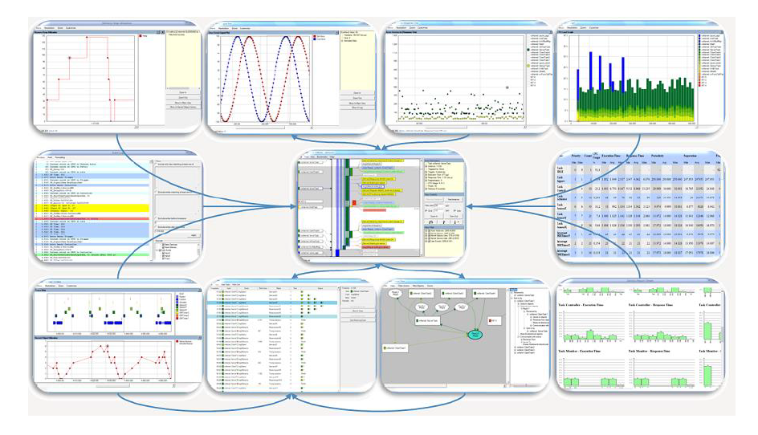
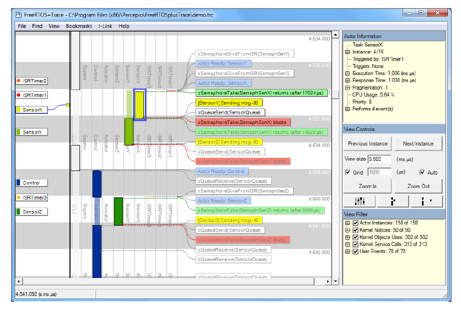
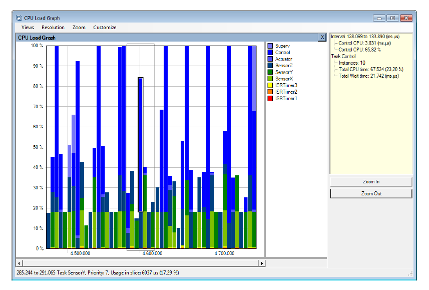
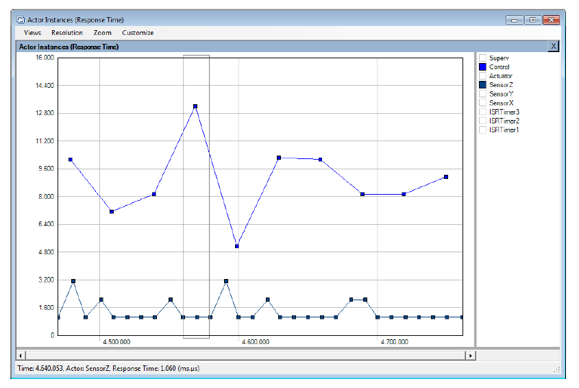
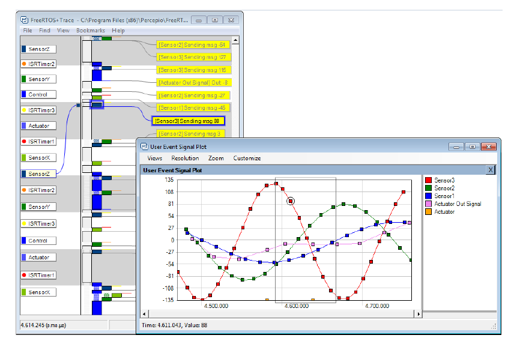
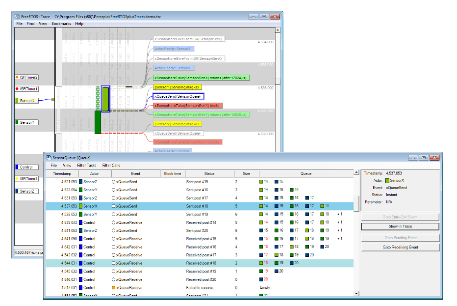
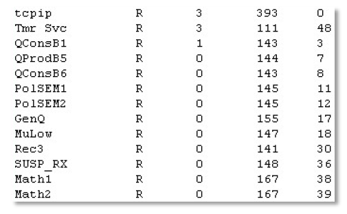
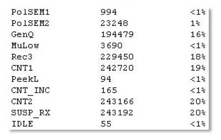
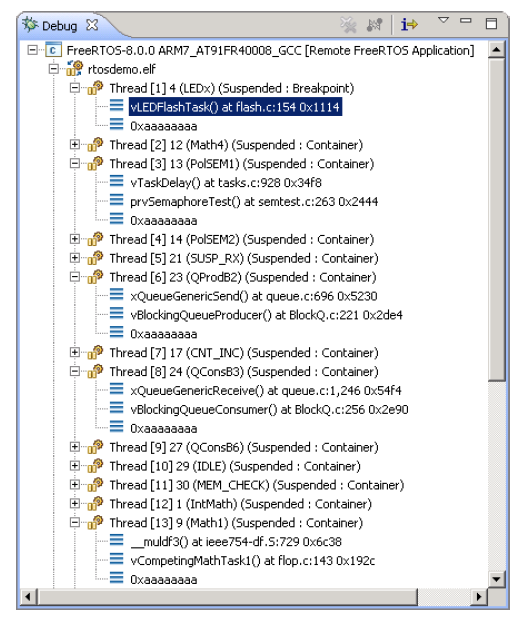

# 12 开发者支持

## 12.1 引言

本章重点介绍一组用于最大化开发效率的特性，它们可以帮助你：

- 观察应用的实际运行行为。
- 发现可优化的机会。
- 在错误发生的第一时间捕获问题。


## 12.2 `configASSERT()` 断言机制

在 C 语言中，宏 `assert()` 用于验证程序中的“断言（假设）”。断言由一个 C 表达式表示；如果表达式求值为假（0），则认为断言失败。例如，清单 12.1 检查了指针 `pxMyPointer` 不为 NULL 的断言。


<a name="list12.1" title="清单 12.1 使用标准 C assert() 宏检查 pxMyPointer 不为 NULL"></a>

```c
/* Test the assertion that pxMyPointer is not NULL */
assert( pxMyPointer != NULL );
```
***清单 12.1*** *使用标准 C assert() 宏检查 pxMyPointer 不为 NULL*

应用开发者需要通过提供 `assert()` 宏实现，来指定断言失败时应采取的动作。

FreeRTOS 源码本身不调用 `assert()`，因为并非所有用于编译 FreeRTOS 的编译器都提供 `assert()`。  
因此，FreeRTOS 源码中大量使用的是 `configASSERT()` 宏。应用开发者可在 `FreeRTOSConfig.h` 中定义该宏，其行为与标准 C 的 `assert()` 完全一致。

断言失败必须视为致命错误。不要尝试继续执行已经触发断言失败的那一行之后的代码。

> *使用 `configASSERT()` 能通过立即捕获并定位许多常见错误来源来提高开发效率。强烈建议在开发或调试 FreeRTOS 应用时定义 `configASSERT()`。*

定义 `configASSERT()` 会显著提升运行期调试能力，但也会增加代码体积，并因此降低执行速度。如果未提供 `configASSERT()` 定义，则会使用默认空定义，且所有 `configASSERT()` 调用都会被 C 预处理器完全移除。


### 12.2.1 `configASSERT()` 定义示例

清单 12.2 中的 `configASSERT()` 定义适合在调试器控制下运行应用时使用。任何断言失败都会让执行停在失败行，因此当调试会话暂停时，调试器显示的就是触发失败的代码行。


<a name="list12.2" title="清单 12.2 在调试器控制下执行时可用的简易 configASSERT() 定义"></a>

```c
/* Disable interrupts so the tick interrupt stops executing, then sit
	 in a loop so execution does not move past the line that failed the
	 assertion. If the hardware supports a debug break instruction, then the
	 debug break instruction can be used in place of the for() loop. */

#define configASSERT( x ) if( ( x ) == 0 ) { taskDISABLE_INTERRUPTS(); for(;;); }
```
***清单 12.2*** *在调试器控制下执行时可用的简易 configASSERT() 定义*

清单 12.3 中的 `configASSERT()` 定义适合不在调试器控制下运行的场景。它会打印或记录触发断言失败的源码位置。失败位置通过标准 C 的 `__FILE__` 获取文件名，通过 `__LINE__` 获取行号。


<a name="list12.3" title="清单 12.3 记录断言失败源码行的 configASSERT() 定义"></a>

```c
/* This function must be defined in a C source file, not the FreeRTOSConfig.h 
	 header file. */
void vAssertCalled( const char *pcFile, uint32_t ulLine )
{
		/* Inside this function, pcFile holds the name of the source file that 
			 contains the line that detected the error, and ulLine holds the line 
			 number in the source file. The pcFile and ulLine values can be printed 
			 out, or otherwise recorded, before the following infinite loop is 
			 entered. */
		RecordErrorInformationHere( pcFile, ulLine );

		/* Disable interrupts so the tick interrupt stops executing, then sit in a 
			 loop so execution does not move past the line that failed the assertion. */
		taskDISABLE_INTERRUPTS();
		for( ;; );
}
/*-----------------------------------------------------------*/

/* These following two lines must be placed in FreeRTOSConfig.h. */
extern void vAssertCalled( const char *pcFile, unsigned long ulLine );
#define configASSERT( x ) if( ( x ) == 0 ) vAssertCalled( __FILE__, __LINE__ )
```
***清单 12.3*** *记录断言失败源码行的 configASSERT() 定义*


## 12.3 适用于 FreeRTOS 的 Tracealyzer

Tracealyzer for FreeRTOS 是由 FreeRTOS 合作伙伴 Percepio 提供的运行时诊断与优化工具。

Tracealyzer for FreeRTOS 可捕获有价值的动态行为信息，并以相互关联的图形视图进行展示。该工具还能同时显示多个同步视图。

在分析、排障或优化 FreeRTOS 应用时，这些被捕获的信息极具价值。

Tracealyzer for FreeRTOS 可与传统调试器并行使用，它提供更高层次、基于时间维度的视角，对调试器的视图形成补充。


<a name="fig12.1" title="图 12.1 FreeRTOS+Trace 包含超过 20 个互联视图"></a>
<a name="fig12.2" title="图 12.2 FreeRTOS+Trace 主跟踪视图——20 多个互联跟踪视图之一"></a>
<a name="fig12.3" title="图 12.3 FreeRTOS+Trace CPU 负载视图——20 多个互联跟踪视图之一"></a>
<a name="fig12.4" title="图 12.4 FreeRTOS+Trace 响应时间视图——20 多个互联跟踪视图之一"></a>
<a name="fig12.5" title="图 12.5 FreeRTOS+Trace 用户事件曲线视图——20 多个互联跟踪视图之一"></a>
<a name="fig12.6" title="图 12.6 FreeRTOS+Trace 内核对象历史视图——20 多个互联跟踪视图之一"></a>

* * *
   
***图 12.1*** *FreeRTOS+Trace 包含超过 20 个互联视图*

   
***图 12.2*** *FreeRTOS+Trace 主跟踪视图——20 多个互联跟踪视图之一*

   
***图 12.3*** *FreeRTOS+Trace CPU 负载视图——20 多个互联跟踪视图之一*

   
***图 12.4*** *FreeRTOS+Trace 响应时间视图——20 多个互联跟踪视图之一*

   
***图 12.5*** *FreeRTOS+Trace 用户事件曲线视图——20 多个互联跟踪视图之一*

   
***图 12.6*** *FreeRTOS+Trace 内核对象历史视图——20 多个互联跟踪视图之一*
* * *


## 12.4 与调试相关的 Hook（回调）函数

### 12.4.1 Malloc 失败钩子

malloc 失败钩子（或回调）已在第 3 章“堆内存管理”中介绍。

定义 malloc 失败钩子可确保当创建任务、队列、信号量或事件组失败时，应用开发者能立即得到通知。

### 12.4.2 栈溢出钩子

栈溢出钩子的细节见 13.3 节“栈溢出”。

定义栈溢出钩子可确保当任务使用的栈超过为其分配的栈空间时，应用开发者能收到通知。


## 12.5 查看运行时与任务状态信息

### 12.5.1 任务运行时间统计

任务运行时间统计用于反映每个任务获得了多少处理器时间。任务的*运行时间*是指自应用启动以来，该任务处于 Running 状态的总时长。

运行时间统计主要用于项目开发阶段的性能分析与调试。它提供的信息仅在“运行时间统计时钟计数器溢出之前”有效。采集运行时间统计会增加任务上下文切换时间。

若要获取二进制格式的运行时间统计信息，可调用 `uxTaskGetSystemState()` API。若要获取人类可读的 ASCII 表格格式，可调用辅助函数 `vTaskGetRunTimeStatistics()`。


### 12.5.2 运行时间统计时钟

运行时间统计需要测量到小于一个 tick 周期的分数时间。因此，不能使用 RTOS tick 计数作为统计时钟，而应由应用代码提供独立时钟。

建议将运行时间统计时钟频率设置为 tick 中断频率的 10~100 倍。时钟越快，统计越精确，但时间值也会越快溢出。

理想情况下，时间值应来自一个自由运行（free-running）的 32 位外设定时器/计数器，并可在无额外处理开销下直接读取。

若受外设条件或时钟频率限制无法做到，可采用以下替代（但效率较低）方案：

- 配置一个外设，以期望的运行时间统计时钟频率周期性产生中断，再用中断次数作为运行时间统计时钟。

	如果该周期中断仅用于提供运行时间统计时钟，则此方法效率很低。  
	但若应用本身已存在频率合适的周期中断，那么在该 ISR 中额外统计中断次数会是简单且高效的做法。

- 通过组合 16 位自由运行定时器当前值与其溢出次数，构造一个 32 位值：

	- 16 位定时器当前值作为 32 位值的低 16 位。
	- 定时器溢出次数作为 32 位值的高 16 位。

通过恰当但相对复杂的处理，也可以把 RTOS tick 计数与 ARM Cortex-M 的 SysTick 当前计数值组合起来，生成运行时间统计时钟。FreeRTOS 下载包中的部分示例工程展示了该方法。


### 12.5.3 配置应用以采集运行时间统计

下面是采集任务运行时间统计所需宏的说明。最初这些宏设计在 RTOS 端口层中定义，因此使用 `port` 前缀；但实践中在 `FreeRTOSConfig.h` 中定义更方便。

**采集运行时间统计所用宏**

- `configGENERATE_RUN_TIME_STATS`

	该宏必须在 FreeRTOSConfig.h 中设为 1。设为 1 后，调度器会在适当时机调用本节其它宏。

- `portCONFIGURE_TIMER_FOR_RUN_TIME_STATS()`

	该宏必须用于初始化提供运行时间统计时钟的外设。

- `portGET_RUN_TIME_COUNTER_VALUE()` 或 `portALT_GET_RUN_TIME_COUNTER_VALUE(Time)`

	必须提供这两个宏中的一个，用于返回当前运行时间统计时钟值。该值是应用自启动以来、以运行时间统计时钟单位表示的总运行时间。

	若使用第一个宏，它必须定义为“求值后即得到当前时钟值”。  
	若使用第二个宏，它必须定义为“将当前时钟值写入其 `Time` 参数”。


### 12.5.4 `uxTaskGetSystemState()` API 函数

`uxTaskGetSystemState()` 提供 FreeRTOS 调度器管理下每个任务的状态快照。信息以 `TaskStatus_t` 结构体数组形式返回，数组中每个索引对应一个任务。`TaskStatus_t` 见清单 12.5，相关字段说明见后文。


<a name="list12.4" title="清单 12.4 uxTaskGetSystemState() API 函数原型"></a>

```c
UBaseType_t uxTaskGetSystemState( TaskStatus_t * const pxTaskStatusArray,
																	const UBaseType_t uxArraySize,
																	configRUN_TIME_COUNTER_TYPE * const pulTotalRunTime );
```
***清单 12.4*** *uxTaskGetSystemState() API 函数原型*

> 注：为保持向后兼容，`configRUN_TIME_COUNTER_TYPE` 默认是 `uint32_t`；如果 `uint32_t` 过于受限，可在 FreeRTOSConfig.h 中覆写。


**`uxTaskGetSystemState()` 参数与返回值**

- `pxTaskStatusArray`

	指向 `TaskStatus_t` 结构体数组的指针。

	数组至少要为每个任务预留一个 `TaskStatus_t` 结构。任务数量可通过 `uxTaskGetNumberOfTasks()` API 获取。

	`TaskStatus_t` 结构体见清单 12.5，字段说明见下一列表。

- `uxArraySize`

	`pxTaskStatusArray` 所指数组的大小。该大小是“数组索引个数（即 `TaskStatus_t` 结构体个数）”，不是字节数。

- `pulTotalRunTime`

	若 `FreeRTOSConfig.h` 中 `configGENERATE_RUN_TIME_STATS` 设为 1，则 `uxTaskGetSystemState()` 会把自目标启动以来的总运行时间（由应用提供的运行时间统计时钟定义）写入 `*pulTotalRunTime`。

	`pulTotalRunTime` 是可选参数；若不需要总运行时间，可传入 NULL。

- 返回值

	返回被 `uxTaskGetSystemState()` 实际填充的 `TaskStatus_t` 结构体数量。

	正常情况下，返回值应与 `uxTaskGetNumberOfTasks()` 一致；若传入的 `uxArraySize` 太小，则返回 0。


<a name="list12.5" title="清单 12.5 TaskStatus_t 结构体"></a>

```c
typedef struct xTASK_STATUS
{
		TaskHandle_t xHandle;
		const char *pcTaskName;
		UBaseType_t xTaskNumber;
		eTaskState eCurrentState;
		UBaseType_t uxCurrentPriority;
		UBaseType_t uxBasePriority;
		configRUN_TIME_COUNTER_TYPE ulRunTimeCounter;
		StackType_t * pxStackBase;
		#if ( ( portSTACK_GROWTH > 0 ) || ( configRECORD_STACK_HIGH_ADDRESS == 1 ) )
				StackType_t * pxTopOfStack;
				StackType_t * pxEndOfStack;
		#endif
		uint16_t usStackHighWaterMark;
		#if ( ( configUSE_CORE_AFFINITY == 1 ) && ( configNUMBER_OF_CORES > 1 ) )
				UBaseType_t uxCoreAffinityMask;
		#endif
} TaskStatus_t;
```
***清单 12.5*** *TaskStatus_t 结构体*

**`TaskStatus_t` 结构体成员**

- `xHandle`

	本结构体信息对应任务的句柄。

- `pcTaskName`

	任务的人类可读文本名称。

- `xTaskNumber`

	每个任务都有唯一的 `xTaskNumber` 值。

	若应用在运行时创建并删除任务，可能出现“一个新任务获得了与历史已删除任务相同的句柄”的情况。`xTaskNumber` 的作用就是让应用代码和内核感知调试器能够区分：当前仍有效的任务，和曾使用同句柄但已删除的旧任务。

- `eCurrentState`

	保存任务状态的枚举类型。
	`eCurrentState` 可取下列值：
  
	- `eRunning`
	- `eReady`
	- `eBlocked`
	- `eSuspended`
	- `eDeleted`

	任务仅会在很短时间内被报告为 `eDeleted`：从 `vTaskDelete()` 删除任务到 Idle 任务释放该任务内部数据结构与栈所占内存之间。过了这段时间，任务将彻底不存在，继续使用其句柄将是无效操作。

- `uxCurrentPriority`

	调用 `uxTaskGetSystemState()` 时任务的当前优先级。只有在任务依据 8.3 节“互斥量（及二值信号量）”介绍的优先级继承机制临时提升了优先级时，`uxCurrentPriority` 才会高于应用最初分配的优先级。

- `uxBasePriority`

	应用开发者为任务分配的基础优先级。仅当 FreeRTOSConfig.h 中 `configUSE_MUTEXES` 设为 1 时该字段有效。

- `ulRunTimeCounter`

	任务自创建以来累计使用的总运行时间。该时间是绝对值，使用应用开发者提供的运行时间统计时钟。仅当 FreeRTOSConfig.h 中 `configGENERATE_RUN_TIME_STATS` 设为 1 时该字段有效。
  
- `pxStackBase`

	指向该任务所分配栈区的基地址。

- `pxTopOfStack`

	指向该任务所分配栈区的当前栈顶地址。仅当栈向上增长（即 `portSTACK_GROWTH` 大于 0）或 FreeRTOSConfig.h 中 `configRECORD_STACK_HIGH_ADDRESS` 设为 1 时该字段有效。

- `pxEndOfStack`

	指向该任务所分配栈区的结束地址。仅当栈向上增长（即 `portSTACK_GROWTH` 大于 0）或 FreeRTOSConfig.h 中 `configRECORD_STACK_HIGH_ADDRESS` 设为 1 时该字段有效。

- `usStackHighWaterMark`

	任务栈高水位。即任务自创建以来“曾经保留下来的最小剩余栈空间”。该值可反映任务距离栈溢出有多近；值越接近 0，表示越接近溢出。`usStackHighWaterMark` 的单位是字节。
  
- `uxCoreAffinityMask`

	位掩码，表示任务可运行的 CPU 核。核编号范围为 0 到 `configNUMBER_OF_CORES - 1`。例如，可在核 0 和核 1 上运行的任务，其 `uxCoreAffinityMask` 为 0x03。仅当 `configUSE_CORE_AFFINITY` 设为 1 且 `configNUMBER_OF_CORES` 大于 1 时该字段可用。


### 12.5.5 `vTaskListTasks()` 辅助函数

`vTaskListTasks()` 提供与 `uxTaskGetSystemState()` 类似的任务状态信息，但其输出是人类可读的 ASCII 表格，而不是二进制数组。

`vTaskListTasks()` 是处理器开销很高的函数，并且会让调度器长时间保持挂起。因此建议仅用于调试，不建议在生产实时系统中使用。

当 `configUSE_TRACE_FACILITY` 设为 1 且 FreeRTOSConfig.h 中 `configUSE_STATS_FORMATTING_FUNCTIONS` 大于 0 时，`vTaskListTasks()` 可用。


<a name="list12.6" title="清单 12.6 vTaskListTasks() API 函数原型"></a>

```c
void vTaskListTasks( char * pcWriteBuffer, size_t uxBufferLength );
```
***清单 12.6*** *vTaskListTasks() API 函数原型*

**`vTaskListTasks()` 参数**

- `pcWriteBuffer`

	指向字符缓冲区的指针，格式化且人类可读的表格会写入该缓冲区。默认假设该缓冲区足够大以容纳完整报告。通常每个任务约 40 字节空间即可。

- `uxBufferLength`

	`pcWriteBuffer` 的长度。

`vTaskListTasks()` 的输出示例见图 12.7。输出中：

- 每一行对应一个任务的信息。

- 第一列是任务名。

- 第二列是任务状态：`X` 表示 Running，`R` 表示 Ready，`B` 表示 Blocked，`S` 表示 Suspended，`D` 表示任务已删除。任务仅会在很短时间内显示为删除状态：从 `vTaskDelete()` 删除任务到 Idle 任务释放该任务内部数据结构与栈内存之间。之后任务将彻底不存在，继续使用其句柄将是无效操作。

- 第三列是任务优先级。

- 第四列是任务栈高水位。详见 `usStackHighWaterMark` 说明。

- 第五列是分配给任务的唯一编号。详见 `xTaskNumber` 说明。


<a name="fig12.7" title="图 12.7 vTaskListTasks() 生成的输出示例"></a>

* * *
   
***图 12.7*** *vTaskListTasks() 生成的输出示例*
* * *

> 注：  
> `vTaskListTasks` 的旧版本是 `vTaskList`。`vTaskList` 假设 `pcWriteBuffer` 的长度为 `configSTATS_BUFFER_MAX_LENGTH`。该函数仅为向后兼容保留。新应用建议使用 `vTaskListTasks`，并显式提供 `pcWriteBuffer` 长度。


<a name="list12.7" title="清单 12.7 vTaskList() API 函数原型"></a>

```c
void vTaskList( signed char *pcWriteBuffer );
```
***清单 12.7*** *vTaskList() API 函数原型*

	**`vTaskList()` 参数**

	- `pcWriteBuffer`
    
		指向字符缓冲区的指针，格式化且人类可读的表格会写入其中。由于该函数不做边界检查，缓冲区必须足够大，能够容纳完整表格。


### 12.5.6 `vTaskGetRunTimeStatistics()` 辅助函数

`vTaskGetRunTimeStatistics()` 将采集到的运行时间统计格式化为人类可读的 ASCII 表格。

`vTaskGetRunTimeStatistics()` 是处理器开销很高的函数，且会让调度器长时间保持挂起。因此建议仅用于调试，不建议用于生产实时系统。

当 FreeRTOSConfig.h 中 `configGENERATE_RUN_TIME_STATS` 设为 1、`configUSE_STATS_FORMATTING_FUNCTIONS` 大于 0 且 `configUSE_TRACE_FACILITY` 设为 1 时，`vTaskGetRunTimeStatistics()` 可用。


<a name="list12.8" title="清单 12.8 vTaskGetRunTimeStatistics() API 函数原型"></a>

```c
void vTaskGetRunTimeStatistics( char * pcWriteBuffer, size_t uxBufferLength );
```
***清单 12.8*** *vTaskGetRunTimeStatistics() API 函数原型*

**`vTaskGetRunTimeStatistics()` 参数**

- `pcWriteBuffer`

	指向字符缓冲区的指针，格式化且人类可读的表格会写入其中。默认假设该缓冲区足够大以容纳完整报告。通常每个任务约 40 字节空间即可。

- `uxBufferLength` 

	`pcWriteBuffer` 的长度。

`vTaskGetRunTimeStatistics()` 的输出示例见图 12.8。输出中：

- 每一行对应一个任务的信息。

- 第一列是任务名。

- 第二列是任务处于 Running 状态的绝对时长。详见 `ulRunTimeCounter` 说明。

- 第三列是任务 Running 时长占系统自启动以来总时间的百分比。显示出来的百分比总和通常会低于期望的 100%，因为统计与计算使用整数运算，结果向下取整到最近整数。


<a name="fig12.8" title="图 12.8 vTaskGetRunTimeStatistics() 生成的输出示例"></a>

* * *
   
***图 12.8*** *vTaskGetRunTimeStatistics() 生成的输出示例*
* * *

> 注：  
> `vTaskGetRunTimeStatistics` 的旧版本是 `vTaskGetRunTimeStats`。`vTaskGetRunTimeStats` 假设 `pcWriteBuffer` 长度为 `configSTATS_BUFFER_MAX_LENGTH`。该函数仅用于向后兼容。新应用建议使用 `vTaskGetRunTimeStatistics` 并显式提供 `pcWriteBuffer` 长度。


<a name="list12.9" title="清单 12.9 vTaskGetRunTimeStats() API 函数原型"></a>

```c
void vTaskGetRunTimeStats( signed char *pcWriteBuffer );
```
***清单 12.9*** *vTaskGetRunTimeStats() API 函数原型*
 
	**`vTaskGetRunTimeStats()` 参数**

	- `pcWriteBuffer`

		指向字符缓冲区的指针，格式化且人类可读的表格会写入其中。该缓冲区必须足够大以容纳完整表格，因为函数不执行边界检查。


### 12.5.7 生成并显示运行时间统计——完整示例

本示例使用一个假设的 16 位定时器来构造 32 位运行时间统计时钟。该计数器被配置为：每当 16 位计数达到最大值时触发一次中断（即溢出中断）。ISR 中统计溢出次数。

该 32 位值由两部分组成：

- 高 16 位：溢出次数计数。
- 低 16 位：当前 16 位计数器值。

中断服务例程的伪代码见清单 12.10。


<a name="list12.10" title="清单 12.10 用于统计定时器溢出次数的 16 位定时器溢出中断处理函数"></a>

```c
void TimerOverflowInterruptHandler( void )
{
		/* Just count the number of interrupts. */
		ulOverflowCount++;

		/* Clear the interrupt. */
		ClearTimerInterrupt();
}
```
***清单 12.10*** *用于统计定时器溢出次数的 16 位定时器溢出中断处理函数*

清单 12.11 展示了在 FreeRTOSConfig.h 中新增的宏定义，用于启用运行时间统计采集。


<a name="list12.11" title="清单 12.11 在 FreeRTOSConfig.h 中新增、用于启用运行时间统计采集的宏"></a>

```c
/* Set configGENERATE_RUN_TIME_STATS to 1 to enable collection of run-time 
	 statistics. When this is done, both portCONFIGURE_TIMER_FOR_RUN_TIME_STATS()
	 and portGET_RUN_TIME_COUNTER_VALUE() or 
	 portALT_GET_RUN_TIME_COUNTER_VALUE(x) must also be defined. */
#define configGENERATE_RUN_TIME_STATS 1

/* portCONFIGURE_TIMER_FOR_RUN_TIME_STATS() is defined to call the function 
	 that sets up the hypothetical 16-bit timer (the function's implementation 
	 is not shown). */
void vSetupTimerForRunTimeStats( void );
#define portCONFIGURE_TIMER_FOR_RUN_TIME_STATS()  vSetupTimerForRunTimeStats()

/* portALT_GET_RUN_TIME_COUNTER_VALUE() is defined to set its parameter to the
	 current run-time counter/time value. The returned time value is 32-bits 
	 long, and is formed by shifting the count of 16-bit timer overflows into 
	 the top two bytes of a 32-bit number, then bitwise ORing the result with 
	 the current 16-bit counter value. */
#define portALT_GET_RUN_TIME_COUNTER_VALUE( ulCountValue )                  \
{                                                                           \
		extern volatile unsigned long ulOverflowCount;                          \
																																						\
		/* Disconnect the clock from the counter so it does not change          \
			 while its value is being used. */                                    \
		PauseTimer();                                                           \
																																						\
		/* The number of overflows is shifted into the most significant         \
			 two bytes of the returned 32-bit value. */                           \
		ulCountValue = ( ulOverflowCount << 16UL );                             \
																																						\
		/* The current counter value is used as the two least significant       \
			 bytes of the returned 32-bit value. */                               \
		ulCountValue |= ( unsigned long ) ReadTimerCount();                     \
																																						\
		/* Reconnect the clock to the counter. */                               \
		ResumeTimer();                                                          \
}
```
***清单 12.11*** *在 FreeRTOSConfig.h 中新增、用于启用运行时间统计采集的宏*

清单 12.12 中的任务每 5 秒打印一次采集到的运行时间统计数据。


<a name="list12.12" title="清单 12.12 输出采集到的运行时间统计信息的任务"></a>

```c
#define RUN_TIME_STATS_STRING_BUFFER_LENGTH       512

/* For clarity, calls to fflush() have been omitted from this code listing. */
static void prvStatsTask( void *pvParameters )
{
		TickType_t xLastExecutionTime;

		/* The buffer used to hold the formatted run-time statistics text needs to
			 be quite large. It is therefore declared static to ensure it is not
			 allocated on the task stack. This makes this function non re-entrant. */
		static signed char cStringBuffer[ RUN_TIME_STATS_STRING_BUFFER_LENGTH ];

		/* The task will run every 5 seconds. */
		const TickType_t xBlockPeriod = pdMS_TO_TICKS( 5000 );

		/* Initialize xLastExecutionTime to the current time. This is the only
			 time this variable needs to be written to explicitly. Afterwards it is 
			 updated internally within the vTaskDelayUntil() API function. */
		xLastExecutionTime = xTaskGetTickCount();

		/* As per most tasks, this task is implemented in an infinite loop. */
		for( ;; )
		{
				/* Wait until it is time to run this task again. */
				xTaskDelayUntil( &xLastExecutionTime, xBlockPeriod );

				/* Generate a text table from the run-time stats. This must fit into
					 the cStringBuffer array. */
				vTaskGetRunTimeStatistics( cStringBuffer, RUN_TIME_STATS_STRING_BUFFER_LENGTH );

				/* Print out column headings for the run-time stats table. */
				printf( "\nTask\t\tAbs\t\t\t%%\n" );
				printf( "-------------------------------------------------------------\n" );

				/* Print out the run-time stats themselves. The table of data contains
					 multiple lines, so the vPrintMultipleLines() function is called 
					 instead of calling printf() directly. vPrintMultipleLines() simply 
					 calls printf() on each line individually, to ensure the line 
					 buffering works as expected. */ 
				vPrintMultipleLines( cStringBuffer );
		}
}
```
***清单 12.12*** *输出采集到的运行时间统计信息的任务*


## 12.6 跟踪 Hook 宏（Trace Hook Macros）

Trace 宏是放置在 FreeRTOS 源码关键位置的宏。默认情况下，这些宏为空实现，因此不会生成代码，也没有运行时开销。通过覆写默认空实现，应用开发者可以：

- 在不修改 FreeRTOS 源文件的前提下，将代码插入 FreeRTOS 执行路径。

- 利用目标硬件可用的任意手段输出详细执行时序信息。Trace 宏在 FreeRTOS 源码中的分布足够广，可据此构建完整且细粒度的调度活动跟踪和性能剖析日志。


### 12.6.1 可用的 Trace Hook 宏

若逐一详述所有宏会占据大量篇幅。下面列出对应用开发者最有价值的一组常用宏。

下列说明多次提到变量 `pxCurrentTCB`。`pxCurrentTCB` 是 FreeRTOS 私有变量，保存当前 Running 状态任务的句柄；凡是从 `FreeRTOS/Source/tasks.c` 调用的宏都可以访问该变量。

**常用 Trace Hook 宏选摘**

- `traceTASK_INCREMENT_TICK(xTickCount)`

	在 tick 中断中、tick 计数递增之前调用。参数 `xTickCount` 把新的 tick 计数值传入宏。

- `traceTASK_SWITCHED_OUT()`

	在选择新任务运行之前调用。此时 `pxCurrentTCB` 保存的是即将离开 Running 状态的任务句柄。

- `traceTASK_SWITCHED_IN()`

	在新任务被选中运行之后调用。此时 `pxCurrentTCB` 保存的是即将进入 Running 状态的任务句柄。

- `traceBLOCKING_ON_QUEUE_RECEIVE(pxQueue)`
  
	当前执行任务尝试从空队列读取，或尝试“获取”空信号量/互斥量而进入 Blocked 状态前立即调用。参数 `pxQueue` 将目标队列或信号量句柄传入宏。

- `traceBLOCKING_ON_QUEUE_SEND(pxQueue)`
  
	当前执行任务尝试向满队列写入并进入 Blocked 状态前立即调用。参数 `pxQueue` 将目标队列句柄传入宏。

- `traceQUEUE_SEND(pxQueue)`
  
	在 `xQueueSend()`、`xQueueSendToFront()`、`xQueueSendToBack()` 或任意信号量“give”函数内部，当发送/给出成功时调用。参数 `pxQueue` 将目标队列或信号量句柄传入宏。

- `traceQUEUE_SEND_FAILED(pxQueue)`

	在 `xQueueSend()`、`xQueueSendToFront()`、`xQueueSendToBack()` 或任意信号量“give”函数内部，当发送/给出失败时调用。若队列已满，且在指定阻塞时间内仍为满，则操作失败。参数 `pxQueue` 将目标队列或信号量句柄传入宏。

- `traceQUEUE_RECEIVE(pxQueue)`

	在 `xQueueReceive()` 或任意信号量“take”函数内部，当接收/获取成功时调用。参数 `pxQueue` 将目标队列或信号量句柄传入宏。

- `traceQUEUE_RECEIVE_FAILED(pxQueue)`

	在 `xQueueReceive()` 或任意信号量“take”函数内部，当接收/获取失败时调用。若队列或信号量为空，且在指定阻塞时间内保持为空，则操作失败。参数 `pxQueue` 将目标队列或信号量句柄传入宏。

- `traceQUEUE_SEND_FROM_ISR(pxQueue)`

	在 `xQueueSendFromISR()` 内部，当发送成功时调用。参数 `pxQueue` 将目标队列句柄传入宏。

- `traceQUEUE_SEND_FROM_ISR_FAILED(pxQueue)`

	在 `xQueueSendFromISR()` 内部，当发送失败时调用。若队列已满则发送失败。参数 `pxQueue` 将目标队列句柄传入宏。

- `traceQUEUE_RECEIVE_FROM_ISR(pxQueue)`

	在 `xQueueReceiveFromISR()` 内部，当接收成功时调用。参数 `pxQueue` 将目标队列句柄传入宏。

- `traceQUEUE_RECEIVE_FROM_ISR_FAILED(pxQueue)`

	在 `xQueueReceiveFromISR()` 内部，当接收因队列已空而失败时调用。参数 `pxQueue` 将目标队列句柄传入宏。

- `traceTASK_DELAY_UNTIL( xTimeToWake )`

	在 `xTaskDelayUntil()` 内部、调用任务进入 Blocked 状态前立即调用。

- `traceTASK_DELAY()`

	在 `vTaskDelay()` 内部、调用任务进入 Blocked 状态前立即调用。


### 12.6.2 定义 Trace Hook 宏

每个 Trace 宏都有默认空定义。可通过在 FreeRTOSConfig.h 中重新定义宏来覆盖默认实现。若宏定义变得很长或很复杂，可将其放入一个新的头文件，再由 FreeRTOSConfig.h 引入该头文件。

遵循软件工程最佳实践，FreeRTOS 采取严格的数据隐藏策略。Trace 宏允许在 FreeRTOS 源文件内部插入用户代码，因此 Trace 宏可见的数据类型与应用代码可见的数据类型可能不同：

- 在 `FreeRTOS/Source/tasks.c` 中，任务句柄是“指向任务描述结构（Task Control Block，TCB）的指针”；而在该文件外部，任务句柄是 `void*`。

- 在 `FreeRTOS/Source/queue.c` 中，队列句柄是“指向队列描述结构的指针”；而在该文件外部，队列句柄是 `void*`。

> *若 Trace 宏直接访问了本应私有的 FreeRTOS 数据结构，必须格外谨慎，因为这些私有结构可能在 FreeRTOS 版本迭代时发生变化。*


### 12.6.3 FreeRTOS 感知型调试器插件

下面这些 IDE 提供了具备一定 FreeRTOS 感知能力的插件（列表可能并不完整）：



- Eclipse（StateViewer）

- Eclipse（ThreadSpy）

- IAR（集成开发环境）

- ARM DS-5（开发套件）

- Atollic TrueStudio（开发环境）

- Microchip MPLAB（开发环境）

- iSYSTEM WinIDEA（开发环境）

- STM32CubeIDE（开发环境）
