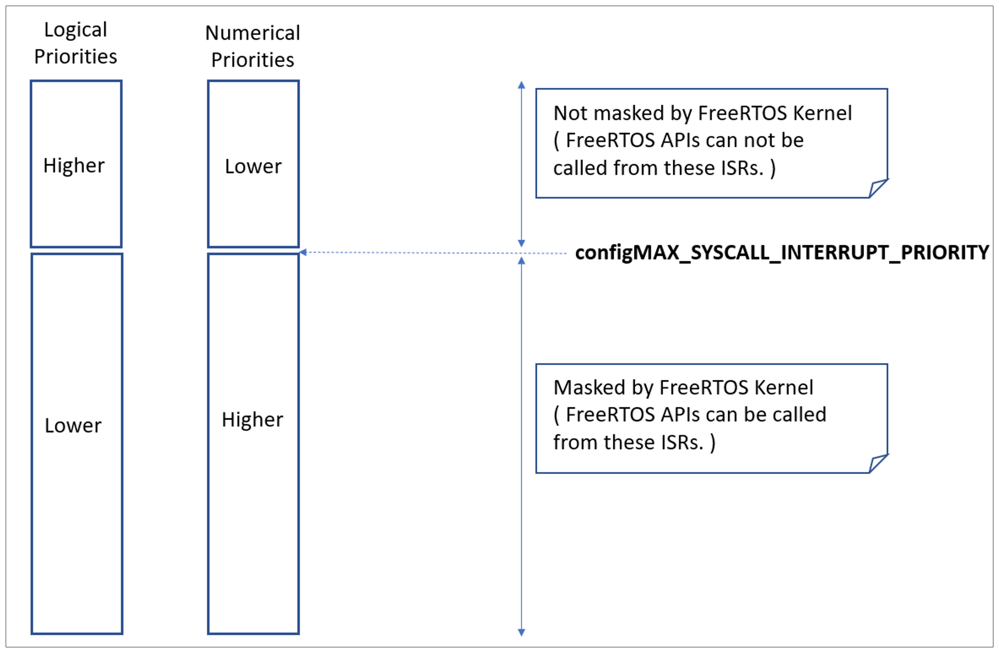

# 13 故障排查

## 13.1 章节介绍与范围

本章重点介绍 FreeRTOS 新用户最常遇到的问题。首先，会聚焦多年支持请求中最常见的三类问题：中断优先级配置错误、栈溢出，以及不恰当使用 `printf()`。随后，将以 FAQ 风格简要覆盖其它常见错误、可能原因和对应解决办法。

> *使用 `configASSERT()` 能显著提升开发效率：它可以在错误发生点立即捕获并定位许多常见问题。强烈建议在 FreeRTOS 应用开发或调试阶段启用 `configASSERT()`。`configASSERT()` 的介绍见 12.2 节。*


## 13.2 中断优先级

> *注意：这是支持请求中排名第一的问题根源，而且在大多数端口中，定义 `configASSERT()` 后可立即捕获该错误！*

如果所用 FreeRTOS 端口支持中断嵌套，且某个中断服务程序使用了 FreeRTOS API，那么该中断优先级*必须*配置为不高于（逻辑上不高于）`configMAX_SYSCALL_INTERRUPT_PRIORITY`，详见 7.8 节“中断嵌套”。若不满足该要求，将导致临界区失效，继而引发间歇性故障。

在以下处理器上运行 FreeRTOS 时请特别小心：

- 中断优先级默认就是最高优先级（某些 ARM Cortex 处理器以及可能的其它处理器属于这种情况）。在此类处理器上，凡是使用 FreeRTOS API 的中断，其优先级都不能保持未初始化状态。

- 数值上“较大”的优先级数字反而表示逻辑上“较低”的中断优先级，这个设定容易让人困惑。ARM Cortex 处理器及某些其它处理器就是如此。

- 例如，在这类处理器上，优先级为 5 的中断可以被优先级为 4 的中断打断。因此，若 `configMAX_SYSCALL_INTERRUPT_PRIORITY` 设置为 5，则凡是使用 FreeRTOS API 的中断，其优先级数值必须大于或等于 5。此时，优先级 5 或 6 是合法的，而优先级 3 明显非法。

	

- 不同库实现对“如何指定中断优先级”的要求不一致。这个问题在 ARM Cortex 相关库中尤为常见，因为写入硬件寄存器前通常需要对优先级位进行移位。有些库会自行移位，有些库则要求调用者先移位后再传入。

- 同一架构的不同实现，可能支持不同数量的中断优先级位。比如某厂商的 Cortex-M 处理器可能实现 3 个优先级位，而另一厂商可能实现 4 个。

- 定义中断优先级的位，可能被拆分为“抢占优先级位”和“子优先级位”。请确保所有位都用于抢占优先级，避免使用子优先级。

在某些 FreeRTOS 端口中，`configMAX_SYSCALL_INTERRUPT_PRIORITY` 还有一个别名：`configMAX_API_CALL_INTERRUPT_PRIORITY`。


## 13.3 栈溢出

栈溢出是支持请求中第二常见的问题。FreeRTOS 提供了若干特性，便于捕获和调试栈相关问题[^28]。

[^28]: 这些特性在 FreeRTOS Windows 端口中不可用。


### 13.3.1 `uxTaskGetStackHighWaterMark()` API 函数

每个任务都有自己的栈，且总栈大小在创建任务时指定。`uxTaskGetStackHighWaterMark()` 用于查询任务距离溢出其分配栈空间还有多远。这个值被称为栈“高水位（high water mark）”。


<a name="list13.1" title="清单 13.1 uxTaskGetStackHighWaterMark() API 函数原型"></a>

```c
UBaseType_t uxTaskGetStackHighWaterMark( TaskHandle_t xTask );
```
***清单 13.1*** *uxTaskGetStackHighWaterMark() API 函数原型*

**`uxTaskGetStackHighWaterMark()` 参数与返回值**

- `xTask`

	被查询任务（目标任务）的句柄。关于如何获取任务句柄，可参考 `xTaskCreate()` API 的 `pxCreatedTask` 参数说明。

	任务可通过传入 NULL（而非有效任务句柄）来查询自身的栈高水位。

- 返回值

	任务执行和中断处理中，任务的栈使用量会动态增减。`uxTaskGetStackHighWaterMark()` 返回的是该任务自开始运行以来“剩余栈空间”的最小值。也就是在栈使用最深时仍未被使用的栈空间。高水位越接近 0，表示任务越接近栈溢出。

`uxTaskGetStackHighWaterMark2()` API 可替代 `uxTaskGetStackHighWaterMark()`，两者主要区别在于返回类型。


<a name="list13.2" title="清单 13.2 uxTaskGetStackHighWaterMark2() API 函数原型"></a>

```c
configSTACK_DEPTH_TYPE uxTaskGetStackHighWaterMark2( TaskHandle_t xTask );
```
***清单 13.2*** *uxTaskGetStackHighWaterMark2() API 函数原型*

使用 `configSTACK_DEPTH_TYPE` 可让应用开发者控制栈深度所使用的数据类型。

### 13.3.2 运行时栈检查——概述

FreeRTOS 提供三种可选的运行时栈检查机制，这些机制由 FreeRTOSConfig.h 中的编译期配置常量 `configCHECK_FOR_STACK_OVERFLOW` 控制。三种方法都会增加上下文切换时间。

栈溢出钩子函数（stack overflow hook/callback）是内核检测到栈溢出时调用的函数。要使用该钩子函数，需要：

1. 在 FreeRTOSConfig.h 中将 `configCHECK_FOR_STACK_OVERFLOW` 设为 1、2 或 3（详见后续小节）。

1. 按清单 13.3 所示的精确函数名和函数原型提供钩子实现。


<a name="list13.3" title="清单 13.3 栈溢出钩子函数原型"></a>

```c
void vApplicationStackOverflowHook( TaskHandle_t *pxTask, signed char *pcTaskName );
```
***清单 13.3*** *栈溢出钩子函数原型*

栈溢出钩子旨在简化栈错误的捕获和调试，但一旦发生栈溢出，实际上几乎没有可靠的恢复手段。该函数参数会将发生溢出的任务句柄和任务名传入钩子。

栈溢出钩子在中断上下文中被调用。

某些微控制器在检测到错误内存访问时会触发 fault 异常，因此有可能在内核来得及调用栈溢出钩子之前就已触发故障。


### 13.3.3 运行时栈检查——方法 1

当 `configCHECK_FOR_STACK_OVERFLOW` 设为 1 时，选择方法 1。

任务每次被切出时，其完整执行上下文都会保存到任务栈上。这通常也是栈使用量达到峰值的时刻。当 `configCHECK_FOR_STACK_OVERFLOW` 设为 1 时，内核会在保存完上下文后检查栈指针是否仍位于有效栈空间内。若栈指针超出有效范围，则调用栈溢出钩子。

方法 1 执行速度快，但可能漏掉发生在两次上下文切换之间的栈溢出。


### 13.3.4 运行时栈检查——方法 2

方法 2 在方法 1 的基础上增加了额外检查。当 `configCHECK_FOR_STACK_OVERFLOW` 设为 2 时选择该方法。

任务创建时，任务栈会被填充为已知模式。方法 2 会检查任务栈空间末尾 20 字节是否仍保持该模式，验证是否被覆盖。若任一字节与预期不符，则调用栈溢出钩子函数。

方法 2 的执行速度不如方法 1，但仍较快，因为只检查 20 字节。通常它能捕获几乎所有栈溢出；不过从理论上说，仍存在极小概率漏检。

### 13.3.4 运行时栈检查——方法 3

当 `configCHECK_FOR_STACK_OVERFLOW` 设为 3 时，选择方法 3。

该方法仅在部分端口可用。可用时，它会启用 ISR 栈检查。检测到 ISR 栈溢出时会触发 assert。注意这种情况下不会调用栈溢出钩子函数，因为该钩子仅针对任务栈，而非 ISR 栈。

## 13.4 `printf()` 与 `sprintf()` 的使用

通过 `printf()` 进行日志输出是常见错误来源。开发者往往未意识到这一点，随后又继续增加 `printf()` 调用以辅助调试，反而会进一步恶化问题。

许多交叉编译器厂商会提供适合小型嵌入式系统使用的 `printf()` 实现。即便如此，该实现也可能并非线程安全，通常也不适合在中断服务例程中使用，并且根据输出目标不同，执行时间可能较长。

若不存在专为小型嵌入式系统设计的 `printf()` 实现，而改用通用 `printf()`，则必须特别谨慎，因为：

- 仅仅引入一次 `printf()` 或 `sprintf()` 调用，就可能大幅增加应用可执行文件体积。

- `printf()` 与 `sprintf()` 可能调用 `malloc()`；如果当前内存分配方案不是 heap_3，这可能不合法。更多信息见 3.2 节“内存分配方案示例”。

- `printf()` 与 `sprintf()` 可能需要远大于常规需求的栈空间。


### 13.4.1 Printf-stdarg.c 文件

许多 FreeRTOS 演示工程使用名为 printf-stdarg.c 的文件。它提供了一个最小化且栈开销更低的 `sprintf()` 实现，可替代标准库版本。在多数情况下，这允许调用 `sprintf()` 及相关函数的任务分配更小的栈。

printf-stdarg.c 还提供一种机制，可将 `printf()` 输出按字符逐个导向端口。虽然这种方式较慢，但可以进一步降低栈使用。

请注意：FreeRTOS 下载包中的 printf-stdarg.c 并非全部实现了 `snprintf()`。未实现 `snprintf()` 的版本会忽略缓冲区大小参数，因为其内部直接映射到 `sprintf()`。

printf-stdarg.c 是开源代码，但归第三方所有，因此其许可证与 FreeRTOS 分离。许可条款位于该源文件顶部。


## 13.5 其他常见错误来源

### 13.5.1 症状：在示例中新增一个简单任务后，示例崩溃

创建任务需要从堆中申请内存。许多示例工程会把堆大小配置为“刚好够创建示例任务”，因此示例任务创建完成后，往往没有足够堆空间再创建新任务、队列、事件组或信号量。

调用 `vTaskStartScheduler()` 时，空闲任务（Idle task）以及可能存在的 RTOS daemon 任务会自动创建。仅当剩余堆内存不足以创建这些任务时，`vTaskStartScheduler()` 才会返回。  
在 `vTaskStartScheduler()` 调用之后加一个空循环 `[ for(;;); ]`，通常有助于更快定位此类问题。

若要继续增加任务，必须增大堆大小，或移除部分已有示例任务。堆大小增加始终受限于可用 RAM 容量。更多信息见 3.2 节“内存分配方案示例”。


### 13.5.2 症状：在中断里调用 API 函数导致应用崩溃

除非 API 名称以 `...FromISR()` 结尾，否则不要在中断服务例程中调用该 API。尤其不要在中断中创建临界区，除非使用了中断安全宏。更多信息见 7.2 节“在 ISR 中使用 FreeRTOS API”。

在支持中断嵌套的 FreeRTOS 端口中，不要在优先级高于 `configMAX_SYSCALL_INTERRUPT_PRIORITY` 的中断里使用任何 API。更多信息见 7.8 节“中断嵌套”。


### 13.5.3 症状：应用有时会在中断服务例程内崩溃

首先应检查是否由中断引发了栈溢出。有些端口只检查任务栈溢出，不检查中断栈溢出。

中断的定义和使用方式在不同端口、不同编译器之间存在差异。因此，第二步应确认中断服务例程使用的语法、宏与调用约定，完全符合所用端口文档说明，并与该端口提供的示例应用保持一致。

如果应用运行在“数值优先级越小，逻辑优先级越高”的处理器上，务必确认每个中断分配的优先级考虑了这一点，因为这往往不直观。  
如果应用运行在“中断默认优先级即为最大可能值”的处理器上，务必确保每个中断都已从默认值重新配置。更多信息见 7.8 节“中断嵌套”与 13.2 节“中断优先级”。


### 13.5.4 症状：调度器尝试启动第一个任务时崩溃

请确认 FreeRTOS 中断处理函数已正确安装。具体信息请参考所用 FreeRTOS 端口文档，以及该端口的示例应用。

某些处理器在启动调度器前必须处于特权模式。最简单的实现方式是在调用 main() 前，于 C 启动代码中先将处理器切换到特权模式。


### 13.5.5 症状：中断意外保持禁用，或临界区嵌套行为异常

若在调度器启动前调用 FreeRTOS API，系统会有意保持中断禁用状态，且直到第一个任务开始执行才重新使能。这样做是为了防止系统初始化期间（调度器尚未启动且可能处于不一致状态）由中断调用 FreeRTOS API 而导致崩溃。

不要通过 `taskENTER_CRITICAL()` 与 `taskEXIT_CRITICAL()` 以外的方法修改 MCU 中断使能位或优先级标志。上述宏会维护调用嵌套深度计数，确保仅当嵌套完全回退至 0 时才重新使能中断。另请注意：某些库函数本身也可能开启或关闭中断。


### 13.5.6 症状：调度器尚未启动前应用就崩溃

凡是可能触发上下文切换的中断服务例程，在调度器启动前都不得执行。对任何尝试向 FreeRTOS 对象（如队列或信号量）发送或接收的中断服务例程，也同样适用。上下文切换必须在调度器启动后才可能发生。

很多 API 在调度器启动前都不能调用。在 `vTaskStartScheduler()` 之前，最好将 API 使用限制在“创建对象（任务、队列、信号量等）”，而不是“使用这些对象”。


### 13.5.7 症状：在调度器挂起期间或临界区内调用 API 导致应用崩溃

调用 `vTaskSuspendAll()` 可挂起调度器，调用 `xTaskResumeAll()` 可恢复（解除挂起）调度器。调用 `taskENTER_CRITICAL()` 进入临界区，调用 `taskEXIT_CRITICAL()` 退出临界区。

不要在调度器挂起期间调用 API，也不要在临界区内调用 API。

## 13.6 额外调试步骤

如果你遇到的问题不属于上述常见原因，可尝试以下调试步骤：

- 定义 `configASSERT()`，并在应用的 FreeRTOSConfig 文件中启用 malloc 失败检查和栈溢出检查。
- 检查 FreeRTOS API 的返回值，确认调用均成功。
- 检查调度器相关配置（如 `configUSE_TIME_SLICING` 与 `configUSE_PREEMPTION`）是否符合应用需求。
- [这个页面](https://www.freertos.org/Debugging-Hard-Faults-On-Cortex-M-Microcontrollers.html) 提供了在 Cortex-M 微控制器上调试硬 Fault 的详细说明。
